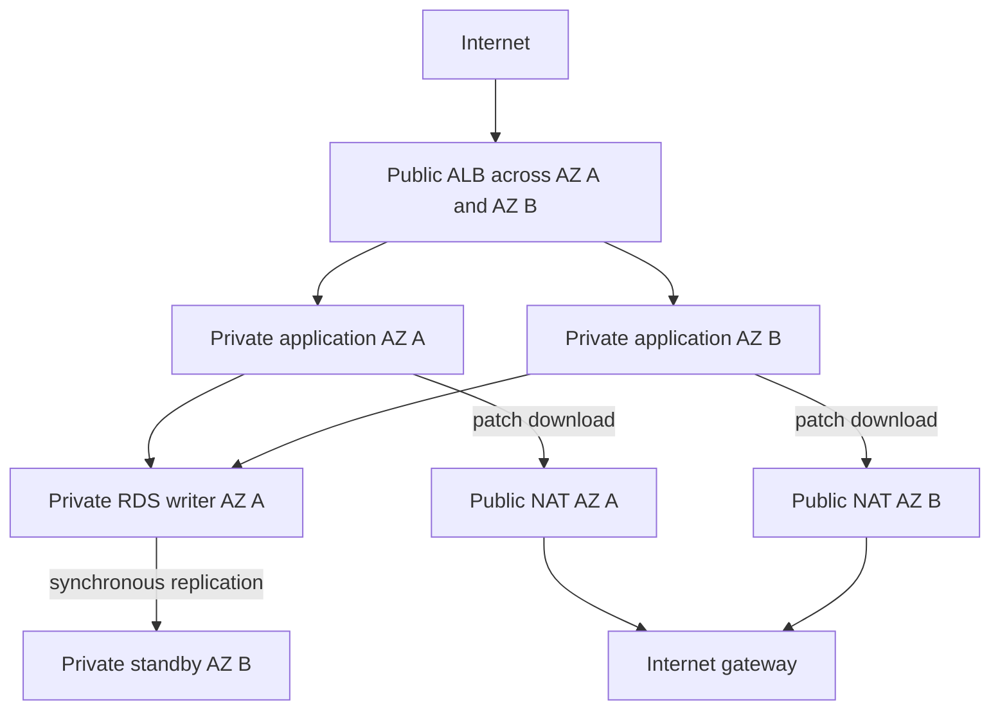
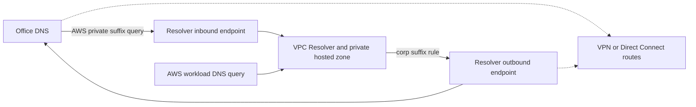
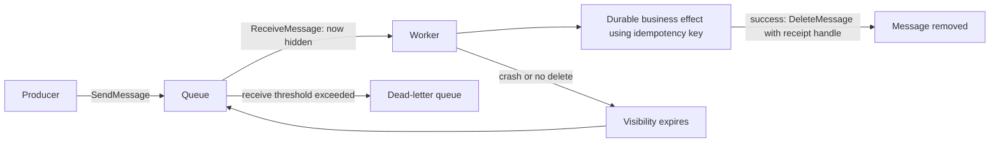
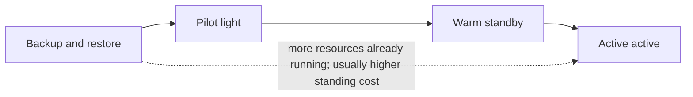

# AWS Certified Solutions Architect – Associate (SAA-C03)
## Self-contained study guide · Beginner edition · Revision 4 · 6 October 2026

**Audience:** You are new to AWS. You can use a computer and browser, but you do not need previous cloud, networking, database or architecture experience. The technical foundations used in this guide are explained below.

**Preparation route:** Learn from this guide, do the written exercises, and optionally take legitimate online practice exams with answer explanations. No AWS account, paid course, sandbox or lab is required by this study plan. The source links are for checking facts; they are not additional assigned reading.

**What this edition aims to provide:** Enough explanation to understand the main SAA-C03 architecture decisions, followed by compact revision material. A study guide cannot guarantee an individual's pass or disclose the live question pool. Readiness means being able to apply the concepts to new scenarios, rather than merely recognize the sentences in this document.

**Fact-check window:** 5–6 October 2026. Official AWS documentation and announcements were checked for the exam blueprint, material service behavior, changed limits, and service availability. Feature availability can depend on Region, engine, deployment mode or account quota. Those conditions are identified where they change a decision. Appendix F records material corrections and the source register. New product functionality does not establish that it appears in the current exam.

**Exam facts:** 65 questions in 130 minutes: 50 scored and 15 unidentified unscored questions. Questions are multiple choice or multiple response. Results use a 100–1,000 scaled score; 720 is the passing score. **720 is not a published raw percentage or a fixed count of correct answers.** There is no penalty for guessing. The domain weights remain Security 30%, Resilience 26%, Performance 24%, Cost 20%. [Exam guide][src-exam]; [scaled scoring][src-scoring].

All worked companies, rates, prices and workload requirements in this guide are **invented teaching examples**, unless explicitly identified as an AWS limit. Worked examples demonstrate reasoning; they are not reported exam questions. Cost arithmetic uses stated example prices, not live AWS quotations.

### Contents

- [0. Ten-day learning plan and readiness](#s0)
- [1. AWS from zero and scenario reasoning](#s1)
- [2. IAM, identity and account security](#s2)
- [3. Encryption, keys, secrets and certificates](#s3)
- [4. VPC and networking](#s4)
- [5. DNS, edge delivery and global networking](#s5)
- [6. Compute, scaling and containers](#s6)
- [7. Storage](#s7)
- [8. Databases and caching](#s8)
- [9. Messaging, events, workflows and APIs](#s9)
- [10. Monitoring and governance](#s10)
- [11. Migration and disaster recovery](#s11)
- [12. Analytics, machine learning and specialist services](#s12)
- [13. Well-Architected and cost reasoning](#s13)
- [14. Numbers with conditions attached](#s14)
- [15. Decision reference with stop conditions](#s15)
- [16. Common traps and their exceptions](#s16)
- [17. Final review](#s17)
- [Appendix A. Glossary](#a)
- [Appendix B. Teaching index and assessment links](#b)
- [Appendix C. Original scenario questions](#c)
- [Appendix D. Answers and explanations](#d)
- [Appendix E. Exercises and human-pilot protocol](#e)
- [Appendix F. Revision record and sources](#f)

---

<a id="s0"></a>
# 0. Ten-day learning plan and readiness

Treat ten days as an **intensive schedule**, not a promise. For a beginner, budget roughly 5–7 focused hours per day as a planning assumption. If a day's checkpoint is still difficult, extend that day. The amount of material you understand determines the timetable.

The reading order deliberately differs from the section order: learn what an application is before learning the permissions and networks that protect it.

| Day | Learn | Produce from memory before moving on |
|---|---|---|
| 1 | §1 foundations; §6.1 instance basics; §7.1 storage foundations | Explain client, server, Region, AZ, compute, object/file/block storage, availability and durability; draw the basic website flow |
| 2 | §4 VPC; §5 DNS and edge | Draw a two-AZ public ALB/private application/private database architecture; trace an internet request and a patch download |
| 3 | §2 IAM; §3 encryption and secrets | Explain role trust versus role permissions; trace cross-account access and an SSE-KMS object read |
| 4 | Remaining §6 compute, load balancing, scaling, containers | Choose a scaling metric; distinguish warmup, health checks and warm pools; explain how state survives instance replacement |
| 5 | Remaining §7 storage | Choose storage by interface, AZ resilience, access frequency and recovery time; calculate a lifecycle tradeoff |
| 6 | §8 databases and caching | Distinguish database HA, read scaling, write scaling, backup and cache; calculate DynamoDB capacity |
| 7 | §9 messaging and APIs; §10 monitoring | Trace a queue message through success and failure; explain retry, deduplication and idempotency; identify the correct monitoring service |
| 8 | §11 DR/migration; §12 specialist services; §13 cost/framework | Choose a DR strategy from explicit RPO/RTO; compare transfer time and total cost; use Appendix B to locate weak concepts |
| 9 | Sit Appendix C once, closed book, for **130 minutes**; then review Appendix D | Record the **uncalibrated raw score**, time per question, guesses and missed constraints; repair weak concepts with the chapters |
| 10 | Appendix E exercises; a previously unseen external practice exam if available; §14–17 targeted review | Review explanations and log any concept missing from this guide. Allow another day for a second unseen exam and for repairs; extend preparation when needed |

**Daily cycle:** Read a small topic, explain it aloud without the guide, draw its flow, solve the worked scenario, then change one requirement and reconsider the answer. After several hours, revisit yesterday's weak topic. Active recall means retrieving and applying an idea; rereading a paragraph is not evidence that you can do that.

**Time budget:** The 65-question sitting, detailed answer review and external exams add work. Ten days is a possible intensive sequence, not an upper limit. If studying from zero, reserve extra days rather than compress explanation review into a rushed final evening. In the HTML, the optional timer runs locally; the Markdown version works with any clock. None of the internal questions are secretly unscored: all 65 count equally in its raw exercise score.

Keep a four-column error log: **requirement missed / mistaken assumption / correct mechanism / what would make my old answer valid**. A guess that happens to be correct belongs in the log. Do not memorize a practice provider's answer without understanding the constraints that support it.

**Readiness checkpoints:** You should be able to complete Appendix E without help, explain the main comparisons in §15, and answer fresh scenario questions under time pressure. As a conservative personal study rule, aim for at least 80% on two different, previously unseen, reputable full-length practice exams, with explanations for the errors. This is a study recommendation, not AWS's raw passing threshold and not a guarantee. Do not reuse a remembered test to measure readiness. If you skip external tests, Appendix C supplies internal application practice, but its result cannot establish equivalent calibration to a full exam.

---

<a id="s1"></a>
# 1. AWS from zero and scenario reasoning

<a id="s1-1"></a>
## 1.1 What an application needs

A **client** asks for work: your browser, phone or another program. A **server** receives requests and produces responses. A server might deliver a page, resize a photo, or look up an order. A **database** organizes records so the application can find or update them. **Storage** keeps bytes, such as photographs, documents or disks. A **network** carries requests between these components.

**Compute** means executing instructions using processors and memory. An EC2 instance is a virtual computer. A Lambda function executes application code when invoked. Containers package application code and its dependencies so they can run consistently; they still need somewhere to execute.

An **API**, or application programming interface, is a defined way for one program to ask another to do something. An AWS API call might create an instance or read a stored object. A web API might accept an order. An **endpoint** is the address used to reach an API or resource. A DNS name can remain the same while the computers behind it change.

An **AWS account** is an ownership, identity, billing and isolation boundary. It contains resources. An **ARN** is an Amazon Resource Name identifying a particular resource or family of resources. An ARN is an identifier, not a credential. An IAM principal is an identity making a request; it might be a human's role session, a workload's role session or an AWS service.

<a id="s1-2"></a>
## 1.2 Geography and failure boundaries

A **Region** is a geographic AWS area, such as `eu-central-1`. An **Availability Zone (AZ)** is an isolated group of one or more data centers inside a Region. AZs are connected by low-latency networks but are designed as separate failure boundaries. A **subnet** belongs to one AZ; a VPC belongs to one Region.

Deploying two application instances in the same AZ protects against one instance failing. Deploying across AZs additionally helps with an AZ outage. Deploying in multiple Regions addresses a wider disaster boundary, but introduces replication, routing, consistency and cost decisions. Two copies on the same disk or host do not create meaningful independent redundancy.

**Edge locations** bring DNS, content delivery and other services closer to users. An edge cache is not a second application Region or a replacement for a database replica. CloudFront can cache a photograph near a viewer without running the company's order database there.

<a id="s1-3"></a>
## 1.3 A website, one request at a time

```text
Browser
  -> DNS lookup: what address serves shop.example?
  -> HTTPS connection: protect the request in transit
  -> Load balancer: choose a healthy application server
  -> Application: validate the user and interpret the request
  -> Database: find or update the order
  <- Response returns to the browser

Photograph request
  -> CloudFront edge cache
  -> S3 origin only if the required object is not already cached
```

This flow separates responsibilities. DNS finds an endpoint; it does not execute the application. A load balancer distributes requests; it does not synchronize files or store orders. A database read replica helps reads; it does not make a slow application boot faster. Always identify which component is constrained.

<a id="s1-4"></a>
## 1.4 Minimum networking vocabulary

An **IP address** identifies a network interface. A **port** identifies a service on a machine: HTTPS commonly uses TCP 443, HTTP TCP 80, SSH TCP 22, and DNS commonly uses UDP or TCP 53. **TCP** supplies a reliable ordered byte stream; **UDP** sends individual datagrams and is used when an application wants to manage timing or reliability itself. **HTTP** is a request/response protocol used by websites and APIs. **TLS** encrypts communication and helps authenticate the endpoint; HTTPS is HTTP over TLS.

A **route** says where to send traffic for a destination range. A **firewall rule** says whether particular traffic may pass. Having a route does not imply permission, and permission does not create a route. A network path can be open while IAM denies an AWS API call. IAM can allow the call while the network has no usable path.

**DNS** maps names to records, such as IP addresses. DNS caching means a changed answer is not immediately used everywhere. A **CIDR** expresses an IP range: `10.0.1.0/24` has 256 IPv4 addresses before AWS reservations. §4 explains the arithmetic.

<a id="s1-5"></a>
## 1.5 Storage and database vocabulary

| Interface | Think of it as | Typical AWS service | Consequence |
|---|---|---|---|
| Object | A complete file-like object addressed by a key through an API | S3 | The application reads/writes objects; it does not get an ordinary mounted disk |
| Block | A disk divided into addressable blocks | EBS | A machine formats it with a filesystem; useful for boot disks and self-managed databases |
| File | A shared directory tree using a file protocol | EFS or FSx | Multiple clients can use paths and filesystem operations |

A **relational database** uses tables and SQL and supports relationships and transactions. A **key-value database** retrieves an item by a key; access patterns and key distribution matter. A **transaction** groups operations so they succeed or fail together according to the database's guarantees. **ACID** means atomicity, consistency, isolation and durability; it does not mean all replicas worldwide instantly agree on every read.

**Replication** copies changes to another location. **Synchronous** replication waits for the required acknowledgment before treating a write as committed. **Asynchronous** replication allows a lag. **Eventual consistency** means a read can temporarily see an older value. **Strong consistency** means a successful strongly consistent read reflects the relevant completed writes under that service's specified scope. These guarantees are deployment-specific, not interchangeable labels.

<a id="s1-6"></a>
## 1.6 Availability, durability, scale and state

**Availability:** Can a user use the service now? **Durability:** Will the stored data survive? Durable archived data might take hours to retrieve. A running instance might be available while the only copy of its temporary disk data remains vulnerable.

**Latency** is the delay for one operation. **Throughput** is the amount of work per unit of time. **IOPS** counts storage input/output operations per second; **MiB/s** measures bytes moved per second. Large sequential transfers and many small random reads impose different demands.

**Vertical scaling** gives one machine more resources. **Horizontal scaling** adds machines. Horizontal scaling requires a way to distribute work and manage shared state. **Stateless** application servers keep no indispensable local session or business state; a replacement server can handle the next request using external storage. A **stateful** server keeps information that must be preserved or reconstructed.

<a id="w1"></a>
**Worked scenario 1 — adding instances is not enough.** Two web servers behind an ALB store uploaded photos on their own local disks. A user's second request goes to the other server and the photo disappears. Adding another server increases the problem. If the application can use object APIs, move photos to S3. If it requires shared Linux filesystem paths, use regional EFS. ALB stickiness can keep a user on one server, but that server's loss still loses access to its local state. The requirement to preserve uploads during replacement determines the storage answer.

<a id="s1-7"></a>
## 1.7 Shared responsibility and managed services

AWS protects and operates its physical infrastructure. With EC2, you still manage the guest operating system, application and access configuration. With services such as S3 or DynamoDB, AWS operates more of the software stack; you still decide who can access data, how the application handles it, and which protection and recovery settings meet requirements. **Managed** transfers some operational work to AWS; it does not remove your responsibility for permissions, data or architecture. [Shared responsibility][src-shared].

**Serverless** means you do not provision and manage the underlying server fleet for the service in question. It does not mean unlimited throughput, zero cost, no latency, or no configuration. A serverless compute option also does not replace the need to select a database or storage interface.

<a id="s1-8"></a>
## 1.8 How to solve an architecture question

1. Write the **hard constraints**: protocol, runtime, interface, compatibility, recovery time, acceptable data loss, permissions and whether application changes are allowed.
2. Locate the **bottleneck or failure**: application CPU, disk throughput, database reads, database writes, connections, network path, startup time or authorization.
3. Eliminate designs that violate a hard constraint, even if cheap or managed.
4. Compare surviving designs against the requested objective: cost, operational work, latency, security or resilience.
5. For a multiple-response question, check that the selected actions form a complete solution together.

<a id="w2"></a>
**Worked scenario 2 — cost has a feasibility boundary.** A four-hour job runs occasionally and cannot restart or tolerate interruption. Spot's lower price does not meet the interruption requirement. On-Demand compute can be appropriate for an occasional job; a long-term purchase commitment might waste money between runs. If the job instead checkpoints every minute and has a flexible completion deadline, Spot becomes a viable candidate. The word “batch” alone does not decide the purchasing model.

Useful keywords suggest candidates. They do not override requirements. There is no universal ranking in which Lambda, Fargate, a database and a queue are substitutes for one another.

**Checkpoint:** Explain why encryption does not grant access, why replication is not a backup, and why two instances are not automatically a highly available application. If these are unclear, revisit the definitions before the service chapters.

<a id="s1-9"></a>
## 1.9 Read the objective: two feasible designs can have different winners

These phrases identify the comparison **after** hard constraints are met. They are common exam language, not guarantees of a particular service.

| Qualifier | Usual deciding question / starting candidate | What can flip the choice? |
|---|---|---|
| **LEAST operational overhead** | Who patches hosts, runs a fleet, handles failover and schedules recovery? Begin with a compatible managed service | Unchanged proprietary software, licensing, hardware or a required protocol can require EC2 or a broker |
| **MOST cost-effective** | Which feasible design has the lowest total cost at the stated volume and duty cycle? | Commitments, idle time, transfer, minimum billing and staff work can outweigh a low unit price |
| **HIGH availability / fault tolerance** | Which failure boundary must the service survive, and which dependencies survive with it? | A single-AZ cache or a database behind two web servers can remain the failure point |
| **BEST performance / LOWEST latency** | Which measured bottleneck is constrained: query, disk, connection, CPU, network or geography? | A read replica cannot fix writes; extra CPU cannot fix an absent network route |
| **MINIMUM application changes** | Which option preserves interfaces, engine behavior and existing client semantics? | A managed service with a different API can lose even when its operating burden is lower |
| **MINIMUM data loss / RPO** | Where does the latest committed data survive and what can lag? | Frequent backups still leave an interval; asynchronous replication does not guarantee zero loss |
| **FASTEST recovery / RTO** | Which recovery steps are already complete before failure? | Standby quotas, missing keys or an untested restore can erase a nominal strategy advantage |

<a id="w31"></a>
**Worked scenario 31 — the qualifier changes a working choice.** Both ECS on EC2 and ECS on Fargate can run a Linux web container using external state. Under LEAST operational overhead, Fargate normally wins by removing EC2 host administration. Change the requirement to a particular host-level kernel module and EC2 can win. For a separate, uninterrupted 24-hour CPU workload, MOST cost-effective requires measured EC2/Fargate costs and commitments; the overhead winner is not automatically the price winner.

**Three contrast pairs:** (1) SQS versus self-managed queues on EC2: SQS reduces broker work when its API fits; an unchanged JMS client flips the choice toward MQ rather than a client rewrite. (2) Athena versus Redshift: occasional SQL on existing S3 files favors Athena's small operating footprint; repeated warehouse joins and concurrency can favor Redshift after measurement. (3) One NAT versus one zonal NAT per AZ: sharing can reduce standing cost in a disposable development environment; required AZ-independent production egress reverses that choice. Never erase a stated resilience requirement to win a cost comparison.

---

<a id="s2"></a>
# 2. IAM, identity and account security

<a id="s2-1"></a>
## 2.1 Authentication, authorization and temporary credentials

**Authentication** establishes identity. **Authorization** determines which actions that identity may perform on which resources. IAM policies describe authorization. **MFA** adds another authentication factor; merely enabling MFA does not require it for every API action unless the relevant access design enforces that condition.

An IAM **user** can have long-lived credentials. An IAM **group** organizes users and their permissions; a group is not a principal that an application assumes. An IAM **role** has a trust policy specifying who may assume it and permission policies specifying what its sessions may do. STS issues temporary credentials when an authorized principal assumes a role. The credential set includes an access key ID, secret key and session token, and expires.

Applications on EC2 obtain credentials from an attached instance role through the instance metadata service; applications should use the SDK credential provider rather than copy credentials into code. IMDSv2 uses session tokens and improves metadata-access protection. Lambda uses an execution role; ECS uses a task role for application permissions. An ECS task execution role handles platform activities such as pulling an image and sending logs; it is distinct from the role used by application code.

For routine work, use federated roles rather than the root user. Protect root with MFA and a unique strong password, keep recovery contacts current, and avoid root access keys. Use root only for tasks that require it; secure any existing keys through the account's root-access management process. A role for an application should permit the required actions on the required resources, not every action in the account. Rotate/remove unused long-lived credentials, and separate administration from normal application access.

<a id="s2-2"></a>
## 2.2 Read a policy without needing to write one

| Field | Question it answers |
|---|---|
| `Effect` | Allow or deny? |
| `Action` | Which API operation, such as `s3:GetObject`? |
| `Resource` | Which bucket objects, table or other resource? |
| `Principal` | Who receives permission in a resource or trust policy? |
| `Condition` | Under what circumstances, such as a required endpoint, organization or TLS connection? |

Granting `s3:ListBucket` on a bucket does not grant `s3:GetObject` on its objects. A bucket ARN and the ARN pattern for objects inside it are different resources. Permissions should cover the necessary action/resource pairs, rather than use administrator access to fix every error.

<a id="s2-3"></a>
## 2.3 Policy types and correct evaluation model

| Type | Role in a decision |
|---|---|
| Identity policy | Grants or denies actions to a user, group or role |
| Resource policy | Grants or denies access to a resource; names principals |
| Role trust policy | Resource policy determining who may assume that role |
| Permissions boundary | Limits permissions available through the attached identity policies; does not grant permission |
| Session policy | Restricts a temporary session; does not grant permission |
| SCP | Organization guardrail limiting principals in affected member accounts; does not grant permission |
| RCP | Organization guardrail limiting access to resources such as S3 buckets in affected accounts; does not grant permission |
| VPC endpoint policy | Restricts use of an endpoint; does not replace IAM or resource authorization |
| S3 ACL / RAM share | Legacy object access mechanism / managed sharing of resources such as VPC subnets and transit gateways |

These are not a simple serial chain where any single allow opens every gate. Start with **implicit deny**. An applicable explicit deny wins over an allow. In ordinary same-account evaluation, identity and resource grants can combine as a **union**. Boundaries, session policies and organization guardrails restrict applicable permissions through **intersections**. A guardrail allowing an action is not itself a grant. Service-specific authorization, especially KMS, still applies. [Policy types][src-iam-types]; [evaluation][src-iam-eval].

**Important boundary:** Same-account resource grants depend on whether they name an IAM user, a role ARN or a role-session ARN. Certain direct user/session grants are not limited by an implicit deny in a boundary or session policy in the same way that role identity permissions are. Applicable explicit denies still matter. Therefore “every resource grant always needs a separate identity allow” and “a resource grant always bypasses the boundary” are both unsafe generalizations. [Permissions boundaries][src-boundaries].

<a id="s2-4"></a>
## 2.4 Two different cross-account flows

```text
Direct resource access
Principal remains in account A
  -> A permits the requested resource action
  -> resource policy in B trusts/permits that principal
  -> applicable guardrails and service controls must also permit it

AssumeRole
Principal in A is authorized to call STS AssumeRole
  -> trust policy of role in B permits assumption
  -> STS returns temporary credentials for the role in B
  -> resource requests use that B role's permissions and applicable controls
```

For ordinary direct cross-account access, permission is needed on both sides. KMS-encrypted data adds key authorization, rather than creating a general exception to this rule. After assuming a role, the original principal's permissions are not simply added to the role's permissions. [Cross-account evaluation][src-cross-eval]; [roles versus resource sharing][src-cross-roles].

<a id="w3"></a>
**Worked scenario 3 — an auditor cannot open an encrypted object.** The auditor has assumed a read-only role in your account. The role can get an S3 object but lacks permission to decrypt its customer-managed KMS key. Making the bucket public does not repair key authorization. Grant the necessary decrypt access under the key policy and role permissions, keeping object access narrow. If the auditor has not assumed a role and instead accesses from another account directly, check that account's identity permission, your bucket policy, and KMS cross-account permissions.

For a third-party service assuming customer roles, use a suitably scoped trust policy and an **ExternalId** supplied for that customer relationship to mitigate the confused-deputy problem. An ExternalId is not a replacement for trust and permission policies, and is not a secret password. On-premises workloads can use **IAM Roles Anywhere** with trusted X.509 certificates instead of storing permanent AWS keys.

<a id="s2-5"></a>
## 2.5 Workforce, application users and directories

| Requirement | Service and mechanism |
|---|---|
| Employees need centrally managed access to multiple AWS accounts | IAM Identity Center: users/groups, account assignments and permission sets; external identity provider integration |
| Customers sign up and sign in to a website or mobile application | Cognito User Pools: authentication and tokens |
| Authenticated application users need temporary AWS credentials | Cognito Identity Pools: exchange identity tokens accepted by the configured identity pool for credentials associated with IAM roles |
| Windows workloads need a managed Active Directory | AWS Managed Microsoft AD |
| Use an existing on-premises AD through a proxy | AD Connector; connectivity to that directory remains necessary |
| Existing enterprise identity provider supplies temporary workforce access | Federation through SAML/OIDC federation and configured role/Identity Center arrangements |

A user-pool token can authorize an application API without granting direct S3 access. An identity pool is useful when the client must call an AWS service with temporary credentials. Use only the components the stated access flow needs; “Cognito” does not always mean both pools.

<a id="w55"></a>
**Worked scenario 55 — staff move between accounts.** Employees already authenticate through a SAML identity provider. Connect that provider to IAM Identity Center, assign job-based permission sets to groups, and give the groups access to the required accounts. A permission set produces the account role permissions; it does not merge the accounts. Offboarding removes assignments and future access, with existing-session revocation handled according to its session controls. Cognito instead addresses application users. Direct per-account SAML roles also work, but require more separate administration. [Identity Center][src-r3-identity-center].

<a id="s2-6"></a>
## 2.6 Multi-account governance

**Organizations** groups accounts into organizational units (OUs) and supports consolidated billing and policy guardrails. **Control Tower** helps establish and govern a landing zone, including logging and account provisioning. **Account Factory** provisions accounts within that governed setup. **RAM** shares resources such as subnets or transit gateways; it does not merge account identities or grant unlimited access.

SCPs apply to affected member-account principals, including those accounts' root users, but not to the Organizations management account or service-linked roles. An SCP does not grant permissions. RCPs control resources of participating services, including S3 and KMS, and address a different side of the authorization boundary. Keep everyday workloads out of the management account and use federated roles for normal work. [SCP behavior][src-scp]; [RCP behavior][src-rcp].

<a id="w4"></a>
**Worked scenario 4 — regional restriction.** A company wants member accounts to deploy only in approved Regions. Apply an appropriately designed SCP to the affected OUs/accounts. Include exceptions for necessary global services; a blanket condition on Region can break IAM or other global operations. Protect and review the management account separately. The SCP alone does not authorize deployments in the allowed Regions.

<a id="s2-7"></a>
## 2.7 Security service selection

| Service | What it answers | Stop condition |
|---|---|---|
| GuardDuty | Is activity suspicious or consistent with a threat? | It detects; it does not itself replace preventive access controls |
| Inspector | Are EC2, ECR-image and Lambda workloads/packages vulnerable or exposed? | It is not the general API-action audit trail |
| Macie | Is sensitive data present in S3? | Do not assume it classifies every database or filesystem |
| Security Hub | How can findings and security posture be aggregated? | Aggregation does not itself fix every finding |
| Detective | How are security events/entities related during investigation? | Investigation differs from vulnerability scanning |
| WAF | Can HTTP application requests be filtered for exploits or abuse? | It is not an NLB-level TCP firewall |
| Shield | Which AWS front doors need baseline or enhanced DDoS protection? | Application flaws still require application-layer controls |
| Firewall Manager | How can WAF, Shield and network protective policies be managed across accounts? | Requires the relevant organization/service configuration |
| Network Firewall | How can routed VPC traffic receive stateful network inspection? | Route traffic through it; merely creating it does not inspect all traffic |
| Artifact | Where can AWS compliance reports/agreements be obtained? | AWS's report does not certify your application configuration |
| Audit Manager | How can audit evidence be collected and assessed? | Evidence collection does not guarantee compliance |
| IAM Access Analyzer | Are policies/resources allowing unintended access? | It is different from packet-path analysis |

Use defense in depth: identity, network placement, encryption, application filtering and logs solve different problems. §10 explains the distinction between audit records, configuration history and metrics.

**Checkpoint:** Explain why a role needs both trust and permissions, why an SCP allow is insufficient by itself, and which pool provides a JWT versus AWS credentials.

<a id="s2-8"></a>
## 2.8 Conditions: identify the caller, the path and the transport

`aws:PrincipalOrgID` tests the AWS organization of the calling principal. An organization ID such as `o-example123` is different from an account ID. It avoids maintaining a separate bucket-policy principal entry for every member account. `aws:SourceVpce` tests which VPC endpoint the request used. `aws:SecureTransport` tests whether the connection uses TLS. None substitutes for the others: organization membership is identity context, an endpoint is a network path, and TLS is transport protection. `aws:SourceArn`/`aws:SourceAccount` help scope service-to-service access and prevent confused-deputy use; they are not the original human user's identity. [IAM condition keys][src-condition-keys].

Read this **illustrative resource policy**, not a deployment recipe. Replace the invented bucket/organization values in a real design. The first statement permits object reads by organization principals. The second denies non-TLS requests, with a service-principal exception because direct AWS service calls can lack that network context.

```json
{
  "Version": "2012-10-17",
  "Statement": [
    {
      "Sid": "ReadWithinOrganization",
      "Effect": "Allow",
      "Principal": "*",
      "Action": "s3:GetObject",
      "Resource": "arn:aws:s3:::example-study-bucket/*",
      "Condition": {"StringEquals": {"aws:PrincipalOrgID": "o-example123"}}
    },
    {
      "Sid": "DenyPlainTransport",
      "Effect": "Deny",
      "Principal": "*",
      "Action": "s3:*",
      "Resource": ["arn:aws:s3:::example-study-bucket", "arn:aws:s3:::example-study-bucket/*"],
      "Condition": {"Bool": {"aws:SecureTransport": "false", "aws:PrincipalIsAWSService": "false"}}
    }
  ]
}
```

<a id="w32"></a>
**Worked scenario 32 — an account leaves the organization.** A research bucket permits organization principals using the first condition above. After an account leaves, its principals no longer match that allow. For ordinary cross-account reads, the caller still needs its identity permission; encrypted objects also need KMS permission. This allow alone is not a universal perimeter: a separate broader allow or the bucket-owner's own permissions need their own controls. An endpoint-only deny instead rejects legitimate internet-path requests even if they originate from your organization. Use explicit denies only with a designed exception path for services and administrators.

<a id="s2-9"></a>
## 2.9 WAF and Shield: match the attack, then the protection

**Shield Standard** supplies automatic baseline DDoS protection without a separate Shield subscription. **Shield Advanced** adds paid enhanced protections and response capabilities for enrolled resources; its cost-protection program has enrollment and claim conditions. Buying it does not authorize application users or inspect arbitrary business errors. [Shield tiers][src-shield-tiers].

**WAF web ACLs** attach to front doors such as CloudFront, ALB and REST API Gateway. Managed rule groups provide maintained exploit patterns, including common web attacks; test them for false positives. A **geo-match** rule can match the apparent country of an IP address; a proxy or VPN can change that apparent location. A **rate-based** rule counts requests by an aggregation key over a selected window and applies an action after a threshold. Scope it down to `/login` if that is the attacked path. It is approximate request-abuse control, not a contractual per-user billing quota. Rules can count, block, challenge or allow according to configuration. [Rate rules][src-waf-rate]; [geo rules][src-waf-geo]; [managed rules][src-waf-managed].

<a id="w33"></a>
**Worked scenario 33 — repeated login requests.** An ALB-backed app needs to limit repeated requests to `/login` without managing an inspection fleet. A WAF rate rule scoped to that URI is the direct starting point; a subnet port rule sees neither URI nor SQL syntax. Aggregating by source IP groups users behind the same corporate NAT, so test thresholds or select the intended aggregation key. If the problem changes to precise authenticated tenant quotas, use application/API usage controls; if it changes to a volumetric network DDoS, Shield addresses that layer.

---

<a id="s3"></a>
# 3. Encryption, keys, secrets and certificates

<a id="s3-1"></a>
## 3.1 At rest, in transit and on the client

**At-rest encryption** protects stored bytes. **In-transit encryption** protects bytes moving across a connection. **Client-side encryption** encrypts before the data reaches the storage service. A private route is not automatically encrypted. Encryption does not grant permission to read, and IAM permission does not necessarily provide permission to use the encryption key.

In **envelope encryption**, a data key encrypts the data and another key protects that data key. The service stores ciphertext and the protected data key. On a permitted read, the protected data key is decrypted and used to decrypt the data. This avoids asking KMS to encrypt an entire large file directly.

<a id="s3-2"></a>
## 3.2 KMS keys and authorization

| Key category | Who controls it? | Architectural consequence |
|---|---|---|
| AWS-owned | AWS; not exposed as a customer-controlled key | Simplest service-managed protection when the service provides that option |
| AWS-managed | AWS manages a key for a service in your account | Limited customer control; not a generally shareable cross-account key |
| Customer-managed | You manage policy, lifecycle and rotation options for the chosen key type | Use when requirements need key control or cross-account sharing permitted for that resource and key type |

KMS key policies are central to authorization. IAM policies work when the key policy allows that authorization path; grants can delegate specified key use. A bucket policy allowing S3 reads does not automatically allow KMS decryption. Sharing an encrypted snapshot requires an appropriate customer-managed key and access to it; an AWS-managed key is not the general cross-account-sharing solution.

<a id="w5"></a>
**Worked scenario 5 — private, encrypted object retrieval.** An EC2 application uses its role credentials to call S3 through a gateway endpoint. S3 checks access and the endpoint policy. For an SSE-KMS object, key authorization must also permit decryption. HTTPS protects the connection. A successful read depends on all of these distinct layers; adding a NAT gateway will not repair a denied key policy.

**Rotation:** Symmetric customer-managed encryption keys whose material is generated by KMS support automatic rotation with a configurable period of **90–2,560 days**, defaulting to **365 days** when enabled. KMS-generated symmetric encryption keys also offer on-demand rotation. Imported symmetric encryption material, including multi-Region keys after the November 2025 extension, permits on-demand rotation; it is not limited to the old “create a new key to rotate” approach. Asymmetric/HMAC keys and custom key-store keys have different limitations. Rotation retains the ability to decrypt older ciphertext while the key and required key material remain usable; it does not automatically rewrite all stored data. Disabling or deleting a key, or losing required imported material, can still make encrypted data unreadable. [Rotation behavior][src-kms-rotation]; [rotation period][src-kms-period].

**Multi-Region KMS keys** have related key material across Regions, with separately managed Regional resources and policies. They are useful when an application must process compatible ciphertext in several Regions. They do not automatically make S3 or RDS replication happen or remove the target Region's permissions. Do not select them just because a scenario mentions more than one Region.

**CloudHSM** gives dedicated single-tenant hardware key custody and more customer responsibility for the cluster and cryptographic users. KMS provides a managed key service with integrated policy controls. The KMS standard key store and CloudHSM's hsm2m type in FIPS mode provide FIPS 140-3 Level 3 HSM protection; **“Level 3” alone no longer distinguishes CloudHSM**. CloudHSM type/mode still matters. Look for dedicated tenancy, required cryptographic interfaces and custody requirements. For CloudHSM HA, use an appropriate multi-AZ cluster. [KMS HSM protection][src-kms-hsm]; [CloudHSM validation][src-cloudhsm-fips]; [AWS FIPS information][src-fips].

<a id="s3-3"></a>
## 3.3 Secrets Manager versus Parameter Store

A **secret** might be a database password or API token. A **configuration parameter** might be an endpoint, feature flag or environment setting. Secrets Manager supplies purpose-built secret lifecycle capabilities, including database automatic rotation using a configured integration. Parameter Store keeps strings and encrypted `SecureString` values; it can store secrets too, but does not supply the same built-in database credential rotation workflow.

| Requirement | Candidate | Condition |
|---|---|---|
| Rotate database credentials automatically | Secrets Manager | Configure an RDS-managed or Lambda-based rotation mechanism and required connectivity/permissions |
| Store ordinary configuration economically | Parameter Store | Standard tier is suitable if its limits/features meet the need |
| Share Parameter Store values across accounts | Advanced parameters with RAM | Encrypted values also need customer-managed KMS-key access |
| Retrieve a secret from a private subnet without internet egress | Interface VPC endpoint for the relevant service | The caller still needs IAM/key permissions |

**Rotation flow:** Create a new credential, set it on the target system, test it, then make it current. Applications retrieve and cache secrets appropriately rather than hard-code passwords. If a rotation function cannot reach the database, credential rotation fails; a security service does not bypass networking. [Shared parameters][src-parameters]; [secret rotation][src-secrets].

<a id="s3-4"></a>
## 3.4 ACM and TLS

A TLS certificate binds a public key to names under the certificate authority's validation process. It helps a client verify the endpoint and establish an encrypted connection. It does not authorize a business user or encrypt stored database data.

**ACM** manages certificates for integrated services such as ALB and CloudFront. For the viewer-facing certificate on CloudFront, use **us-east-1**. For an ALB, use the certificate in that ALB's Region; if CloudFront connects to an ALB over HTTPS, viewer and origin connections can require certificates in different Regions.

> **Current feature · R03.** Since 17 June 2025, ACM also offers **exportable public certificates**. Request a new certificate with export enabled to export the certificate and private key for EC2, containers or on-premises systems. Exportable certificates are charged. ACM can renew them, but your deployment process must install the renewed certificate where you exported it. Existing non-exportable certificates do not become exportable simply because the feature exists. DNS validation supports managed renewal while its required validation records and renewal conditions are maintained. [Exportable certificates][src-acm]; [CloudFront origin TLS][src-cf-alb].

<a id="w6"></a>
**Worked scenario 6 — TLS on the actual endpoint.** A company terminates HTTPS at an ALB, then sends traffic to EC2. Associate an ACM certificate with the ALB listener. If the requirement also demands encryption from ALB to EC2, configure HTTPS targets and the relevant endpoint certificates; viewer-side TLS alone does not protect that second hop. If TLS must terminate directly on EC2 without a load balancer, an exportable ACM certificate can be a candidate with renewal deployment automation.

<a id="s3-5"></a>
## 3.5 Service-specific encryption behavior

- **S3:** New uploads have baseline SSE-S3 protection by default unless another configured encryption option applies. SSE-KMS adds KMS authorization/control; S3 Bucket Keys can reduce SSE-KMS request overhead. SSE-C means the client supplies the key for requests and S3 does not retain the key. New general purpose buckets, and specified existing buckets in accounts with no SSE-C history, block new SSE-C writes by default after the April 2026 rollout; explicitly enable it when needed. The rule concerns new writes, not deleting existing encrypted data. See recent-change R04 in Appendix F. Client-side encryption is the appropriate pattern when plaintext must not reach the storage service. [SSE-C update][src-ssec].
- **EBS:** Encryption can be configured for new volumes and copied snapshots; Regional default-encryption settings help enforce it. You cannot directly convert an encrypted snapshot into an unencrypted snapshot or switch an encrypted volume to unencrypted. Re-keying is different from removing encryption. [EBS encryption][src-ebs-encryption].
- **RDS:** For an unencrypted RDS instance whose engine permits snapshot encryption, the standard encryption migration is snapshot, encrypted snapshot copy, restore to a new database, and application cutover. Read-replica/key rules depend on the engine and Regions. [RDS encryption][src-rds-encryption].
- **EFS:** At-rest encryption is chosen when creating the filesystem; mount through the EFS TLS helper for transit protection.
- **DynamoDB:** At-rest encryption is always provided; key selection changes control rather than whether stored data is encrypted.
- **SQS, SNS and other services:** Check each service's actual default and encryption choices for the chosen queue/topic type; do not memorize “all messaging encryption is off by default.”

**Checkpoint:** Trace every authorization and network gate for an encrypted S3 read, explain envelope encryption, and distinguish certificate renewal from installing that renewed certificate on an exported endpoint.

---

<a id="s4"></a>
# 4. VPC and networking

<a id="s4-1"></a>
## 4.1 Addresses, subnets and routes

A **VPC** is a logically isolated network in one Region. A subnet is a range of its addresses in one AZ. Plan non-overlapping ranges if networks must connect. An IPv4 **CIDR** such as `10.0.0.0/16` describes a network prefix: 16 of the 32 address bits are fixed, leaving 16 bits for addresses. A larger prefix number means a smaller range.

For an ordinary AWS IPv4 subnet, AWS reserves five addresses. A `/24` contains 256 addresses and leaves 251 assignable; a `/26` contains 64 and leaves 59. Address planning matters because instances, load balancers, interface endpoints and container networking consume addresses. Running out of subnet addresses can prevent replacements even when an Auto Scaling group wants to grow. Do not apply this five-address subtraction to every IPv6 network or every AWS address-management feature. [Subnet sizing][src-subnet].

A **route table** chooses the next hop from the destination address. Each subnet uses one route table, explicitly associated or inherited from the VPC's main table. The most specific matching route normally wins: an S3 prefix route can beat `0.0.0.0/0`. The VPC has local routing between its subnets, but firewalls still govern permitted traffic. A route does not grant IAM permissions. [Route tables][src-routes].

- A **public subnet** has an applicable route to an internet gateway (IGW).
- A **private subnet** has no direct route to an IGW; it may have outbound connectivity through NAT or private endpoints.
- An **isolated subnet** has no internet-egress route. It can still communicate through deliberately configured private paths.

For ordinary direct IPv4 internet access by EC2, the instance needs a public IPv4 address or Elastic IP, the appropriate IGW route, and permitted firewall traffic. Putting an instance in a public subnet does not automatically give it a public address. Conversely, a public-facing ALB can send requests to targets with only private addresses.

**Elastic IP:** A persistent public IPv4 address that can be reassociated with a compatible resource; it is Regional. Public IPv4 addresses generally incur charges, including attached addresses. Use DNS or load balancers for ordinary application routing rather than moving addresses for every deployment.

**Two-AZ request and egress map.** Solid request arrows and separate patch arrows represent different connections. The ALB spans public subnets; application/database addresses remain private. The classic database standby is not a read endpoint.



If AZ A fails, AZ B needs enough application capacity, its own usable egress, and database failover/reconnection. A diagram with two applications but one surviving-only-in-A dependency is not AZ-independent.

<a id="s4-2"></a>
## 4.2 Security groups and network ACLs

| Property | Security group (SG) | Network ACL (NACL) |
|---|---|---|
| Applies to | Associated network interfaces/resources | Traffic crossing the subnet boundary |
| Rules | Allow only; combined across attached SGs | Allow and deny; evaluate lowest-numbered match first |
| Connection behavior | Stateful: permitted connection's reply traffic is allowed | Stateless: permit the return path separately |
| Identifies peers by | Addresses and SG references in the allowed VPC relationships | Address ranges, not SG identity |
| Normal role | Workload-specific access | Coarse subnet controls and explicit IP blocking |

A newly created ordinary SG starts with no inbound access and allow-all outbound. The VPC's **default** SG has a different initial inbound rule permitting traffic from members of that same SG. The default NACL permits traffic; a custom NACL initially denies traffic until rules are added. These are starting configurations, not mandatory final rules. [SG rules][src-sg]; [NACLs][src-nacl].

A reference to `AppSG` in a database inbound rule identifies permitted application interfaces; it does **not** copy the rules of `AppSG`. References also depend on VPC/connectivity relationships: same-VPC references, same-Region peering, or enabled inbound TGW SG referencing. Do not assume that an SG reference is universally usable across Regions, arbitrary middleboxes or every peered/transit topology.

<a id="w7"></a>
**Worked scenario 7 — trace both legs of a web request.** A public ALB listens on HTTPS 443. Its private application targets listen on HTTP 8080; the application connects to PostgreSQL on TCP 5432.

```text
Browser --443--> ALB --8080--> Application --5432--> Database
                 ALB SG       App SG              DB SG
```

Allow browser traffic to the ALB listener, ALB SG traffic to App SG on 8080, and App SG traffic to DB SG on 5432. If egress is restricted, allow each outgoing leg too. The ALB's backend request is a separate connection; opening 443 on the application does not help a target listening on 8080. With NACLs, permit both request ports and the return traffic's client **ephemeral ports**—temporary ports chosen by the client. The required range depends on the clients and platform; `1024–65535` is a common broad allowance, not a universal requirement to expose every instance service.

**Failure behavior:** An SG rejection, missing route, unhealthy target or closed application listener can all look like an unsuccessful request. Diagnose the actual layer. Neither a correct SG nor correct IAM can repair a missing network path.

**Stop condition:** “Use an SG” is insufficient when the requirement explicitly needs a subnet-wide deny for an IP range; consider NACLs or the appropriate firewall. A web exploit requires application-layer controls such as WAF, not a port rule.

<a id="s4-3"></a>
## 4.3 Outbound internet, NAT and IPv6

A public **NAT gateway** lets private IPv4 clients initiate connections to internet destinations. It translates their source addresses, tracks the connection and forwards replies. Internet clients cannot use it to initiate arbitrary connections into those private clients. NAT is neither a proxy that understands every application nor a firewall policy service.

Two current deployment patterns must be distinguished:

| Pattern | Placement and behavior | Failure/cost condition |
|---|---|---|
| **Zonal public NAT gateway** | Place it in a public subnet with an Elastic IP and IGW path; private subnet's default route targets it | For AZ independence, normally use a NAT in each workload AZ and route locally. One shared zonal NAT introduces an AZ dependency and potentially cross-AZ transfer |
| **Regional public NAT gateway** | One Regional NAT resource can expand across workload AZs; automatic mode manages the required AZ presence and internet connectivity without your own NAT public subnets | Expansion after a new AZ appears can take up to 60 minutes; traffic may cross AZs before expansion. Manual mode, availability and constrained-AZ conditions matter |
| **Private NAT gateway** | Private address translation toward private networks through private connectivity | It is zonal and does not provide public internet egress through an IGW |

> **Current feature · R10.** Regional NAT launched on 20 November 2025; its earliest calculated exam date is 20 February 2026. Do not memorize either “NAT is always zonal” or “a NAT per AZ is always required” as an unconditional current rule. An exam scenario explicitly using zonal NAT still follows the zonal design. [Regional NAT][src-regional-nat]; [NAT basics][src-nat].

<a id="w8"></a>
**Worked scenario 8 — private servers need patches and S3.** Two AZs contain private application instances. They need downloads from an internet software repository and read access to S3. Use a resilient public NAT design for the external repository; use an S3 gateway endpoint for same-Region S3 traffic from the endpoint VPC. The endpoint avoids sending that S3 transfer through the NAT. The instance profile still needs S3 authorization. If the patch source becomes a privately reachable repository, reconsider whether public NAT is necessary at all.

**IPv6:** Public IPv6 addresses can be globally routed without IPv4-style source NAT, but routes and firewall rules still control access. AWS also supports **private IPv6** ranges through IPAM; these are not directly internet-reachable merely because they are IPv6. An **egress-only IGW** supports outbound-initiated IPv6-to-IPv6 internet communication. IPv6-only clients reaching an IPv4-only destination can use **DNS64 plus NAT64** through a NAT gateway. DNS64 synthesizes an IPv6 answer; NAT64 translates the traffic. The shortcut “NAT never handles IPv6” is false. [IPv6 addressing][src-ipv6]; [DNS64/NAT64][src-nat64].

<a id="s4-4"></a>
## 4.4 ENIs and private connectivity

An **elastic network interface (ENI)** carries private addresses and network attributes such as SG associations. It belongs to an AZ. A secondary ENI can be detached and attached to another compatible instance in that **same AZ**; its attributes follow it. The primary ENI cannot simply be detached from a running instance. ENI movement is useful for an appliance tied to an interface identity; it is not a cross-AZ disaster-recovery mechanism. Network appliances that forward traffic for other machines may require disabling source/destination checks. [ENIs][src-eni].

| Requirement | Typical connection | Where the shortcut stops |
|---|---|---|
| Connect two non-overlapping VPCs directly | VPC peering, including cross-Region peering | No transitive routing: A↔B and B↔C does not give A↔C; overlapping ranges are a problem |
| Connect many VPCs and hybrid networks through a hub | Transit Gateway (TGW) | Route-table associations/propagation and segmentation still need design; it is not an automatic allow-all network |
| Manage a wider global network centrally | Cloud WAN | More scope and policy management than a simple two-VPC requirement needs |
| Publish a particular service privately | PrivateLink | Service access does not provide general network peering or arbitrary bidirectional reachability |
| Share a VPC's subnets across organization accounts | VPC sharing through RAM | Sharing is not ownership transfer of every participant workload or a replacement for IAM |

A **gateway endpoint** uses route-table entries for S3 or DynamoDB. It has no additional endpoint charge and is not a general private route for every AWS service. An **interface endpoint** uses private ENIs, DNS and SGs to reach services that expose a PrivateLink endpoint; it normally has hourly and data-processing costs. Both S3 and DynamoDB now support gateway and interface options; DynamoDB is not gateway-only. For S3 access from on-premises through private connectivity, choose interface endpoint access rather than assuming a VPC's S3 gateway endpoint is reachable through VPN/TGW/peering. A common customer endpoint-service design uses an NLB; newer PrivateLink resource features mean “every form of PrivateLink requires an NLB” is too broad. [Gateway endpoints][src-gateway-endpoints]; [S3 gateway endpoint][src-s3-endpoint]; [interface endpoints][src-interface]; [PrivateLink resource endpoints][src-resource-endpoint].

**Endpoint request flow:** Resolve the service name to the intended private address/path → routing reaches the endpoint → interface SG, if applicable, permits the connection → endpoint policy and service/IAM policies permit the API action. Private DNS often makes the normal AWS hostname resolve privately, but only with the required VPC DNS settings. An endpoint does not give its caller new permissions. For some services, multiple endpoints are needed for different API/data paths.

<a id="s4-5"></a>
## 4.5 Hybrid connections and DNS

**Site-to-Site VPN** establishes IPsec tunnels over internet connectivity. It is a relatively quick way to connect an on-premises router to a VGW, TGW or Cloud WAN attachment. Each connection has two tunnels; configure both. Performance varies with the internet path. Standard tunnel bandwidth is up to 1.25 Gbps; the newer Large Bandwidth option supports up to 5 Gbps per tunnel with TGW/Cloud WAN configurations and Regions. Do not infer that a VGW tunnel can use that higher option. [VPN tunnels and quotas][src-vpn].

**Direct Connect (DX)** provides a dedicated private connectivity path through a DX location. Dedicated connection offerings include 1, 10, 100 and 400 Gbps, with location-dependent availability. Hosted offerings differ. DX is not inherently IPsec-encrypted and is not a guarantee of zero packet loss or instant installation. Use redundant connections/locations for resilience; a VPN can supply a backup path or encryption overlay when appropriate. **MACsec**, on a MACsec-capable DX connection, protects the applicable connection segment rather than every onward application path. [DX connections][src-dx]; [DX encryption][src-dx-security].

**Client VPN** is for individual remote users. **Site-to-Site VPN** is for networks. **DX gateway** associates private virtual interfaces with virtual private gateways, or transit virtual interfaces with transit gateways, across accounts/Regions; it is not an internet gateway or an unrestricted VPC-to-VPC transit router.

DNS must work in both directions as required. Route 53 Resolver **inbound endpoints** let on-premises systems ask AWS Resolver about names; **outbound endpoints plus rules** let AWS workloads send selected DNS queries to external/on-premises resolvers. A private hosted zone answers names inside associated VPCs or appropriate hybrid Resolver paths. Obtaining a private address from DNS does not create a VPN route or authorize access. [Hybrid DNS][src-resolver].

<a id="w9"></a>
**Worked scenario 9 — encrypted connection needed this week.** A company must connect its office network to a VPC immediately and encrypt the link. Site-to-Site VPN meets those constraints. DX alone fails the encryption and lead-time requirements. If the question instead specifies an existing DX circuit, consistent high bandwidth and link encryption, DX with the appropriate encryption/resilience design may be correct. A service name cannot override explicit setup time.

<a id="w34"></a>
**Worked scenario 34 — DNS in both directions.** An AWS app must resolve `inventory.corp.example` through the office DNS server; an office app must resolve a VPC private hosted zone. Use an outbound Resolver endpoint and suffix rule for the first direction, an inbound endpoint plus office forwarder for the second. Use endpoints across AZs for resilience, routes over VPN/DX, and UDP/TCP 53 rules. If DNS returns the right private address but TCP times out, investigate the data path rather than adding another DNS record.



The arrows show **queries**; DNS answers return along those connections. VPN/DX supplies reachability. The resulting application connection is separate.

<a id="s4-6"></a>
## 4.6 Diagnose network failures in order

For a timeout, check: name resolves correctly → source/destination addresses are appropriate → routes exist in both directions → SGs/NACLs permit required legs → destination listener is active → application responds. For an access-denied API response, investigate authorization after establishing that the service was reached.

- **VPC Flow Logs:** Network metadata, including accept/reject outcomes; not full packet payloads and not proof of successful application transactions.
- **Reachability Analyzer:** Analyzes network configuration paths; it does not send a live business request or test application correctness.
- **Traffic Mirroring:** Copies traffic from EC2 network interfaces on instance types that permit Traffic Mirroring for inspection; use when packet visibility is needed.
- **Network Firewall:** Managed network filtering/inspection in a routed architecture. **WAF** instead inspects web requests.

**Checkpoint:** Draw an ALB request, a private-server internet download, an S3 endpoint request and an on-premises DNS lookup. Mark routes, connection directions, SGs and authorization separately.

<a id="s4-7"></a>
## 4.7 NAT instances and administration paths

A **NAT instance** is EC2 configured to forward/translate traffic using a maintained current OS image; the old prebuilt Amazon Linux NAT AMI is retired. Place it on the public egress path, disable source/destination checks, permit forwarded traffic, and route private clients to it. You manage patches, capacity, monitoring and replacement/failover. A NAT gateway removes that instance administration and scales under its service rules; NAT hourly/data-processing charges still apply. Small nonproduction traffic can favor a small NAT instance after including its operating work, but one instance is a failure point. [NAT instances][src-nat-instance].

A **bastion host** is an administrative entry machine, normally with tightly restricted SSH/RDP access and a private onward path. It is not a NAT service merely because it is in a public subnet. Session Manager often reduces operating work by avoiding inbound administration ports when managed-node prerequisites and outbound service access exist.

<a id="w35"></a>
**Worked scenario 35 — cheap development egress.** A disposable test VPC sends very little traffic and tolerates manual repair. Compare a small NAT instance's total cost with a gateway. Change the requirement to automatic resilient egress for production and the instance needs a designed failover fleet or gives way to a resilient NAT-gateway design. A bastion for administrators does not automatically solve application patch downloads.

---

<a id="s5"></a>
# 5. DNS, edge delivery and global networking

<a id="s5-1"></a>
## 5.1 Route 53: answers, caching and health

Route 53 supplies authoritative DNS and related routing/health features. An **A record** maps a name to IPv4, **AAAA** to IPv6, and **CNAME** to another name. A CNAME cannot be used at the zone apex, such as `example.com`; a Route 53 **alias** can target AWS targets such as ALB and CloudFront there. An alias is not a general-purpose substitute for every external hostname. A **TTL** tells resolvers how long they may cache a DNS answer. [Route 53 records][src-r53-records].

| Routing policy | Decision it makes | Condition to check |
|---|---|---|
| Simple | Basic answer for a name | Does not support attached health checks in the simple-policy pattern |
| Weighted | Relative share, such as a gradual rollout | Weight is not a promise that exactly that percentage of individual requests follows it; DNS caching matters |
| Latency | AWS Region with measured favorable latency for the query | Not necessarily the physically nearest Region |
| Failover | Healthy primary versus secondary | Health checks/evaluate-target-health and record design must be correct |
| Geolocation | Answer based on geographic origin | Include a default; geographic routing alone is not a data-residency enforcement system |
| Geoproximity | Route by resource/query geography with optional bias | Current Route 53 supports this in appropriate records as well as Traffic Flow; it is not universally Traffic-Flow-only |
| Multivalue answer | Several healthy answers for basic distribution | Not an application load balancer with connection-level health/routing |
| IP-based | Route by specified source CIDR collections | Requires maintained address mappings, rather than automatic user identity |

[Routing policies][src-r53-routing]; [geoproximity][src-geoproximity]. Health checks can inspect endpoints, calculated checks or CloudWatch alarms. A private-only endpoint is not directly reachable by ordinary public endpoint health checkers; use a CloudWatch-alarm-based or calculated health check or the target service's health integration.

<a id="w10"></a>
**Worked scenario 10 — Regional failover and the missing database.** DNS points to a primary Region and switches to a secondary when the primary becomes unhealthy. That changes where new clients connect after relevant caches update. It does not replicate order data, provision missing capacity, recover secrets or guarantee that already-open connections move. A valid DR answer also includes a usable application, current-enough data and tested failover procedures in the secondary Region. Lower TTL can reduce some cache delay; it cannot make every resolver or client switch instantly.

<a id="s5-2"></a>
## 5.2 CloudFront: origin, cache and access controls

CloudFront is a CDN: a viewer request goes to an edge, which can reuse a cached response or contact an **origin**. An origin is the source of content: S3, an ALB, EC2 or a compatible HTTP server. A **cache key** determines which requests can share a cached response. Including unnecessary cookies/query strings fragments the cache; omitting an identity-dependent input can serve the wrong personalized response. Choose cache and origin-request policies deliberately. HTTPS, WAF and caching serve different purposes.

```text
Viewer -> CloudFront: check viewer access and cache key
                     -> Cache hit: return cached response selected by its cache key and TTL
                     -> Cache miss: ask origin, then cache if permitted
```

**Four distinct origin/access patterns:**

1. **Private regular S3 bucket:** Use the bucket's REST origin, OAC and a scoped bucket policy; add KMS permissions if necessary. **OAC** controls CloudFront-to-origin access. It is not a subscription check for viewers. OAI is an older, more limited option, not proof that any scenario containing it is wrong. [S3 origin access][src-oac].
2. **S3 website endpoint:** It is a custom HTTP origin; it cannot use S3 OAC/OAI private-bucket protection. Native website endpoint access requires public content. CloudFront can provide HTTPS to viewers, but the website-origin leg remains HTTP. For private S3 plus HTTPS, choose the regular REST origin and handle index/error/routing behavior appropriately. [S3 website endpoint][src-s3-website].
3. **Private ALB/NLB/EC2 origin:** CloudFront **VPC origins** reach private ALB/NLB/EC2 origins meeting its protocol/network requirements. The VPC needs an attached IGW, but that IGW is not used to route to the private origin and no public origin route is required. The private subnet needs available IPv4 space for the managed ENI. Origin/protocol/Region restrictions still apply; do not substitute an S3 OAC policy for this network feature. [VPC origins][src-vpc-origins].
4. **Public ALB restricted to CloudFront:** A managed CloudFront origin-facing prefix list can narrow network sources; use a secret custom origin header and ALB rules to distinguish your distribution. Prefix filtering alone does not identify your particular distribution. [ALB restrictions][src-cf-alb].

**Viewer restrictions:** CloudFront **signed URLs** permit access to a particular resource for a limited period; **signed cookies** suit access to multiple protected resources without rewriting each URL. These mechanisms are separate from an S3 presigned URL, which sends the caller directly to S3 under the signing identity's bounded authority.

**Invalidation** removes selected cached paths so a later request can fetch fresh content; versioned filenames are often simpler for immutable assets. S3's strong consistency does not automatically invalidate a CloudFront cache. CloudFront Functions handles lightweight viewer-request/response logic; Lambda@Edge offers broader edge processing with different event/runtime restrictions. Do not infer that either can run an arbitrary long backend job. CloudFront viewer ACM certificates belong in `us-east-1`; a Regional ALB certificate belongs in the ALB's Region. [CloudFront certificates][src-cf-certs].

<a id="s5-3"></a>
## 5.3 Global Accelerator and location choices

**Global Accelerator** supplies static anycast IPs and routes TCP/UDP application traffic over AWS's global network toward healthy configured endpoints. It does not cache objects. **CloudFront** is the common choice for HTTP content delivery and caching. The exact requirement—cache reuse versus static ingress IPs, protocol, endpoint type and failover—decides. Neither service replicates application data.

**Local Zones** extend selected AWS services such as EC2 and EBS closer to a metropolitan area while depending on a parent Region. **Wavelength** places compute near participating telecommunications networks for low-latency applications. **Outposts** brings managed AWS infrastructure to an on-premises site for local latency/data-location needs; it requires site capacity, connectivity and the services offered on that Outposts configuration. These are deployment locations, not generic replacements for multiregion resilience.

**Checkpoint:** Explain what DNS failover changes, what a CDN caches, how origin access differs from viewer access, and why a static-IP TCP application might use Global Accelerator.

<a id="s5-4"></a>
## 5.4 Origin failover and protecting fields through intermediaries

A CloudFront **origin group** pairs primary and secondary origins. On a cache miss, CloudFront tries the primary; configured connection failures or selected error status codes can trigger a secondary attempt. This failover applies to **GET, HEAD and OPTIONS** requests, not arbitrary POST/PUT writes. It does not copy content or database state into the secondary origin. Cache hits need no origin request. [Origin failover][src-cf-failover].

**Field-level encryption** encrypts selected form fields at the edge using a public key. Intermediaries can forward ciphertext; only the designated application with the private key can decrypt. Its content format is `application/x-www-form-urlencoded`; configure HTTPS and the required request methods. It does not encrypt every arbitrary JSON body or replace TLS. Define blocking behavior for unexpected content types rather than inadvertently forwarding plaintext. [Field encryption][src-cf-field].

<a id="w36"></a>
**Worked scenario 36 — images fail over, checkout does not.** Two origins contain the same immutable product images. An origin group can recover GETs from selected primary failures. It cannot guarantee safe retry of a checkout POST after an ambiguous payment. Protect payment-form fields through intermediate services with field-level encryption if that form format fits, and separately design write authority/idempotency. If only edge-to-origin TLS was required, HTTPS alone is simpler.

---

<a id="s6"></a>
# 6. Compute, scaling and containers

<a id="s6-1"></a>
## 6.1 EC2, disks and instance lifecycle

EC2 supplies configurable virtual machines. An **AMI** describes the image used to launch one. A **launch template** captures launch configuration such as AMI, instance type, network and role. **User data** is commonly used for boot-time setup; it is not a secure place for long-lived secrets and is not a guarantee that every restart reruns the setup.

Choose the resource profile from the bottleneck: general purpose for balanced needs; compute optimized for CPU; memory optimized for large working sets; storage optimized for local throughput/IOPS; accelerated instances for GPU/other accelerators. CPU architecture matters: an x86-only binary does not automatically run on an Arm/Graviton instance. A burstable instance's CPU-credit behavior can be unsuitable or costly for sustained high CPU.

**EBS** is persistent network-attached block storage; **instance store** is storage tied to the instance's host lifecycle. Persistence and backups are different. [Instance lifecycle][src-ec2-lifecycle].

| Action | Memory | EBS | Instance store / addressing |
|---|---|---|---|
| Reboot | Application memory is lost/recreated | Remains | Instance-store data normally remains on the same host; addresses remain |
| Stop/start, EBS-backed instance | Memory is lost | Remains unless separately deleted | Instance-store data is lost; auto-assigned public IPv4 can change; primary private IPv4 remains |
| Hibernate, hibernation-capable instance | RAM is saved to encrypted EBS root storage and restored | Remains; needs room for RAM | Requires a hibernation-capable instance type and OS and enabling hibernation at launch; instance-store contents are not preserved |
| Terminate | Lost | Depends on each volume's `DeleteOnTermination` setting | Instance-store data is lost; this is not a reversible stop |

Root EBS volumes normally default to deletion on termination; separately added data-volume defaults differ, and both are configurable. Do not answer a data-retention question without checking the stated setting. Hibernation is not a universal feature of every instance or a durable backup of business data. [Hibernation prerequisites][src-hibernate].

**Placement groups:** Cluster places compatible instances close for low-latency/high-throughput communication, with a correlated placement risk. Spread separates a small set across distinct hardware. Partition separates groups of instances for distributed systems that manage their own replicas. A placement group does not itself replicate data or repair an application.

**Dedicated Host** gives a physical host with placement/host visibility useful for per-socket/per-core licensing permitted by the vendor. **Dedicated Instances** provide instance tenancy isolation but do not provide the same host-level licensing control. **EC2 recovery** can restore an EBS-backed instance configured for recovery after a system status-check failure; application-process failure may instead need service restart or ASG replacement.

<a id="s6-2"></a>
## 6.2 Paying for compute and securing capacity

| Option | Appropriate use | Important boundary |
|---|---|---|
| On-Demand | Short, uncertain or changing usage without commitment | Capacity can still be unavailable; lack of commitment is not a reservation |
| Savings Plans | Commit an hourly spend for steady usage covered by the purchased plan for 1 or 3 years | Unused commitment still costs money; compute/EC2 plan flexibility differs; not an automatic capacity reservation |
| Reserved Instances | EC2 configuration commitment/discount for 1 or 3 years | Regional versus zonal scope and Standard/Convertible rules differ; a zonal RI can reserve capacity in its AZ |
| Spot | Interruptible, checkpointable, flexible workloads | Interruption and capacity loss are expected possibilities, not a fixed cheap service-level promise |
| On-Demand Capacity Reservation | Reserve compatible capacity in a specific AZ | Primarily secures capacity; does not itself supply a commitment discount |

Spot normally offers a two-minute interruption warning for stop/terminate actions; hibernation does not provide that same two-minute lead. Build retry/checkpoint logic and diversify instance-type/AZ capacity pools that meet the job requirements. “Batch” does not automatically mean Spot if interruption violates a hard deadline or loses unrecoverable work. [Spot interruption][src-spot]; [capacity reservations][src-capacity].

<a id="w11"></a>
**Worked scenario 11 — baseline versus burst.** An application needs 10 instance-equivalents all day and another 30 during occasional launches. A commitment for the verified baseline may reduce its cost; committing to the peak can leave paid unused capacity. Add On-Demand or appropriate interruptible capacity for the burst. If the release has a strict guarantee that particular instances must be available in an AZ, a discount contract alone does not solve that capacity requirement.

<a id="s6-3"></a>
## 6.3 Auto Scaling and application state

An **Auto Scaling group (ASG)** maintains a desired number of instances between configured minimum and maximum values. Scaling policies change desired capacity; health checks can trigger replacement. Default EC2 health checks do not automatically cover an application's ELB target health: enable the appropriate ELB health-check integration when target failure should cause replacement. Put capacity across AZs for AZ resilience and use an appropriate launch template. Configured maximum, EC2 quotas, subnet address supply, startup speed and capacity availability can all constrain scaling. [ASG health checks][src-asg-health].

- **Target tracking:** Maintain a target metric, such as average CPU or ALB request count per target. Choose a metric whose relationship to capacity makes sense.
- **Step scaling:** Change capacity by specified increments for alarm severity ranges.
- **Scheduled scaling:** Prepare for a known-time event.
- **Predictive scaling:** Forecast recurring patterns; still needs suitable history and configuration.
- **Warm pool:** Keep prepared instances in a stopped, running or hibernated state to shorten startup. It is not equivalent to merely changing the metric warmup setting.

**Warmup versus health:** Instance warmup prevents a newly started instance's incomplete metrics from distorting target-tracking and step-scaling decisions and handles warming capacity in those decisions. Health-check grace protects against premature replacement during startup. Load-balancer health checks decide whether a target should receive traffic. A **cooldown**, especially in simple scaling, controls timing between scaling actions. These are related but different controls. Configure application readiness correctly; warmup alone does not make a broken server healthy. [ASG warmup][src-warmup].

<a id="w12"></a>
**Worked scenario 12 — capacity rises too far during boot.** New servers take four minutes before their metrics represent normal work. Scaling reacts to transitional metrics and launches more than needed. Configure an appropriate default instance warmup for the target-tracking or step-scaling policy. If the problem were requests arriving before the app is ready, fix target health/readiness. If startup itself is too slow to absorb a known sale, pre-scale or use a suitable warm pool. The same phrase “four-minute startup” can imply three different changes depending on the observed failure.

For queue workers, scale on a meaningful measure such as **backlog per active worker**, accounting for job duration and acceptable waiting time. Raw queue length alone may overreact or underreact if desired processing time changes. A CPU metric can miss workers stalled on an external system.

**State:** A local shopping cart, uploaded file or login session disappears when its instance is replaced unless durable/shared storage preserves it. Put sessions in an appropriate external store, uploads in S3 or suitable shared storage, and orders in a durable database. **Sticky sessions** route a client back to a target but do not protect local state from target failure. Stateless instances simplify replacement; the overall application still has state somewhere.

Scaling workers cannot remove a saturated downstream database or API limit. Confirm downstream headroom before increasing concurrency; use backpressure, rate limits or dependency scaling when that is the bottleneck.

<a id="s6-4"></a>
## 6.4 Load balancers

| Type | Understands / typical use | Boundary |
|---|---|---|
| ALB | HTTP/HTTPS layer 7; host/path rules, web apps, gRPC/WebSockets, WAF integration | Does not give a fixed per-AZ public IP like an NLB; rules and protocol configuration matter |
| NLB | TCP/UDP/TLS layer 4; high-performance connections and static per-AZ addresses/Elastic IPs | Has security groups; client-IP behavior depends on target/protocol configuration; does not supply ALB path routing |
| GWLB | Distribute traffic through virtual network appliances using GENEVE | For inspection appliance insertion, not an ordinary website frontend |
| Classic Load Balancer | Older EC2 load-balancing pattern | Learn to recognize legacy deployments; choose by required features, not “old name must be wrong” |

**Listener → rule → target group → healthy target** is the ALB decision flow. Internet-facing and internal load balancers can both use private-address targets. Cross-zone balancing distributes to targets across enabled AZs. ALB enables it at the load-balancer level, while target-group settings can change relevant behavior; NLB/GWLB defaults and transfer charging differ. Never infer that every ELB type has the same cross-zone settings/costs. To use NLB SGs, associate at least one when creating it; an NLB created without SGs cannot gain them later. [ELB behavior][src-elb]; [NLB security groups][src-nlb-sg].

**Failure behavior:** A load balancer can avoid unhealthy targets, but it cannot create replacement application capacity by itself. In an all-targets-unhealthy condition, some ELB behavior can **fail open**, sending to unhealthy targets rather than providing the healthy-only guarantee a beginner might expect. Use ASG/service replacement plus meaningful health checks, adequate capacity and application recovery. [ALB health][src-alb-health].

<a id="s6-5"></a>
## 6.5 Lambda: invocations, concurrency and retries

Lambda runs functions on managed execution environments. You provide code/configuration and an **execution role**. A trigger identifies when to invoke it. Examples: an HTTP request through API Gateway, an S3 upload event, or an event-source mapping polling SQS.

| Invocation style | What the caller sees | Who manages the next attempt? |
|---|---|---|
| Synchronous | Waits for a result/error, such as an API request | Usually caller/integrating service; Lambda does not add the same asynchronous retry queue |
| Asynchronous | Lambda accepts an event for later execution | Lambda's async mechanism has configurable retries/age and destinations or DLQ behavior; duplicates remain possible |
| Event-source mapping, e.g. SQS | Lambda polls the source and invokes batches | Source/integration rules determine retry and checkpoint behavior; an SQS queue's redrive policy is not an async-invocation function DLQ |

Ordinary Lambda execution and synchronous invocations retain the **15-minute maximum**. If the options offer only ordinary Lambda and a continuous job takes longer, select a compatible long-running compute design. A long Step Functions workflow does not change the runtime of an individual ordinary function. [Lambda limits][src-lambda-limits].

> **2026 exception · R01 · outside the October new-feature window.** Lambda Managed Instances gained up to **90 minutes** for asynchronous/event-source invocations on 9 September 2026; synchronous invocations remain fifteen minutes, and MQ/DocumentDB sources are excluded from the long-running path. The three-month FAQ rule gives **9 December 2026** as the earliest calculated exam date for this feature. Learn the ordinary mechanism first. [Launch][src-lambda-90].

**Concurrency** means simultaneous executions. At a steady 100 requests/second taking 0.5 second each, about 50 concurrent executions are needed before burst/headroom effects. **Reserved concurrency** both reserves and limits a function's concurrency; **provisioned concurrency** prepares execution environments to reduce initialization latency and incurs charges. They solve different problems. Regional quotas can be lower for new accounts and can often be increased. VPC attachment uses managed network interfaces in the selected subnets; it does not automatically give the function internet access, even if selected subnets are public.

Functions should tolerate retries and avoid treating temporary execution-local files or memory as a durable shared database. They can reuse an environment, but cannot depend on receiving the same one. Increase memory when it helps CPU/resource needs; choose from the memory/duration result, not a universal “minimum memory is cheapest” rule.

<a id="w13"></a>
**Worked scenario 13 — duplicated photo notifications.** S3 sends an upload event to a Lambda-based image processor. The same event may be processed again. Use a stable object/version/job identifier and an appropriate atomic idempotency record so repeated processing does not create duplicate billing or conflicting outputs. If jobs routinely require an ordinary function to run continuously for 40 minutes, ECS/Fargate or Batch can suit them. Managed Instances execution is now another configuration-specific possibility; the question's runtime, invocation mode, integration and overhead constraints decide.

<a id="s6-6"></a>
## 6.6 Containers and other compute

A **container image** packages code/dependencies. **ECR** stores images. **ECS** orchestrates tasks/services; **EKS** provides managed Kubernetes. A service keeps a desired set of tasks/pods running, whereas a one-off task/job runs work to completion. An image repository is not an orchestrator.

**Fargate** supplies container execution without managing EC2 hosts. ECS/EKS on EC2 gives more host/control choices but adds host responsibilities. ECS Managed Instances and EKS Auto Mode provide other managed infrastructure patterns with their own constraints; “Fargate is the only managed container compute” is outdated. A task's application permissions belong in its **task role**; the **task execution role** supports actions such as image/log/secret retrieval by the runtime. Scheduling is not the same as storage persistence or database replication. [ECS roles][src-ecs-roles]; [ECS compute][src-ecs-compute].

**Batch** queues and schedules batch jobs on EC2, Fargate or EKS compute environments; useful for dependencies, retries and fleet utilization. **Elastic Beanstalk** manages an application platform over underlying resources; deployment convenience does not make all those resources free. **Serverless Application Repository** provides deployable serverless applications; evaluate what they deploy. **ECS Anywhere/EKS Anywhere/EKS Distro** are different hybrid/self-managed options, not a guarantee that AWS runs every on-premises component for you.

**Stop condition:** “Least management” favors compatible managed services only after language/runtime, network, duration, protocol, hardware and migration constraints are satisfied. A requirement for host-level licensing, GPUs or an unchanged specialized operating system can reverse a serverless shortcut.

<a id="s6-7"></a>
## 6.7 Launch/termination gates and safe load-balancer changes

**Lifecycle hooks** pause an ASG transition in a wait state so automation can initialize an instance or export final information before completing that action. Send a completion signal or heartbeat; timeouts eventually resolve according to the configured action. A termination hook is best-effort work within a time budget, not a guarantee against Spot interruption or hardware loss. Store important business data continuously elsewhere. Health-check grace, metric warmup and hooks solve different startup problems. [Lifecycle hooks][src-asg-hooks].

For scale-in, the ASG first considers **AZ balance**, then the termination policy within the relevant candidates. The default tries to align configurations/allocation strategies and remove obsolete capacity; policies such as `OldestInstance` choose among candidates according to age. Scale-in protection does not prevent every health replacement or Spot loss. [Termination policies][src-asg-termination].

An ALB HTTPS listener can have several certificates. **SNI** lets the client state its hostname during TLS setup so ALB selects a matching certificate. Non-SNI clients or unmatched hostnames get the default certificate; host-header routing happens later and cannot repair the certificate mismatch. **Deregistration delay** lets in-flight requests drain while a target is removed; its default is 300 seconds and is configurable. Keep the application alive during draining, and allow its shutdown process to finish; delay does not preserve local data after termination. [SNI][src-alb-sni]; [draining][src-alb-drain].

<a id="w37"></a>
**Worked scenario 37 — deploy while requests are running.** Before a new instance enters service, a launch hook waits for configuration completion and target health verifies readiness. During removal, deregistration drains existing work before shutdown; a termination hook can export noncritical diagnostics. Warmup filters transitional scaling metrics. Replacing all four controls with a long health grace period neither waits for the configuration signal nor protects active requests during shutdown.

<a id="s6-8"></a>
## 6.8 Size the bottleneck and know the HPC boundary

Measure working-set memory, sustained CPU, storage IOPS/throughput and network capacity separately. Adding memory can shorten a CPU-bound Lambda because CPU allocation rises with memory, but measure **memory × billed duration**, not just duration. Containerizing a legacy app packages dependencies; externalize indispensable state, define health checks, configure task/pod roles and resource requests, then choose ECS or Kubernetes/EKS according to the orchestration requirement. Packaging does not repair a single-instance state store.

**EFA**, Elastic Fabric Adapter, provides a specialized inter-instance communication path for tightly coupled HPC and machine-learning jobs using compatible instance types and libraries such as MPI/NCCL through Libfabric. The OS-bypass communication path stays within an AZ. A cluster placement group reduces communication distance but increases the shared failure boundary; it is not the ordinary choice for an AZ-resilient website. [EFA][src-efa].

<a id="w38"></a>
**Worked scenario 38 — tightly coupled simulation.** A simulation spends much of its time synchronizing MPI processes, rather than reading S3. A compatible EFA-enabled EC2 fleet in a cluster placement group targets the network bottleneck. More S3 prefixes would not help. If the jobs are independent, queue-backed Batch workers can spread across AZs and Spot pools instead; they do not need synchronized low-latency placement.

**Checkpoint:** Explain how an instance disappears without losing an order, why a healthy load balancer still needs replacement capacity, and how synchronous Lambda errors differ from an SQS retry.

---

<a id="s7"></a>
# 7. Storage

<a id="s7-1"></a>
## 7.1 Choose the interface first

An application that opens a disk block device, mounts a shared file tree and requests an object through an API has three different interface requirements. Cheap storage with the wrong interface is not a valid replacement. Revisit §1.5 if these distinctions are unclear.

| Need | Start with | Check next |
|---|---|---|
| Durable objects, media, backups, data lake | S3 | Retrieval delay, object access permissions, lifecycle cost, Region/AZ resilience |
| Disk for an EC2 operating system/database | EBS | AZ attachment, IOPS/throughput, encryption and snapshots |
| Disposable local scratch/cache | Instance store | Rebuildability after instance/host loss |
| Shared Linux NFS files | EFS | Regional versus One Zone, throughput and client/mount security |
| Shared Windows SMB/AD files | FSx for Windows File Server | Deployment HA, AD integration and networking |
| HPC filesystem linked to S3 | FSx for Lustre | Scratch versus persistent deployment and data protection |
| NetApp features and NFS/SMB/iSCSI | FSx for NetApp ONTAP | Protocol, capacity/performance and HA configuration |
| Managed OpenZFS/NFS features | FSx for OpenZFS | Deployment, snapshots and performance choices |

<a id="s7-2"></a>
## 7.2 S3 objects, uploads and consistency

An S3 object is bytes plus metadata under a **key** in a **bucket**. A prefix such as `photos/2026/` looks like a folder but is part of the key namespace. A general purpose bucket's data is in its chosen Region; a globally unique bucket name does not mean its objects automatically replicate worldwide. Objects are replaced as objects rather than edited like disk sectors.

S3 provides strong read-after-write and listing consistency for its ordinary object operations: after a successful write, subsequent relevant reads/lists reflect it. This does not make a multistep transaction across several objects atomic, automatically synchronize an application cache, or eliminate concurrent-writer conflicts. Conditional requests/version IDs can help control concurrent changes. [S3 consistency][src-s3-consistency].

The maximum object size was raised in December 2025 from the old 5-TB figure to the advertised **50-TB class**. The precise multipart limit is **10,000 parts × 5 GiB**, or about **48.8 TiB / 53.7 decimal TB**. AWS's announcement and multipart page use different unit presentations; do not treat 50 decimal TB and 48.8 TiB as the same exact byte count. The documented single-operation upload limit is 5 GB; larger uploads require multipart. Around 100 MB is a recommendation to consider multipart, not its mandatory minimum. Parts are 5 MiB–5 GiB except the final part, which has no minimum. [Size announcement][src-s3-size]; [multipart specifications][src-multipart]; [upload methods][src-s3-upload].

**Multipart flow:** Start an upload → upload independently retryable parts → complete the upload to assemble the object. An incomplete upload consumes storage until aborted; a lifecycle abort rule limits forgotten-part costs. A completed object is not a collection of application-visible files.

**Presigned URL flow:** An authorized signer creates a URL for a specific permitted action/object → the recipient uses it directly against S3 → S3 checks the signature and applicable permissions. The URL cannot authorize more than its signer can do. It expires at its configured time or when the underlying credential expires/is revoked, whichever applies first. A URL signed with short-lived role credentials cannot outlive those credentials merely because its requested expiration is longer. [Presigned URLs][src-presigned].

**CORS:** A browser applying the same-origin policy may block a page from using a response from another origin. S3 CORS rules can permit designated browser origins/methods/headers. They **do not** make a private object public, sign a request or grant IAM access. A non-browser client does not use CORS as an authorization boundary. [S3 CORS][src-cors].

<a id="w14"></a>
**Worked scenario 14 — direct browser uploads fail.** A private web application gives a user a valid presigned upload URL, but browser requests are blocked by cross-origin rules. Configure appropriate S3 CORS alongside the existing authorized request. Making the bucket public is unnecessary and changes the security requirement. If S3 returns signature/access denied instead, investigate signing, method, expiration and permissions; CORS cannot repair them.

<a id="s7-3"></a>
## 7.3 S3 classes: retrieval and billing conditions

All rows below are decisions about a storage class, not promises that every object survives every disaster. **Single-AZ** classes are appropriate only when the loss boundary is acceptable or another copy exists.

| Class | Access behavior / resilience | Cost condition |
|---|---|---|
| Standard | Immediate access; multi-AZ; frequent access | No minimum duration charge; normal storage/request/transfer costs |
| Intelligent-Tiering | Automatically moves objects of at least 128 KB among access tiers according to observed access; multi-AZ | Monitoring charge for objects of at least 128 KB; objects below 128 KB are not monitored and remain in Frequent Access. Optional archive tiers require restore and suit long idle periods |
| Standard-IA | Immediate retrieval; multi-AZ | 30-day minimum duration; 128-KB minimum billable object size; retrieval charges |
| One Zone-IA | Immediate retrieval in one AZ | Same 30-day/128-KB billing conditions; unsuitable as the sole copy needing AZ-loss resilience |
| Glacier Instant Retrieval | Millisecond access to long-lived, infrequently read data; multi-AZ | 90-day minimum; 128-KB minimum billable size; retrieval charges |
| Glacier Flexible Retrieval | Restore first: expedited minutes where available, standard typically hours, bulk longer | 90-day minimum; per-object metadata overhead and restore costs; no generic “40-KB minimum object” rule |
| Glacier Deep Archive | Restore first: standard typically within 12 hours, bulk within 48 hours | 180-day minimum; per-object metadata overhead and retrieval costs |
| Express One Zone | High-performance, single-AZ objects in directory buckets | Specialized bucket/access model and pricing; does not inherit Standard's multi-AZ resilience |

[Storage-class behavior][src-s3-classes]; [pricing conditions][src-s3-pricing]. Flexible Retrieval and Deep Archive have **40 KB of additional per-object metadata**, split between Standard and archive-class billing. That overhead is different from the 128-KB minimum billable size in the IA/Instant classes. “Availability by design” figures and contractual SLA thresholds are different quantities; this edition does not label design availability as an SLA. [S3 SLA][src-s3-sla].

<a id="w15"></a>
**Worked scenario 15 — archived scans needed immediately.** Large medical scans are retained for a year, read only occasionally, but must be available in milliseconds and survive an AZ loss. Glacier Instant Retrieval is a plausible candidate. Flexible Retrieval/Deep Archive fail the immediate-access requirement; One Zone-IA fails the sole-copy AZ-loss requirement. Compare Standard-IA versus Instant Retrieval with actual read volume and retrieval charges before claiming one is always cheaper. If access can wait a day, Deep Archive becomes a candidate.

**Lifecycle cost example:** Suppose 100,000 objects are only 10 KB each. Moving them into a class with 128-KB minimum billing means charging for roughly 12.8 GB of objects rather than 1 GB, before transition/request/retrieval charges. Lower advertised cost per GB alone can mislead. Since September 2024, new/modified lifecycle configurations normally prevent transitions of objects under 128 KB unless appropriately overridden. Legacy configuration behavior can differ. [Lifecycle transition rules][src-s3-lifecycle].

For Standard-IA/One Zone-IA, lifecycle transitions generally require objects to be at least 30 days old. A minimum **billable duration** does not necessarily prohibit deletion: deleting or transitioning early can incur remaining-duration charges. Lifecycle expiration also treats current/noncurrent versions differently. Do not assume deleting a current name removes every retained version.

<a id="s7-4"></a>
## 7.4 Prevent deletion, recover history and replicate

**Versioning** retains versions on overwrite and adds a delete marker for an ordinary delete of the current object. Recover by removing the appropriate marker or restoring a version. Explicitly deleting a version permanently removes that version unless protection prevents it. Versioning increases retained-data cost; noncurrent-version lifecycle rules help manage it.

**MFA Delete** adds requirements for certain permanent deletion/versioning-state actions; enabling it requires the bucket owner's root credentials and API/CLI usage, rather than an ordinary console checkbox. It is different from blocking every upload or every delete-marker creation. [Versioning/MFA Delete][src-versioning].

**Object Lock** applies WORM protection to object versions in a versioned bucket. It can now be enabled on an existing general purpose versioned bucket; the old “only at bucket creation” rule is stale. **Governance mode** permits authorized bypass with the required action/header. **Compliance mode** protects the retained version from shortening/removal, including by root, during the retention period. A **legal hold** protects until an authorized person removes the hold; it has no automatic retention end date. A new version can still be created while an older version is locked. [Object Lock][src-object-lock].

**Replication:** Same-Region Replication and Cross-Region Replication asynchronously copy objects covered by the replication rule and meeting replication requirements. Source/destination versioning, IAM and KMS access must be correct. Existing objects need an appropriate backfill such as Batch Replication; enabling live replication does not retroactively copy everything. Delete-marker behavior depends on configuration, and explicit version deletions do not become a universal “delete everywhere” promise. Replication is not a substitute for protection against authorized destructive changes or a guarantee of RPO zero. [Replication requirements][src-s3-replication].

**S3 Replication Time Control:** Designed to replicate 99.99% of new objects matching the replication rule within 15 minutes; its contractual SLA commitment is 99.9% for the applicable monthly Region pair and conditions. It is not an absolute 15-minute deadline for every object. This distinction matters because AWS pages sometimes abbreviate the two figures ambiguously. [RTC design versus SLA][src-rtc].

**S3 notifications** can deliver to SNS standard topics, SQS standard queues or Lambda functions, but delivery can be duplicated and out of order. Use idempotent processing; avoid a loop in which a function writes objects matching its own trigger. Direct S3 notification destinations have compatibility restrictions; use EventBridge where the required routing/target pattern needs it. Object events do not themselves provide a durable order ledger.

**Access/performance:** Block Public Access and bucket policies protect access; modern Object Ownership's bucket-owner-enforced mode disables ACLs. Access Points provide tailored entry policies for applications, not duplicate buckets. S3 scales across prefixes; the documented 3,500 write-type and 5,500 read-type requests/second per prefix are performance guidelines, not fixed total bucket maxima. Sudden scaling can produce temporary throttling; retry appropriately. Transfer Acceleration uses edge paths for transfers to/from a bucket and should be tested for benefit; it is not a cached website. [S3 performance][src-s3-performance].

**Inventory/Storage Lens/analytics:** Inventory lists object metadata for analysis; Storage Lens summarizes storage/activity; class analysis informs transitions. They do not move an object merely by reporting on it. Requester Pays is explained in §7.7. S3 Select is closed to new customers; do not present it as an unrestricted current choice for a new application. [Availability changes][src-service-changes].

<a id="s7-5"></a>
## 7.5 EBS, EFS and FSx

EBS volumes normally attach to instances in their **same AZ**. An EBS snapshot can create a new volume in another AZ and, after copying, another Region; this is restoration, not mounting the same original volume everywhere. Snapshots are incremental, but deleting an earlier snapshot does not break later snapshots: AWS retains blocks still needed. Quiesce/coordinate writes for application-consistent backups where required. New volumes restored from snapshots can have first-read initialization effects; pre-initialization, Fast Snapshot Restore or provisioned initialization options address different needs. [EBS snapshots][src-ebs-snapshots].

| Volume | Main choice | Boundary |
|---|---|---|
| gp3 SSD | General-purpose SSD; tune capacity, IOPS and throughput separately | Current Regional limits differ from older guides and Outposts; instance bandwidth can still constrain it |
| gp2 SSD | Older general-purpose type with size-related performance/credits | Buying extra capacity just for performance may be wasteful compared with gp3 |
| io2 Block Express / io1 | Provisioned IOPS for demanding database/latency needs | Extra performance/durability costs money; engine/instance limits still matter |
| st1 HDD | Sequential throughput workloads | Not a boot volume or a low-latency random-I/O database choice |
| sc1 HDD | Colder sequential data at lower cost | Wrong interface/latency can erase a price advantage |

Current ordinary Regional gp3 supports up to **64 TiB, 80,000 IOPS and 2,000 MiB/s**, with included baseline **3,000 IOPS / 125 MiB/s**. Size/IOPS ratios and instance capabilities apply; Outposts retains lower limits. Current io2 Block Express maximums are **64 TiB / 256,000 IOPS / 4,000 MiB/s** on compatible configurations. These are ceilings, not what every small volume gets. [gp3][src-gp3]; [io2][src-io2].

**Multi-Attach** works for provisioned-IOPS volumes/instances in the same AZ. It requires an application/filesystem designed to coordinate concurrent writes. Attaching a conventional filesystem to two writers does not turn it into a safe shared filesystem or cross-AZ HA. [Multi-Attach][src-multi-attach].

**EFS** supplies shared NFS files for clients. Regional EFS distributes data across AZs; One Zone has a different failure boundary. Mount targets and SGs must permit NFS access. IAM/access points can constrain application identity and filesystem paths; POSIX permissions still matter. **General Purpose** is the normal recommended performance mode. **Max I/O** is a legacy, higher-latency mode for Regional filesystems with Bursting or Provisioned throughput; it is unavailable with One Zone or Elastic throughput, not a universal “parallel workload always choose Max I/O” answer. **Elastic throughput** suits variable/unpredictable demand; **Provisioned** suits specified throughput; **Bursting** depends on stored size/credits. EFS IA/Archive lifecycle options have access/pricing/throughput-mode conditions. [EFS performance][src-efs-performance]; [EFS lifecycle][src-efs-lifecycle].

<a id="w16"></a>
**Worked scenario 16 — local uploads vanish after scaling.** Multiple Linux web servers need the same mutable file tree across AZs, and the application cannot be rewritten to use an object API. Regional EFS fits shared-file and AZ requirements. Local EBS per server leaves separate copies; Multi-Attach does not cross AZs; S3 requires an interface/application change. If the application can use immutable object uploads, S3 may offer a simpler storage design. For Windows SMB with AD integration, start with FSx for Windows rather than native EFS.

**FSx** is a family, not one protocol. Select Windows/Lustre/ONTAP/OpenZFS by the application requirement. In Lustre, scratch deployments favor rebuildable high-speed work; persistent deployment/data-protection choices differ. An S3 data-repository integration does not automatically make every local edit immediately durable in S3. Configure import/export behavior and backups appropriately. [FSx family][src-fsx].

<a id="w54"></a>
**Worked scenario 54 — capacity is not disk performance.** A database needs 200 GiB and 6,000 sustained random IOPS. A gp3 volume can set those dimensions separately; expanding a gp2 volume only to obtain more baseline IOPS purchases unnecessary space. io2 can win when its latency/durability characteristics are required. Change the workload to large sequential streams and st1 can become a candidate; very infrequent sequential cold data can favor sc1. HDD volumes cannot serve every SSD-style random-I/O requirement, and instance EBS limits can constrain an otherwise adequate volume.

<a id="s7-6"></a>
## 7.6 Hybrid storage, transfer and backup

- **S3 File Gateway:** Presents NFS/SMB file shares backed by S3 with local cache. It is not a POSIX disk shared invisibly with arbitrary direct S3 mutations; cache refresh and object/file semantics matter.
- **Volume Gateway:** Presents iSCSI volumes. Cached volumes emphasize cloud-backed primary data with local working cache; stored volumes keep primary data locally with cloud snapshots. Local capacity and network outages affect behavior.
- **Tape Gateway:** Presents a virtual tape library over iSCSI for compatible backup software and S3 archive storage.
- **FSx File Gateway:** A legacy availability-constrained option, closed to new customers since October 2024. Do not recommend a new deployment without that qualification. [Storage Gateway][src-gateway]; [FSx gateway availability][src-fsx-gateway].

**DataSync** moves file/object data online, with managed scheduling, validation and transfer features. It is a transfer service, not a replacement live database replication engine or a filesystem interface. **Transfer Family** supplies managed SFTP/FTPS/FTP/AS2 patterns for storage/workflows; protocol compatibility and private/public endpoint design matter. **DMS** migrates databases and can capture ongoing changes; see §11.

**Snow devices** illustrate offline transfer: ship encrypted data on an appliance when the network/time budget is inadequate. Current availability is material: Snowball Edge is restricted to existing customers from November 2025; Snowcone and Snowmobile are retired. Device capacity varies; the old blanket 80-TB storage-optimized number is not current. Preserve the offline-transfer concept for legacy/existing-customer exam contexts, but do not promise any new customer can order a device. [Snowball availability][src-snow]; [Snow history][src-snow-history].

**AWS Backup** centralizes backup plans for resources such as EBS, RDS, DynamoDB and S3, retention, vaults, copying and restore. Coverage, cross-account/cross-Region copying and resource features vary by service. **Backup Vault Lock** governance and compliance modes have different bypass/immutability behavior; the compliance lock's changeable period matters. **Restore testing** verifies whether recovery works. A successful backup job does not prove an application can recover within its RTO. [AWS Backup features][src-backup]; [Vault Lock][src-vault-lock].

**Checkpoint:** Select storage by interface first, then failure boundary and retrieval time. Explain delete marker versus permanent version deletion, archive overhead versus minimum size, and why a snapshot differs from a mounted replica.

<a id="w48"></a>
**Worked scenario 48 — retain NFS, shrink local disks.** A branch office edits a small working set inside a large archive. S3 File Gateway presents an NFS/SMB share, caches active files locally and uploads file data into S3 objects. The full primary dataset can live in S3 while local cache capacity fits the active set. Connectivity, pending uploads and cache sizing remain part of the failure plan. DataSync moves datasets between locations; it does not itself present this live share. Tape Gateway presents a compatible backup VTL, and Volume Gateway presents block volumes. Choose the required interface first. [File Gateway][src-r3-filegateway]; [Tape Gateway][src-r3-tapegateway].

<a id="s7-7"></a>
## 7.7 Size, batch and automate the right storage

Size disk capacity from retained bytes **plus growth, indexes, temporary workspace and headroom**. Measure IOPS and throughput independently; choose gp3 settings or io2 instead of buying unneeded capacity solely to gain performance. EFS and S3 grow as data is stored; that does not make throughput, request cost or quotas infinite. RDS storage autoscaling is a different capacity mechanism (§8.6).

**DLM**, EBS Data Lifecycle Manager, creates and retains EBS snapshots and EBS-backed AMIs according to policies, then expires the artifacts it manages. It is a narrow automation choice; AWS Backup supplies centralized plans across several resource types. Neither turns a snapshot into a live mounted standby. DLM does not manage arbitrary snapshots created outside its policies. [DLM][src-dlm].

**Requester Pays** makes authenticated requesters acknowledge request/transfer charges; the owner retains storage charges. It does not grant access, permit anonymous downloads, or move every possible charge to the reader. Requester Pays does not work as S3 static website hosting. [Requester Pays][src-requester-pays].

<a id="w39"></a>
**Worked scenario 39 — many tiny research records.** Millions of 2-KB records are retained for a year and usually queried in bulk by date. Combine them into appropriately sized, date-partitioned objects to reduce request/object overhead, using a manifest when individual record lookup matters. Multipart uploads instead split **one large object** into independently retryable parts; they do not combine unrelated small files automatically. If users need independent low-latency updates to each record, aggregation can lose that requirement. On a shared research bucket, Requester Pays shifts download costs, while DLM would be irrelevant to its S3 objects.

---

<a id="s8"></a>
# 8. Databases and caching

<a id="s8-1"></a>
## 8.1 Begin with the workload

A database choice starts with how records are accessed and updated. Orders needing joins, constraints and transactions suggest a relational engine. A known-key shopping-cart lookup can suit a key-value design. Full-text search needs a search index. A cache helps repeated reads but may hold stale/missing data.

**Read scaling** supplies more capacity for queries. **Write scaling** supplies more capacity/partitioning for updates. **High availability** reduces disruption after failure. **Backup** permits historical recovery. One feature does not automatically supply the other three.

**Connection** means an application session to a database. Hundreds of rapidly created Lambda connections can exhaust a database even when its CPU is moderate. **Indexes** speed specified queries but consume storage and add work on updates. Poor queries can remain slow on a larger instance. A cache cannot fix every query or data-model mistake.

<a id="s8-2"></a>
## 8.2 RDS: engine, HA, replicas and recovery

RDS manages relational database engines: MySQL, MariaDB, PostgreSQL, Oracle, SQL Server and Db2, with engine/version/Region-specific features. Aurora is a related compatible-engine service with its own storage architecture. RDS handles much underlying management, but you still design schemas, permissions, queries, capacity, connectivity and recovery. [RDS engines][src-rds-engines].

| Deployment/feature | What it supplies | What it does not automatically supply |
|---|---|---|
| Classic Multi-AZ DB **instance** | Synchronous standby replication and managed failover to another AZ | The standby cannot serve your normal read traffic |
| RDS Multi-AZ DB **cluster**, MySQL/PostgreSQL | One writer and two readable instances in three AZs; semisynchronous replication | Every engine/instance deployment does not support this; it is not arbitrary multiwriter sharding |
| Ordinary read replica | Generally asynchronous readable copy for engine/version configurations with the required replica feature | Zero-lag reads or automatic primary failover in every replica setup |
| Cross-Region read replica | Read locality and a possible promotion-based DR path for RDS engines that offer cross-Region replicas, such as MySQL and PostgreSQL | Guaranteed zero data loss or automatic complete application recovery |
| Automated backup/PITR | Restore historical state in the retained recovery window to a new database | A continuously live standby or instantaneous restore |

[Multi-AZ deployments][src-rds-multiaz]; [Multi-AZ clusters][src-rds-cluster]; [read replicas][src-rds-replicas]. “Multi-AZ never supports reads” is wrong unless scoped to the classic instance standby.

**Write flow, classic instance:** Application connects to writer endpoint → writer coordinates the synchronous standby update → commit response → if the writer fails, managed failover changes the endpoint's destination. Connections can break; clients must reconnect/retry safely and respect DNS behavior. A failover does not mean no interruption, nor does HA protect against an application issuing an unwanted valid SQL delete.

<a id="w17"></a>
**Worked scenario 17 — reports overload the order database.** Orders need resilient writes, while reports can tolerate slight delay. Multi-AZ supplies HA; an engine-compatible read replica supplies separate reporting capacity. Route reports to the replica endpoint. Sending every query to the writer gains no read offload. If a report must immediately reflect a just-committed order, use an appropriate writer/consistency path instead of assuming an asynchronous replica is current.

Automated-backup retention is **0–35 days for DB instances**, where zero disables the relevant automated backup/PITR capability. RDS Multi-AZ DB clusters require **1–35 days**. API/CLI instance defaults and console defaults differ; never make “RDS backup default is always seven days” universal. Manual snapshots persist until explicitly deleted under their rules. Restoring normally creates a new resource/endpoint and needs a cutover. [Backup retention][src-rds-retention].

**RDS Proxy** pools/manages connections for its listed RDS/Aurora engine/version combinations, including MySQL and PostgreSQL, and can improve connection handling/failover behavior. It does not make the underlying database serverless, double write capacity or cache every query. Transaction/session pinning can reduce pooling benefits. Secrets/IAM database authentication still require the selected engine, proxy and role configuration. **IAM database authentication** uses temporary authentication tokens with MariaDB, MySQL or PostgreSQL instead of a stored application database password; it does not replace database authorization grants. [RDS Proxy][src-rds-proxy].

For performance diagnosis, use CloudWatch metrics, Enhanced Monitoring for operating-system visibility, and **CloudWatch Database Insights** for database-load/query analysis. Current monitoring terminology has changed from the older standalone Performance Insights experience; engine support differs, including Db2 restrictions. [Database Insights][src-db-insights].

<a id="s8-3"></a>
## 8.3 Aurora: shared storage and global replicas

Aurora's traditional MySQL-/PostgreSQL-compatible clusters separate compute from distributed cluster storage. Storage has six copies across three AZs. The classic quorum explanation is **four of six for writes, three of six for reads**: it can tolerate loss of two copies for writes and three for reads in that model. Do not reverse those loss counts, or interpret them as three independent AZs can all disappear while the application remains available. Available compute, failure correlations and recovery behavior also matter. [Aurora quorum][src-aurora-quorum].

Writer and reader endpoints identify different compute paths. Aurora Replicas share cluster storage; adding readers increases read capacity and supplies failover candidates, not ordinary multiwriter capacity. A reader endpoint balances connections, not a promise to distribute every query evenly during an existing session. Traditional cluster storage expands automatically; recent engine versions can reach **256 TiB**; older versions have smaller limits. Exact version thresholds are in Appendix F, R26. This is storage growth, not reader or writer compute scaling (R26). [Aurora storage][src-aurora-storage].

**Aurora Global Database** has one primary write Region and asynchronously replicated secondary Regions for read locality/DR. Current limits allow up to **10 secondary clusters**, subject to the combined budget of **15 primary-region replicas plus secondary clusters**. Typical replication lag can be under one second, but that is not a contractual zero-loss RPO. Configured secondary write forwarding sends writes to the primary; it does not make each Region an independent local writer. [Global topology][src-aurora-global].

**Aurora serverless** (formerly **Aurora Serverless v2**, renamed in April 2026) adjusts compute within configured bounds using ACUs. A zero-ACU minimum permits automatic pause/resume only on engines/versions with the auto-pause feature; exact thresholds are in Appendix F, R28. Live user connections or features that need continuously available compute can prevent pause. Resuming has latency, and storage costs continue while compute is paused. Serverless does not mean no schemas, no connection limits or an infinitely fast burst. Aurora Serverless v1 is retired; do not recommend it as a current new architecture. [v2 pause conditions][src-aurora-pause]; [v1 retirement][src-aurora-v1].

<a id="w18"></a>
**Worked scenario 18 — worldwide SQL reads.** A compatible relational application has one write authority but readers on several continents and a regional DR requirement. Aurora Global Database can fit. It fails a requirement for independent low-latency local writes in every Region with no primary dependency. DynamoDB global tables have a different model and require a compatible data/access design; they are not a drop-in replacement for arbitrary SQL joins/transactions.

<a id="s8-4"></a>
## 8.4 DynamoDB: keys, capacity and consistency

DynamoDB is a managed key-value/document database. Choose a **partition key** that spreads workload, and optionally a **sort key** that orders/groups items inside a partition-key value. Example: partition key `CustomerId`, sort key `OrderTimestamp` supports one customer's time-ordered orders. It does not efficiently support every query by postal code without another access path. A **Scan** reads broadly; a **Query** requires a partition-key equality and can add a sort-key condition. A low-cardinality/hot key can throttle even when total table capacity seems ample.

**Provisioned** mode allocates capacity with optional autoscaling; **on-demand** charges for requests and manages capacity under scaling rules. Neither removes key hot spots, quotas, or every sudden-burst limitation. Warm throughput/capacity planning can matter. The item limit remains **400 KB**. Store a large photograph in S3 and a pointer/metadata item in DynamoDB rather than putting multi-megabyte media in one item. [DynamoDB core][src-ddb-core]; [capacity][src-ddb-capacity].

For ordinary nontransactional operations:

- One **WCU** supports one write/second for an item up to 1 KB; round each larger item up in 1-KB units.
- One **RCU** supports one strongly consistent read/second up to 4 KB, or two eventually consistent reads/second; round up in 4-KB units.
- Transactional reads/writes consume twice the relevant ordinary strong-read/write capacity.

<a id="w19"></a>
**Worked scenario 19 — capacity arithmetic.** A steady workload writes 100 items/second, each 1.5 KB, and strongly reads 60 items/second, each 6 KB. Each write rounds to 2 units: `100 × 2 = 200 WCU`. Each read rounds to 2 units: `60 × 2 = 120 RCU`. Eventual reads would use 60 RCU for the same stated workload; transactional strong reads would use 240. Add headroom and account for indexes/other operations in a real design. Do not divide the entire second's byte total before rounding each operation. [Read/write units][src-ddb-units].

**Indexes:** A **GSI** provides another partition/sort-key access path and supports only eventual reads. A **LSI** keeps the original partition key with another sort key; it is defined at table creation and supports applicable strong reads. Index projections choose which attributes are copied; indexes have storage/write costs and limits. A filter after a read does not mean unread filtered items consume no capacity.

**TTL** marks items for eventual automatic deletion, typically within a few days; expired items can remain visible until removed. Filter/validate expiration in the application when prompt invisibility matters. **PITR** restores to a new table within a configurable **1–35-day** recovery window; it is not automatic failover. **DynamoDB Streams** retains item-change records for **24 hours**, useful for downstream processing; consumer duplicates/retries still require care. Its history is not a multiweek archive. [TTL][src-ddb-ttl]; [PITR][src-ddb-recovery]; [Streams][src-ddb-streams].

<a id="s8-5"></a>
## 8.5 Global tables and caches

DynamoDB global tables support multiple Regional replicas, but the consistency mode changes the architecture:

| Mode | Behavior | Boundary |
|---|---|---|
| **MREC**, default | Multi-Region eventual consistency; asynchronous propagation; concurrent-update conflict resolution uses last-writer-wins behavior | A strong read in one Region does not make all remote writes instantly visible there; replication lag remains |
| **MRSC** | Multi-Region strong consistency using cross-Region quorum | Exactly three participating Regions: three replicas, or two replicas plus a witness, within one AWS-defined Region set (Appendix F, R30); higher cross-Region latency; no transactions, TTL or LSIs |

> **Current feature · R30.** MRSC became generally available on 30 June 2025. It needs exactly three participating Regions within one AWS-defined set; the reference list is in Appendix F, R30. Therefore “all global tables are eventual” is stale, but choosing MRSC must satisfy its location and feature restrictions. A witness is not a third application-readable replica. [Global-table consistency][src-ddb-global].

**DAX** is a DynamoDB-compatible cache for appropriate eventual-read workloads. Applications use a DAX-aware client/path; this is not a zero-code-change switch. Strong reads bypass the cache behavior. DAX does not make arbitrary relational SQL fast or replace a table backup. [DAX][src-dax].

**ElastiCache** supports Valkey, Redis OSS and Memcached configurations. Valkey/Redis-family patterns suit richer structures, sessions and replication/failover; Memcached suits compatible simpler caching. Deployment modes/features differ. A replica is not proof that cached data has durable transaction-log semantics. **MemoryDB** supplies a durable database model for Redis/Valkey-compatible workloads and is a different decision from an expendable cache. [ElastiCache engines][src-cache]; [MemoryDB][src-memorydb].

**Cache-aside request flow:** Application checks cache → hit returns cached value → miss queries durable store → application populates cache with expiry → return. On an update, invalidate/update the appropriate cache safely. Cache loss should fall back to the durable store; plan for the resulting load surge. Sensitive or immediately consistent data may require a different path. A long TTL improves reuse but increases stale-data risk.

<a id="w20"></a>
**Worked scenario 20 — cart survives a web-server failure.** Put the session/cart in an appropriate external replicated store or durable database rather than server memory. If the cart must survive cache-wide data loss, an expendable cache alone is insufficient; durable writes or a durable store are required. Stickiness helps routing but fails when the sticky server disappears.

**Specialist databases:** DocumentDB for compatible document workloads; Neptune for graph relationships/traversals; Keyspaces for compatible Cassandra-style wide-column access; Redshift for analytical warehouses, not normal per-order transactional writes. Compatibility does not mean every original-engine feature works. QLDB ended support in July 2025 and is not a current ledger recommendation. [Specialist scope][src-in-scope]; [QLDB retirement][src-qldb].

<a id="w52"></a>
**Worked scenario 52 — writes during a Regional partition.** A DynamoDB application accepts independent bookings near users in two Regions. MREC global tables permit local writes and replicate them asynchronously. Readers elsewhere can see old state, and concurrent updates to the same item need an ownership/conflict design; separate item IDs reduce that collision risk. MRSC trades isolated write availability and latency for cross-Region quorum consistency. A single Regional table with remote callers supplies neither a local write authority nor independent operation during a broken inter-Region path. [Global-table behavior][src-r3-ddb-global].

<a id="s8-6"></a>
## 8.6 Three different database scaling controls

**RDS storage autoscaling** increases allocated storage toward a configured maximum when low-space conditions and modification timing permit. It does not shrink storage later, resize CPU/RAM, or guarantee instant relief for a sudden massive import. Set the ceiling and alarms with headroom; disabling it does not undo prior growth. Traditional RDS databases continue to need compute sizing. [RDS storage autoscaling][src-rds-autoscale].

**Aurora Replica Auto Scaling** adds/removes readers within configured bounds using a reader load metric. It adds read capacity; it does not create extra writer authorities. **Aurora custom endpoints** group selected instances, such as large reporting readers, rather than send all reporting connections to every reader. Endpoint distribution concerns new connections, not per-query redistribution inside a persistent session. Auto Scaling's new readers are not automatically members of every custom-endpoint configuration; choose static/exclusion membership deliberately. [Reader scaling][src-aurora-scale]; [custom endpoints][src-aurora-custom].

<a id="w40"></a>
**Worked scenario 40 — reports and disk growth.** RDS disk consumption grows but CPU is low: storage autoscaling addresses free space. In a separate Aurora cluster, daytime reports overload readers: reader scaling addresses capacity, while a custom endpoint isolates heavy reports from lightweight queries. Neither solves writer lock contention. If compute rather than disk space is constrained, resize the writer or optimize the workload.

<a id="s8-7"></a>
## 8.7 Cache writes, ranking and purpose-built databases

**Write-through** updates the backing database and cache during the application's write path, reducing later cache misses but adding work/latency and caching data that may never be read. **Cache-aside/lazy loading** fills on a read miss, reducing unnecessary cache population but making the first read slower. Invalidation, TTL and consistency remain your design: two independent writes can fail halfway; naming the pattern does not create an atomic database/cache transaction. [Cache strategies][src-cache-strategies].

Valkey/Redis OSS **sorted sets** maintain members with scores and allow ordered range/rank queries, useful for leaderboards. Memcached's simple key/value model does not supply that structure. If rankings must survive cache-wide data loss, retain authoritative scores in a durable store or choose a durable database design; cache replication alone is not a durable business ledger.

For specialist access patterns: Neptune handles graph traversals; DocumentDB targets MongoDB-compatible document access; Keyspaces targets Cassandra-compatible wide-column access; Redshift stores columnar warehouse data for analytical aggregations. Compatibility requires checking the actual application's features, not merely its original product name. Time-indexed measurements can be modeled with timestamp sort keys/partitions and retention rules; a time-series requirement alone does not authorize an unavailable service. A relational engine remains useful when joins and transactions are essential.

<a id="w41"></a>
**Worked scenario 41 — live rankings.** A game needs top-ten ranking and a player's rank with low latency. A Valkey/Redis sorted set directly models that query. A write-through cache for player profiles is a different pattern; it does not turn profile objects into a score index. If complete durable history rather than ranking is the requirement, write authoritative results to the durable store and rebuild rankings after cache loss.

**Checkpoint:** For each design, identify the writer, read path, replication mode, what can be stale, what happens during failover, and how an unwanted delete would be recovered.

---

<a id="s9"></a>
# 9. Messaging, events, workflows and APIs

<a id="s9-1"></a>
## 9.1 Four mechanisms, four questions

| Mechanism | Question answered | Typical service |
|---|---|---|
| Queue | Which worker should do this task later? | SQS |
| Publish/subscribe | Which independent subscribers need a copy? | SNS |
| Event routing | Which targets match this event's contents? | EventBridge |
| Workflow | What step comes next, and how do failures change that sequence? | Step Functions |
| Replayable stream | Which consumers need an ordered record history/offset? | Kinesis Data Streams or MSK |

Decoupling lets producers and consumers fail/scale independently. It does not remove downstream capacity constraints, duplicate handling, access permissions or delivery limits. **Backpressure** occurs when work arrives faster than it can be processed; a queue absorbs it only until retention/capacity and acceptable delay become problems.

<a id="s9-2"></a>
## 9.2 SQS: receive is not delete



The durable business effect and queue deletion are separate operations. A crash between them is the duplication window; the stable idempotency key protects that effect.

**Standard queues:** At-least-once delivery and best-effort ordering; duplicates and reordering are possible. **FIFO queues:** Ordered processing within each **message group**, with send deduplication. Different groups can run in parallel; one group creates an ordering bottleneck. Five-minute send deduplication is not an eternal business-transaction guarantee. [SQS types][src-sqs-types]; [FIFO deduplication][src-sqs-fifo].

**Visibility timeout** hides a received message while a worker tries it. It does not acknowledge completion. Extend it if a legitimate job needs longer; too short can create concurrent repeated work, too long delays retry after failure. **Long polling** waits for available messages and reduces empty receives; it is not a 20-second processing time limit. **Delay** postpones initial visibility; it is different from post-receive visibility.

**DLQ:** A source redrive policy moves messages after a configured receive threshold. Alert on DLQ arrivals, diagnose the poison message, fix the cause and redrive safely. Merely creating a DLQ does not configure redrive or fix failed business work. For Standard queues, expiration remains based on the original enqueue time; use longer DLQ retention where possible within the 14-day ceiling and alert before the remaining time expires, rather than assuming a fresh full retention window. Moving a FIFO message aside can affect the application's end-to-end order requirement. [DLQs][src-sqs-dlq].

<a id="w21"></a>
**Worked scenario 21 — worker charges twice after a crash.** The worker charges a customer's payment and crashes before deleting the SQS message. Another worker receives it and charges again. FIFO send deduplication cannot prevent this receive/retry sequence. Use the stable order/payment id as an idempotency key at the payment system, with suitable atomic state/transaction handling. A non-atomic “check if processed, then charge” can race between workers. The queue's delivery guarantees and the payment system's effect guarantees are different.

Current SQS maximum messages are **1 MiB**, rather than the old 256-KiB limit; a queue's configured maximum can be lower. For larger payloads, store data in S3 and send an authorized pointer; manage retention, lifecycle and failure consistency for both resources. Other unchanged limits: retention **1 minute–14 days**, default **4 days**; visibility **0–12 hours**, default **30 seconds**; delay **up to 15 minutes**; long polling **up to 20 seconds**; API batches **up to 10 messages**, with a 1-MiB aggregate send payload. FIFO throughput depends on high-throughput mode, batching, partitioning and Region quotas; there is no universal 20,000-message/second ceiling. [SQS limits][src-sqs-limits]; [size update][src-sqs-size]; [batch limits][src-sqs-batch].

**SQS + Lambda:** Set function timeout no higher than queue visibility; AWS recommends visibility at least **six times the function timeout plus any batching window**. The invocation batch must fit Lambda's synchronous payload limit including metadata. Configure **partial batch responses** where appropriate so one failed record need not retry all successful records. Use the queue's DLQ/redrive policy for this integration; a function's asynchronous DLQ is a different invocation path. [SQS integration][src-lambda-sqs].

<a id="s9-3"></a>
## 9.3 SNS and EventBridge

**SNS fanout:** Publish once to a topic; each subscription whose filter matches receives its own delivery. To let billing and shipping work independently at their own speeds, subscribe two SQS queues. Two workers reading one SQS queue normally compete for tasks; they do not each receive every order. Subscription filters can select messages; FIFO ordering/deduplication requires compatible configurations/endpoints. SNS FIFO also supports configured archive/replay for up to 365 days; “SNS can never retain/replay messages” is too broad. [SNS fanout][src-sns]; [FIFO archive][src-sns-archive].

> **2026 exception · R02 · outside the October new-feature window.** SNS topics default to **256 KiB**, but `MaximumMessageSize` can now be configured up to **1 MiB** for Standard/FIFO topics. Above 256 KiB, a topic permits only **SQS, Data Firehose and Lambda subscriptions**, with **at most 100 total subscriptions**. Individual downstream payload/envelope limits still matter. A 1-MiB SNS message is not an unlimited email/mobile-push message. The 18 September launch gives **18 December 2026** as its earliest calculated exam date under the FAQ rule. Keep the 256-KiB default in mind when a question gives no larger topic setting. [SNS size update][src-sns-size]; [topic configuration][src-sns-topic].

**EventBridge:** An event bus accepts events; rules match fields and route to targets. Useful for application/AWS/SaaS integration with content-based routing. Configured retries/DLQ handle delivery failures; archives/replay are available where configured. It is not an ordered work queue or a distributed transaction coordinator. **Pipes** connects sources such as SQS, Kinesis or DynamoDB Streams to targets with filtering/enrichment; **Scheduler** schedules one-off/recurring invocations with configured retries and a dead-letter queue.

For `PutEvents`, the current **total entry-size budget per request is below 1 MiB**, across up to 10 entries, rather than 1 MiB for every entry in a ten-entry batch. Service-generated envelopes and downstream limits also matter. [EventBridge publishing][src-eb-size]. Never infer end-to-end “exactly once” simply because an event router retries failed delivery.

<a id="w22"></a>
**Worked scenario 22 — two systems need every order.** Choose SNS-to-separate-SQS-queues for straightforward reliable fanout and independent backlogs. Choose EventBridge when field-based rules, AWS/SaaS event sources or broader routing features are required. A single shared queue fails the requirement that both systems receive every event. A Step Functions workflow can coordinate required sequential business steps, but is not automatically the best broadcast mechanism.

<a id="w53"></a>
**Worked scenario 53 — events are routed, work is retained.** Publish application events into EventBridge; match event source/detail fields in rules and deliver to the selected Lambda or SQS targets. Configure target retries and a DLQ for exhausted delivery attempts. If an SQS target accepts the event, its consumers own processing retries thereafter: the event-bus DLQ does not replace the queue's redrive policy. Add a rule/target for a new consumer without coupling producer code to it. Duplicates still require idempotent effects. SNS fanout can be simpler for application notifications; Kinesis fits independent ordered replay. [Patterns][src-r3-event-patterns]; [delivery DLQ][src-r3-event-dlq].

<a id="s9-4"></a>
## 9.4 Workflows and broker compatibility

**Step Functions** describes states such as task, choice, parallel, map and wait. It coordinates service calls, retries and error handling. **Retry** repeats a specified failed step; **Catch** selects a recovery path. A **callback/task token** can wait for external completion in Standard workflows. Orchestration is different from making one compute task run continuously for the workflow's lifetime.

| Type | Maximum duration | Execution model / constraints |
|---|---|---|
| Standard | 1 year | Exactly-once workflow execution unless configured Retry causes re-execution; supports relevant job/callback patterns; state-transition charging |
| Asynchronous Express | 5 minutes | At-least-once; choose idempotent actions |
| Synchronous Express | 5 minutes | At-most-once; caller waits; no Standard-style job/callback integration patterns |

The workflow model does not promise that an external business effect can never repeat after an ambiguous result. Design idempotency for retries. State payload limits also differ from SQS/Lambda limits; keep bulky data in S3 when appropriate. [Workflow types][src-step-types].

<a id="w23"></a>
**Worked scenario 23 — authorize, reserve, charge.** A checkout must reserve stock, charge payment and issue a receipt. A workflow expresses the sequence and failure/compensation paths. If payment fails, release reserved stock. If a task times out after it already charged, a retry must use the same payment idempotency key. Publishing three unrelated notifications alone does not ensure the required order or compensation.

**Amazon MQ** provides managed ActiveMQ/RabbitMQ brokers for compatible protocols and existing client semantics. Choose it when migrating an application while preserving required broker behavior. SQS is a different API/model; “queue = SQS” fails a requirement for unchanged JMS/AMQP clients. **AppFlow** transfers data between SaaS applications with an AppFlow connector and AWS services; it is not a general queue or arbitrary transaction coordinator.

<a id="s9-5"></a>
## 9.5 Streams, delivery and replay

**Kinesis Data Streams** stores records for multiple consumers to process/replay. A partition key maps records to a shard; order applies within the relevant shard/partition path, not one global order across all records. Consumers checkpoint positions; retry and producer ambiguity can create duplicates. A hot partition key can bottleneck even when the total stream has capacity. On-demand and provisioned modes change capacity management. [Streams behavior][src-kds]; [duplicate records][src-kds-duplicates].

For provisioned shards, base sustained ingestion remains **1 MB/second or 1,000 records/second per shard**, and shared read capacity **2 MB/second per shard**; enhanced fan-out supplies dedicated consumer throughput. Current streams can opt into records up to **10 MiB**, with the default record limit still **1 MiB**. Large-record burst handling does not change a shard into a sustained 10-MB/second producer pipe. Downstream integrations may accept smaller payloads. Retention defaults to **24 hours** and can reach **365 days**. [Limits][src-kds-limits]; [large records][src-kds-large].

**Amazon Data Firehose** delivers streaming data into destinations with optional transformation/buffering/format conversion. It is useful for managed ingestion into a data lake/analytics destination rather than custom replay consumers. A zero-second buffering setting can deliver within seconds to the configured application destination, including S3/OpenSearch/Redshift/HTTP delivery. It does not apply to S3 backup delivery, and dynamic partitioning does not permit zero buffering. “Firehose always waits at least 60 seconds” is stale; it remains different from a millisecond interactive query path. [Firehose buffering][src-firehose].

**Managed Service for Apache Flink** performs stateful stream processing, windows and real-time transformation. Older **Kinesis Data Analytics for SQL** is retired. **MSK** is managed Kafka for compatible producers/consumers and ecosystem needs. **Kinesis Video Streams** handles video-stream ingestion/storage/access; it is not a substitute name for general Kinesis event records. [Retired services][src-retired].

<a id="w24"></a>
**Worked scenario 24 — independent replayable consumers.** Fraud detection and analytics must each consume a day's event history and resume independently after outage. Kinesis Data Streams or a suitable Kafka/MSK design fits the replay/consumer model. A standard SQS task queue deletes completed messages rather than maintaining each consumer's replay offset. Firehose fits if the requirement changes to managed delivery into S3 without custom replay processing.

<a id="s9-6"></a>
## 9.6 API front doors

API Gateway authenticates/routes/throttles web API requests and integrates with backends such as Lambda or private services. **REST APIs** have features such as usage plans/API keys, stage caching, request validation and private API endpoints. **HTTP APIs** offer a simpler lower-overhead feature set with JWT authorizers. **WebSocket APIs** support persistent two-way application communication. Choose from the feature requirement rather than assuming the cheapest API type has every REST feature. [API types][src-api-types].

An **API key** identifies usage-plan clients; it is not sufficient user authentication. Choose IAM, Cognito user-pool, JWT or Lambda authorizers according to the API type. A **VPC link** connects a REST or HTTP API to a private backend; it does not by itself make a public API frontend private. A **private REST API** uses its VPC endpoint/access-policy design.

API Gateway's waiting time is separate from the backend runtime limit. HTTP API maximum integration timeout is **30 seconds**. Regional/private REST API timeouts can be raised beyond the old **29-second** limit, potentially trading account throttle quota. For long jobs, accept work, return a job identifier and use a queue/workflow plus status/callback rather than holding a browser connection indefinitely. [HTTP timeout][src-api-http]; [REST timeout change][src-api-rest]. **AppSync** supports managed GraphQL/data-access patterns and subscriptions; it is not simply another name for API Gateway REST.

**Checkpoint:** Describe receive/delete, visibility/delay, fanout/competing workers, send deduplication/business idempotency, and stream offsets. Trace a failure after the business action succeeds but before its acknowledgement arrives.

<a id="s9-7"></a>
## 9.7 API endpoint type and throttling objective

REST API **edge-optimized** endpoints use an API Gateway-managed CloudFront distribution; **Regional** endpoints serve from the chosen Region and can sit behind a distribution you control; **private** endpoints are reachable through interface VPC endpoints and the required resource policies. HTTP APIs use Regional endpoints. A VPC link makes the **backend** path private, not automatically the client-facing API. [Endpoint types][src-api-endpoints].

Throttling rejects excess requests, commonly with HTTP 429, so clients should use bounded backoff and retries rather than immediate loops. Usage plans/API keys can associate REST clients with throttle/quota targets, but those are best-effort controls, not hard billing/security limits. Queue buffering is better when work may wait; throttling is better when the request must be refused quickly to protect capacity. Never retry non-idempotent writes blindly.

<a id="w42"></a>
**Worked scenario 42 — internal order API.** The API must be unreachable from public internet clients, even with credentials. Use a private REST API plus its endpoint/resource policies and network access. A Regional API with a private VPC-link backend still has a public frontend. If the requirement becomes public global access, edge-optimized or Regional plus CloudFront can fit; choose by distribution control, caching and overhead.

---

<a id="s10"></a>
# 10. Monitoring and governance

<a id="s10-1"></a>
## 10.1 Match the evidence to the question

| Need | Tool | Boundary |
|---|---|---|
| CPU, latency, errors, queue depth, alarms/dashboards | CloudWatch metrics/alarms | An alarm is not the underlying repair; memory/disk OS metrics may require an agent |
| Application/system logs and log queries | CloudWatch Logs / Logs Insights | Logs must actually be emitted/collected with appropriate retention |
| Who called an AWS API, from where, with what action? | CloudTrail | Event history is not every data access; trails/event data stores and event selectors determine broader coverage |
| Resource configuration history/compliance rules | AWS Config | Compliance with a rule is not proof of business/legal compliance or a threat detector |
| Latency/error path across distributed services | Tracing, such as X-Ray with instrumentation | A CPU graph alone does not show the slow downstream call |
| Advice on cost, quotas, security, performance, resilience | Trusted Advisor | Available checks/features depend on support plan; advice does not automatically fix resources |
| AWS incidents/maintenance affecting the account | AWS Health | Distinguish public service status from personalized affected-resource events |

**CloudTrail event history** retains the last **90 days of management events per Region**. S3 object reads/writes and other data events require appropriate explicit data-event capture rather than assuming event history contains them. Trails can deliver to S3; organization trails centralize appropriate multi-account coverage. Protect log integrity, access and retention according to the requirement. [CloudTrail event history][src-trail]; [data events][src-trail-data].

<a id="w25"></a>
**Worked scenario 25 — “our database was deleted.”** CloudTrail investigates the deletion API caller. Config helps establish the resource's configuration before deletion. CloudWatch can show the outage's symptoms. A backup is needed to recover data. No one monitoring service substitutes for the others or reconstructs missing database content from a CPU graph.

**CloudWatch:** Metrics have dimensions; a metric for one resource is not automatically an aggregate for all resources. EC2 detailed monitoring changes the standard metric collection frequency, but does not automatically install OS memory metrics. Alarm actions can notify SNS or invoke configured EC2 actions or Auto Scaling policies. Billing metrics for a CloudWatch billing alarm are in `us-east-1` and require appropriate billing-alert setup; Budgets is more suited to flexible account/cost planning. [CloudWatch EC2 metrics][src-cw]; [billing alarm][src-billing-alarm].

**Systems Manager:** Session Manager enables managed-node access without opening inbound SSH/RDP, if agent, identity and outbound service connectivity exist. Patch Manager, Run Command, Automation, Inventory and Parameter Store have distinct management roles. “No inbound port” does not mean no network path, no agent or no authorization. [Session Manager][src-session].

**Trusted Advisor:** Current support plans include Business Support+, Enterprise Support and Unified Operations for full relevant checks; older plan names persist during transitions. Do not memorize the old five-category inventory as exhaustive or treat every check as free. **Compute Optimizer** recommends choices for resources such as EC2, EBS and Lambda from observed utilization. **Service Quotas** helps view quotas and request increases for adjustable quotas; hard limits are not all increaseable. [Support/current checks][src-support].

<a id="s10-2"></a>
## 10.2 Repeatable infrastructure and multi-account controls

**CloudFormation** declares desired resources in a template and creates/updates a **stack**. A change set previews changes before execution; drift detection checks configuration differences for resource types with drift detection; it does not inspect arbitrary application data. Rollback is resource/operation-dependent, not a universal undo of every external effect. **StackSets** deploy stacks across accounts/Regions. Infrastructure as code improves repeatability; it does not by itself create a tested DR recovery or exempt template credentials from security rules. [CloudFormation][src-cfn].

**Control Tower** helps set up/govern a multi-account landing zone with controls. **Organizations** supplies account structure, consolidated billing and policy boundaries. **Service Catalog** publishes approved products/configurations. **RAM** shares resources such as subnets without sharing a human's credentials. **License Manager** helps manage licensing rules/usage; it does not confer software licenses automatically. **Managed Grafana/Managed Service for Prometheus** supply compatible observability/dashboard/metric options, including common container monitoring ecosystems.

**Checkpoint:** Given a symptom, identify the needed evidence source, whether it was configured beforehand, and the separate action that restores service.

<a id="s10-3"></a>
## 10.3 Immutable replacement and business visibility

**Immutable infrastructure** means creating a new version of servers/images rather than manually patching each running server into a different state. Build/test an image or task definition, launch a replacement fleet, verify health and business signals, shift traffic, then retire the old fleet. CloudFormation describes infrastructure; an AMI/container image packages software. A rollback selects a prior known version, while database/schema changes need their own compatibility plan. Drift can recur if people keep editing instances manually.

<a id="w43"></a>
**Worked scenario 43 — CPU is healthy, checkout is failing.** A deployment returns HTTP 200 but produces fewer completed orders because its payment call times out. Alarm on business completion/error rate and trace downstream requests, not just average CPU. Shift back to the previous application fleet if its schema remains compatible. A queue-age alarm is similarly meaningful for a worker system whose requirement is completion within two minutes. The business objective determines the metric, then the repair.

---

<a id="s11"></a>
# 11. Migration and disaster recovery

<a id="s11-1"></a>
## 11.1 RPO and RTO are requirements, not service names

**Recovery Point Objective (RPO)** is the acceptable amount of lost recent data, expressed as time. **Recovery Time Objective (RTO)** is the acceptable time to restore useful service. A backup every hour can expose close to an hour of new data if failure happens just before the next backup. A five-minute data replication lag says nothing by itself about whether the application takes six hours to rebuild.

| Strategy | What is already present in the recovery Region? | Tradeoff |
|---|---|---|
| Backup/restore | Protected data/artifacts; most runtime is created after failure | Lower standby runtime cost; restore/provision/cutover can take longer |
| Pilot light | Critical data/core dependencies kept ready; substantial application capacity still needs activation | Faster starting point than rebuild; full service is not already running |
| Warm standby | A functional but reduced-capacity deployment | Can scale toward production demand; additional standing cost and tested scale-up time |
| Multisite active/active | Multiple sites serve traffic already | Potentially faster traffic recovery; highest coordination, consistency, routing and cost complexity |

No strategy name has a universal guaranteed RPO/RTO. Synchronous versus asynchronous replication, retained backups, capacity, quotas, dependencies, health detection and operational procedure determine the actual result. **Active/passive** describes traffic roles; it does not tell you whether the passive system is pilot-light or full-size hot standby. [DR strategies][src-dr].

<a id="w26"></a>
**Worked scenario 26 — measured recovery budget.** A business requires RPO ≤5 minutes and RTO ≤20 minutes. Its proposed standby has measured replication lag ≤2 minutes, detection/routing work 3 minutes, application scale-up 10 minutes, and validation 4 minutes, with the relevant steps sequential in this example. `3 + 10 + 4 = 17 minutes` fits the stated RTO; the data lag fits the RPO under the stated failure assumptions. A backup-only alternative needing 45 minutes to restore fails RTO even if its backups are fresh. These times are teaching assumptions, not AWS service guarantees.



Moving right usually reduces recovery work **after** failure, while increasing standing cost and coordination. RPO comes from the data-protection mechanism; the arrow is not a guarantee of progressively better data loss. A bad change can replicate in every strategy.

**Failure plan:** Detect failure → decide whether to fail over → ensure the correct writer/data recovery point → activate/scale dependencies → change traffic routing → validate business operations → reconcile/fail back deliberately. Avoid split-brain writes: two sites independently treating themselves as the authoritative writer can corrupt business state. DNS failover cannot perform this entire sequence by itself.

Backups protect earlier states; replication protects a current copy. A destructive authorized change can propagate to replicas. Use protected backups/versioning/retention when recovery from corruption/deletion is required, and test restore with IAM/KMS/network/application dependencies. Cross-Region copying requires usable keys and permissions there; a key ARN in the failed Region is not enough.

<a id="s11-2"></a>
## 11.2 Pick migration tools by what moves

| Moving | Tool/pattern | Conditions |
|---|---|---|
| Server/VM workload with minimal application changes | AWS Transform MGN (formerly Application Migration Service) | Source OS/replication-agent compatibility, launch configuration and test/cutover planning |
| Continuous server disaster recovery | Elastic Disaster Recovery (DRS) | Replication/staging, recovery launch and failback planning; not merely a one-time migration |
| Database records and ongoing changes | DMS | Source/target support, replication permissions and validation; heterogeneous schema/code may need DMS Schema Conversion/SCT and manual changes |
| Files/objects online | DataSync | Available bandwidth, compatible endpoints/agents, permissions, validation and final synchronization |
| Existing transfer clients using SFTP/FTPS/FTP/AS2 | Transfer Family | Protocol/storage/workflow design; not an arbitrary database replication engine |
| Extremely large offline import with limited bandwidth | Available offline-transfer service/appliance or partner path | Snow new-customer restrictions apply; logistics/Region/security matter |

<a id="w27"></a>
**Worked scenario 27 — transfer time beats a keyword.** Move **100 decimal TB** over a link with **100 Mbps** genuinely available to the transfer. Ideal time is `100 × 10^12 bytes × 8 ÷ (100 × 10^6 bits/s) = 8,000,000 seconds ≈ 92.6 days`. Overhead and competing traffic make it longer. A five-day deadline cannot be met by simply selecting an online transfer service on that unchanged link. Consider more bandwidth or a physical transfer path available to this customer. For 100 GB instead, ideal time is about 2.2 hours; shipping an appliance can be excessive.

For a low-downtime database move: initial load → ongoing change capture → validate → briefly stop/quiesce writes as required → apply remaining changes → redirect application → validate. “DMS supports ongoing replication” does not promise a zero-downtime cutover for every database, transformation or transaction. A database snapshot alone leaves post-snapshot changes behind.

**Checkpoint:** Given a failure, state the data-loss boundary, recovery sequence, missing dependencies and measurement needed to substantiate RPO/RTO. Calculate transfer time before choosing the migration mechanism.

<a id="w49"></a>
**Worked scenario 49 — copy now, cut over later.** Engineers continue updating an on-premises NFS dataset during a move to EFS. A DataSync agent connects the source, tasks copy changes to the EFS destination, and checksum verification checks transferred data. Schedule successive runs, then pause source writes and run the final verified transfer before switching mounts. An active source can change during a task; verification alone is not an atomic application cutover. Available bandwidth still bounds completion. [DataSync][src-r3-datasync]; [verification modes][src-r3-datasync-verify].

<a id="w50"></a>
**Worked scenario 50 — records are not stored procedures.** Moving Oracle to PostgreSQL needs schema/code assessment and conversion, including manual repairs where the target lacks an equivalent. Use DMS full load and change capture to reduce how far the target falls behind ongoing source writes. Before cutover, stop writes, catch up and validate data plus application behavior. DMS moving records does not prove Oracle procedures now execute correctly in PostgreSQL. MGN preserves a server installation; it does not accomplish this engine change. [Conversion][src-r3-dms-convert]; [data migration][src-r3-dms].

<a id="w51"></a>
**Worked scenario 51 — migration versus continuing protection.** A leased data center is closing permanently: MGN replicates servers, permits test launches and supports final EC2 cutover. If the primary site instead stays active and AWS is the recovery destination, DRS supplies a continuing replication/recovery/failback path. Neither tool removes the need to test dependency reachability, permissions, licenses and usable-service recovery time. MGN's current name is **AWS Transform MGN**, formerly Application Migration Service; the June 2026 rename does not change this distinction. [MGN][src-r3-mgn]; [DRS][src-r3-drs]; [rename][src-r3-mgn-rename].

<a id="s11-3"></a>
## 11.3 Standby dependencies and legacy migration

Request the necessary quotas **before** failover: EC2 vCPU/concurrency, load balancers, database capacity and subnet addresses must allow standby growth. A quota increase does not reserve physical capacity; reservations, prepared instances and tested alternatives address different risks. Replicate deployable artifacts, usable secrets/keys and dependencies; test end-to-end service recovery at the required scale.

**Application Discovery Service** collects server/application inventory and dependencies for planning; **Migration Hub** tracks migration progress across tools. Both are closed to new customers from 7 November 2025, while existing projects continue. Recognize their roles in legacy scenarios; a new-customer plan should use a currently available discovery/planning route, such as AWS Transform where its workload capabilities fit. These planning tools do not transfer databases themselves. [Discovery notice][src-discovery-status]; [Migration Hub notice][src-migrationhub-status].

<a id="w44"></a>
**Worked scenario 44 — unchanged Windows file application.** A legacy application requires SMB shares and AD identities and cannot be rewritten. FSx for Windows with an HA deployment and the required AD/network integration improves reliability while preserving its file interface. S3 would require code changes. For the recovery site, quotas and AD/DNS reachability are as material as the file replica. A diagram that omits the identity service has not demonstrated recoverability.

---

<a id="s12"></a>
# 12. Analytics, machine learning and specialist services

<a id="s12-1"></a>
## 12.1 Analytics as an actual data path

```text
Events -> stream/managed delivery -> S3 data lake
       -> Glue catalog / transformations -> curated columnar datasets
       -> Athena queries or Redshift warehouse -> dashboards
Permissions: IAM + applicable Lake Formation/data permissions + KMS
```

**ETL** extracts, transforms and loads data. A **data lake** stores varied data, commonly in S3. A **warehouse** organizes analytical data for repeated large joins/aggregations. **Partitioning** separates data by fields such as date so a query can skip irrelevant files; a columnar format such as Parquet can reduce scanned bytes for selected columns. This is different from the DynamoDB partition-key mechanism, despite the shared word.

| Requirement | Candidate | Stop condition |
|---|---|---|
| Occasional SQL directly over S3 datasets | Athena | Scan volume/file format/partitions affect latency and cost; not an OLTP order database |
| Managed analytical warehouse and large repeated SQL analytics | Redshift, including Serverless configurations | Ingestion/model/concurrency and cost still require design; not general per-record low-latency writes |
| Catalog datasets, discover schemas, managed ETL | Glue | A crawler catalogs; it does not clean every business error or grant data permissions |
| Fine-grained governed lake access | Lake Formation | IAM, data/catalog permissions and access paths still apply |
| Spark/Hadoop/open-source big-data frameworks | EMR, including managed/serverless modes | Runtime/ecosystem compatibility and operating responsibility vary by deployment |
| Full-text search/log search | OpenSearch Service | Search indexing consistency and cost differ from a primary relational database |
| Stateful streaming transformations/windows | Managed Service for Apache Flink | Does not replace the durable source/destination or remove checkpoint/retry design |
| Kafka compatibility | MSK | Compatible ecosystem demand is the reason; not automatically least-cost for every queue |
| Business dashboards/BI | Quick Sight (formerly QuickSight), in the Amazon Quick family | Dashboard tooling is not data cleansing or database replication |
| Acquire/share subscribed datasets | AWS Data Exchange | Licensing/entitlement and dataset freshness still matter |

[Current analytics scope][src-in-scope]; [Athena optimization][src-athena]; [Quick product naming][src-quick]. Amazon Quick is the current family name used in the official service list; older material may say QuickSight. Avoid claims that analytics is a known fixed percentage of live questions: AWS publishes domain weights, not these per-service frequencies.

<a id="w28"></a>
**Worked scenario 28 — daily logs, occasional queries.** Logs already arrive in S3; an analyst queries a few days each month. Athena with partitioned/columnar data can suit the low-management requirement. Launching a permanent database fleet just to query those files may add unnecessary cost. If the requirement becomes continuously repeated complex warehouse analytics with predictable concurrency, consider Redshift. If it becomes substring/text search for an operational investigation, OpenSearch can be more suitable.

**Redshift Spectrum** lets a Redshift workload query external tables over S3 data, using catalog metadata and permissions, without first loading every file into warehouse storage. Use it when existing Redshift SQL must join warehouse and lake data. Athena is a separate SQL-on-S3 query service; Spectrum is not a generic alias for Athena. [Spectrum][src-spectrum].

<a id="w45"></a>
**Worked scenario 45 — ingest, transform, query.** Devices send events at 4 decimal MB/s. Under the stated provisioned-shard byte limit, at least four balanced shards are needed before headroom, and the records/second limit must also fit. Deliver raw data to S3; use Glue to convert JSON/CSV to date-partitioned Parquet, preserving a raw copy. Grant IAM, catalog/lake and KMS access; queries over selected columns/dates scan less. Existing Redshift reports can use Spectrum; Quick Sight presents the result. If the requirement is low-latency stateful windows rather than daily ETL, Flink consumes the stream and checkpoints its processing. Encryption and a data catalog alone do not secure the ingestion producer identity.

<a id="s12-2"></a>
## 12.2 Machine-learning API choices

These services provide prebuilt capabilities; select the **input and desired output**, not merely the word “AI.” They still require permissions, an input format/language accepted by the selected API, request-size/throughput planning and review appropriate to the application.

| Service | Input → result | Example distinction |
|---|---|---|
| Textract | Document image/PDF → extracted text and structured fields/tables | Invoice text/fields, rather than just identifying objects in a photo |
| Rekognition | Image/video → visual labels/analysis | Identify image content, rather than translate its language |
| Comprehend | Text → language/entity/sentiment analysis | Analyze text after OCR/transcription; does not itself record audio |
| Transcribe | Speech audio → text | Speech recognition, not text-to-speech |
| Polly | Text → speech | Generate spoken output |
| Translate | Text in a language offered by Translate → another offered language | Translation, not document-field extraction |
| Lex | Conversation input → intent/dialog handling | Conversational interface, not a generic data warehouse |
| SageMaker AI | Tools/infrastructure for building, training and deploying models | Appropriate when a custom model workflow is required rather than a suitable prebuilt API |

<a id="w29"></a>
**Worked scenario 29 — extract then analyze.** An application receives scanned forms and wants the sentiment of a written comment. Textract can extract text; Comprehend can analyze the text. Transcribe fails because there is no audio input. A custom trained model may be justified by requirements the prebuilt APIs do not meet, but adds work if the prebuilt services already satisfy them.

<a id="s12-3"></a>
## 12.3 Scope and legacy names

**Amplify** supports compatible web/mobile application development/hosting integrations; it does not eliminate backend authorization design. **Device Farm** tests applications on devices/browsers. **VMware Cloud on AWS** describes a VMware-based hybrid/migration pattern; since 30 April 2024, AWS no longer resells it, while the service remains available through Broadcom (R44). Recognize these names without substituting them for a specifically required storage/network/database mechanism.

The official scope is not an exhaustive list. Still, it explicitly marks categories/services such as **all IoT services, Lightsail, CDK, Personalize and Cloud Map** out of scope. They are not mandatory beginner study assignments in this edition. Bedrock familiarity may be useful generally, but its existence does not establish a SAA-C03 question frequency. [Out-of-scope list][src-out-scope].

The official in-scope list still includes **Elastic Transcoder**, despite its November 2025 retirement. Learn the legacy purpose—media transcoding—and the availability qualification; a current new workload would consider services such as MediaConvert. This mismatch is recorded openly rather than hidden behind “always choose the newest service.” [Elastic Transcoder retirement][src-transcoder].

**Checkpoint:** Explain which component ingests, stores, transforms, queries and presents data. For each ML question, identify the input/output before choosing a service.

---

<a id="s13"></a>
# 13. Well-Architected and cost reasoning

<a id="s13-1"></a>
## 13.1 The six pillars

| Pillar | Architecture questions to ask |
|---|---|
| Operational excellence | Can we observe behavior, deploy safely, automate repeatable work and learn from incidents? |
| Security | Who is authorized, where can requests travel, how are data/keys protected, and how are threats detected? |
| Reliability | What fails, what survives, how is capacity supplied, and how is recovery tested? |
| Performance efficiency | Does the chosen service/resource fit the workload, and which measurable bottleneck remains? |
| Cost optimization | Are we paying only for required useful capacity, access, transfer and operation? |
| Sustainability | Can we improve utilization and reduce unnecessary processing/storage/resources while meeting the need? |

The Well-Architected Tool records/reviews workloads against relevant practices; it does not certify that a deployment is failure-free. A question may trade one pillar against another; satisfy hard requirements first. [Well-Architected framework][src-wa].

<a id="s13-2"></a>
## 13.2 Compare total cost, with the same requirements

Total cost includes compute, storage, requests/retrieval, commitments, data transfer, NAT/endpoints/load balancers, backup/replication and management burden. A service marked “serverless” still has chargeable resources or requests. A cheaper single-AZ design does not win a question explicitly requiring AZ-loss resilience.

Useful patterns: rightsize from measured use; scale/stop appropriate nonproduction workloads; match commitments to steady demand; use interruptible compute only where safe; avoid buying storage solely to get performance when tunable choices exist; use lifecycle after accounting for access/duration/minimum size; reduce scanned bytes in analytics; keep healthy reads local with cross-AZ fallback; use an endpoint for the service and network path it actually serves.

<a id="w30"></a>
**Worked scenario 30 — NAT versus interface endpoint.** Use invented prices to illustrate the decision: an interface endpoint costs $0.01/hour and $0.01/GB; a NAT's processing costs $0.045/GB. For one endpoint-AZ and 100 GB/month, the endpoint adds `730 × $0.01 + 100 × $0.01 = $8.30`; avoided NAT processing is $4.50. If the NAT remains for other traffic, the endpoint is not a saving under those assumptions. At 1,000 GB, the corresponding $17.30 versus $45.00 can favor the endpoint. Multiple AZs/services, transfer charges, security requirements and actual prices change the result. An S3 **gateway** endpoint has a different no-additional-endpoint-charge model. These numbers are hypothetical, not AWS quotations.

**Cost tools:** Cost Explorer analyzes spend/usage; Cost and Usage Report / Data Exports supplies detailed cost data; Budgets tracks defined cost/usage targets and can trigger configured actions; Cost Anomaly Detection identifies unusual spending patterns; Pricing Calculator estimates an architecture. A budget alert is not a universal hard cap that prevents every charge. Consolidated billing can aggregate usage/discount benefits; allocation still needs tags/accounts and policy. [Cost tools][src-cost-tools].

<a id="s13-3"></a>
## 13.3 Follow the traffic path to find the charges

Use this sequence: **source → each intermediary → destination → return path**. Data-transfer charges, service processing charges and hourly resources are separate. Avoid memorizing one price for all private traffic; Regions and service exceptions differ. The examples below teach rules, not a quoted bill. [EC2 transfer pricing][src-ec2-transfer]; [VPC/NAT pricing][src-vpc-pricing]; [RDS pricing][src-rds-pricing]; [ELB FAQ][src-elb-pricing-faq].

| Path | Cost rule to apply |
|---|---|
| Internet → EC2 | Inbound transfer is generally free; serving replies outward can incur egress charges |
| EC2 → EC2, same AZ over private addresses | No ordinary same-AZ EC2 transfer charge; an intermediary can still charge processing |
| EC2 across AZs | Regional transfer can charge both sides; do not assume private IPs eliminate it |
| EC2 ↔ S3/DynamoDB, same Region, direct path | No ordinary service-to-EC2 transfer charge, but NAT/interface endpoint/TGW processing can still apply |
| EC2 ↔ RDS in the same AZ | No ordinary transfer charge; across AZs, the EC2 side incurs the applicable charge while the RDS side is free |
| RDS Multi-AZ replication | No data-transfer charge for the managed Multi-AZ replication leg; application traffic has its own rules |
| Cross-Region replication/traffic | Source egress and service request/storage/copy charges may apply; count each replicated dataset |
| ALB ↔ EC2 targets over private IPs in the same VPC | The ALB target transfer exemption differs from ordinary EC2 cross-AZ traffic; load-balancer capacity/hour charges remain |
| NLB cross-zone traffic | Inter-AZ transfer charging can apply; do not borrow ALB's exemption |
| Private subnet → NAT → internet | NAT hours, processed bytes, possible AZ crossing, public IPv4 and internet egress can all contribute |
| Regional NAT across multiple AZs | One resource does not mean one AZ-hour charge; hours are charged for each configured AZ |

<a id="w46"></a>
**Worked scenario 46 — same-Region S3 is not the whole bill.** A private EC2 fleet sends large datasets to same-Region S3 through a NAT in another AZ. Ordinary EC2-to-S3 transfer is free, but the path adds NAT processing and an AZ crossing. An S3 gateway endpoint on the workload route tables avoids those legs. Keep NAT for external repositories if still needed; deleting it is not required to save the S3 processing charge. Moving the only workload copy into one AZ would instead sacrifice the stated HA requirement.

For two VPCs, direct peering can avoid TGW attachment/processing charges when nontransitive connectivity and nonoverlapping ranges suffice. Many networks with segmented transit can justify TGW's extra cost. DX can favor sustained high-volume private transfer, but port/provider costs, provisioning and backup paths matter. A VPN is often simpler for low-volume or urgent links; choose usable throughput, not advertised peak alone. CDNs reduce origin requests/bytes for cacheable content; personalized cache keys and TTL determine the benefit. Rate limits can protect bandwidth and downstream cost, but reject work; use them only when that behavior fits.

<a id="s13-4"></a>
## 13.4 Rightsizing, retention and the objective

Activate cost-allocation tags to attribute spend; merely attaching a tag does not guarantee it appears as an active billing dimension. Use account separation/consolidated billing for ownership and aggregate discounts, and CUR/Data Exports for detailed allocation. Forecasts and alerts do not establish a spending cap.

<a id="w47"></a>
**Worked scenario 47 — resize before buying the peak.** A database has low CPU but sustained memory pressure and many disk reads. Measure query/index behavior; a memory-focused size or cache may remove those reads more efficiently than a CPU-focused instance. Purchase commitments only after observing the steady requirement. For a nightly four-hour development database whose restore time is acceptable, scheduled stopping/recreation and retained snapshots can beat paying for production-grade capacity all day. The answer flips when the system must be available continuously or recover faster than that restore.

Choose an engine by compatibility as well as price. Moving SQL Server to PostgreSQL can save license charges but requires schema/procedure conversion, testing and operational change; DMS moves records/change capture rather than guaranteeing application-code conversion. Columnar warehouse storage suits broad analytics, while a transactional system may need indexed row-oriented access. Set backup frequency from RPO and retention from recovery/compliance requirements; retaining everything forever is not automatically a cost-effective backup policy.

**Checkpoint:** State the common requirement set, list all material charge components, and identify which assumption could reverse the cheaper choice.


<a id="w56"></a>
**Worked scenario 56 — allocate the shared bill.** Departments share infrastructure across organization accounts. Activate cost allocation tags so the billing system records those dimensions; merely tagging a resource is not enough. Export CUR/Data Exports records for retained resource-level analysis, and use Budgets for target alerts. A CPU graph answers utilization questions; a billing export answers charges and usage. An alert is not a universal spending cap, and old untagged usage does not acquire a complete historical department label automatically.

---

<a id="s14"></a>
# 14. Numbers with conditions attached

Understand the mechanism before memorizing a limit. A **default** is a starting setting; a **quota** may be increaseable; a **hard limit** is not. Performance guidelines and contractual commitments are different again. The main chapters explain the cases below; this table is revision, not a substitute for them. Facts checked 5–6 October 2026.

**Units:** 1 MiB = 1,048,576 bytes; 1 GiB = 1,073,741,824 bytes; 1 decimal GB = 1,000,000,000 bytes. AWS sometimes labels binary units “MB/GB”; retain the source's context rather than equating every label. Link bandwidth in Mbps counts bits, not bytes. Divide by 8 before estimating bytes/second, then allow for overhead.

<a id="s14-1"></a>
## 14.1 Compute and integration

| Number | Scope / condition |
|---|---|
| Lambda 15 minutes | Ordinary execution and synchronous invocations; **R01, earliest calculated 2026-12-09:** Managed Instances async/event-source can reach 90 minutes; MQ/DocumentDB excluded; not October new-feature material |
| Ordinary Lambda 128–10,240 MB memory | Configured range; more memory supplies proportional CPU resources |
| Ordinary Lambda `/tmp` 512–10,240 MB | Temporary execution-environment storage, not a durable shared volume |
| Lambda sync 6 MB request / 6 MB buffered response | Streaming response is a separate path, currently up to **200 MB**; caller/integration limits can be smaller |
| Lambda async 1 MiB | Current invocation payload ceiling; use pointers for larger data; envelope overhead matters |
| Ordinary Lambda ZIP 50 MB direct upload / 250 MB unzipped including layers | Larger compressed uploads use S3 within the unzipped limit; container images have a separate 10-GB uncompressed limit |
| API Gateway HTTP 30-second integration timeout | Does not imply the backend may occupy that request for its entire Lambda runtime |
| REST API old 29-second baseline | Regional/private REST timeout quota can be raised; may reduce throttle quota |
| Step Functions Standard 1 year / Express 5 minutes | Workflow duration, not the continuous runtime limit of an ordinary Lambda task |
| Spot usually 2-minute stop/terminate warning | Hibernation has different notice behavior; capacity remains interruptible |

[Runtime/configuration][src-lambda-limits]; [payload API][src-lambda-invoke]; [Lambda configuration][src-lambda-config]; [API timeouts][src-api-http]; [REST change][src-api-rest]; [workflow types][src-step-types].

<a id="s14-2"></a>
## 14.2 Storage and network

| Number | Scope / condition |
|---|---|
| S3 advertised 50-TB-class objects | Exact multipart ceiling **10,000 × 5 GiB ≈48.8 TiB**; old 5-TB maximum is stale |
| S3 single-operation upload 5 GB | Use multipart above the documented single-operation limit; around 100 MB is a recommendation to consider multipart |
| Multipart parts 5 MiB–5 GiB | Final part has no minimum; maximum 10,000 parts |
| IA classes 30-day minimum billing / 128-KB minimum object billing | Standard-IA and One Zone-IA; deletion can still occur with early-duration charges |
| Glacier Instant 90 days / 128 KB | Minimum billing conditions, not a delay before retrieving the object |
| Glacier Flexible 90 days; Deep Archive 180 days | Additional 40-KB per-object metadata overhead; not a universal 40-KB minimum-size rule |
| Deep Archive typical standard 12 hours / bulk 48 hours | Restore-time descriptions, not immediate GET latency or unconditional deadline guarantees |
| RTC 15 minutes | Design target **99.99%**; SLA commitment **99.9%** under applicable monthly conditions; not every-object RPO zero |
| S3 3,500 write-type / 5,500 read-type requests/s/prefix | Guidelines, not fixed whole-bucket ceilings |
| gp3 included 3,000 IOPS / 125 MiB/s | Current ordinary Regional ceilings **64 TiB / 80,000 IOPS / 2,000 MiB/s**; ratios, instance and Outposts conditions apply |
| io2 Block Express up to 64 TiB / 256,000 IOPS / 4,000 MiB/s | Compatible volume/instance size and capability needed |
| IPv4 `/24`: 251; `/26`: 59 assignable subnet addresses | Ordinary AWS IPv4 subnet: total minus five reserved |
| Standard VPN up to 1.25 Gbps/tunnel | Large Bandwidth up to **5 Gbps/tunnel** for TGW/Cloud WAN configurations/Regions |
| Dedicated DX 1/10/100/400 Gbps | Location support differs; private connectivity is not automatic encryption |
| Regional NAT expansion up to 60 minutes | Relevant after a new workload AZ appears; not a normal per-request latency |

[Multipart][src-multipart]; [classes/pricing][src-s3-pricing]; [RTC][src-rtc]; [gp3][src-gp3]; [io2][src-io2]; [subnets][src-subnet]; [VPN][src-vpn]; [DX][src-dx]; [Regional NAT][src-regional-nat].

<a id="s14-3"></a>
## 14.3 Messages, databases and security

| Number | Scope / condition |
|---|---|
| SQS 1 MiB message | Current Standard/FIFO ceiling; `SendMessageBatch` has up to 10 messages but a **1-MiB total payload**, not ten full-size messages |
| SQS retention 1 minute–14 days, default 4 days | Retention continues while work waits/fails; not a replay archive for every independent consumer |
| SQS visibility 0–12 hours, default 30 seconds | Hidden after receive; deletion is separate |
| SQS delay up to 15 minutes; long poll up to 20 seconds | Initial delay versus receive waiting time |
| SQS FIFO send deduplication 5 minutes | Does not make an external payment side effect exactly once |
| SQS→Lambda visibility recommendation 6× timeout + batch window | Function timeout must not exceed visibility; batch metadata counts toward Lambda payload size |
| SNS default 256 KiB; configurable up to 1 MiB | **R02, earliest calculated 2026-12-18:** Above 256 KiB only SQS/Firehose/Lambda subscribers, up to 100 subscriptions; not October new-feature material; downstream limits still apply |
| SNS FIFO archive up to 365 days | Must be configured; do not apply to every ordinary topic delivery pattern |
| EventBridge `PutEvents` request below 1 MiB | Sum of up to 10 entry sizes per request; not 1 MiB × 10 |
| Kinesis default record 1 MiB; opt-in maximum 10 MiB | Large-record handling does not raise sustained per-shard ingestion bandwidth; downstream limits matter |
| Kinesis provisioned shard 1 MB/s or 1,000 records/s in; 2 MB/s shared out | Enhanced fan-out changes per-consumer read allocation; mode/key skew still matters |
| Kinesis retention 24 hours default, up to 365 days | Consumer outage beyond retention loses replay availability unless stored elsewhere |
| DynamoDB item 400 KB | Larger payload: suitable external storage/pointer |
| DynamoDB write units 1-KB blocks; read units 4-KB blocks | Round each item/operation up; eventual reads half ordinary strong reads; transactions twice ordinary units |
| DynamoDB PITR 1–35-day window | Configurable retained window; restore to a new table |
| DynamoDB Streams 24-hour history | Item changes, not the same retention model as configurable Kinesis streams |
| RDS instance backup retention 0–35 days | Zero disables relevant automated backups; Multi-AZ cluster retention is 1–35 |
| Aurora six storage copies / three AZs | Classic quorum: four writes/three reads; tolerate two lost copies for writes, three for reads |
| Aurora up to 10 secondary global clusters | Combined primary replicas + secondary clusters ≤15; single primary write Region |
| DynamoDB MRSC exactly three participating Regions | Three replicas or two plus witness within one AWS-defined Region set (Appendix F, R30); no TTL, transaction APIs or LSI |
| CloudTrail event history 90 days | Management events per Region; data-event capture is separate |
| KMS automatic rotation for KMS-generated symmetric encryption keys 90–2,560 days, default 365 | Default after enabling; imported symmetric material supports on-demand rather than automatic rotation |

[Queue limits][src-sqs-limits]; [batch aggregate][src-sqs-batch]; [SNS configuration][src-sns-topic]; [EventBridge][src-eb-size]; [stream limits][src-kds-limits]; [DynamoDB units][src-ddb-units]; [RDS retention][src-rds-retention]; [Aurora global][src-aurora-global]; [MRSC][src-ddb-global]; [rotation][src-kms-period].

Do not spend the final evening memorizing every maximum in the catalog. Prioritize numbers that change a design in a scenario: timeout, payload, retention, retrieval, consistency unit and failure boundary. A recent maximum helps prevent factual errors, but does not establish its exam frequency.

---

<a id="s15"></a>
# 15. Decision reference with stop conditions

Read each row as **a candidate after checking constraints**, not “one keyword guarantees one answer.” Return to the linked chapter if you cannot explain the mechanism.

| Requirement | Candidate / mechanism | Stop condition that changes the answer |
|---|---|---|
| AWS workload needs AWS API access | Role with temporary credentials | Trust, attached permissions, boundaries/key/resource policies still required (§2) |
| Employees need access across AWS accounts | IAM Identity Center/federation | Customer application logins use a different identity design |
| Web/mobile users need login | Cognito user pool | AWS credentials additionally require an appropriate identity-pool/federation path |
| Third-party auditor assumes a role | Scoped cross-account role + trust + external ID where needed | External ID is not a substitute for authorization or a secret password |
| Restrict member-account permissions | SCP for principals; RCP for resources of participating services such as S3 | Neither grants access; management-account and policy-scope exceptions matter |
| Rotate database credentials | Secrets Manager | Rotation must reach/configure/test the database |
| Store ordinary configuration | Parameter Store | Cross-account sharing requires advanced tier/RAM; secret rotation needs differ |
| Customer controls keys / cross-account encrypted sharing | Customer-managed KMS key | Both data-resource and key authorization required |
| Dedicated key tenancy/interfaces | CloudHSM | FIPS Level 3 alone no longer distinguishes it from modern KMS |
| TLS on EC2/on-premises | Exportable ACM certificate or suitable certificate management | Export-enabled certificate and renewed-certificate installation needed |
| Web exploit filtering | WAF | Does not filter arbitrary TCP traffic at an NLB as HTTP |
| DDoS protection | Shield Standard/appropriate Advanced design | Advanced protections/cost-protection eligibility have conditions, not automatic unlimited reimbursement |
| Sensitive data discovery in S3 | Macie | Not a scan of every database/filesystem |
| Threat detection / vulnerability scanning / investigation | GuardDuty / Inspector / Detective respectively | Different evidence/questions, not interchangeable labels |
| Private-server internet egress | Resilient public NAT design | Distinguish zonal/Regional NAT; private NAT does not supply public egress |
| Private AWS API path | Appropriate gateway/interface endpoint | S3/DynamoDB gateway is free for same-Region traffic from the endpoint VPC; hybrid access may need interfaces; IAM remains |
| Private access to a published service | PrivateLink | Service/resource access is not unrestricted VPC peering |
| Many VPCs plus hybrid network | TGW / suitable Cloud WAN | Routes, segmentation, ranges and charges still matter |
| Encrypted network connection quickly | Site-to-Site VPN | Existing DX/high-bandwidth/consistent-path requirements may change it |
| Private dedicated hybrid path | DX with resilience/encryption as required | Setup time, location, bandwidth and encryption conditions apply |
| Private-instance administration without inbound SSH | Session Manager | Managed-node setup, role permissions and outbound connectivity required |
| Global cached HTTP delivery | CloudFront | Cache key, personalized data, origin/viewer protection must be correct |
| Global static-IP TCP/UDP ingress | Global Accelerator | No object caching; TCP/UDP with ALB, NLB, EC2 or Elastic IP endpoints in a standard accelerator |
| Fail over new DNS clients | Route 53 health-based failover | DNS caches, data and application readiness remain separate |
| Fixed-IP L4 load balancing | NLB | ALB host/path routing needs a different layer |
| HTTP host/path routing | ALB | Healthy targets need application capacity and correct listener/backend ports |
| More workers for variable load | ASG/service scaling on a useful capacity metric | Startup, state, quotas and downstream bottlenecks constrain it |
| Known-time demand spike | Scheduled pre-scaling / suitable warm pool | A discount contract alone does not secure capacity or readiness |
| CPU transitional metrics during startup | Appropriate warmup | Premature traffic is a health/readiness problem; slow startup may need prepared capacity |
| Cheap interruptible jobs | Spot with checkpoints/retries/flexible pools | Hard interruption/deadline constraints can rule it out |
| Serverless event processing | Ordinary Lambda | Continuous duration, payload, runtime/host requirements; Managed Instances exception R01 starts no earlier than calculated 2026-12-09 for exam use |
| Long/containerized batch jobs | Batch/ECS/Fargate or other compatible compute | Ordinary Lambda means 15 minutes; Managed Instances R01 is outside the October window; compute/integration constraints decide |
| Containers with no EC2 host management | Fargate or compatible managed-infrastructure option | Hardware/runtime/network requirements may need EC2/other choices |
| Shared Linux files across AZs | Regional EFS | Object-compatible design may instead use S3; Windows SMB differs |
| Windows SMB/AD files | FSx for Windows | Check HA/configuration; old FSx File Gateway is new-customer restricted |
| HPC parallel files plus S3 integration | FSx for Lustre | Scratch/persistent/export/durability requirements matter |
| NFS/SMB/iSCSI with NetApp features | FSx for ONTAP | Protocol compatibility and operating cost remain |
| Durable object uploads | S3; presigned requests if suitable | Filesystem/block semantics and signer/CORS permissions differ |
| Immutable retained objects | S3 Object Lock | Governance/compliance/legal hold differ; does not make all application records an append-only ledger |
| Millisecond infrequent archive retrieval | Glacier Instant Retrieval / appropriate IA | Compare retrieval/minimum charges and required AZ resilience |
| Cheap long retention with hours to wait | Flexible Retrieval / Deep Archive | Minimum duration, metadata/request cost and restore delay must fit |
| Relational HA | RDS Multi-AZ / suitable Aurora topology | Classic standby versus readable Multi-AZ cluster differs; not automatic write scaling |
| Relational read offload | Engine-compatible read replicas | Lag/consistency and application routing required |
| Global SQL reads/DR, one write authority | Aurora Global Database | Async lag is not RPO zero; write forwarding still uses primary |
| Key-based managed database | DynamoDB | Data model, key distribution, item/consistency requirements must fit |
| Multi-Region key-value writes | DynamoDB global tables | MREC versus restricted MRSC consistency/feature/location tradeoff |
| Repeated eventual DynamoDB reads | DAX | Client change required; strong reads bypass cache path |
| Expendable low-latency cache/sessions | Suitable ElastiCache topology | Durable-loss requirements need durable storage; stale/cache-miss behavior matters |
| Durable compatible in-memory database | MemoryDB | Different cost/persistence model from ordinary cache |
| Buffer tasks for workers | SQS | FIFO groups/dedup differ; business effects still require idempotency |
| Copies for several independent consumers | SNS + separate SQS queues | Competing workers on one queue are not fanout; large SNS topics have restrictions |
| Content-based event integration | EventBridge | Not universal ordering or exactly-once business execution |
| Coordinated sequence with retries/compensation | Step Functions | Workflow type and idempotency constraints apply |
| Keep existing JMS/AMQP broker clients | MQ | SQS is a different interface/model |
| Replayable streams/multiple offsets | Kinesis Data Streams / MSK | Partition order/retention/capacity; not every consumer sees global order |
| Managed streaming delivery to a data destination | Data Firehose | Buffer/destination limits; not a custom replay engine |
| Ad hoc SQL on S3 | Athena | File format/partition/scan cost; OLTP differs |
| Repeated warehouse analytics | Redshift | Not a replacement transactional order database |
| Configuration history / API audit / metrics | Config / CloudTrail / CloudWatch | Choose by evidence sought; data capture must be configured |
| Protected centralized backups | AWS Backup with suitable vault policy | EBS/RDS/DynamoDB/S3 coverage, copy conditions and restore tests; not an always-live standby |
| Move servers / databases / files | MGN / DMS / DataSync | Interface, schema, cutover, bandwidth and validation determine fit |
| Offline data transfer | Current physical-transfer/partner option; Snow for existing-customer contexts | Snow is not freely orderable by new customers |
| Cost alert / cost analysis / unusual-spend detection | Budgets / Cost Explorer / Cost Anomaly Detection | Alerting does not impose an unconditional spending cap |

---

<a id="s16"></a>
# 16. Thirty traps and their exceptions

1. **720 = a fixed raw pass percentage/count.** Scaled scoring; no published fixed conversion.
2. **An explicit allow always wins.** Applicable explicit deny prevails; required boundary/key/trust gates remain.
3. **SCP gives permissions.** It limits applicable permissions; identity/resource grants are separate.
4. **A private subnet cannot receive a web request.** A public ALB can reach private targets on permitted paths.
5. **A public subnet automatically makes EC2 internet-reachable.** Address, route, firewall and listener all matter.
6. **Opening a request port fixes a NACL.** Stateless return traffic needs permission too.
7. **SG reference copies another group's rules.** It identifies peers, not inherited rules.
8. **NAT is always IPv4-only/zonal.** NAT64 and Regional NAT are conditional current features.
9. **All IPv6 addresses are public.** AWS supports private IPv6; routing/filtering still matter.
10. **Endpoint means permission granted.** Private network reachability and IAM/KMS authorization remain separate.
11. **DX is encrypted by default.** Design suitable encryption and redundant paths where required.
12. **DNS failover means complete DR.** Capacity, data, credentials, routing caches and client retries remain.
13. **OAC works with every CloudFront origin.** Private S3 REST, S3 website and VPC origins have different models.
14. **S3 CORS authorizes users.** Browser-origin handling and data authorization are different.
15. **Encryption can always be removed by copying.** EBS cannot turn encrypted snapshots into unencrypted copies.
16. **FIPS Level 3 automatically means CloudHSM.** KMS's standard store and the appropriate CloudHSM type/FIPS mode both provide Level-3 protection; custody/tenancy/interfaces decide.
17. **ACM public private keys can never be exported.** ACM offers public certificates with export enabled at issuance; installation after renewal is your concern.
18. **Reboot = stop/start = hibernate.** RAM, host storage, addresses and prerequisites differ.
19. **Sticky sessions preserve data.** They do not survive target loss with its local-only state.
20. **Warmup makes a target ready for traffic.** Metric handling differs from target health and application startup.
21. **Multi-AZ never supplies read capacity.** Classic instance standby does not; Multi-AZ DB clusters have readers.
22. **Read replica adds normal write capacity or guarantees current reads.** Writer authority and replication lag remain.
23. **Replication is a backup against every bad change.** Valid destructive changes can replicate; retain recoverable protected history.
24. **S3 lower cost/GB is always cheaper.** Minimum sizes/durations, metadata, requests and retrieval charges matter.
25. **High durability equals multi-AZ availability.** One-AZ classes and temporary access failures have different implications.
26. **FIFO ensures exactly one payment.** Send deduplication does not eliminate receive retries/ambiguous side effects.
27. **SQS and SNS both always stop at 256 KiB.** SQS now reaches 1 MiB; SNS retains that default; its restricted 1-MiB configurations are R02, outside the October new-feature window.
28. **All DynamoDB global tables are eventual last-writer-wins.** MREC has that model; MRSC uses restricted strong-consistency topology/features.
29. **Every Lambda configuration stops at 15 minutes.** Ordinary/synchronous limit remains; Managed Instances async/source can reach 90, but R01 is outside the October new-feature window.
30. **The newest product is automatically the exam answer.** Meet stated requirements and recognize legacy/current-availability contexts; feature launch is not proof of exam inclusion.

---

<a id="s17"></a>
# 17. Final review

Before the final review, verify that you can explain the main chapters; a fluent cheat-sheet recital alone is not readiness.

**Trace five paths:**

- Browser → DNS → CloudFront/ALB → private application → database: where can a request fail?
- Workload role → API/resource policy → KMS: where is authorization evaluated?
- Private workload → route/endpoint or NAT → service: what is private, what is encrypted, and what costs money?
- Producer → queue/stream → consumer → durable business effect → acknowledgement: where can duplicates arise?
- Failure detection → surviving/replicated data → compute recovery → traffic cutover → validation: what establishes RPO/RTO?

**Compare without notes:** object/file/block; availability/durability; HA/read scaling/write scaling/backup; queue/fanout/event/workflow/stream; authentication/authorization; role trust/permissions; SG/NACL; gateway/interface endpoint; CloudFront/Global Accelerator; timeout/visibility/retention; cache/durable database.

**At the exam:** There are 130 minutes for 65 questions, about two minutes each on average. Identify the hard constraints and requested objective, trace the proposed architecture, eliminate a choice by the requirement it violates, and select every requested answer in multiple-response questions. Flag genuinely difficult items and return with remaining time. Guess rather than leave unanswered; there is no penalty for an incorrect response. Treat all questions seriously because unscored questions are unidentified. [Exam format][src-exam].

Use the last study hours for your error log, not new internet claims without reliable evidence. If readiness exercises still expose conceptual gaps, extend preparation. The no-labs route remains possible; the ten-day date is the part that should flex.

---

<a id="a"></a>
# Appendix A. Glossary

| Term | Plain meaning |
|---|---|
| ACID | Atomicity, consistency, isolation, durability: transaction properties; not a promise that replicas never lag |
| API / endpoint | Program-to-program interface / address at which it is reached |
| ARN / principal | Resource identifier / identity making a request |
| AZ / Region | Isolated failure zone / geographic AWS area containing AZs |
| CIDR / subnet | Address-range notation / an AZ-specific VPC address range |
| Control plane / data plane | Management/configuration operations / actual workload traffic and data operations |
| CPU / RAM | Processor work / temporary working memory |
| DNS / TTL | Name-to-address system / cache or expiration lifetime, depending on context |
| Egress / ingress | Outgoing / incoming traffic |
| ENI / EIP | Elastic network interface / persistent public IPv4 Elastic IP |
| ETL / OLTP | Extract-transform-load analytics work / transactional application processing |
| HA / DR | High availability within the intended failure boundary / recovery from a disaster |
| IAM / STS / SCP / RCP | Identity/permission management / temporary credentials / organization identity boundary / resource boundary for the service types in §2.6 |
| Idempotency | Repeating the same logical action does not produce an additional business effect |
| IOPS / throughput / latency | Operations per second / bytes per second / time to perform an operation |
| JWT / OIDC / SAML | Signed identity claims token / common modern federation protocol / enterprise federation protocol |
| KMS / HSM / TLS | Managed key service / hardware security module / transport encryption protocol |
| NFS / SMB / iSCSI | File-sharing protocols for common Linux/Windows patterns / block storage over a network |
| OAC / origin / cache | CloudFront origin access control / content source / reusable stored response |
| Partition key / shard | Key distributing/grouping records / a stream capacity and ordering division |
| PITR / RPO / RTO | Historical point-in-time recovery / acceptable lost-data time / acceptable recovery duration |
| Pub/sub / fanout | Publish to subscribers / give each appropriate subscriber a copy |
| Quorum | Required number of participating copies/votes to complete an operation |
| Replica / snapshot | Continuing copy of data / captured recovery state |
| RCU / WCU / ACU | DynamoDB read/write capacity unit / Aurora compute capacity unit |
| REST / GraphQL / WebSocket | API design/interface styles / persistent two-way connection protocol |
| SG / NACL / WAF | Stateful workload firewall / stateless subnet ACL / web-request firewall on the integrations in §2.9 |
| Stateful / stateless | Relies on retained local context / can handle work without that particular instance's local context |
| VPC / IGW / NAT / TGW | Regional virtual network / internet gateway / address translation / network transit hub |
| WORM | Write once, read many: retained data cannot be overwritten/deleted under the applicable protection rules |

## A.1 Service status and old names

This register classifies the service families named in the official in-scope list, then the additional service names needed for the guide's comparisons. **Current** means the family remains a current offering; it does not promise every feature in every Region, engine or account. Component restrictions are named in the teaching. **Closed to new customers** permits existing-customer continuity as described by its notice. **Retired** means the listed product/version has ended; do not recommend it for a new design. A family can contain components with different status. Dates are checked to 6 October 2026. The scope list itself is not an availability guarantee. [Scope list][src-in-scope]; [shutdown notices][src-full-shutdown].

| Service / component | Status | Availability or name note | Taught |
|---|---|---|---|
| Amazon Athena | Current | — | [§12.1](#s12-1) |
| AWS Data Exchange | Current | — | [§12.1](#s12-1) |
| Amazon Data Firehose | Current | Formerly Kinesis Data Firehose; delivery, not arbitrary replay. | [§9.5](#s9-5) |
| Amazon EMR | Current | — | [§12.1](#s12-1) |
| AWS Glue | Current | — | [§12.1](#s12-1) |
| Amazon Kinesis | Current | Data Streams and Video Streams are separate; SQL analytics retirement does not retire Kinesis. | [§9.5](#s9-5) |
| AWS Lake Formation | Current | — | [§12.1](#s12-1) |
| Amazon Managed Streaming for Apache Kafka (Amazon MSK) | Current | — | [§12.1](#s12-1) |
| Amazon OpenSearch Service | Current | Formerly Amazon Elasticsearch Service. | [§12.1](#s12-1) |
| Amazon Quick | Current | BI: Quick Sight, formerly QuickSight; do not confuse family and BI component. | [§12.1](#s12-1) |
| Amazon Redshift | Current | — | [§12.1](#s12-1) |
| Amazon AppFlow | Current | — | [§12.1](#s12-1) |
| Amazon EventBridge | Current | CloudWatch Events is the predecessor event-bus name/API lineage. | [§9.3](#s9-3) |
| Amazon MQ | Current | — | [§9.4](#s9-4) |
| Amazon SNS | Current | — | [§9.3](#s9-3) |
| Amazon SQS | Current | — | [§9.2](#s9-2) |
| AWS Step Functions | Current | — | [§9.6](#s9-6) |
| AWS Budgets | Current | — | [§13.2](#s13-2) |
| AWS Cost and Usage Report | Current | CUR and current Data Exports supply detailed billing records. | [§13.4](#s13-4) |
| AWS Cost Explorer | Current | — | [§13.2](#s13-2) |
| Savings Plans | Current | — | [§13.2](#s13-2) |
| AWS Batch | Current | — | [§6.6](#s6-6) |
| Amazon EC2 | Current | — | [§6.1](#s6-1) |
| Amazon EC2 Auto Scaling | Current | — | [§6.1](#s6-1) |
| AWS Elastic Beanstalk | Current | — | [§6.6](#s6-6) |
| AWS Outposts | Current | — | [§12.3](#s12-3) |
| AWS Serverless Application Repository | Current | — | [§12.3](#s12-3) |
| VMware Cloud on AWS | Current | Procured through Broadcom; AWS resale ended 2024-04-30 [notice][src-vmware-procurement]. | [§11.3](#s11-3) |
| AWS Wavelength | Current | — | [§12.3](#s12-3) |
| Amazon ECR | Current | — | [§6.6](#s6-6) |
| Amazon ECS | Current | — | [§6.6](#s6-6) |
| Amazon ECS Anywhere | Current | — | [§6.6](#s6-6) |
| Amazon EKS | Current | — | [§6.6](#s6-6) |
| Amazon EKS Anywhere | Current | — | [§6.6](#s6-6) |
| Amazon EKS Distro | Current | — | [§6.6](#s6-6) |
| Amazon Aurora | Current | — | [§8.3](#s8-3) |
| Amazon Aurora Serverless | Current | Current Aurora serverless is the former v2 model; v1 is retired. | [§8.3](#s8-3) |
| Amazon DocumentDB | Current | — | [§8.5](#s8-5) |
| Amazon DynamoDB | Current | — | [§8.4](#s8-4) |
| Amazon ElastiCache | Current | — | [§8.5](#s8-5) |
| Amazon Keyspaces | Current | — | [§8.5](#s8-5) |
| Amazon Neptune | Current | — | [§8.5](#s8-5) |
| Amazon RDS | Current | — | [§8.1](#s8-1) |
| AWS X-Ray | Current | Service continues; SDK/daemon maintenance is not service retirement. | [§10.1](#s10-1) |
| AWS Amplify | Current | — | [§12.3](#s12-3) |
| Amazon API Gateway | Current | — | [§9.6](#s9-6) |
| AWS Device Farm | Current | — | [§12.3](#s12-3) |
| Amazon Comprehend | Current | — | [§12.2](#s12-2) |
| Amazon Lex | Current | — | [§12.2](#s12-2) |
| Amazon Polly | Current | — | [§12.2](#s12-2) |
| Amazon Rekognition | Current | — | [§12.2](#s12-2) |
| Amazon SageMaker AI | Current | Former model-building service name: Amazon SageMaker. | [§12.2](#s12-2) |
| Amazon Textract | Current | — | [§12.2](#s12-2) |
| Amazon Transcribe | Current | — | [§12.2](#s12-2) |
| Amazon Translate | Current | — | [§12.2](#s12-2) |
| AWS Auto Scaling | Current | Distinguish scaling plans, EC2 Auto Scaling and Application Auto Scaling. | [§6.3](#s6-3) |
| AWS CLI | Current | CLI family is current; use v2. Maintenance of v1 does not retire the CLI. | [§10.2](#s10-2) |
| AWS CloudFormation | Current | — | [§10.2](#s10-2) |
| AWS CloudTrail | Current | — | [§10.2](#s10-2) |
| Amazon CloudWatch | Current | — | [§10.2](#s10-2) |
| AWS Compute Optimizer | Current | — | [§10.2](#s10-2) |
| AWS Config | Current | — | [§10.2](#s10-2) |
| AWS Control Tower | Current | — | [§10.2](#s10-2) |
| AWS Health Dashboard | Current | — | [§10.2](#s10-2) |
| AWS License Manager | Current | — | [§10.2](#s10-2) |
| Amazon Managed Grafana | Current | — | [§10.2](#s10-2) |
| Amazon Managed Service for Prometheus | Current | — | [§10.2](#s10-2) |
| AWS Management Console | Current | — | [§10.2](#s10-2) |
| AWS Organizations | Current | — | [§2.6](#s2-6) |
| AWS Service Catalog | Current | — | [§10.2](#s10-2) |
| AWS Systems Manager | Current | — | [§10.2](#s10-2) |
| AWS Trusted Advisor | Current | — | [§10.2](#s10-2) |
| AWS Well-Architected Tool | Current | — | [§10.2](#s10-2) |
| Amazon Elastic Transcoder | Retired | Ended 2025-11-13; still named in the blueprint [notice][src-full-shutdown]. | [§12.3](#s12-3) |
| Amazon Kinesis Video Streams | Current | — | [§12.3](#s12-3) |
| AWS Application Migration Service | Renamed | Now AWS Transform MGN; same server rehosting engine [notice][src-r3-mgn-rename]. | [§11.2](#s11-2) |
| AWS DataSync | Current | — | [§11.2](#s11-2) |
| AWS DMS | Current | — | [§11.2](#s11-2) |
| AWS Snow Family | Closed to new customers / retired components | Snowball Edge closed to new customers 2025-11-07; existing customers continue. Snowcone/Snowmobile and named old devices are retired [notice][src-snow] [notice][src-snow-history]. | [§11.2](#s11-2) |
| AWS Transfer Family | Current | — | [§11.2](#s11-2) |
| AWS Client VPN | Current | — | [§4.5](#s4-5) |
| Amazon CloudFront | Current | — | [§5.2](#s5-2) |
| AWS Direct Connect | Current | — | [§4.5](#s4-5) |
| Elastic Load Balancing (ELB) | Current | — | [§6.4](#s6-4) |
| AWS Global Accelerator | Current | — | [§5.3](#s5-3) |
| AWS PrivateLink | Current | — | [§4.4](#s4-4) |
| Amazon Route 53 | Current | — | [§5.1](#s5-1) |
| AWS Site-to-Site VPN | Current | — | [§4.5](#s4-5) |
| AWS Transit Gateway | Current | — | [§4.5](#s4-5) |
| Amazon VPC | Current | — | [§4.1](#s4-1) |
| AWS Artifact | Current | — | [§2.7](#s2-7) |
| AWS Certificate Manager (ACM) | Current | — | [§3.4](#s3-4) |
| AWS CloudHSM | Current | — | [§3.2](#s3-2) |
| Amazon Cognito | Current | — | [§2.5](#s2-5) |
| Amazon Detective | Current | — | [§2.7](#s2-7) |
| AWS Directory Service | Current | — | [§2.5](#s2-5) |
| AWS Firewall Manager | Current | — | [§2.7](#s2-7) |
| Amazon GuardDuty | Current | — | [§2.7](#s2-7) |
| AWS IAM Identity Center | Current | Formerly AWS Single Sign-On / AWS SSO. | [§2.5](#s2-5) |
| Amazon Inspector | Current | — | [§2.7](#s2-7) |
| AWS KMS | Current | — | [§3.2](#s3-2) |
| Amazon Macie | Current | — | [§2.7](#s2-7) |
| AWS Network Firewall | Current | — | [§2.7](#s2-7) |
| AWS Resource Access Manager (AWS RAM) | Current | — | [§2.7](#s2-7) |
| AWS Secrets Manager | Current | — | [§3.3](#s3-3) |
| AWS Security Hub | Current | — | [§2.7](#s2-7) |
| AWS Shield | Current | — | [§2.9](#s2-9) |
| AWS WAF | Current | — | [§2.9](#s2-9) |
| IAM | Current | IAM roles/users/policies; workforce federation is a separate use of Identity Center. | [§2.1](#s2-1) |
| AWS Fargate | Current | — | [§6.6](#s6-6) |
| AWS Lambda | Current | — | [§6.5](#s6-5) |
| AWS Backup | Current | — | [§7.6](#s7-6) |
| Amazon EBS | Current | — | [§7.5](#s7-5) |
| Amazon EFS | Current | — | [§7.5](#s7-5) |
| Amazon FSx (for all types) | Current | Windows File Server, Lustre, NetApp ONTAP and OpenZFS are distinct filesystems. | [§7.5](#s7-5) |
| Amazon S3 | Current | — | [§7.2](#s7-2) |
| Amazon S3 Glacier | Current | Primarily the S3 Glacier storage-class family in this guide. | [§7.3](#s7-3) |
| AWS Storage Gateway | Current | — | [§11.2](#s11-2) |
| AWS Transform MGN | Current | Formerly Application Migration Service; renamed 2026-06-08 [notice][src-r3-mgn-rename]. | [§11.2](#s11-2) |
| AWS Application Discovery Service | Closed to new customers | 2025-11-07; existing customers retain access [notice][src-discovery-status]. | [§11.3](#s11-3) |
| AWS Migration Hub | Closed to new customers | 2025-11-07; existing customers retain access [notice][src-migrationhub-status]. | [§11.3](#s11-3) |
| Amazon S3 Select | Closed to new customers | Availability notice; a closure date is not asserted here [notice][src-service-changes]. | [§7.2](#s7-2) |
| Amazon FSx File Gateway | Closed to new customers | 2024-10-28; S3 File Gateway remains a separate current product [notice][src-fsx-gateway]. | [§11.2](#s11-2) |
| Amazon QLDB | Retired | 2025-07-31 [notice][src-full-shutdown]. | [§8.5](#s8-5) |
| AWS App Mesh | Retired | End of support 2026-09-30 [notice][src-appmesh]. | [§6.6](#s6-6) |
| Kinesis Data Analytics for SQL | Retired | 2026-01-27; not the current Flink service [notice][src-full-shutdown]. | [§12.1](#s12-1) |
| Aurora Serverless v1 | Retired | 2025-03-31 [notice][src-aurora-v1]. | [§8.3](#s8-3) |
| AWS Snowmobile | Retired | 2024-03-14 [notice][src-full-shutdown]. | [§11.2](#s11-2) |
| AWS Snowcone | Retired | Retirement described in the Snow update [notice][src-snow-history]. | [§11.2](#s11-2) |
| Amazon Managed Service for Apache Flink | Current | Formerly Kinesis Data Analytics for Apache Flink; SQL retirement does not retire Flink. | [§12.1](#s12-1) |
| Amazon MemoryDB | Current | Durable in-memory database; distinct from an ElastiCache cache. | [§8.5](#s8-5) |
| AWS Security Token Service (STS) | Current | Temporary credential service used by role sessions. | [§2.4](#s2-4) |
| AWS Application Auto Scaling | Current | Scales service resources, including Aurora readers. | [§8.6](#s8-6) |
| Amazon EBS Data Lifecycle Manager | Current | Lifecycle automation for EBS snapshots and EBS-backed AMIs. | [§7.7](#s7-7) |
| Amazon CloudWatch Database Insights | Current | Current database-monitoring experience; older Performance Insights terminology appears in older materials. | [§8.1](#s8-1) |
| AWS Audit Manager | Current | Automated audit-evidence collection; not a compliance guarantee [notice][src-auditmanager]. | [§2.7](#s2-7) |
| IAM Roles Anywhere / Access Analyzer | Current | IAM family features: external workload credentials / access-policy analysis. | [§2.4](#s2-4) |
| AWS Service Quotas | Current | Views quotas and requests increases; hard limits can still apply. | [§10.1](#s10-1) |
| AWS Cloud WAN | Current | Global network policy/control; routes and attachment charges still matter. | [§4.5](#s4-5) |
| AWS Snowball Edge | Closed to new customers | 2025-11-07; continuing existing customers, with named device-model retirements [notice][src-snow]. | [§11.2](#s11-2) |
| AWS Elemental MediaConvert | Current | Current media-transcoding candidate, contrasted with retired Elastic Transcoder. | [§12.3](#s12-3) |
| Amazon Bedrock | Current | Context only; no claimed SAA-C03 frequency or assigned deep study. | [§12.3](#s12-3) |
| Lightsail / AWS CDK / Amazon Personalize / AWS Cloud Map | Current | Recognition only: explicitly excluded by the cited SAA-C03 scope list [notice][src-out-scope]. | [§12.3](#s12-3) |

### A.2 Renamed labels in older questions

| Older label | Status | Read it as | Taught |
|---|---|---|---|
| Kinesis Data Firehose | Renamed | Amazon Data Firehose | [§9.5](#s9-5) |
| AWS SSO / AWS Single Sign-On | Renamed | IAM Identity Center | [§2.5](#s2-5) |
| CloudWatch Events | Renamed | EventBridge event buses; older Events API names can remain | [§9.3](#s9-3) |
| Kinesis Data Analytics for Apache Flink | Renamed | Managed Service for Apache Flink; not the retired SQL variant | [§12.1](#s12-1) |
| Amazon Elasticsearch Service | Renamed | Amazon OpenSearch Service | [§12.1](#s12-1) |
| Amazon SageMaker (model-building service) | Renamed | Amazon SageMaker AI | [§12.2](#s12-2) |
| Amazon QuickSight | Renamed | Amazon Quick Sight, BI within Amazon Quick | [§12.1](#s12-1) |
| Aurora Serverless v2 | Renamed | Aurora serverless; not retired v1 | [§8.3](#s8-3) |
| AWS Personal Health Dashboard | Renamed | AWS Health Dashboard | [§10.2](#s10-2) |
| AWS Application Migration Service | Renamed | AWS Transform MGN (MGN); same rehosting mechanism | [§11.2](#s11-2) |

Read the architecture under the names offered in the question. A rename does not invalidate its design. A retired product in an older practice question calls for a note about vintage; it is not a recommendation to deploy it today. Performance Insights is an **experience transition**, not a claim that CloudWatch or every underlying API has retired.

---

<a id="b"></a>
# Appendix B. Teaching index and assessment links

This is an **editorial teaching index**, not a coverage test. It indexes the **189 knowledge/skill bullets in the 14 official task statements**: 32 security, 43 resilience, 50 performance and 64 cost. IDs such as `1.1.K01` are **local audit IDs**, assigned in official bullet order: K = knowledge; S = skill. They are not AWS-issued question IDs. Short labels paraphrase the items. [Domain 1][src-domain1]; [domain 2][src-domain2]; [domain 3][src-domain3]; [domain 4][src-domain4].

**Teaching** identifies sections to study. **Context only** links a worked case with a relevant application setting, without claiming it tests the full item; unrelated links have been removed and blank cases are intentional. **Direct aspect** means a mock question requires reasoning about a named mechanism in the item, not every example or skill within that official bullet. **Not sampled** means this mock does not test the item. The 65 questions cannot sample all 189 items. The CSV gives separate fields for these strengths.

The short prompts are **ungraded recall/application exercises**, not additional validated test items. Answer without reading the chapter, explain the mechanism and change one requirement. Then use the teaching to check your reasoning. Neither a pointer, a prompt nor a correct answer establishes mastery of an entire blueprint item. Human testing and independent unfamiliar questions remain necessary evidence.

## B.1 Security

| Local item / topic | Teaching | Case context / ungraded exercise | Mock assessment |
|---|---|---|---|
| 1.1.K01 · Account boundaries | [§2.4](#s2-4), [§2.6](#s2-6) | Context only: [W3](#w3). An auditor reads another account's data. Which side must grant access? | Direct aspect: [Q46](#q46), [Q56](#q56) |
| 1.1.K02 · Federated identities | [§2.5](#s2-5) | Context only: [W55](#w55). Employees span several accounts. Which workforce identity service centralizes assignments? | Direct aspect: [Q1](#q1) |
| 1.1.K03 · Failure geography | [§1.2](#s1-2) | Context only: [W7](#w7). Two subnets share an AZ. What failure do two instances still share? | Not sampled |
| 1.1.K04 · Least privilege | [§2.1](#s2-1), [§2.2](#s2-2) | Context only: [W5](#w5). A worker only reads one bucket. What actions and resources should its role admit? | Direct aspect: [Q23](#q23) |
| 1.1.K05 · Shared responsibility | [§1.7](#s1-7) | Context only: [W31](#w31). An EC2 app is vulnerable. Who patches its guest OS? | Not sampled |
| 1.1.S01 · Root protection | [§2.1](#s2-1) | No linked case. Engineers use root daily. What authentication and access changes reduce that risk? | Direct aspect: [Q47](#q47) |
| 1.1.S02 · Authorization model | [§2.1](#s2-1), [§2.3](#s2-3) | Context only: [W55](#w55). Employees and applications need different privileges. How do groups, roles and policies differ? | Direct aspect: [Q47](#q47) |
| 1.1.S03 · Role sessions | [§2.4](#s2-4) | Context only: [W3](#w3). A caller can invoke STS but assumption fails. Which target policy matters? | Direct aspect: [Q46](#q46) |
| 1.1.S04 · Organization controls | [§2.6](#s2-6), [§10.2](#s10-2) | Context only: [W4](#w4). New accounts need Regional restrictions. Which control governs their principals? | Direct aspect: [Q50](#q50) |
| 1.1.S05 · Resource policies | [§2.8](#s2-8) | Context only: [W32](#w32). Member accounts change frequently. Which bucket condition avoids account lists? | Direct aspect: [Q28](#q28) |
| 1.1.S06 · Directory federation | [§2.5](#s2-5) | Context only: [W55](#w55). A company retains its identity provider. How can staff acquire AWS role sessions? | Direct aspect: [Q1](#q1) |
| 1.2.K01 · Credentials configuration | [§3.3](#s3-3), [§2.1](#s2-1) | Context only: [W5](#w5). A private database rotates passwords. How does the app retrieve the current secret? | Direct aspect: [Q7](#q7) |
| 1.2.K02 · Service endpoints | [§4.4](#s4-4) | Context only: [W8](#w8). A private workload reaches Secrets Manager. Which endpoint type supplies private ENIs? | Direct aspect: [Q13](#q13) |
| 1.2.K03 · Network controls | [§4.2](#s4-2) | Context only: [W7](#w7). HTTPS reaches an ALB but its backend uses 8080. Which connection rules are needed? | Not sampled |
| 1.2.K04 · Application access | [§2.5](#s2-5), [§9.6](#s9-6) | Context only: [W42](#w42). A login token authorizes an API. Does it also supply S3 SDK credentials? | Direct aspect: [Q6](#q6), [Q25](#q25) |
| 1.2.K05 · Security tools | [§2.7](#s2-7), [§2.9](#s2-9) | No linked case. Sensitive S3 content needs discovery. Which service analyzes the data? | Direct aspect: [Q43](#q43) |
| 1.2.K06 · External attacks | [§2.9](#s2-9) | Context only: [W33](#w33). SQL injection and volumetric DDoS occur together. Which protection addresses each layer? | Direct aspect: [Q19](#q19) |
| 1.2.S01 · Secure topology | [§4.1](#s4-1), [§4.2](#s4-2) | Context only: [W7](#w7). Private targets serve public requests. How do ALB routes and SGs separate the tiers? | Direct aspect: [Q12](#q12) |
| 1.2.S02 · Subnet segmentation | [§4.1](#s4-1) | Context only: [W7](#w7). A database needs no internet path. Which subnet placement fits? | Direct aspect: [Q12](#q12) |
| 1.2.S03 · Security integration | [§2.9](#s2-9), [§3.3](#s3-3) | Context only: [W33](#w33). Login abuse and rotating secrets need controls. Which services handle each mechanism? | Direct aspect: [Q19](#q19) |
| 1.2.S04 · Hybrid protection | [§4.5](#s4-5) | Context only: [W9](#w9). An existing private circuit carries plaintext. Which layer adds required IPsec? | Direct aspect: [Q2](#q2) |
| 1.3.K01 · Data governance | [§2.8](#s2-8), [§12.1](#s12-1) | Context only: [W45](#w45). Analysts have different dataset rights. Which identity, lake and key gates remain? | Not sampled |
| 1.3.K02 · Historical recovery | [§7.4](#s7-4), [§11.1](#s11-1) | Context only: [W26](#w26). An authorized delete replicates. What retained history permits recovery? | Not sampled |
| 1.3.K03 · Retention classification | [§2.7](#s2-7), [§7.3](#s7-3), [§7.4](#s7-4) | Context only: [W15](#w15). Regulated records need seven-year retention. How do classification and WORM differ? | Direct aspect: [Q5](#q5) |
| 1.3.K04 · Key management | [§3.1](#s3-1), [§3.2](#s3-2) | Context only: [W5](#w5). An encrypted object is unreadable despite S3 permission. Which key gate is missing? | Direct aspect: [Q22](#q22) |
| 1.3.S01 · Compliance controls | [§2.7](#s2-7), [§7.4](#s7-4) | Context only: [W39](#w39). Even root must not delete retained versions. Which retention mode fits? | Direct aspect: [Q3](#q3), [Q5](#q5) |
| 1.3.S02 · Rest encryption | [§3.5](#s3-5) | Context only: [W5](#w5). A new disk must be encrypted. Which provisioning setting applies before use? | Not sampled |
| 1.3.S03 · Transit encryption | [§3.4](#s3-4), [§5.4](#s5-4) | Context only: [W6](#w6). ALB receives HTTPS but forwards HTTP. Which leg remains unencrypted? | Direct aspect: [Q64](#q64) |
| 1.3.S04 · Key authorization | [§3.2](#s3-2) | Context only: [W3](#w3). Another account reads SSE-KMS data. What caller and key-owner grants are required? | Direct aspect: [Q22](#q22), [Q56](#q56) |
| 1.3.S05 · Backup replication | [§7.4](#s7-4), [§7.6](#s7-6), [§11.1](#s11-1) | Context only: [W26](#w26). A current copy and recovery from last week's corruption are needed. Which protections differ? | Not sampled |
| 1.3.S06 · Object protection | [§7.3](#s7-3), [§7.4](#s7-4) | Context only: [W39](#w39). Versions accumulate after overwrites. Which lifecycle rules manage retained history safely? | Not sampled |
| 1.3.S07 · Rotation renewal | [§3.2](#s3-2), [§3.3](#s3-3), [§3.4](#s3-4) | Context only: [W6](#w6). A certificate renews after export. Who installs it on EC2? | Direct aspect: [Q7](#q7), [Q48](#q48) |

## B.2 Resilience

| Local item / topic | Teaching | Case context / ungraded exercise | Mock assessment |
|---|---|---|---|
| 2.1.K01 · API management | [§9.6](#s9-6), [§9.7](#s9-7) | Context only: [W42](#w42). An internal API needs private clients. Which endpoint type applies? | Direct aspect: [Q12](#q12) |
| 2.1.K02 · Managed mechanisms | [§1.7](#s1-7), [§9.1](#s9-1), [§3.3](#s3-3) | Context only: [W31](#w31). A team needs durable tasks without broker administration. Which managed mechanism fits? | Direct aspect: [Q20](#q20) |
| 2.1.K03 · Cache patterns | [§8.5](#s8-5), [§8.7](#s8-7) | Context only: [W20](#w20). A record is absent from cache. What happens on a lazy-loading miss? | Not sampled |
| 2.1.K04 · Microservice state | [§1.6](#s1-6), [§6.3](#s6-3) | Context only: [W20](#w20). A web instance disappears. Where must indispensable cart state reside? | Not sampled |
| 2.1.K05 · Event designs | [§9.1](#s9-1), [§9.3](#s9-3) | Context only: [W53](#w53). Two independent systems need every event. How does fanout differ from competing workers? | Direct aspect: [Q20](#q20), [Q44](#q44) |
| 2.1.K06 · Scaling dimensions | [§1.6](#s1-6), [§6.3](#s6-3) | Context only: [W12](#w12). One machine grows versus more machines added. Which scaling dimension changes? | Not sampled |
| 2.1.K07 · Edge acceleration | [§5.2](#s5-2), [§5.3](#s5-3) | No linked case. An object response can be reused worldwide. Which edge mechanism caches it? | Not sampled |
| 2.1.K08 · Container migration | [§6.6](#s6-6), [§6.8](#s6-8) | Context only: [W31](#w31). A legacy app is packaged as an image. What state and health design still remain? | Not sampled |
| 2.1.K09 · Load distribution | [§6.4](#s6-4) | Context only: [W7](#w7). Host/path rules choose a backend. Which load-balancer layer understands them? | Not sampled |
| 2.1.K10 · Application tiers | [§1.3](#s1-3), [§4.2](#s4-2) | Context only: [W7](#w7). A request passes frontend, application and data tiers. Which ports are separate connections? | Not sampled |
| 2.1.K11 · Message models | [§9.1](#s9-1), [§9.2](#s9-2), [§9.3](#s9-3) | Context only: [W22](#w22). One worker versus every subscriber needs a message. Which mechanism changes? | Direct aspect: [Q20](#q20) |
| 2.1.K12 · Serverless patterns | [§6.5](#s6-5), [§6.6](#s6-6) | Context only: [W13](#w13). An API accepts a long job. Which part should run synchronously? | Direct aspect: [Q58](#q58) |
| 2.1.K13 · Storage interfaces | [§1.5](#s1-5), [§7.1](#s7-1) | Context only: [W16](#w16). An unchanged app mounts NFS. Why is an object API not interchangeable? | Direct aspect: [Q51](#q51) |
| 2.1.K14 · Container orchestration | [§6.6](#s6-6) | Context only: [W31](#w31). An image is in ECR. What service schedules and replaces its running tasks? | Not sampled |
| 2.1.K15 · Read replicas | [§8.2](#s8-2), [§8.3](#s8-3) | Context only: [W17](#w17). Reports tolerate lag but overload orders. Which endpoint offloads them? | Direct aspect: [Q24](#q24) |
| 2.1.K16 · Workflow sequencing | [§9.4](#s9-4) | Context only: [W23](#w23). Reservation precedes payment. How are failed steps retried or compensated? | Not sampled |
| 2.1.S01 · Decoupled design | [§4.2](#s4-2), [§9.1](#s9-1), [§9.3](#s9-3) | Context only: [W22](#w22). A shipping outage must not block intake. Where is its independent backlog? | Direct aspect: [Q20](#q20) |
| 2.1.S02 · Component scaling | [§6.3](#s6-3), [§8.6](#s8-6) | Context only: [W40](#w40). Readers and writers have different load. Which component should grow? | Not sampled |
| 2.1.S03 · Loose coupling | [§9.2](#s9-2), [§9.3](#s9-3) | Context only: [W22](#w22). Workers are unavailable temporarily. Where can accepted work wait durably? | Direct aspect: [Q20](#q20), [Q58](#q58) |
| 2.1.S04 · Container choice | [§6.6](#s6-6), [§6.8](#s6-8) | Context only: [W31](#w31). The app needs packaged dependencies and forty-minute runs. Which compute model fits? | Direct aspect: [Q40](#q40) |
| 2.1.S05 · Serverless choice | [§1.9](#s1-9), [§6.5](#s6-5), [§6.6](#s6-6) | Context only: [W31](#w31). Short events need no host control. Which option removes host administration? | Not sampled |
| 2.1.S06 · Whole architecture | [§1.8](#s1-8), [§4.2](#s4-2), [§7.1](#s7-1), [§8.1](#s8-1) | Context only: [W7](#w7). A resilient order service needs network, compute and data. Which single dependency remains? | Direct aspect: [Q4](#q4) |
| 2.1.S07 · Purpose-built tools | [§8.7](#s8-7), [§9.4](#s9-4), [§12.2](#s12-2) | Context only: [W29](#w29). Document extraction is required. Why might a prebuilt API beat a custom model? | Not sampled |
| 2.2.K01 · Global failure | [§1.2](#s1-2), [§5.1](#s5-1), [§8.3](#s8-3), [§8.5](#s8-5), [§11.1](#s11-1) | Context only: [W10](#w10). A Region fails. Which routing and state dependencies must exist elsewhere? | Direct aspect: [Q59](#q59), [Q15](#q15) |
| 2.2.K02 · Managed APIs | [§1.7](#s1-7), [§12.2](#s12-2) | Context only: [W29](#w29). Text needs speech output without model operation. Which managed API supplies it? | Not sampled |
| 2.2.K03 · Routing basics | [§4.1](#s4-1), [§4.2](#s4-2) | Context only: [W7](#w7). DNS resolves a private IP. What separate routing requirements still apply? | Not sampled |
| 2.2.K04 · Recovery objectives | [§11.1](#s11-1) | Context only: [W26](#w26). A standby restores in seventeen minutes with two-minute lag. Which objective measures each? | Direct aspect: [Q26](#q26) |
| 2.2.K05 · Distributed patterns | [§1.6](#s1-6), [§9.2](#s9-2), [§11.1](#s11-1) | Context only: [W21](#w21). A worker crashes after its side effect. What prevents a duplicate business result? | Direct aspect: [Q29](#q29), [Q37](#q37) |
| 2.2.K06 · Failover behavior | [§5.1](#s5-1), [§5.4](#s5-4), [§8.2](#s8-2) | Context only: [W10](#w10). A primary fails. Which new connections move, and which clients must reconnect? | Direct aspect: [Q59](#q59) |
| 2.2.K07 · Immutable versions | [§10.3](#s10-3) | No linked case. Replacement servers differ from survivors. Which tested artifact makes deployment repeatable? | Not sampled |
| 2.2.K08 · Target health | [§6.4](#s6-4) | Context only: [W37](#w37). All targets fail health checks. Why is healthy capacity still a separate requirement? | Direct aspect: [Q14](#q14), [Q49](#q49) |
| 2.2.K09 · Connection proxies | [§8.2](#s8-2) | No linked case. Failover breaks database sessions. What proxy/client behavior helps reconnection? | Direct aspect: [Q55](#q55) |
| 2.2.K10 · Standby quotas | [§11.3](#s11-3), [§6.3](#s6-3) | Context only: [W51](#w51). DR requires forty instances but quota allows ten. What must be arranged before failure? | Direct aspect: [Q31](#q31) |
| 2.2.K11 · Data survival | [§7.3](#s7-3), [§7.4](#s7-4), [§7.5](#s7-5) | Context only: [W16](#w16). A sole One Zone copy loses its AZ. Which required failure boundary was omitted? | Direct aspect: [Q51](#q51) |
| 2.2.K12 · Workload tracing | [§10.1](#s10-1), [§10.3](#s10-3) | Context only: [W43](#w43). Checkout slows only at a downstream service. Which evidence follows that request? | Not sampled |
| 2.2.S01 · Recovery automation | [§10.2](#s10-2), [§10.3](#s10-3) | No linked case. An environment must be recreated consistently. What do templates and images each describe? | Not sampled |
| 2.2.S02 · Failure-tolerant topology | [§4.2](#s4-2), [§8.2](#s8-2), [§11.1](#s11-1) | Context only: [W7](#w7). An AZ disappears. Which compute and database resources remain useful? | Direct aspect: [Q4](#q4) |
| 2.2.S03 · Business metrics | [§6.3](#s6-3), [§10.3](#s10-3) | Context only: [W43](#w43). CPU is low but orders fail. Which business metric should trigger investigation? | Not sampled |
| 2.2.S04 · Single dependencies | [§4.3](#s4-3), [§11.3](#s11-3) | Context only: [W8](#w8). Both AZs share one zonal NAT. Which outage can block their egress? | Direct aspect: [Q49](#q49), [Q4](#q4) |
| 2.2.S05 · Durable recovery | [§7.4](#s7-4), [§7.6](#s7-6), [§11.1](#s11-1) | Context only: [W26](#w26). Corruption propagates to replicas. Which protected historical copy is recoverable? | Not sampled |
| 2.2.S06 · DR selection | [§11.1](#s11-1), [§11.2](#s11-2) | Context only: [W26](#w26). Backup restore misses RTO. Which prepared-runtime strategy reduces recovery work? | Direct aspect: [Q26](#q26), [Q8](#q8) |
| 2.2.S07 · Legacy reliability | [§7.5](#s7-5), [§9.4](#s9-4), [§11.3](#s11-3) | Context only: [W44](#w44). A client cannot change JMS or SMB interfaces. Which managed services preserve them? | Direct aspect: [Q52](#q52) |
| 2.2.S08 · Managed specialization | [§9.4](#s9-4), [§12.2](#s12-2) | Context only: [W29](#w29). A custom speech fleet is hard to operate. Which managed API can replace compatible work? | Not sampled |

## B.3 Performance

| Local item / topic | Teaching | Case context / ungraded exercise | Mock assessment |
|---|---|---|---|
| 3.1.K01 · Hybrid storage | [§7.6](#s7-6), [§11.2](#s11-2) | Context only: [W48](#w48). An office app uses local files backed by S3. Which gateway interface fits? | Direct aspect: [Q30](#q30) |
| 3.1.K02 · Storage services | [§7.1](#s7-1), [§7.5](#s7-5) | Context only: [W16](#w16). An app needs a disk versus shared files. Which interface determines the service? | Direct aspect: [Q51](#q51), [Q36](#q36) |
| 3.1.K03 · Storage semantics | [§1.5](#s1-5), [§7.1](#s7-1) | Context only: [W16](#w16). Several clients edit paths concurrently. Why is block attachment alone insufficient? | Direct aspect: [Q51](#q51) |
| 3.1.S01 · Storage performance | [§7.5](#s7-5), [§7.7](#s7-7) | Context only: [W54](#w54). A disk meets capacity but lacks IOPS. Which setting targets the actual constraint? | Direct aspect: [Q36](#q36), [Q53](#q53) |
| 3.1.S02 · Storage growth | [§7.7](#s7-7), [§8.6](#s8-6) | Context only: [W40](#w40). Space grows while CPU is healthy. Which capacity mechanism changes without compute resizing? | Not sampled |
| 3.2.K01 · Compute choices | [§6.5](#s6-5), [§6.6](#s6-6), [§12.1](#s12-1) | No linked case. A Spark ecosystem is required. Which managed compute family fits instead of a web function? | Not sampled |
| 3.2.K02 · Distributed placement | [§1.2](#s1-2), [§5.3](#s5-3), [§6.8](#s6-8) | Context only: [W38](#w38). MPI communication dominates runtime. Which placement boundary favors latency? | Not sampled |
| 3.2.K03 · Independent workers | [§9.1](#s9-1), [§9.2](#s9-2) | Context only: [W22](#w22). More workers share one queue. Do they each receive every message? | Direct aspect: [Q20](#q20) |
| 3.2.K04 · Scaling capabilities | [§6.3](#s6-3), [§8.6](#s8-6) | Context only: [W40](#w40). Load changes by component. How do ASG and database reader scaling differ? | Not sampled |
| 3.2.K05 · Serverless constraints | [§6.5](#s6-5), [§6.6](#s6-6) | Context only: [W13](#w13). A long continuous task exceeds ordinary Lambda. Which compute alternative preserves its run? | Direct aspect: [Q40](#q40) |
| 3.2.K06 · Scheduling containers | [§6.6](#s6-6) | No linked case. A team requires Kubernetes APIs. Which orchestrator supplies that compatibility? | Not sampled |
| 3.2.S01 · Independent scaling | [§9.2](#s9-2), [§9.3](#s9-3) | Context only: [W22](#w22). Producer demand spikes while processing is slow. Which buffer separates their capacity? | Direct aspect: [Q58](#q58) |
| 3.2.S02 · Scaling signals | [§6.3](#s6-3), [§10.3](#s10-3) | Context only: [W43](#w43). Queue age rises while CPU remains low. Which metric reflects unmet completion time? | Direct aspect: [Q60](#q60) |
| 3.2.S03 · Resource fit | [§6.1](#s6-1), [§6.8](#s6-8) | Context only: [W38](#w38). An x86-only binary needs acceleration. Which hardware/architecture checks precede sizing? | Not sampled |
| 3.2.S04 · Compute sizing | [§6.8](#s6-8), [§13.4](#s13-4) | Context only: [W47](#w47). Doubling Lambda memory shortens runtime. What product determines compute cost? | Direct aspect: [Q9](#q9) |
| 3.3.K01 · Database geography | [§8.2](#s8-2), [§8.3](#s8-3), [§8.5](#s8-5) | Context only: [W18](#w18). Global SQL reads share one writer. Which replication mode can lag? | Direct aspect: [Q15](#q15), [Q21](#q21) |
| 3.3.K02 · Cache strategies | [§8.5](#s8-5), [§8.7](#s8-7) | Context only: [W41](#w41). Writes are soon read. Which pattern populates cache before the first read? | Direct aspect: [Q65](#q65) |
| 3.3.K03 · Access patterns | [§8.1](#s8-1), [§8.4](#s8-4) | Context only: [W19](#w19). Users query status by customer. Which key/index path matches that access? | Direct aspect: [Q45](#q45) |
| 3.3.K04 · Capacity units | [§8.4](#s8-4), [§8.6](#s8-6) | Context only: [W19](#w19). Each item exceeds one capacity block. Where must rounding occur? | Direct aspect: [Q16](#q16) |
| 3.3.K05 · Connections | [§8.2](#s8-2) | Context only: [W40](#w40). Many short sessions exhaust connection slots. Which mechanism pools them? | Direct aspect: [Q55](#q55) |
| 3.3.K06 · Engine compatibility | [§8.1](#s8-1), [§11.2](#s11-2), [§13.4](#s13-4) | Context only: [W50](#w50). Moving SQL Server to PostgreSQL changes procedures. What work remains beyond record transfer? | Direct aspect: [Q39](#q39) |
| 3.3.K07 · Read replication | [§8.2](#s8-2), [§8.3](#s8-3) | Context only: [W17](#w17). A newly committed order is missing on a replica. Which read path can avoid lag? | Direct aspect: [Q24](#q24) |
| 3.3.K08 · Database models | [§8.1](#s8-1), [§8.7](#s8-7) | No linked case. Graph traversals differ from known-key lookup. Which database model fits each? | Not sampled |
| 3.3.S01 · Reader configuration | [§8.2](#s8-2), [§8.6](#s8-6) | Context only: [W40](#w40). Heavy reports should use selected Aurora readers. Which endpoint groups them? | Not sampled |
| 3.3.S02 · Database architecture | [§8.1](#s8-1), [§8.2](#s8-2), [§8.5](#s8-5) | Context only: [W18](#w18). HA, reads and backup are required. Which independent features supply each? | Direct aspect: [Q21](#q21) |
| 3.3.S03 · Engine selection | [§8.1](#s8-1), [§8.2](#s8-2), [§13.4](#s13-4) | Context only: [W50](#w50). An application relies on engine-specific SQL. Why is price alone insufficient? | Not sampled |
| 3.3.S04 · Model selection | [§8.1](#s8-1), [§8.4](#s8-4), [§8.7](#s8-7) | No linked case. An order needs joins while a cart uses known keys. Which models differ? | Not sampled |
| 3.3.S05 · Caching integration | [§8.5](#s8-5), [§8.7](#s8-7) | Context only: [W41](#w41). Rank queries must be fast. Which structure supplies ordering and what remains authoritative? | Direct aspect: [Q65](#q65) |
| 3.4.K01 · Edge services | [§5.2](#s5-2), [§5.3](#s5-3) | Context only: [W36](#w36). UDP needs static global ingress. Why is a content cache the wrong interface? | Direct aspect: [Q32](#q32) |
| 3.4.K02 · Address topology | [§4.1](#s4-1), [§4.2](#s4-2) | Context only: [W7](#w7). Containers consume subnet addresses. What can stop scaling despite free CPU capacity? | Not sampled |
| 3.4.K03 · Load-balancer layers | [§6.4](#s6-4), [§6.7](#s6-7) | Context only: [W7](#w7). TCP fixed-IP ingress differs from HTTP path routing. Which layer matters? | Not sampled |
| 3.4.K04 · Connection choices | [§4.4](#s4-4), [§4.5](#s4-5) | No linked case. One private service is shared across accounts. Why is peering more reachability than needed? | Direct aspect: [Q13](#q13) |
| 3.4.S01 · Hybrid topology | [§4.4](#s4-4), [§4.5](#s4-5) | No linked case. Many VPCs and an office need segmented transit. Which routing hub fits? | Not sampled |
| 3.4.S02 · Network growth | [§4.1](#s4-1), [§4.4](#s4-4) | Context only: [W7](#w7). A network must add peers later. Why plan nonoverlapping ranges now? | Not sampled |
| 3.4.S03 · Resource placement | [§1.2](#s1-2), [§5.3](#s5-3), [§6.8](#s6-8) | Context only: [W38](#w38). Local latency and AZ resilience compete. Which explicit objective decides placement? | Not sampled |
| 3.4.S04 · Balancing strategy | [§6.4](#s6-4), [§6.7](#s6-7) | Context only: [W37](#w37). Several HTTPS names share one ALB. How do SNI and host routing differ? | Not sampled |
| 3.5.K01 · Analytics tools | [§12.1](#s12-1) | Context only: [W45](#w45). Existing warehouse SQL joins lake files. Which feature queries them without full loading? | Direct aspect: [Q17](#q17) |
| 3.5.K02 · Ingestion frequency | [§9.5](#s9-5), [§12.1](#s12-1) | Context only: [W45](#w45). Hourly files versus live windows arrive. Which ingestion/processing mode changes? | Not sampled |
| 3.5.K03 · Transfer mechanisms | [§7.6](#s7-6), [§11.2](#s11-2) | Context only: [W49](#w49). Files must migrate once versus remain locally mounted. Which service roles differ? | Direct aspect: [Q27](#q27) |
| 3.5.K04 · Format transformation | [§12.1](#s12-1) | Context only: [W45](#w45). CSV scans too many bytes. Which ETL output format improves selected-column queries? | Direct aspect: [Q10](#q10) |
| 3.5.K05 · Producer security | [§2.1](#s2-1), [§3.2](#s3-2), [§12.1](#s12-1) | Context only: [W45](#w45). A producer writes encrypted lake objects. Which action and key permissions are required? | Not sampled |
| 3.5.K06 · Ingestion sizing | [§9.5](#s9-5), [§11.2](#s11-2) | Context only: [W27](#w27). Transfer bytes and deadline are known. How much usable bandwidth is necessary? | Not sampled |
| 3.5.K07 · Stream services | [§9.5](#s9-5) | Context only: [W24](#w24). Consumers keep independent offsets. Which retained streaming model supplies them? | Direct aspect: [Q35](#q35) |
| 3.5.S01 · Governed lake | [§12.1](#s12-1), [§3.2](#s3-2) | Context only: [W45](#w45). Catalog entries exist but analysts lack access. Which permission layers must align? | Direct aspect: [Q10](#q10) |
| 3.5.S02 · Stream architecture | [§9.5](#s9-5), [§12.1](#s12-1) | Context only: [W24](#w24). A hot partition throttles ingestion. What distribution/capacity change addresses it? | Direct aspect: [Q35](#q35) |
| 3.5.S03 · Transfer design | [§7.6](#s7-6), [§11.2](#s11-2) | Context only: [W49](#w49). A five-day deadline conflicts with link speed. Which alternatives change the physical budget? | Direct aspect: [Q27](#q27) |
| 3.5.S04 · Visualization | [§12.1](#s12-1) | No linked case. SQL results need a business dashboard. Which BI component presents them? | Not sampled |
| 3.5.S05 · Processing compute | [§12.1](#s12-1), [§6.6](#s6-6) | No linked case. A job requires Spark libraries. Which EMR deployment responsibility must be considered? | Not sampled |
| 3.5.S06 · Ingestion settings | [§9.5](#s9-5), [§12.1](#s12-1) | Context only: [W45](#w45). Four MB/s arrive as many tiny records. Which second shard ceiling also matters? | Direct aspect: [Q35](#q35) |
| 3.5.S07 · Columnar conversion | [§12.1](#s12-1) | Context only: [W45](#w45). Daily CSV becomes Parquet. How do partition predicates and column selection reduce scans? | Direct aspect: [Q38](#q38) |

## B.4 Cost

| Local item / topic | Teaching | Case context / ungraded exercise | Mock assessment |
|---|---|---|---|
| 4.1.K01 · Requester billing | [§7.7](#s7-7) | Context only: [W39](#w39). Authorized outsiders download data. Which feature shifts request/download costs? | Direct aspect: [Q63](#q63) |
| 4.1.K02 · Billing allocation | [§13.4](#s13-4) | Context only: [W56](#w56). Tags exist on resources. What activation step makes them billing dimensions? | Direct aspect: [Q18](#q18) |
| 4.1.K03 · Cost tools | [§13.2](#s13-2), [§13.4](#s13-4) | Context only: [W56](#w56). Finance needs analysis, detail and alerts. Which tool supplies each? | Direct aspect: [Q18](#q18) |
| 4.1.K04 · Storage economics | [§7.1](#s7-1), [§7.3](#s7-3), [§7.5](#s7-5) | Context only: [W15](#w15). Cheap object storage has the wrong interface. Why does it fail a file workload? | Not sampled |
| 4.1.K05 · Backup economics | [§7.6](#s7-6), [§7.7](#s7-7), [§11.1](#s11-1) | Context only: [W39](#w39). Only EBS retention automation is needed. Which narrow managed policy fits? | Direct aspect: [Q61](#q61) |
| 4.1.K06 · Disk classes | [§7.5](#s7-5) | Context only: [W54](#w54). Sequential cold data differs from random database I/O. Which HDD/SSD class fits? | Direct aspect: [Q53](#q53) |
| 4.1.K07 · Lifecycle phases | [§7.3](#s7-3), [§7.4](#s7-4) | Context only: [W39](#w39). Files age into rare access. Which transition and expiry rules match retained versions? | Not sampled |
| 4.1.K08 · Hybrid interfaces | [§7.6](#s7-6), [§11.2](#s11-2) | Context only: [W48](#w48). A local NFS workflow needs cloud-backed files. Which gateway avoids an application rewrite? | Direct aspect: [Q30](#q30) |
| 4.1.K09 · Access economics | [§7.3](#s7-3) | Context only: [W15](#w15). A lower storage rate adds many retrieval charges. What usage can reverse the saving? | Direct aspect: [Q33](#q33) |
| 4.1.K10 · Archive tiers | [§7.3](#s7-3) | Context only: [W15](#w15). Records can wait two days. Which archive tier becomes feasible? | Direct aspect: [Q57](#q57) |
| 4.1.K11 · Storage interfaces | [§1.5](#s1-5), [§7.1](#s7-1) | Context only: [W16](#w16). A shared mutable directory is required. Why compare file services before object prices? | Direct aspect: [Q51](#q51) |
| 4.1.S01 · Batch objects | [§7.7](#s7-7) | Context only: [W39](#w39). Millions of tiny records are read together. What aggregation reduces per-object overhead? | Not sampled |
| 4.1.S02 · Storage sizing | [§7.7](#s7-7) | Context only: [W39](#w39). Data grows and indexes need space. What headroom belongs in capacity planning? | Not sampled |
| 4.1.S03 · Transfer cost | [§11.2](#s11-2), [§13.3](#s13-3) | Context only: [W27](#w27). Two links meet different deadlines/costs. Which lowest-price path is physically feasible? | Not sampled |
| 4.1.S04 · Storage autoscaling | [§7.7](#s7-7), [§8.6](#s8-6) | Context only: [W40](#w40). Capacity grows while compute stays healthy. Which storage mechanism addresses it? | Not sampled |
| 4.1.S05 · Object lifecycle | [§7.3](#s7-3), [§7.4](#s7-4) | Context only: [W39](#w39). Ten-KB objects last ten days. Which billing minima matter before transition? | Direct aspect: [Q33](#q33) |
| 4.1.S06 · Archive selection | [§7.3](#s7-3), [§7.6](#s7-6) | Context only: [W15](#w15). Long retention permits restore delay. Which archival access plan fits? | Direct aspect: [Q57](#q57) |
| 4.1.S07 · Migration selection | [§7.6](#s7-6), [§11.2](#s11-2) | No linked case. Existing SFTP clients move files to S3. Which managed interface preserves them? | Direct aspect: [Q41](#q41), [Q61](#q61) |
| 4.1.S08 · Tier selection | [§7.3](#s7-3) | Context only: [W15](#w15). Infrequent objects require milliseconds. Which archive tiers fail that requirement? | Direct aspect: [Q57](#q57) |
| 4.1.S09 · Version retention | [§7.4](#s7-4), [§13.4](#s13-4) | Context only: [W39](#w39). Overwrites retain old versions. Which noncurrent rules control cost without breaking retention? | Not sampled |
| 4.1.S10 · Total storage | [§7.3](#s7-3), [§7.7](#s7-7), [§13.2](#s13-2) | Context only: [W39](#w39). Lower price per GB hides request minima. Which complete cost components must be compared? | Direct aspect: [Q33](#q33) |
| 4.2.K01 · Compute allocation | [§13.4](#s13-4) | Context only: [W56](#w56). Compute spans departments. Which accounts/tags associate spend with owners? | Direct aspect: [Q18](#q18) |
| 4.2.K02 · Compute cost tools | [§13.2](#s13-2), [§10.1](#s10-1) | Context only: [W47](#w47). Instances are underused. How do utilization advice and billing analysis differ? | Not sampled |
| 4.2.K03 · Placement cost | [§1.2](#s1-2), [§13.3](#s13-3) | Context only: [W46](#w46). Cross-AZ traffic is unnecessary on healthy reads. How can placement/routing retain HA? | Direct aspect: [Q54](#q54) |
| 4.2.K04 · Purchase options | [§6.2](#s6-2) | Context only: [W11](#w11). Steady baseline and uncertain bursts differ. Which purchase mix avoids unused commitments? | Direct aspect: [Q62](#q62) |
| 4.2.K05 · Edge processing | [§5.2](#s5-2), [§5.3](#s5-3) | No linked case. Repeated HTTP responses dominate origin load. Which edge processing/cache can reduce it? | Not sampled |
| 4.2.K06 · Hybrid compute | [§5.3](#s5-3), [§12.3](#s12-3) | No linked case. An app must run at the factory site. Which AWS placement option addresses locality? | Not sampled |
| 4.2.K07 · Instance profiles | [§6.1](#s6-1), [§6.8](#s6-8) | Context only: [W38](#w38). An x86 workload is memory-bound. Which architecture/family check precedes pricing? | Not sampled |
| 4.2.K08 · Utilization patterns | [§6.5](#s6-5), [§6.6](#s6-6), [§13.4](#s13-4) | Context only: [W31](#w31). A short occasional job idles between runs. Which compute duty-cycle cost matters? | Not sampled |
| 4.2.K09 · Elastic runtime | [§6.1](#s6-1), [§6.3](#s6-3) | No linked case. A development machine can stop between sessions. What hibernation prerequisites and charges remain? | Not sampled |
| 4.2.S01 · Load balancing | [§6.4](#s6-4), [§13.3](#s13-3) | No linked case. A TCP app needs static ingress. Which load-balancer features are unnecessary? | Not sampled |
| 4.2.S02 · Scaling method | [§1.6](#s1-6), [§6.3](#s6-3) | Context only: [W12](#w12). More workers versus a larger worker have different limits. Which constraint decides? | Direct aspect: [Q60](#q60) |
| 4.2.S03 · Compute economics | [§6.2](#s6-2), [§6.5](#s6-5), [§6.6](#s6-6), [§13.4](#s13-4) | Context only: [W31](#w31). Both container services work. What measured cost can reverse the overhead winner? | Not sampled |
| 4.2.S04 · Availability classes | [§4.7](#s4-7), [§13.2](#s13-2) | Context only: [W35](#w35). Development tolerates manual repair. Which standing production redundancy may be unnecessary? | Not sampled |
| 4.2.S05 · Family selection | [§6.1](#s6-1), [§6.8](#s6-8) | Context only: [W38](#w38). CPU is low but memory pressure is high. Which family better matches the bottleneck? | Not sampled |
| 4.2.S06 · Size selection | [§6.8](#s6-8), [§13.4](#s13-4) | Context only: [W47](#w47). A larger function completes faster. Which measured resource-duration comparison decides cost? | Direct aspect: [Q9](#q9) |
| 4.3.K01 · Database allocation | [§13.4](#s13-4) | Context only: [W56](#w56). Databases serve several teams. How can billing data associate costs with departments? | Direct aspect: [Q18](#q18) |
| 4.3.K02 · Database cost tools | [§13.2](#s13-2) | Context only: [W56](#w56). A monthly database budget rises unexpectedly. Which analysis/alert tools address it? | Not sampled |
| 4.3.K03 · Cache economics | [§8.5](#s8-5), [§8.7](#s8-7), [§13.4](#s13-4) | Context only: [W41](#w41). Cache costs exceed avoided reads. What request pattern would make it worthwhile? | Not sampled |
| 4.3.K04 · Retention economics | [§8.2](#s8-2), [§11.1](#s11-1), [§13.4](#s13-4) | Context only: [W26](#w26). Snapshots accumulate indefinitely. Which RPO/retention obligations justify keeping them? | Not sampled |
| 4.3.K05 · Capacity costs | [§8.4](#s8-4), [§8.5](#s8-5) | Context only: [W19](#w19). Demand is mostly silent with unpredictable bursts. Which capacity model avoids maintaining idle provisioned capacity? | Direct aspect: [Q34](#q34) |
| 4.3.K06 · Proxy economics | [§8.2](#s8-2) | Context only: [W40](#w40). Connections are healthy already. Does adding a proxy necessarily save money? | Not sampled |
| 4.3.K07 · Engine migration | [§11.2](#s11-2), [§13.4](#s13-4) | Context only: [W50](#w50). A license-saving engine change needs procedures converted. Which migration costs remain? | Direct aspect: [Q39](#q39) |
| 4.3.K08 · Replica costs | [§8.2](#s8-2), [§8.3](#s8-3) | Context only: [W17](#w17). Reports can use one added reader. Why are unused readers not automatically cost-effective? | Direct aspect: [Q24](#q24) |
| 4.3.K09 · Model economics | [§8.1](#s8-1), [§8.7](#s8-7) | No linked case. Known-key access fits DynamoDB but SQL joins do not. What constraint precedes price? | Not sampled |
| 4.3.S01 · Backup schedule | [§11.1](#s11-1), [§13.4](#s13-4) | Context only: [W26](#w26). One-hour backups exceed five-minute RPO. What frequency/replication policy must change? | Not sampled |
| 4.3.S02 · Engine choice | [§8.1](#s8-1), [§13.4](#s13-4) | Context only: [W50](#w50). PostgreSQL is cheaper but required engine features differ. What compatibility test comes first? | Not sampled |
| 4.3.S03 · Database cost | [§8.4](#s8-4), [§8.6](#s8-6), [§13.4](#s13-4) | Context only: [W47](#w47). An intermittent database pauses compute. Which storage/resume costs still remain? | Not sampled |
| 4.3.S04 · Specialist models | [§8.7](#s8-7), [§12.1](#s12-1), [§13.4](#s13-4) | Context only: [W45](#w45). Broad analytical columns differ from per-order rows. Which model changes the economics? | Direct aspect: [Q17](#q17) |
| 4.3.S05 · Schema data moves | [§11.2](#s11-2), [§13.4](#s13-4) | Context only: [W50](#w50). A heterogeneous move transfers records. What schema/code conversion and cutover steps remain? | Direct aspect: [Q39](#q39) |
| 4.4.K01 · Network allocation | [§13.4](#s13-4) | Context only: [W56](#w56). A shared network incurs processing charges. How should account/tag allocation expose them? | Direct aspect: [Q18](#q18) |
| 4.4.K02 · Network cost tools | [§13.2](#s13-2), [§13.3](#s13-3) | Context only: [W46](#w46). The NAT bill rises. Which detailed usage and cost dimensions reveal why? | Not sampled |
| 4.4.K03 · Load-balancer cost | [§6.4](#s6-4), [§13.3](#s13-3) | No linked case. NLB targets cross AZs. Why does ALB's transfer exemption not automatically apply? | Not sampled |
| 4.4.K04 · NAT economics | [§4.3](#s4-3), [§4.7](#s4-7), [§13.3](#s13-3) | Context only: [W35](#w35). Tiny egress tolerates repair. Which whole-cost comparison can favor an instance? | Not sampled |
| 4.4.K05 · Hybrid links | [§4.5](#s4-5), [§13.3](#s13-3) | Context only: [W9](#w9). Urgent low-volume transfer differs from continuous high bandwidth. Which link costs/lead times matter? | Not sampled |
| 4.4.K06 · Transit topology | [§4.4](#s4-4), [§13.3](#s13-3) | No linked case. Two VPCs need direct nontransitive access. When can peering avoid transit charges? | Not sampled |
| 4.4.K07 · DNS services | [§5.1](#s5-1), [§4.5](#s4-5) | Context only: [W34](#w34). An answer needs a private hostname. Which DNS service differs from traffic transport? | Direct aspect: [Q11](#q11) |
| 4.4.S01 · NAT placement | [§4.3](#s4-3), [§13.3](#s13-3) | Context only: [W8](#w8). One shared zonal NAT crosses AZs. When does local resilient egress justify standing cost? | Not sampled |
| 4.4.S02 · Connection costs | [§4.5](#s4-5), [§13.3](#s13-3) | Context only: [W9](#w9). DX has a port/provider fee. Which volume and resilience assumptions determine value? | Not sampled |
| 4.4.S03 · Traffic routes | [§13.3](#s13-3), [§4.4](#s4-4) | Context only: [W46](#w46). S3 bytes traverse NAT and another AZ. Which endpoint removes those paid legs? | Direct aspect: [Q42](#q42) |
| 4.4.S04 · CDN strategy | [§5.2](#s5-2), [§13.3](#s13-3) | Context only: [W36](#w36). Many users request identical objects. Which cache key/TTL can reduce origin traffic? | Not sampled |
| 4.4.S05 · Network optimization | [§4.6](#s4-6), [§13.3](#s13-3) | Context only: [W46](#w46). Healthy local replicas exist but reads cross AZs. Which route preserves HA and reduces cost? | Direct aspect: [Q54](#q54) |
| 4.4.S06 · Request throttling | [§9.7](#s9-7), [§2.9](#s2-9) | Context only: [W33](#w33). Excess requests must be refused quickly. How does throttling differ from queued acceptance? | Direct aspect: [Q19](#q19) |
| 4.4.S07 · Bandwidth allocation | [§4.5](#s4-5), [§11.2](#s11-2) | Context only: [W27](#w27). A deadline requires more than one link's usable rate. Which capacity/topology constraints must fit? | Not sampled |

---

<a id="c"></a>
# Appendix C. Original 65-question sitting

Use **130 minutes, closed book**, for the first attempt. There are 53 single-answer, nine **Choose TWO**, and three **Choose THREE** questions. Multiple-response questions have five or six options; select the exact requested set. All 65 questions carry one raw point each; this teaching score is **uncalibrated**, with no conversion to AWS's 720 scaled score. The internal domain allocation is 20 security / 17 resilience / 15 performance / 13 cost.

These scenarios were authored from this guide's mechanisms and invented constraints, without using exam dumps. They are original teaching material, not an AWS-approved mock or a measured approximation of live exam difficulty. The HTML offers a local timer and answer checking; use a clock and paper for Markdown. Stop at 130 minutes and retain the time limit even if unfinished. Answers and chapter links are in Appendix D; avoid them during the first sitting. Record guesses and question times, not only the raw score.

**Practice integrity:** The offline HTML contains its scoring key and explanations. Timed mode hides them in the reader, but page-source inspection can reveal them. This is an honor-system practice tool; do not inspect the key during an attempt. Its score remains uncalibrated even when taken honestly. Internal question length and topic mix are editorial choices, not measured replicas of the live exam.

<a id="q1"></a>
### Q1. Question

A company uses an external SAML identity provider for its employees and manages twelve AWS accounts through Organizations. Engineers need the same job-based access in several accounts, while auditors need a separate read-only assignment. The company wants to retain its identity provider and centrally remove AWS access when employees leave. Which design meets these requirements with the LEAST operational overhead?

A. Connect the identity provider to IAM Identity Center and assign permission sets to groups across the accounts.  
B. Create IAM users in each account and distribute their passwords through the company identity-management workflow.  
C. Use a Cognito user pool and an identity pool to issue temporary credentials to employee applications.  
D. Configure SAML federation and matching IAM roles in each account; maintain the role trust policies.

<a id="q2"></a>
### Q2. Question

A company already has a Direct Connect connection carrying private traffic between its office network and a VPC. Routing is reliable, but the connection currently has no encryption. Security requires end-to-end IPsec protection between the customer gateway and the AWS VPN termination, while keeping traffic on the existing private circuit. Which addition most directly meets that requirement?

A. Add a redundant Direct Connect connection at a second provider location.  
B. Use MACsec on a compatible Direct Connect segment to protect that network link.  
C. Create a Direct Connect gateway with a transit virtual interface for the office network.  
D. Overlay the circuit with AWS Site-to-Site VPN tunnels using IPsec.

<a id="q3"></a>
### Q3. Question — Choose TWO

An organization needs one year of centralized evidence showing infrastructure management API changes and reads of objects in a sensitive S3 bucket. A central log bucket already has the required access controls and retention protection. Default CloudTrail event history is the only current logging. Which TWO changes collect the missing events and deliver them into the retained evidence path?

A. Enable S3 Inventory reports on the sensitive research bucket.  
B. Enable S3 object-level data events for the sensitive bucket.  
C. Enable AWS Config recording and configuration-change rules in member accounts.  
D. Create an organization trail delivering management events to retained S3 logs.  
E. Collect EC2 application logs with the CloudWatch agent across the organization.

<a id="q4"></a>
### Q4. Question — Choose THREE

A company is redesigning an EC2 order service to survive the loss of one AZ with a short interruption. Orders are stored in PostgreSQL, and clients can reconnect and safely retry after database failover. No indispensable state may depend on the local disk or memory of a lost web server. Which THREE design elements form the required resilient foundation?

A. Use RDS Multi-AZ with client reconnection and safe retry handling.  
B. Keep orders and indispensable session state outside replaceable application instances.  
C. Use ALB stickiness with each cart stored only in its target's memory.  
D. Put the application fleet in one cluster placement group in a single AZ.  
E. Use only nightly snapshots to restore the database after an AZ failure.  
F. Run application capacity across AZs behind a healthy-target load balancer.

<a id="q5"></a>
### Q5. Question

A records department stores audit documents in S3. Regulations require each retained document version to remain undeletable for seven years, including against actions by the bucket owner's root user. The department may add corrected versions, but an administrator must not shorten an existing version's retention period. Which control most directly meets this explicit retention requirement?

A. Enable versioning and Object Lock governance retention with authorized bypass administration.  
B. Apply legal holds that compliance administrators can remove from the document versions.  
C. Replicate records across Regions and restrict deletion using role identity policies.  
D. Apply seven-year Object Lock compliance retention to versioned documents.

<a id="q6"></a>
### Q6. Question

A mobile application already signs in users through a Cognito user pool. A new feature must upload objects directly from each client into that user's prefix in a private S3 bucket. The client can use an AWS SDK but must not receive a long-lived access key. Which addition provides the temporary AWS authorization needed for this feature?

A. Add a Cognito user-pool authorizer to the application's existing REST API.  
B. Configure IAM Identity Center account assignments for users through the company directory.  
C. Issue CloudFront signed cookies to users who pass the user-pool login.  
D. Use Cognito identity-pool role credentials restricted to the user's S3 prefix.

<a id="q7"></a>
### Q7. Question

A private application uses a database password to connect to RDS. Company policy requires regular automatic rotation, including changing the password in the database and testing the new value. The application can retrieve a current secret at runtime. The team wants to minimize custom scheduling and rotation code while retaining password authentication. Which design meets these requirements with the LEAST operational overhead?

A. Use Secrets Manager password rotation with a configured database integration and private access.  
B. Use an EC2 instance role and IAM database authentication in place of the password.  
C. Store a Parameter Store SecureString and maintain a custom database rotation workflow.  
D. Store the password in an encrypted application file and distribute replacements during deployments.

<a id="q8"></a>
### Q8. Question

A manufacturer will keep its production servers on premises but needs recovery in AWS after a site outage. The applications cannot be rewritten, and their operating systems work with AWS replication agents. Nightly image backups lose too much recent work. The company wants ongoing replication, periodic recovery drills and a return to the repaired site. Which design best meets those recovery requirements?

A. Use AWS DataSync to copy application files to S3 on a schedule and restore them onto new servers.  
B. Use AWS Elastic Disaster Recovery to replicate servers into staging and test recovery and return to the primary site.  
C. Retain daily server-image backups in S3 and rebuild the applications in AWS after the site fails.  
D. Use AWS Application Migration Service (AWS MGN; now AWS Transform MGN) for EC2 test launches and a permanent cutover.

<a id="q9"></a>
### Q9. Question

A Lambda function performs the same job in two seconds at 1 GiB and 0.7 second at 2 GiB. Testing confirms identical results, with no change in invocation count or downstream charges. The company wants to choose based on measured compute consumption rather than allocated memory alone. Which configuration has the lower GB-second compute charge for the measured job?

A. Choose 4 GiB because additional memory will necessarily reduce the compute charge.  
B. Add provisioned concurrency to the 1-GiB function for all invocations.  
C. Select the 2-GiB setting for this benchmark and retain the current invocation count.  
D. Keep 1 GiB because it allocates less memory for each invocation.

<a id="q10"></a>
### Q10. Question — Choose THREE

An analytics team receives hourly CSV files in S3. Reports query only certain dates and columns, and analysts have different dataset permissions. The existing reporting software can consume SQL results. The team wants a curated, efficient query path while retaining the raw data for recovery or reprocessing. Which THREE changes establish the required transformation, access and query design?

A. Use Athena for the occasional SQL queries over the curated S3 datasets.  
B. Register table metadata and configure IAM, lake/catalog and KMS permissions.  
C. Grant every analyst identical access to all curated datasets in the bucket.  
D. Replace the existing SQL reports with DynamoDB known-key reads of imported rows.  
E. Use Glue ETL to produce date-partitioned Parquet while retaining raw data.  
F. Keep only unpartitioned CSV and scan every historical object for each report.

<a id="q11"></a>
### Q11. Question — Choose TWO

Office DNS servers and an AWS VPC already have routed connectivity over a VPN. Office applications now need names from an AWS private hosted zone, and AWS applications need corp.example names maintained by office DNS. The company wants each side to retain authority for its own zone. Which TWO Resolver configurations provide the missing bidirectional name-resolution paths?

A. Publish the office DNS server's private address in a public hosted zone.  
B. Create inbound Resolver endpoints and office forwarding for the AWS private suffix.  
C. Create outbound Resolver endpoints with a corp.example forwarding rule.  
D. Add Route 53 health checks to the office application endpoint records.  
E. Associate the VPC private hosted zone with a second AWS VPC.

<a id="q12"></a>
### Q12. Question

An internal order-management API will be used by office applications over an existing VPN connection to a VPC. Policy requires that the API endpoint be unreachable from public internet clients, including clients with valid login credentials. The team wants to use API Gateway and retain its private backend. Which design provides the required boundary for the API's callers?

A. Use a Regional HTTP API with a JWT authorizer and private backend integration.  
B. Use an edge-optimized REST API with a Cognito user-pool authorizer.  
C. Use a private REST API with an interface endpoint and resource access policies.  
D. Use a Regional REST API with a VPC link to the private application backend.

<a id="q13"></a>
### Q13. Question — Choose TWO

An office application downloads private S3 objects over an existing Direct Connect connection. Its IAM and bucket permissions are correct. Security prohibits requests through S3 public endpoints, and the company does not want to operate a proxy fleet. A VPC already has an S3 gateway endpoint for its EC2 instances. Which TWO additions allow office clients to reach S3 privately over the existing connection?

A. Create an S3 interface endpoint in the VPC and allow the office network through its security group.  
B. Associate the existing S3 gateway endpoint with the subnet routes used by the Direct Connect connection.  
C. Provide office DNS resolution of the S3 interface endpoint name to its private IP addresses.  
D. Advertise the S3 public service prefixes through a Direct Connect public virtual interface for the office.  
E. Use a public NAT gateway in the VPC and route office S3 traffic through that gateway.

<a id="q14"></a>
### Q14. Question — Choose TWO

A company uses an Auto Scaling group behind an ALB. A configuration service must approve each new instance before it becomes available. ALB health checks and metric warmup are already correct. When an old instance is removed, short in-flight HTTP requests must finish before its application stops. Which TWO controls address the remaining startup and shutdown transitions?

A. Configure target deregistration delay and keep the app alive while draining.  
B. Set the ASG termination policy to remove the oldest instance first.  
C. Use a launch lifecycle hook and complete it after configuration succeeds.  
D. Increase the ASG health-check grace period during instance startup.  
E. Increase default instance warmup to cover the configuration interval.

<a id="q15"></a>
### Q15. Question

A travel application already uses DynamoDB and serves users from two AWS Regions. Each booking has a unique identifier, and the application can direct later updates to its owning Region. Both Regions must continue accepting local writes if the connection between them fails. Users can tolerate replication delay before seeing bookings created elsewhere. Which design best fits these availability and consistency requirements?

A. Use DynamoDB global tables in MREC mode, with separate write endpoints and eventual convergence.  
B. Use DynamoDB MRSC global tables and require every write to pass through the cross-Region quorum.  
C. Use one Regional DynamoDB table and send requests from both application Regions to that table.  
D. Use two unrelated Regional DynamoDB tables and periodically restore an exported copy over the second table.

<a id="q16"></a>
### Q16. Question

A provisioned DynamoDB table has a stable workload: 80 ordinary writes per second of 1.5-KB items and 40 strongly consistent reads per second of 6-KB items. There are no indexes or transactions, and the requested figures exclude extra headroom. The engineer must round each item to the relevant capacity-unit block before multiplying by requests. Which allocation meets exactly this stated base-table rate?

A. Provision 320 WCU and 160 RCU for the DynamoDB base table.  
B. Provision 120 WCU and 60 RCU for the DynamoDB base table.  
C. Provision 160 WCU and 80 RCU for the DynamoDB base table.  
D. Provision 160 WCU and 40 RCU for the DynamoDB base table.

<a id="q17"></a>
### Q17. Question

A company already runs Redshift SQL reports joining warehouse tables. It has added partitioned datasets in S3 and wants those reports to join selected lake data with the existing warehouse tables. Loading every lake file into warehouse storage would add unnecessary delay and capacity. Which design extends the current SQL reporting path while avoiding that full import?

A. Move reports to standalone Athena queries and copy the warehouse tables into the lake.  
B. Load all relevant S3 files into local Redshift tables before joining each report.  
C. Query S3 external tables through Redshift Spectrum alongside the local warehouse tables.  
D. Load the lake files into PostgreSQL on RDS and move reporting queries to that database.

<a id="q18"></a>
### Q18. Question

Finance manages a consolidated bill across several accounts. It needs department allocation using resource tags, detailed usage records retained for year-over-year analysis, and alerts against monthly targets. Analysts must query exported billing records by resource. The company understands that alerts do not automatically stop all charges. Which design provides the required allocation, detail and target monitoring?

A. Activate cost allocation tags, analyze aggregate Cost Explorer results, and configure monthly AWS Budgets alerts.  
B. Export CUR/Data Exports records, enable resource tags, and use CloudWatch CPU alerts for monthly cost targets.  
C. Activate cost allocation tags, export CUR/Data Exports records, and use CloudTrail alerts for monthly cost targets.  
D. Activate cost allocation tags, export CUR/Data Exports records, and configure monthly AWS Budgets alerts.

<a id="q19"></a>
### Q19. Question

An ALB-backed website is experiencing repeated automated login attempts from a group of source addresses. Each source makes many requests to /login, while most other page requests remain normal. The team wants to reduce this abuse without denying every visitor from an entire country or maintaining an inspection fleet. Which addition addresses the stated pattern with the LEAST operational overhead?

A. Attach an ALB WAF web ACL with a source-IP rate rule scoped to /login.  
B. Attach a WAF geo-match rule blocking requests from the apparent source country.  
C. Enroll the ALB in Shield Advanced for enhanced DDoS protection.  
D. Attach a WAF managed rule group aimed at common SQL injection patterns.

<a id="q20"></a>
### Q20. Question

An order service publishes small events that both billing and shipping must process. Each consumer must receive every event and retain its own backlog during an outage. The teams scale independently, and the producer must continue accepting orders if one consumer is unavailable. No content-based routing or per-order sequencing is required. Which design meets these needs with the LEAST operational overhead?

A. Publish each event to SNS and subscribe one SQS queue for each consumer.  
B. Run Kafka on EC2 with separate billing and shipping consumer groups.  
C. Call billing and shipping synchronously from the order service, retrying failed calls.  
D. Publish each event to one SQS queue shared by the billing and shipping workers.

<a id="q21"></a>
### Q21. Question — Choose TWO

A company uses Aurora PostgreSQL for a transactional service. All writes have one authoritative Region, but read-only reporting applications on other continents experience excessive network latency. Reports can tolerate brief replication lag. The company also wants a second Region from which to recover after a Regional outage. Which TWO design actions address these objectives while keeping the current relational model?

A. Create a custom endpoint containing primary-Region reporting readers and use it from every continent.  
B. Route reports to secondary reader endpoints and test Regional failover, application reconnection and write redirection.  
C. Create an Aurora Global Database with secondary clusters in the Regions that need local reports.  
D. Move the relational tables into DynamoDB global tables and preserve the existing SQL reporting statements.  
E. Add Aurora Replicas to the primary cluster and route all continental reports to its reader endpoint.

<a id="q22"></a>
### Q22. Question

An EC2 application can read unencrypted objects in a private S3 bucket, but receives AccessDenied for objects uploaded with a customer-managed KMS key. Its role policy allows s3:ListBucket and s3:GetObject only. The bucket policy admits the role, and the key policy delegates authorization to account IAM. Network connectivity has been verified. Which change repairs access with the smallest permission increase?

A. Add an S3 gateway endpoint route to the application subnet's route table.  
B. Add the application origin and GET method to the bucket's CORS configuration.  
C. Grant the role kms:Decrypt for the customer-managed key that encrypted the object.  
D. Grant the application role s3:GetObject for the protected bucket's object resources.

<a id="q23"></a>
### Q23. Question

A company runs an image-processing application on EC2. The application lists and reads objects in one private S3 bucket, and its AWS SDK can use the standard credential provider chain. Auto Scaling frequently replaces instances. Security requires temporary credentials and wants to avoid distributing or rotating access keys on each replacement. Which design meets these requirements with the LEAST operational overhead?

A. Store an IAM user access key in Secrets Manager and rotate it for the application.  
B. Associate an instance profile carrying a read-only bucket role with each launched EC2 instance.  
C. Configure IAM Roles Anywhere certificates and role sessions on the EC2 fleet.  
D. Have a signing service distribute presigned URLs for the objects each instance needs.

<a id="q24"></a>
### Q24. Question

An order application uses a classic RDS PostgreSQL Multi-AZ DB instance for managed AZ failover. Long-running reports compete with order queries on its writer. Reports can tolerate modest replication delay, but they must stop consuming the writer's query capacity. The company wants the smallest change that preserves its current order database and HA behavior. Which design meets those requirements?

A. Move the application database to Aurora PostgreSQL with separate reporting readers.  
B. Restore each night's snapshot to a separate PostgreSQL reporting database.  
C. Add an RDS PostgreSQL read replica and direct report connections to its endpoint.  
D. Increase the primary database instance size and keep reporting queries on that writer.

<a id="q25"></a>
### Q25. Question

A subscription video service delivers many private resources through CloudFront. Authenticated paying users should receive temporary access to a group of resources without modifying every media URL. The private S3 REST origin must accept access from the distribution rather than direct public readers. Which design meets both the viewer-access and origin-access requirements?

A. Use CloudFront signed URLs for individual resources with the same OAC-protected S3 REST origin.  
B. Stream private S3 objects through an authenticated Regional API for the subscribed viewers.  
C. Give viewers short-lived S3 presigned URLs to read objects from the private bucket.  
D. Give viewers CloudFront signed cookies and protect the private S3 REST origin using OAC.

<a id="q26"></a>
### Q26. Question

A business requires no more than five minutes of lost data and recovery within twenty minutes. A tested backup/restore procedure takes fifty minutes. A reduced running standby has two minutes of replication lag and can restore usable service in fifteen minutes. Full active-active capacity would also meet the requirements but has a greater standing cost. Which tested design is MOST cost-effective while satisfying the objectives?

A. Keep only replicated data and provision the application infrastructure after an outage.  
B. Maintain full active-active capacity in both Regions throughout normal operation.  
C. Increase backup frequency while retaining the tested fifty-minute restore procedure.  
D. Choose warm standby with the demonstrated fifteen-minute activation runbook.

<a id="q27"></a>
### Q27. Question

An engineering team is moving an on-premises NFS dataset into Amazon EFS. The existing link can complete the initial copy within the migration window. Engineers will keep changing files for several weeks before cutover, so the team needs repeated incremental transfers and integrity verification. It wants to avoid maintaining custom copy scripts. Which solution meets these transfer requirements with the LEAST operational overhead?

A. Launch an EC2 transfer server and maintain scheduled rsync jobs, retry handling and checksum verification.  
B. Deploy an AWS DataSync agent, configure the NFS and EFS locations, and schedule verified transfer tasks.  
C. Deploy S3 File Gateway and mount its NFS share so new writes are uploaded to an S3 bucket.  
D. Configure AWS Transfer Family with an SFTP endpoint and have the engineers upload changed files to EFS.

<a id="q28"></a>
### Q28. Question

A research organization stores private datasets in one S3 bucket. Roles in many member accounts already have identity permission to read the datasets. Accounts are added or removed regularly, and maintaining a separate list of account IDs has caused access mistakes. The bucket owner wants its resource policy to follow current organization membership automatically. Which policy condition best implements that access boundary?

A. Allow reads when aws:PrincipalAccount matches a maintained list of current member-account IDs.  
B. Allow reads when aws:SourceVpce matches the company's central VPC endpoint identifier.  
C. Allow reads when aws:SecureTransport is true on the incoming object request.  
D. Allow reads when aws:PrincipalOrgID matches the research organization identifier.

<a id="q29"></a>
### Q29. Question

A payment worker receives an SQS message, charges the customer successfully and then crashes before deleting the message. After the visibility timeout, another worker receives the same logical payment. The business must avoid charging twice even if work is delivered again, and it cannot rely on the first worker surviving. Which application change directly addresses this failure sequence?

A. Lower the queue's maximum receive count and redrive failed messages to a DLQ.  
B. Replace the standard queue with FIFO and deduplicate sends by payment identifier.  
C. Use a stable payment idempotency key and retain the result at the payment boundary.  
D. Increase the queue visibility timeout beyond the usual payment processing duration.

<a id="q30"></a>
### Q30. Question

A branch office keeps an expanding archive of media files on a local NFS server. Staff repeatedly edit a small working set, but most older files are rarely opened. The existing application must keep using NFS paths. The company wants the complete dataset in S3 and local low-latency access to active files without buying local disks for the full archive. Which design best meets these storage requirements?

A. Use S3 File Gateway to serve an NFS share with S3 storage and a local working-set cache.  
B. Use Volume Gateway in stored-volume mode and allocate local disks for the complete application dataset.  
C. Use Tape Gateway with a virtual tape library and archive completed tapes into S3 Glacier storage.  
D. Use AWS DataSync to copy the archive to S3 and remove the local copies after each successful transfer.

<a id="q31"></a>
### Q31. Question

A company can redirect clients through Route 53 if its primary Region fails. The secondary Region already contains current replicated data and application artifacts, but it has no running application capacity. Its EC2 quota allows fewer instances than production needs. The recovery-time objective is ten minutes. Which action is necessary before treating this configuration as a tested recovery design?

A. Take primary database snapshots every minute and copy them to the secondary Region.  
B. Add public endpoint health checks to the primary application's Route 53 records.  
C. Reduce the failover-record TTL while retaining the current secondary capacity limits.  
D. Prepare secondary quotas, capacity and a timed test of complete service recovery.

<a id="q32"></a>
### Q32. Question

A global interactive application communicates over UDP with clients whose firewalls need a fixed allowlist of ingress addresses. Healthy endpoints are already running in several AWS Regions. The company wants traffic to enter through static anycast addresses and use the AWS network toward those endpoints. It has no need for HTTP object caching. Which front-door service most directly fits these requirements?

A. Use CloudFront with a cache policy and HTTP origins in the application Regions.  
B. Use Route 53 latency records pointing directly to the Regional endpoints.  
C. Use Global Accelerator with endpoint groups for the Regional application deployments.  
D. Use a Network Load Balancer with static addresses in a single Region.

<a id="q33"></a>
### Q33. Question

An application keeps 100,000 objects of ten KB each for ten days, then deletes them. Reads must remain immediate throughout that period. A proposed move to Standard-IA is based only on its lower storage price per GB, ignoring its billing minima. Which alternative avoids the proposed minimum-size and minimum-duration costs while preserving the required access time?

A. Move the objects to S3 Standard-IA immediately after each upload.  
B. Move the objects to S3 Glacier Flexible Retrieval after each upload.  
C. Keep the objects in S3 Standard for the required ten-day lifetime.  
D. Move the objects to S3 One Zone-IA for the remaining ten-day lifetime.

<a id="q34"></a>
### Q34. Question

A DynamoDB application uses well-distributed keys but has long periods with no traffic and abrupt, unpredictable bursts. The team has no reliable recurring pattern or steady baseline on which to size a commitment. It wants to avoid maintaining idle peak capacity or tuning a scaling schedule while preserving the table's key-based API. Which choice best fits the utilization pattern with the LEAST operational overhead?

A. Provision peak write capacity and add DAX to reduce repeated-read requests.  
B. Provision steady peak capacity and keep it allocated through the quiet periods.  
C. Use provisioned capacity with manually maintained scaling schedules for expected burst times.  
D. Use DynamoDB on-demand capacity and monitor bursts against partition and table limits.

<a id="q35"></a>
### Q35. Question — Choose TWO

Two custom consumers process a sensor stream for different purposes. Each must keep its own position and replay records after an outage lasting six hours. Ordering within a sensor partition is enough; global ordering is unnecessary. Sensors produce many small records, and ingestion must avoid one overloaded partition. Which TWO design choices meet the replay and ingestion requirements?

A. Use only Data Firehose delivery into S3 with no custom stream consumers.  
B. Route all sensor records to one partition key to preserve global sequence.  
C. Use one SQS standard queue shared by both consumers for the sensor records.  
D. Use Kinesis Data Streams with retention longer than the consumer outage.  
E. Distribute partition keys and size shards for bytes and records per second.

<a id="q36"></a>
### Q36. Question

A Linux simulation fleet reads large datasets stored in S3 and needs a shared filesystem for parallel processing. Its working results can be regenerated after compute failure. The application requires high-throughput shared scratch rather than Windows SMB semantics or a rewrite around object operations. Which managed storage design most directly fits the interface and performance requirements?

A. Use FSx for Windows File Server with an SMB share and Active Directory integration.  
B. Restore a separate EBS dataset volume for each simulation compute node.  
C. Configure FSx for Lustre scratch linked to S3 datasets through a data repository association.  
D. Rewrite the simulation to retrieve the datasets directly through S3 object requests.

<a id="q37"></a>
### Q37. Question — Choose TWO

Workers normally finish healthy SQS jobs in ninety seconds, but messages become visible again after thirty seconds. Monitoring shows two workers processing some jobs concurrently. Separately, malformed messages fail repeatedly and require investigation without filling the main work queue indefinitely. Which TWO changes address these distinct observations while retaining the current worker and queue model?

A. Configure a redrive policy and monitored dead-letter queue for repeated failures.  
B. Increase the initial message delay before workers can first receive it.  
C. Enable FIFO send deduplication using stable message identifiers.  
D. Increase long-poll waiting time to twenty seconds on receive requests.  
E. Set sufficient visibility and extend it during legitimate longer processing.

<a id="q38"></a>
### Q38. Question

Analysts run occasional Athena reports over logs in S3. Each report filters a few recent dates and selects only several columns, but the current layout makes queries scan most of the retained history. The team can run a scheduled ETL job and wants to reduce scanned bytes without running a dedicated warehouse. Which data layout best fits this access pattern?

A. Produce partitioned Parquet and apply date predicates when running Athena queries.  
B. Produce date-partitioned CSV files and query the requested date partitions.  
C. Produce unpartitioned Parquet files containing mixed dates for the retained history.  
D. Produce date-partitioned Parquet files but scan all dates for every report.

<a id="q39"></a>
### Q39. Question — Choose TWO

A company plans to replace an on-premises Oracle database with Amazon RDS for PostgreSQL to reduce licensing costs. Applications will keep writing to Oracle during migration. The initial data copy takes several hours, but the final outage must be under one hour. Stored procedures contain Oracle-specific constructs. Which TWO actions form the migration plan before the application is switched to PostgreSQL?

A. Rehost Oracle on EC2 with AWS Application Migration Service (AWS MGN; now AWS Transform MGN), retaining Oracle.  
B. Assess and convert schema and code with DMS Schema Conversion or AWS SCT, repairing conversion exceptions.  
C. Convert the schema and run a one-time DMS full load after stopping all Oracle application writes.  
D. Use AWS DMS full load and change capture to move the database into Amazon RDS for Oracle.  
E. Use AWS DMS for full load and ongoing change capture, then validate and drain replication before cutover.

<a id="q40"></a>
### Q40. Question

A document-analysis job runs as a Linux container for forty continuous minutes. A public API must acknowledge an accepted request immediately and let the client check status later. The team wants managed execution without operating EC2 hosts. The job cannot be split into shorter steps. Which proposed architecture meets the request-response, runtime and operational requirements?

A. Use a Standard Step Functions workflow with one Lambda task lasting forty minutes.  
B. Execute one Lambda invocation for the full job and return the final output asynchronously.  
C. Execute the container on ECS with Fargate and retain the HTTP connection until completion.  
D. Return a job ID, send work to SQS, and execute the container on ECS with Fargate.

<a id="q41"></a>
### Q41. Question

A company must vacate a data center within six weeks. It wants to rehost its application servers on EC2 with minimal software changes. The migration team needs replicated test launches before the final move. After cutover, the original servers will be decommissioned; no continuing primary-site protection or failback is needed. Which managed approach most directly fits this scope and avoids running an unnecessary ongoing recovery program?

A. Use AWS Elastic Disaster Recovery and keep the original servers under continuous protection after AWS recovery.  
B. Use AWS Application Migration Service (AWS MGN; now AWS Transform MGN) for this rehost.  
C. Use AWS DataSync to copy server files to S3 and write custom scripts to rebuild the EC2 systems.  
D. Rebuild the application on containers, move its database with DMS, and retire the source servers.

<a id="q42"></a>
### Q42. Question

Private EC2 instances in two AZs send most outbound bytes to a same-Region S3 bucket through zonal NAT gateways. They still require internet patch repositories, and IAM permission for S3 is correct. The company wants to reduce S3-related processing charges with the smallest network change while preserving patch access. Which design best meets these requirements?

A. Route all S3 and patch traffic through one shared zonal NAT in the other AZ.  
B. Create S3 interface endpoints in both AZs while retaining NAT for patch traffic.  
C. Use the S3 gateway endpoint for bucket access and keep NAT gateways for patching.  
D. Route S3 traffic through a TGW-connected egress VPC and its central NAT gateway.

<a id="q43"></a>
### Q43. Question

A company stores years of documents in several S3 buckets. The security team suspects some files contain personal identifiers and wants findings it can use to classify the datasets and investigate exposure. Access logs and network controls are already in place, but they do not identify the contents of the documents. Which managed service most directly supplies the missing analysis?

A. Use Amazon Inspector to scan application packages for exploitable vulnerabilities.  
B. Run Amazon Macie sensitive-data discovery jobs on the S3 buckets and review the resulting findings.  
C. Use Amazon GuardDuty to detect suspicious activity involving the accounts and workloads.  
D. Use Amazon Detective to investigate the relationships between security events.

<a id="q44"></a>
### Q44. Question

A company wants one managed integration path for order events published by its application and relevant AWS service events. The finance consumer needs only orders above a stated value, while operations needs selected service state changes. Destinations include Lambda and SQS. Teams must add consumers without changing producer code, and no global ordering is required. Which design meets this with the LEAST operational overhead?

A. Use SNS subscription filters and a collector that republishes the AWS service events.  
B. Use EventBridge rules on an event bus to match fields and deliver to configured targets.  
C. Use a shared SQS work queue with competing consumers that filter their received messages.  
D. Use Kinesis Data Streams consumers to filter records and dispatch them to destinations.

<a id="q45"></a>
### Q45. Question

A new DynamoDB table stores customer invoices. Applications query one customer's invoices in date order and also query that same customer's invoices by status. Both query paths must allow strongly consistent reads, and the key for grouping invoices will remain CustomerId. The team can choose the indexes when creating the table. Which design provides the required access paths without scanning the dataset?

A. Define a customer-partitioned table with invoice date ordering and a status LSI.  
B. Use DAX to cache invoice queries and serve the cached responses for both paths.  
C. Add a status attribute and scan the table with a filter for the required invoices.  
D. Use CustomerId as partition key and a status GSI for the second query path.

<a id="q46"></a>
### Q46. Question

An auditor in account A needs S3 data owned by account B and is authorized to call sts:AssumeRole on an audit role in B. That role has the required object permissions. Its trust policy admits an external principal from account C, and no other principal. There are no SCP denies. The auditor cannot obtain a session for the role. What is the narrowest repair?

A. Grant the auditor identity object read access to the destination bucket in account B.  
B. Grant the audit role permission to read the S3 data owned by account B.  
C. Update the trust relationship of the audit role to admit the requesting identity.  
D. Add the destination role principal to the research bucket's resource policy.

<a id="q47"></a>
### Q47. Question — Choose TWO

A small company has been sharing its AWS root credentials among engineers for routine infrastructure changes. It now needs individually attributable access, job-specific permissions and protection for the account's highest privilege. Existing workloads can continue using roles, and root access is needed only for the limited actions that require it. Which TWO changes directly address the company's access requirements?

A. Create a permissions boundary for a separate application deployment role.  
B. Configure an organization trail to capture infrastructure management API activity.  
C. Protect root with MFA and reserve it for root-required actions.  
D. Assign federated engineer roles with least-privilege permission sets.  
E. Enable default encryption for newly created EBS volumes.

<a id="q48"></a>
### Q48. Question

An application encrypts data with a symmetric customer-managed KMS key whose material was generated by KMS. Its security policy requires automatic rotation every 180 days. The application must retain the same key identifier and continue decrypting older ciphertext without rewriting all stored data. Which approach meets these requirements with the LEAST operational overhead?

A. Set automatic rotation on the existing key to 180 days.  
B. Replace the key with imported material and rotate that material on a manual schedule.  
C. Have an administrator invoke on-demand rotation on the key every 180 days.  
D. Create another KMS key every 180 days and redirect the application alias.

<a id="q49"></a>
### Q49. Question

An Auto Scaling group runs three EC2 web servers behind an ALB. One server passes EC2 status checks but fails the application health check, so the ALB stops sending it requests. The group still considers that instance healthy because it checks only EC2 status, leaving the service below its intended working capacity. Which change directly enables replacement based on the application failure?

A. Configure ASG ELB health checks and a startup grace period.  
B. Increase desired group capacity using a scheduled action every morning.  
C. Raise the ALB healthy threshold while retaining the group's EC2-only checks.  
D. Add an average CPU utilization alarm for the existing Auto Scaling group.

<a id="q50"></a>
### Q50. Question

A developer role can launch EC2 instances in two Regions under its identity policy. The member account also has an SCP that explicitly denies those launches outside the company-approved Region. The developer's requested Region is outside that boundary, and the organization will retain the restriction. There is no requirement to run in that particular Region. What should the developer do to complete a compliant deployment?

A. Assume another deployment role in the same account and launch in the requested Region.  
B. Launch with the current role in the approved Region, as permitted by the organization SCP.  
C. Attach an EC2 administrator policy to the developer role and retry the requested Region.  
D. Move the project account to an OU without the Regional restriction and retry the launch.

<a id="q51"></a>
### Q51. Question

A Linux web application runs on EC2 instances in two AZs. All instances read and update the same upload directory using ordinary file operations. The company cannot rewrite the application around an object API. Uploaded data and shared file access must remain available when either AZ is lost. Which storage design meets the application interface and failure-boundary requirements?

A. Mount a Regional EFS filesystem through mount targets in both application AZs.  
B. Store the uploads in S3 and access them using application SDK object operations.  
C. Attach an independent persistent EBS volume to each application instance.  
D. Mount an EFS One Zone filesystem from application instances in both AZs.

<a id="q52"></a>
### Q52. Question

A company is migrating a legacy application that communicates with JMS clients and relies on ActiveMQ broker behavior. It cannot change those clients during the move. The team wants to reduce broker host maintenance without redesigning messaging around another API or streaming model. Which service choice most directly preserves the required interface with the LEAST operational overhead?

A. Run the existing ActiveMQ software on EC2 with managed instance replacement.  
B. Move the broker to Amazon MQ for ActiveMQ and retain the existing clients.  
C. Move events to Amazon MSK and implement the clients as Kafka consumer groups.  
D. Move task messages to Amazon SQS and change clients to its queue API.

<a id="q53"></a>
### Q53. Question

An application on EC2 needs a 200-GiB SSD volume with 6,000 sustained IOPS. Its measurements do not require io2's higher durability or latency characteristics. The team wants to meet the workload without purchasing unused disk capacity merely to raise IOPS. Which volume choice is MOST cost-effective among the proposed designs?

A. Use a 200-GiB gp3 volume provisioned for 6,000 IOPS.  
B. Use a 200-GiB io2 volume provisioned for 6,000 IOPS.  
C. Use a 200-GiB gp3 volume with the included 3,000 IOPS.  
D. Use a larger gp2 volume sized to sustain the required 6,000 IOPS.

<a id="q54"></a>
### Q54. Question

An application runs in two AZs, each with healthy compute capacity and a local replica that can answer the required reads. The current application route sends every read across AZs. The replicas already provide the required data consistency, and the company must retain operation after either AZ fails. Which change reduces ordinary transfer cost while preserving the two-AZ failure design?

A. Route replica reads through one shared Transit Gateway attachment across both AZs.  
B. Use the public IPv4 address of each replica to serve reads from both AZs.  
C. Run both application groups beside one replica, consolidating compute into a single AZ.  
D. Prefer co-located database replicas, retaining an alternate target if that zone becomes unavailable.

<a id="q55"></a>
### Q55. Question

A serverless application creates many short-lived connections to an RDS PostgreSQL database. During bursts it exhausts connection slots even though query CPU and storage capacity are healthy. The application can connect through a different endpoint without changing its data model. Which addition directly addresses the diagnosed bottleneck with the LEAST operational overhead?

A. Enable cross-Region automated backups for the production database instance.  
B. Use an RDS Proxy endpoint to reuse backend sessions between requests.  
C. Enable storage autoscaling and increase the maximum allocated database storage.  
D. Add a lag-tolerant read replica and move reporting queries away from the writer.

<a id="q56"></a>
### Q56. Question — Choose THREE

An EC2 application role in account A reads an SSE-KMS object owned by account B through a working S3 endpoint. Routing, TLS, endpoint policy and organization guardrails are correct. Neither account has granted the object read, and B's customer-managed key does not permit this caller. Which THREE authorization changes complete the required cross-account read path?

A. Add an explicit allow for the read action to the organization SCP.  
B. Add the caller to the bucket's browser CORS origin and method configuration.  
C. Allow s3:GetObject for the object in the caller's identity policy.  
D. Allow that caller principal to read the object in the bucket policy.  
E. Add an allow for the read action to the caller's permissions boundary.  
F. Allow cross-account decryption through key policy and caller kms:Decrypt permission.

<a id="q57"></a>
### Q57. Question

An organization keeps large completed-case documents for seven years. They are rarely opened, and the recovery procedure allows up to forty-eight hours before the restored documents are ready. Measured request and object-metadata costs are small relative to storage. Among the proposed classes, which is the natural lowest-storage-cost archival candidate to evaluate while retaining a feasible retrieval procedure?

A. Use S3 Standard and keep every retained document immediately available.  
B. Use S3 Glacier Deep Archive and a restore process within the deadline.  
C. Use S3 Glacier Instant Retrieval to keep the documents immediately accessible.  
D. Use S3 Standard-IA for the rarely accessed documents throughout their retention.

<a id="q58"></a>
### Q58. Question

An API accepts document-processing requests that take several minutes to complete. Clients must receive a job identifier immediately and retrieve status later. Accepted requests must survive a temporary processing-worker outage, while workers can scale separately from the API. There is no requirement for the client to hold a connection until completion. Which architecture meets these acceptance and processing requirements?

A. Keep newly accepted jobs in the API server's local in-memory buffer.  
B. Persist jobs in SQS, return identifiers, and let workers record completion status.  
C. Hold each client connection open until the worker returns the completed result.  
D. Throttle requests at the API rather than retaining an accepted-job backlog.

<a id="q59"></a>
### Q59. Question

A company has active web application deployments in two AWS Regions. Both deployments can serve the same requests, and data replication is already addressed. Users access the service through a custom domain. The company wants DNS to choose the healthy deployment with the best measured network latency for each user population. It does not need fixed ingress addresses or a content cache. Which design meets that routing requirement?

A. Create Route 53 weighted alias records for the ALBs with equal weights and target health evaluation.  
B. Create Route 53 failover alias records with one primary ALB and one secondary ALB.  
C. Create Route 53 geolocation records that send users to the Region assigned to their country.  
D. Create Route 53 latency aliases for both Regional ALBs with target health evaluation.

<a id="q60"></a>
### Q60. Question

A queue-based worker service promises completion within two minutes. CPU utilization stays low because workers wait for a downstream response during most jobs, but the oldest message keeps getting older. The downstream service has ample capacity for more concurrent requests. Which scaling approach best reflects the unmet completion objective rather than the misleading CPU measurement?

A. Scale from average worker CPU utilization as the only demand signal.  
B. Scale the group from the total bytes stored in the application's S3 bucket.  
C. Apply a fixed scheduled capacity increase to the worker group each midnight.  
D. Scale on backlog per worker and job time; monitor queue age.

<a id="q61"></a>
### Q61. Question

A company already uses backup software that writes to an iSCSI virtual tape library. It wants to retire physical tape storage while preserving its backup workflow. Completed tapes are rarely recalled, and recovery plans permit an archive retrieval delay. Network capacity is adequate for the daily backup volume. Which approach meets the interface and archival requirements with the LEAST operational overhead?

A. Use S3 File Gateway and point the existing iSCSI tape jobs at its SMB or NFS share.  
B. Use Storage Gateway Tape Gateway for virtual tapes with managed Amazon S3 Glacier archival.  
C. Run a virtual tape appliance on EC2 and maintain its S3 archival integration and recovery procedures.  
D. Use Volume Gateway cached volumes and expose its virtual disks as the existing tape library.

<a id="q62"></a>
### Q62. Question

An EC2 service requires ten instance-equivalents continuously and forty during occasional promotions. It cannot tolerate interruption. A commitment sized to the verified baseline reduces expected annual cost, but committing to promotion capacity would leave substantial paid idle usage. Availability is already handled. Which purchasing mix is MOST cost-effective under the stated workload and commitment assumptions?

A. Use Spot capacity for the whole service and replace instances after interruption.  
B. Commit to all forty instance-equivalents throughout the purchase term.  
C. Commit to the verified baseline and use On-Demand for unpredictable promotion capacity.  
D. Use On-Demand for the continuous baseline and every promotion burst.

<a id="q63"></a>
### Q63. Question

A research group publishes a large S3 dataset to authorized users with their own AWS accounts. The group will keep paying for storage, but wants those readers to accept charges for their requests and downloads. It does not want to charge readers through a separate billing application. Which S3 feature directly implements this allocation for authenticated access?

A. Enable S3 Transfer Acceleration for users who download the research dataset.  
B. Provide separate S3 access points and policies for the authorized research departments.  
C. Add department tags and allocate the bucket owner's costs through Cost Explorer.  
D. Enable Requester Pays and require readers to acknowledge charges on authenticated requests.

<a id="q64"></a>
### Q64. Question

An internet-facing ALB accepts HTTPS using an ACM certificate and forwards requests to private EC2 instances over HTTP. The service works, and its routes and security groups already permit the application ports. A new policy requires encryption on both the client connection and the separate connection to each application target. Which change meets this requirement while retaining the ALB architecture?

A. Replace the client-facing ALB certificate with a wildcard ACM certificate.  
B. Configure HTTPS target connections using certificates on each application instance.  
C. Restrict the target security group to requests arriving from the ALB security group.  
D. Encrypt the EC2 application volumes with a customer-managed KMS key.

<a id="q65"></a>
### Q65. Question

A product service caches frequently accessed records. Customers usually read a record soon after it is updated, and the first read after a successful update should already find the new value in cache. The team accepts additional write-path work and will handle failures between database and cache operations. Which pattern most directly meets the stated read objective?

A. Have write-through application code update the database and cache for each write.  
B. Use cache-aside logic to load records only when a request misses the cache.  
C. Invalidate the cached record after an update and repopulate it on the next read.  
D. Replace cached product records through a complete refresh every night.

---

<a id="d"></a>
# Appendix D. Answers and explanations

For each option, the explanation identifies the decisive mechanism or the primary requirement it misses. **Would fit if** changes a requirement or objective so that a rejected design becomes useful. All other prerequisites still apply; changing one sentence cannot magically supply missing permissions, code or capacity. For multiple-response items, individual options can be components of the requested combined solution.

### D1. A — Workforce access across accounts

**Revisit:** [§2.5](#s2-5), [§2.6](#s2-6).

- <span class="option-rationale" data-option-id="S19-bc12a8018abd72f5">**A — Correct.** Identity Center centralizes workforce federation and account assignments. Group-based permission sets avoid separate user credentials and per-account federation administration.</span>
- <span class="option-rationale" data-option-id="S19-d98d4467b8e8ed7d">**B — Rejected.** Per-account IAM users add account-by-account credential and offboarding work compared with workforce federation. **Would fit if:** A narrowly justified legacy client cannot federate and a separately controlled IAM-user lifecycle is required.</span>
- <span class="option-rationale" data-option-id="S19-15056cb03f52ebad">**C — Rejected.** Cognito handles application identities; it does not supply the requested workforce account/permission-set management. **Would fit if:** The consumers are end users of an application that needs temporary AWS credentials rather than employee account assignments.</span>
- <span class="option-rationale" data-option-id="S19-2a622c4982e70769">**D — Rejected.** Direct SAML federation works, but requires maintaining separate account arrangements instead of the requested central assignment model. **Would fit if:** There are few accounts and the existing direct-federation setup already satisfies centralized administration needs.</span>

### D2. D — A dedicated circuit still needs encryption

**Revisit:** [§4.5](#s4-5).

- <span class="option-rationale" data-option-id="S18-dcdae7cd4bc56a0c">**A — Rejected.** Circuit redundancy improves resilience but does not add IPsec. **Would fit if:** The missing objective is independent connectivity during a location failure.</span>
- <span class="option-rationale" data-option-id="S18-40576d74e4dfc0c7">**B — Rejected.** MACsec is segment protection, not the specified end-to-end IPsec layer. **Would fit if:** The requirement is encryption of that compatible physical link segment.</span>
- <span class="option-rationale" data-option-id="S18-7cbf4bcabcf1300a">**C — Rejected.** Those control connectivity topology rather than IPsec encryption. **Would fit if:** The requirement is reaching several gateways from the circuit.</span>
- <span class="option-rationale" data-option-id="S18-8bbf273456acd5bd">**D — Correct.** The VPN supplies the required IPsec layer over private connectivity.</span>

### D3. B and D — Audit management and object activity

**Revisit:** [§10.1](#s10-1).

- <span class="option-rationale" data-option-id="S12-296ce4f2ad8600e1">**A — Rejected.** Inventory describes objects rather than who read them. **Would fit if:** The requirement is a periodic object-metadata inventory.</span>
- <span class="option-rationale" data-option-id="S12-77ba1a99f3f9b070">**B — Correct.** Object reads are data events and require explicit collection.</span>
- <span class="option-rationale" data-option-id="S12-184918f5e5fe190d">**C — Rejected.** Config tracks resource configuration, not the full object-read audit trail. **Would fit if:** The evidence sought is resource state/compliance history.</span>
- <span class="option-rationale" data-option-id="S12-93acb6edcd24f22d">**D — Correct.** The trail gives multi-account management coverage beyond default 90-day history.</span>
- <span class="option-rationale" data-option-id="S12-6e354ad776f6c123">**E — Rejected.** Application logs do not collect all AWS management and S3 object API events. **Would fit if:** The missing evidence is guest/application behavior.</span>

### D4. A and B and F — Recover an order service after an AZ outage

**Revisit:** [§4.2](#s4-2), [§6.3](#s6-3), [§8.2](#s8-2).

- <span class="option-rationale" data-option-id="R17-82fad4179d1585ed">**A — Correct.** Managed standby failover addresses the database's AZ failure boundary.</span>
- <span class="option-rationale" data-option-id="R17-5f35cc90ce978634">**B — Correct.** Application loss does not destroy its only copy of business state.</span>
- <span class="option-rationale" data-option-id="R17-e4ce4f5210e69cac">**C — Rejected.** The indispensable cart disappears with its target. **Would fit if:** Local session loss is acceptable and only affinity is needed.</span>
- <span class="option-rationale" data-option-id="R17-9b67b393905d6df2">**D — Rejected.** This placement does not survive the required AZ loss. **Would fit if:** Tightly coupled HPC latency outweighs AZ independence.</span>
- <span class="option-rationale" data-option-id="R17-0c96d57f69db6c47">**E — Rejected.** Rebuilding from nightly history fails the short-interruption recovery objective. **Would fit if:** The business accepts that restore time and corresponding data-loss interval.</span>
- <span class="option-rationale" data-option-id="R17-d4975cd360e0dfac">**F — Correct.** A surviving AZ can serve application requests.</span>

### D5. D — Retention that even root cannot shorten

**Revisit:** [§7.4](#s7-4).

- <span class="option-rationale" data-option-id="S14-807e1467cc258b78">**A — Rejected.** Governance mode permits authorized bypass. **Would fit if:** Approved administrators must be able to bypass retention.</span>
- <span class="option-rationale" data-option-id="S14-9218a37ef13fc5db">**B — Rejected.** An authorized removal can end the hold before seven years. **Would fit if:** Records stay protected until a case-specific hold is deliberately released.</span>
- <span class="option-rationale" data-option-id="S14-432823198992f1bf">**C — Rejected.** Ordinary permissions can be changed by the owner; replication is not fixed WORM retention. **Would fit if:** The requirement is Regional recovery with administratively adjustable access.</span>
- <span class="option-rationale" data-option-id="S14-858f7d4819a4966f">**D — Correct.** Compliance retention prevents removal/shortening during its retained period.</span>

### D6. D — Login token or AWS credentials

**Revisit:** [§2.5](#s2-5).

- <span class="option-rationale" data-option-id="S09-679f6a6605f86ea4">**A — Rejected.** That authorizes API requests, not direct S3 SDK calls with AWS credentials. **Would fit if:** Uploads go through an authenticated application API instead.</span>
- <span class="option-rationale" data-option-id="S09-24a6cf9b711c286a">**B — Rejected.** That is workforce account access rather than the mobile customer credential flow. **Would fit if:** Employees need console/CLI access across company accounts.</span>
- <span class="option-rationale" data-option-id="S09-9f7114506e35578c">**C — Rejected.** Viewer cookies grant bounded CloudFront access, not S3 upload credentials. **Would fit if:** Authenticated users need to download several protected CDN resources.</span>
- <span class="option-rationale" data-option-id="S09-1b20db5a6ae2a4ad">**D — Correct.** The identity pool exchanges identity evidence for AWS role credentials.</span>

### D7. A — Rotate the database credential

**Revisit:** [§3.3](#s3-3).

- <span class="option-rationale" data-option-id="S07-aafb2a1fd5361d28">**A — Correct.** The secret lifecycle integrates generation, database change, testing and current-version selection.</span>
- <span class="option-rationale" data-option-id="S07-c627273fa4b92c50">**B — Rejected.** This replaces the stipulated password mechanism rather than rotating it. **Would fit if:** The compatible application can use IAM tokens instead of passwords.</span>
- <span class="option-rationale" data-option-id="S07-6aec799d50018757">**C — Rejected.** It can work, but the bespoke database rotation adds operating work. **Would fit if:** An existing Parameter Store rotation workflow already meets policy, and migrating it would add operating work.</span>
- <span class="option-rationale" data-option-id="S07-0acdfdf98f3a4009">**D — Rejected.** An encrypted file alone does not implement automatic database password rotation. **Would fit if:** The credential is static and the requirement is protected local configuration.</span>

### D8. B — Recovering on-premises servers

**Revisit:** [§11.1](#s11-1), [§11.2](#s11-2).

- <span class="option-rationale" data-option-id="R12-6598582f484d49eb">**A — Rejected.** File copies do not provide bootable continuous whole-server replication and recovery orchestration. **Would fit if:** Only file datasets need periodic recovery, and server rebuild time and copy intervals meet RPO/RTO.</span>
- <span class="option-rationale" data-option-id="R12-414e5b579612c8a0">**B — Correct.** DRS continuously replicates server disks into a staging area and provides recovery/drill and failback workflows. Full application recovery still requires tested networking, dependencies and quotas.</span>
- <span class="option-rationale" data-option-id="R12-92377e8191723951">**C — Rejected.** The daily recovery point repeats the data-loss interval that already fails the requirement. **Would fit if:** Daily backup RPO and the measured rebuild time satisfy the business objectives.</span>
- <span class="option-rationale" data-option-id="R12-b89ce020d99fca5b">**D — Rejected.** MGN provides a migration path, but a permanent move does not match ongoing site protection and failback. **Would fit if:** The company plans a permanent rehost to AWS instead of retaining the primary site.</span>

### D9. C — Benchmark compute cost instead of guessing from memory size

**Revisit:** [§6.8](#s6-8).

- <span class="option-rationale" data-option-id="C11-1d45b1e8f2b2c769">**A — Rejected.** No 4-GiB benchmark is given. More memory alone does not establish a lower memory-duration product. **Would fit if:** A measured 4-GiB invocation completes in less than 0.35 second with the same output and unchanged other charges.</span>
- <span class="option-rationale" data-option-id="C11-f65c5537f6412c5d">**B — Rejected.** Standing concurrency adds cost without addressing the measured compute-product objective. **Would fit if:** Strict initialization-latency requirements justify prepared environments.</span>
- <span class="option-rationale" data-option-id="C11-30a48aaf31c4d22e">**C — Correct.** Two times 0.7 is lower than one times two.</span>
- <span class="option-rationale" data-option-id="C11-a775be5ca9e5d96e">**D — Rejected.** The given duration makes its two GB-seconds higher. **Would fit if:** The 2-GiB duration stays above one second at the same rate assumptions.</span>

### D10. A and B and E — Build the governed analytical data path

**Revisit:** [§12.1](#s12-1).

- <span class="option-rationale" data-option-id="P15-bb19ecbc4ef97851">**A — Correct.** Athena queries the prepared lake files without a standing warehouse fleet.</span>
- <span class="option-rationale" data-option-id="P15-311961b453f0df29">**B — Correct.** Discovery metadata and access controls must match the query path.</span>
- <span class="option-rationale" data-option-id="P15-ece86884437f09e1">**C — Rejected.** Uniform unrestricted access violates dataset-specific authorization. **Would fit if:** All analysts are authorized for exactly the same entire dataset collection.</span>
- <span class="option-rationale" data-option-id="P15-53f58cd3ffc658f8">**D — Rejected.** Known-key item reads do not preserve the required SQL reporting interface. **Would fit if:** The workload changes to key-based application lookups instead of SQL analytics.</span>
- <span class="option-rationale" data-option-id="P15-f3eb3360b399a61e">**E — Correct.** Columnar, partitioned files allow relevant scans to skip unnecessary bytes.</span>
- <span class="option-rationale" data-option-id="P15-3e8a8504210c20a7">**F — Rejected.** That loses on the explicit selected-column/date scan-efficiency objective. **Would fit if:** The dataset is small and scan optimization is unnecessary.</span>

### D11. B and C — Two DNS directions across the hybrid link

**Revisit:** [§4.5](#s4-5).

- <span class="option-rationale" data-option-id="R13-548b86ead47bcd1d">**A — Rejected.** Publishing an address does not configure suffix forwarding to that server. **Would fit if:** A publicly resolvable record is needed for an already reachable service.</span>
- <span class="option-rationale" data-option-id="R13-beb548a89828bb35">**B — Correct.** Office queries enter AWS Resolver through the inbound path.</span>
- <span class="option-rationale" data-option-id="R13-6f25834f50a469de">**C — Correct.** AWS queries for the corporate suffix reach office DNS.</span>
- <span class="option-rationale" data-option-id="R13-5ab1219b6c267ab4">**D — Rejected.** Endpoint health routing does not provide recursive hybrid name resolution. **Would fit if:** DNS answers must exclude unhealthy application endpoints.</span>
- <span class="option-rationale" data-option-id="R13-26c134c47644d54f">**E — Rejected.** That extends AWS private-zone visibility, not the two office DNS directions. **Would fit if:** Another VPC needs to resolve the same private-zone records.</span>

### D12. C — Private frontend, private backend

**Revisit:** [§9.7](#s9-7).

- <span class="option-rationale" data-option-id="S10-8f1a41f710b2edf5">**A — Rejected.** The HTTP API frontend is Regional and public despite its protected backend. **Would fit if:** A public API needs JWT authorization with a simpler feature set.</span>
- <span class="option-rationale" data-option-id="S10-bb0d48ee078a000b">**B — Rejected.** Authentication does not remove the public frontend. **Would fit if:** Public global clients may connect but must authenticate.</span>
- <span class="option-rationale" data-option-id="S10-2ab81e0d53c8fdbc">**C — Correct.** The frontend uses the private endpoint path reached through the VPN.</span>
- <span class="option-rationale" data-option-id="S10-6deeb0eb719bc143">**D — Rejected.** The backend is private but the Regional frontend remains publicly reachable. **Would fit if:** The public API must reach a private backend.</span>

### D13. A and C — Private S3 access from the office

**Revisit:** [§4.4](#s4-4), [§4.5](#s4-5).

- <span class="option-rationale" data-option-id="S17-f3fe11eb6db57ec2">**A — Correct.** S3 interface endpoint private IPs can be reached from the office through the existing private routed connection; gateway endpoints cannot be extended to office clients.</span>
- <span class="option-rationale" data-option-id="S17-106542bd08b64da3">**B — Rejected.** A gateway endpoint serves its VPC route tables; it is not an endpoint office clients can reach over Direct Connect. **Would fit if:** The callers are EC2 instances inside the endpoint VPC accessing same-Region S3.</span>
- <span class="option-rationale" data-option-id="S17-1c43c26c7cad8a12">**C — Correct.** Clients must address the private endpoint, using its endpoint-specific name or a correctly configured private DNS/Resolver path. Routing and authorization alone do not select it.</span>
- <span class="option-rationale" data-option-id="S17-da71ca42831e432e">**D — Rejected.** A public virtual interface can reach AWS public services over DX, but still uses public service endpoints forbidden here. **Would fit if:** Policy permits S3 public endpoints and only the public internet transport path must be avoided.</span>
- <span class="option-rationale" data-option-id="S17-1cb9759e0530ae4f">**E — Rejected.** This supplies egress to the public S3 endpoint instead of the required private service endpoint. **Would fit if:** Clients need general outbound internet access and public service endpoints are permitted.</span>

### D14. A and C — Wait for readiness and drain on removal

**Revisit:** [§6.7](#s6-7).

- <span class="option-rationale" data-option-id="R06-5013108152746d09">**A — Correct.** Draining permits accepted requests to complete during target removal.</span>
- <span class="option-rationale" data-option-id="R06-3b190deabbb680b8">**B — Rejected.** Instance selection does not provide readiness gating or request draining. **Would fit if:** The requirement specifies which scale-in candidate to remove.</span>
- <span class="option-rationale" data-option-id="R06-62ad72260c1e117c">**C — Correct.** The hook explicitly gates the ASG launch transition.</span>
- <span class="option-rationale" data-option-id="R06-b9621a563ce3acbb">**D — Rejected.** Grace suppresses premature replacement rather than awaiting the external configuration signal. **Would fit if:** Correct targets are being replaced while they boot.</span>
- <span class="option-rationale" data-option-id="R06-6580093a38e2ee3d">**E — Rejected.** Warmup controls scaling-metric treatment, not the required completion signal. **Would fit if:** Transitional metrics are causing excess scaling.</span>

### D15. A — Regional writes to a shared table

**Revisit:** [§8.4](#s8-4), [§8.5](#s8-5).

- <span class="option-rationale" data-option-id="R14-48f3e3c207ced630">**A — Correct.** MREC supports local writes and asynchronous replication across Regions. An outage can delay remote visibility; concurrent writes to one item require a deliberate ownership/conflict design.</span>
- <span class="option-rationale" data-option-id="R14-01d90fc84242e9ec">**B — Rejected.** Cross-Region quorum is a different consistency/availability tradeoff and does not promise isolated local writes in both Regions. **Would fit if:** Global strong consistency is required and the application accepts quorum-dependent write availability and latency.</span>
- <span class="option-rationale" data-option-id="R14-b792213bdde45b4c">**C — Rejected.** One table does not provide independent local writes after the inter-Region path fails. **Would fit if:** A single write Region and continued access to it satisfy the availability requirement.</span>
- <span class="option-rationale" data-option-id="R14-b1a129cf92973a82">**D — Rejected.** Periodic replacement does not merge both Regions' ongoing accepted writes into the shared dataset. **Would fit if:** The secondary is a replaceable read-only snapshot and does not accept independent writes.</span>

### D16. C — Capacity is rounded per item

**Revisit:** [§8.4](#s8-4).

- <span class="option-rationale" data-option-id="P05-34ecdb91729d369a">**A — Rejected.** It allocates transactional rates unnecessarily for ordinary operations. **Would fit if:** Both writes and reads use transaction APIs.</span>
- <span class="option-rationale" data-option-id="P05-2193794cddc76400">**B — Rejected.** Aggregating bytes before rounding understates the per-item allocation. **Would fit if:** Rates change to sixty such writes and thirty such strong reads per second.</span>
- <span class="option-rationale" data-option-id="P05-52252cfbd3cb9c89">**C — Correct.** Each write rounds to two 1-KB units and each strong read to two 4-KB units.</span>
- <span class="option-rationale" data-option-id="P05-fcff3de31f324512">**D — Rejected.** That read allocation is for eventual rather than the specified strong reads. **Would fit if:** The forty 6-KB reads may be eventually consistent.</span>

### D17. C — Join warehouse and lake data

**Revisit:** [§12.1](#s12-1).

- <span class="option-rationale" data-option-id="P13-ac2072f7f170a7d2">**A — Rejected.** That replaces rather than extends the stipulated existing Redshift query path. **Would fit if:** The warehouse path may be replaced by occasional SQL on lake files.</span>
- <span class="option-rationale" data-option-id="P13-0ab99a76186a8620">**B — Rejected.** Loading all files violates the explicit no-full-load requirement. **Would fit if:** Repeated query performance warrants materializing the data in warehouse storage.</span>
- <span class="option-rationale" data-option-id="P13-d99104ca7d741f67">**C — Correct.** Spectrum integrates external lake data into Redshift queries.</span>
- <span class="option-rationale" data-option-id="P13-6f580a6609da7edb">**D — Rejected.** That also abandons the required Redshift query path. **Would fit if:** The workload becomes relational application querying with PostgreSQL requirements.</span>

### D18. D — Attribute costs without a hard spending cap

**Revisit:** [§13.2](#s13-2), [§13.4](#s13-4).

- <span class="option-rationale" data-option-id="C13-8d6b4d081053c352">**A — Rejected.** Aggregate Cost Explorer views do not supply the requested retained resource-level export for year-over-year queries. **Would fit if:** Aggregate interactive cost analysis suffices and retained resource-level billing exports are unnecessary.</span>
- <span class="option-rationale" data-option-id="C13-048e00f005b77e20">**B — Rejected.** CPU alarms do not monitor monthly billing targets, even though tags and exports provide allocation and detail. **Would fit if:** The alert objective is utilization rather than monthly cost.</span>
- <span class="option-rationale" data-option-id="C13-c927e9fbcd2821a0">**C — Rejected.** CloudTrail records API activity; its alerts do not implement monthly billing-target monitoring. **Would fit if:** The alert objective is a specified API action rather than a monthly spending threshold.</span>
- <span class="option-rationale" data-option-id="C13-c3e937bfb03a404d">**D — Correct.** Activated tags provide department dimensions, billing exports provide retained resource-level records, and Budgets tracks monthly cost targets.</span>

### D19. A — Abuse concentrated on one URI

**Revisit:** [§2.9](#s2-9).

- <span class="option-rationale" data-option-id="S11-253719472510df78">**A — Correct.** The rule combines request-rate control with the specified path.</span>
- <span class="option-rationale" data-option-id="S11-d75260dadecf4b87">**B — Rejected.** Geography does not select excessive request rates on the login path. **Would fit if:** The requirement is blocking traffic by apparent country.</span>
- <span class="option-rationale" data-option-id="S11-85375a8dc3ced436">**C — Rejected.** Enhanced DDoS protection does not itself express this URI-specific rate rule. **Would fit if:** The requirement is enrolled-resource DDoS response and protection.</span>
- <span class="option-rationale" data-option-id="S11-201f96a5a21fde1e">**D — Rejected.** Exploit signatures do not identify the stated volume of ordinary login requests. **Would fit if:** The attack uses malicious request content matching that group.</span>

### D20. A — Two independent consumers need every order

**Revisit:** [§9.3](#s9-3).

- <span class="option-rationale" data-option-id="R01-a58fed6ffe97030d">**A — Correct.** Each system receives its own durable backlog instead of competing for one message.</span>
- <span class="option-rationale" data-option-id="R01-f457457860f3dbc7">**B — Rejected.** It can supply independent consumption but adds avoidable broker administration. **Would fit if:** Kafka compatibility or its ecosystem is an explicit requirement.</span>
- <span class="option-rationale" data-option-id="R01-a164e566fa624820">**C — Rejected.** Consumer unavailability remains coupled to the order request. **Would fit if:** Both consumers are available and synchronous completion is required.</span>
- <span class="option-rationale" data-option-id="R01-daa5fa078202fb07">**D — Rejected.** Competing consumers split tasks rather than each receiving every order. **Would fit if:** Either worker may perform the same interchangeable task.</span>

### D21. B and C — Relational reads near global users

**Revisit:** [§8.3](#s8-3), [§11.1](#s11-1).

- <span class="option-rationale" data-option-id="P03-1caa857a1f67c8fb">**A — Rejected.** A custom endpoint groups readers; it does not move them closer to remote users or create another Regional copy. **Would fit if:** Reports need selected primary-Region instance classes and geographic latency is acceptable.</span>
- <span class="option-rationale" data-option-id="P03-2c0d63e2a3102633">**B — Correct.** Local reads require application routing. Recovering service requires more than replicated data: failover, connection changes and the new write authority must be tested.</span>
- <span class="option-rationale" data-option-id="P03-68861fa6c25c6cb0">**C — Correct.** Global Database asynchronously replicates primary storage changes to secondary Regions, supplying local read capacity and a cross-Region recovery foundation.</span>
- <span class="option-rationale" data-option-id="P03-336383002eea8dde">**D — Rejected.** DynamoDB is a different access/model interface and does not preserve the stated relational SQL application. **Would fit if:** The application can be redesigned around DynamoDB key-based access patterns.</span>
- <span class="option-rationale" data-option-id="P03-0e44e3925b18d0be">**E — Rejected.** Same-Region readers offload work but retain the diagnosed intercontinental network path. **Would fit if:** The bottleneck is read capacity in the primary Region rather than geographic latency or Regional recovery.</span>

### D22. C — Encryption beyond the bucket permission

**Revisit:** [§3.2](#s3-2).

- <span class="option-rationale" data-option-id="S05-0b276245ec1d46e6">**A — Rejected.** The network path already reaches S3; key authorization is independent. **Would fit if:** Private instances cannot reach the same-Region S3 API.</span>
- <span class="option-rationale" data-option-id="S05-501296d4d68985fb">**B — Rejected.** Browser origin handling does not authorize decryption. **Would fit if:** A browser blocks an otherwise authorized cross-origin response.</span>
- <span class="option-rationale" data-option-id="S05-4b989f0e5d846394">**C — Correct.** The remaining missing gate is the role's key-use permission.</span>
- <span class="option-rationale" data-option-id="S05-381877500665a9f8">**D — Rejected.** That object permission is already present. **Would fit if:** The object is reachable but its read action lacks an identity grant.</span>

### D23. B — Credentials that follow instance replacement

**Revisit:** [§2.1](#s2-1).

- <span class="option-rationale" data-option-id="S01-362fdb66e8f6948e">**A — Rejected.** This distributes long-lived user credentials instead of the required temporary credentials. **Would fit if:** Temporary credentials cease to be required and a legacy client needs user keys.</span>
- <span class="option-rationale" data-option-id="S01-05e18aa2adbe97e8">**B — Correct.** The SDK obtains automatically refreshed role credentials without distributing persistent application keys.</span>
- <span class="option-rationale" data-option-id="S01-d09667cc5ed9f36f">**C — Rejected.** Certificate provisioning adds avoidable operating work when native instance roles already meet the requirement. **Would fit if:** The workload runs outside AWS and needs certificate-based temporary access.</span>
- <span class="option-rationale" data-option-id="S01-9b50a346d8ac7a3a">**D — Rejected.** Object-specific URLs do not supply the SDK credentials needed for the stated bucket-listing flow. **Would fit if:** The client needs only bounded transfers of known objects.</span>

### D24. C — A database standby does not serve reports

**Revisit:** [§8.2](#s8-2).

- <span class="option-rationale" data-option-id="R03-62316d786e96e4c8">**A — Rejected.** It may work but requires a larger migration than adding the compatible replica. **Would fit if:** Aurora features justify an engine/deployment migration.</span>
- <span class="option-rationale" data-option-id="R03-5666ff600e559f21">**B — Rejected.** Its daily data age exceeds the stated slight report lag. **Would fit if:** Reports may use a fixed previous-day dataset.</span>
- <span class="option-rationale" data-option-id="R03-f384dfd93bc7c91b">**C — Correct.** The replica offloads lag-tolerant reads while the existing standby preserves HA.</span>
- <span class="option-rationale" data-option-id="R03-c872cdc3def613f4">**D — Rejected.** Vertical scaling adds shared capacity rather than the requested separate report capacity. **Would fit if:** The writer itself is undersized and shared execution remains acceptable.</span>

### D25. D — Protect several viewer resources

**Revisit:** [§5.2](#s5-2).

- <span class="option-rationale" data-option-id="S16-3d778cab742893c9">**A — Rejected.** Signing every resource URL violates the unchanged-URL requirement. **Would fit if:** Individual resource URLs can be replaced with signed versions.</span>
- <span class="option-rationale" data-option-id="S16-f576bb126f342cc2">**B — Rejected.** The API delivery path does not meet the stipulated CloudFront media path. **Would fit if:** The application intentionally delivers content through its API.</span>
- <span class="option-rationale" data-option-id="S16-5a44ba12d3fd11c2">**C — Rejected.** Those URLs direct clients to S3 rather than the required CDN path. **Would fit if:** Bounded direct S3 downloads are the intended delivery route.</span>
- <span class="option-rationale" data-option-id="S16-608620b5d5a88f08">**D — Correct.** Cookies cover multiple viewer resources; OAC governs the origin leg.</span>

### D26. D — Recovery objectives select a standby

**Revisit:** [§11.1](#s11-1).

- <span class="option-rationale" data-option-id="R09-376bb232ae3d7780">**A — Rejected.** This untested pilot-light activation has not established the twenty-minute RTO. **Would fit if:** Activation testing demonstrates that its complete recovery meets RTO.</span>
- <span class="option-rationale" data-option-id="R09-137098be8c0659ad">**B — Rejected.** It can meet the objectives but adds unnecessary standing deployment under the stated objective. **Would fit if:** The required recovery/traffic model demands both Regions serving continuously.</span>
- <span class="option-rationale" data-option-id="R09-462f7b7558ed2ce4">**C — Rejected.** More frequent backups do not shorten the stated fifty-minute recovery. **Would fit if:** RTO permits at least fifty minutes and the backup interval meets RPO.</span>
- <span class="option-rationale" data-option-id="R09-ecf72f22eb695ae2">**D — Correct.** Its measured loss and recovery times fit both objectives.</span>

### D27. B — Moving a changing file dataset

**Revisit:** [§7.6](#s7-6), [§11.2](#s11-2).

- <span class="option-rationale" data-option-id="P14-c98d2badc1f23d0c">**A — Rejected.** The file-transfer design can work but gives the team the script/host work it wants to avoid. **Would fit if:** A required copy transformation cannot be expressed through DataSync and warrants a maintained transfer host.</span>
- <span class="option-rationale" data-option-id="P14-8bbfb8530f1e77dd">**B — Correct.** DataSync handles network file transfer with incremental copying, scheduling and data verification. It does not make the source and destination one live shared filesystem.</span>
- <span class="option-rationale" data-option-id="P14-7b7b856c6278e3d7">**C — Rejected.** A live S3-backed share is a different storage interface and does not migrate the existing dataset into EFS. **Would fit if:** The target is an ongoing S3-backed NFS/SMB share rather than an EFS migration.</span>
- <span class="option-rationale" data-option-id="P14-bbbb84dd51e3776d">**D — Rejected.** An SFTP server requires changing the current automated NFS-copy workflow to client-driven uploads. **Would fit if:** Existing clients already use SFTP and the objective is to preserve that file-transfer interface.</span>

### D28. D — Organization-wide object readers

**Revisit:** [§2.8](#s2-8).

- <span class="option-rationale" data-option-id="S02-d899f0998219c75f">**A — Rejected.** A fixed account list requires maintenance for new members. **Would fit if:** Membership is a fixed audited set rather than automatically expanding.</span>
- <span class="option-rationale" data-option-id="S02-e7a8593799bb6d22">**B — Rejected.** The condition identifies a network path, not all organization members. **Would fit if:** All readers must enter through that one endpoint.</span>
- <span class="option-rationale" data-option-id="S02-287044a1d092f433">**C — Rejected.** TLS checks the connection but does not restrict callers to the organization. **Would fit if:** Identity restriction is handled elsewhere and this statement only enforces transport.</span>
- <span class="option-rationale" data-option-id="S02-3567ee47143bf04a">**D — Correct.** The condition follows the caller account's organization membership.</span>

### D29. C — A crash after the payment

**Revisit:** [§9.2](#s9-2).

- <span class="option-rationale" data-option-id="R04-44479f3723259d41">**A — Rejected.** Redrive moves repeated failures but does not protect the payment side effect. **Would fit if:** Poison messages need isolation and investigation.</span>
- <span class="option-rationale" data-option-id="R04-eda2e1de96b857a5">**B — Rejected.** FIFO send deduplication does not remove this receive-after-crash window. **Would fit if:** The missing property is ordered per-group delivery or duplicate sends within five minutes.</span>
- <span class="option-rationale" data-option-id="R04-66c122034444229d">**C — Correct.** The effect remains single even when the queue record is retried.</span>
- <span class="option-rationale" data-option-id="R04-30c7f8edabfe09fd">**D — Rejected.** A later retry can still repeat an already completed payment. **Would fit if:** Concurrent retries occur because visibility expires during healthy processing.</span>

### D30. A — Keeping files local while using cloud storage

**Revisit:** [§7.6](#s7-6), [§11.2](#s11-2).

- <span class="option-rationale" data-option-id="C03-a54b3a47b4c05fb5">**A — Correct.** S3 File Gateway exposes NFS/SMB files backed by S3 objects with a local cache. Cache space and an operational upload/connectivity plan remain necessary.</span>
- <span class="option-rationale" data-option-id="C03-f3af04dfcd9503a5">**B — Rejected.** Stored volumes keep the full primary dataset locally, contrary to the local-capacity constraint. **Would fit if:** The application uses block storage and must retain its complete primary copy locally.</span>
- <span class="option-rationale" data-option-id="C03-4ea554f14c8f6ba6">**C — Rejected.** A virtual tape interface does not preserve the required live NFS file operations. **Would fit if:** Compatible backup software already writes tapes and needs an archival target.</span>
- <span class="option-rationale" data-option-id="C03-5685897f2e95c146">**D — Rejected.** Copy-and-delete does not provide an ongoing locally cached NFS interface for files that staff still open and edit. **Would fit if:** The local application no longer needs the transferred files and this is a one-time archive transfer.</span>

### D31. D — DNS failover is the last step, not every step

**Revisit:** [§11.3](#s11-3).

- <span class="option-rationale" data-option-id="R08-cff784507f2b7d3c">**A — Rejected.** Fresher recovery data does not solve the stated capacity/RTO gap. **Would fit if:** The missing objective is a shorter data-loss interval.</span>
- <span class="option-rationale" data-option-id="R08-748eb95a5cf76221">**B — Rejected.** Detection does not supply the quota or secondary runtime. **Would fit if:** The standby is ready but failure detection is absent.</span>
- <span class="option-rationale" data-option-id="R08-05ce29395c1126c1">**C — Rejected.** Faster DNS cache turnover does not launch the missing production capacity. **Would fit if:** The standby is ready and resolver cache delay is the remaining bottleneck.</span>
- <span class="option-rationale" data-option-id="R08-4e8a9ba23fe83eec">**D — Correct.** Usable application recovery depends on capacity and measured activation, not DNS alone.</span>

### D32. C — Static ingress IPs for a global UDP application

**Revisit:** [§5.3](#s5-3).

- <span class="option-rationale" data-option-id="P09-a82863958f693272">**A — Rejected.** HTTP content delivery does not meet the UDP application protocol. **Would fit if:** The requirement is global HTTP delivery with reusable cached content.</span>
- <span class="option-rationale" data-option-id="P09-35d1dd91159b1747">**B — Rejected.** DNS-based endpoint selection does not supply static anycast ingress IPs. **Would fit if:** Clients accept DNS-selected addresses rather than fixed global entry IPs.</span>
- <span class="option-rationale" data-option-id="P09-40f567e72706b97d">**C — Correct.** It supplies static anycast entry and routes TCP/UDP toward configured healthy endpoints.</span>
- <span class="option-rationale" data-option-id="P09-3210bdce4161aea4">**D — Rejected.** One Regional load balancer does not supply the required global anycast entry. **Would fit if:** Static Regional layer-4 ingress is sufficient.</span>

### D33. C — Tiny objects and minimum billing

**Revisit:** [§7.3](#s7-3).

- <span class="option-rationale" data-option-id="C01-9364b8a7502cbc8e">**A — Rejected.** The stated tiny, short-lived pattern incurs the IA billing minima. **Would fit if:** Objects are large, remain at least thirty days, and retrieval economics favor IA.</span>
- <span class="option-rationale" data-option-id="C01-5e87990412557782">**B — Rejected.** Restore-first access violates the required immediate reads. **Would fit if:** Delayed access is acceptable and full retention/retrieval costs favor archival storage.</span>
- <span class="option-rationale" data-option-id="C01-5412f3c0b3efa61f">**C — Correct.** Standard avoids IA's 128-KB billable minimum and thirty-day duration charge.</span>
- <span class="option-rationale" data-option-id="C01-dcd058072a00200d">**D — Rejected.** Its 128-KB minimum and thirty-day minimum duration retain the unwanted billing pattern. **Would fit if:** Larger, recreatable objects remain at least thirty days and retrieval economics favor One Zone-IA.</span>

### D34. D — Unpredictable requests with a known price model

**Revisit:** [§8.4](#s8-4).

- <span class="option-rationale" data-option-id="C05-24d14e6e8838dd96">**A — Rejected.** DAX helps repeated reads, but this design retains idle peak write capacity and adds cache administration. **Would fit if:** Repeated eventually consistent reads dominate and the measured savings justify DAX alongside a justified provisioned baseline.</span>
- <span class="option-rationale" data-option-id="C05-195bed239ccba21a">**B — Rejected.** Keeping peak provisioned capacity requires paying for the quiet periods instead of matching the requested utilization model. **Would fit if:** A stable workload makes provisioned capacity cheaper at the measured rate.</span>
- <span class="option-rationale" data-option-id="C05-206f19af52bfd2d2">**C — Rejected.** The unpredictable workload supplies no reliable schedule and the team wants to avoid maintaining one. **Would fit if:** Demand follows a reliable recurring pattern and scheduled provisioned capacity meets the performance and operating objectives.</span>
- <span class="option-rationale" data-option-id="C05-f735fa2d710524cc">**D — Correct.** On-demand avoids idle provisioned capacity and maintaining a burst schedule for this unpredictable workload. It still has table, partition and burst/ramp limits; no universal price claim is made.</span>

### D35. D and E — Replayable streaming and independent readers

**Revisit:** [§9.5](#s9-5).

- <span class="option-rationale" data-option-id="P10-f0315f881ed9862c">**A — Rejected.** Delivery alone does not provide the stipulated custom stream-consumption model. **Would fit if:** The requirement is managed lake delivery rather than live custom consumers.</span>
- <span class="option-rationale" data-option-id="P10-74eb61d719ff4439">**B — Rejected.** One key defeats the intended balanced capacity without a global-order requirement. **Would fit if:** The total traffic fits one partition and strict common order is necessary.</span>
- <span class="option-rationale" data-option-id="P10-233bd317bf53e967">**C — Rejected.** Completed tasks are not retained as independent replay history for both readers. **Would fit if:** Interchangeable workers need one durable task backlog.</span>
- <span class="option-rationale" data-option-id="P10-ef98a4a33728b91f">**D — Correct.** Retained history permits independent consumer checkpoint/replay.</span>
- <span class="option-rationale" data-option-id="P10-7e0a8a5b75709ec8">**E — Correct.** Balanced keys and both shard limits determine usable ingestion capacity.</span>

### D36. C — Parallel file access for a simulation

**Revisit:** [§7.5](#s7-5).

- <span class="option-rationale" data-option-id="P01-1f6e97370a8a9a9f">**A — Rejected.** The Windows/SMB interface does not match this Linux parallel-filesystem requirement. **Would fit if:** The application requires Windows SMB and AD-integrated file access.</span>
- <span class="option-rationale" data-option-id="P01-049a28ff3a819b2e">**B — Rejected.** Independent node disks do not supply the required shared filesystem. **Would fit if:** Each node processes its own independent dataset partition.</span>
- <span class="option-rationale" data-option-id="P01-cdb67b2023f36145">**C — Correct.** Lustre targets parallel HPC file access and S3-linked datasets.</span>
- <span class="option-rationale" data-option-id="P01-7cf9eacd4d9a2184">**D — Rejected.** Direct objects do not preserve the specified filesystem interface. **Would fit if:** The simulation can use object APIs without file semantics.</span>

### D37. A and E — Visibility and failure isolation

**Revisit:** [§9.2](#s9-2).

- <span class="option-rationale" data-option-id="R15-d4ce3445317f5264">**A — Correct.** Poison messages are isolated for repair rather than retried indefinitely.</span>
- <span class="option-rationale" data-option-id="R15-a02e57ebf27c1a0e">**B — Rejected.** Initial delay does not protect an already-running ninety-second job. **Would fit if:** Work must become available only after an initial waiting interval.</span>
- <span class="option-rationale" data-option-id="R15-1cec4a8c91acfc31">**C — Rejected.** Send deduplication does not extend visibility after a worker receives a message. **Would fit if:** Duplicate producer sends are the identified failure.</span>
- <span class="option-rationale" data-option-id="R15-80e4a36a6e82403e">**D — Rejected.** Waiting for arrival does not extend visibility after receive. **Would fit if:** The issue is excessive empty receive calls.</span>
- <span class="option-rationale" data-option-id="R15-b53ec7812c8abbb0">**E — Correct.** That prevents ordinary processing from outlasting the hidden interval.</span>

### D38. A — Lower analytical bytes scanned

**Revisit:** [§12.1](#s12-1).

- <span class="option-rationale" data-option-id="C10-b6b693691ae17a40">**A — Correct.** Date partitions let predicates prune history; Parquet also reduces reads of unneeded columns. ETL and partition/catalog maintenance are part of the design.</span>
- <span class="option-rationale" data-option-id="C10-d22140aa3b4bd227">**B — Rejected.** Partition pruning helps dates, but CSV does not provide the requested columnar reads. **Would fit if:** Queries read all columns and date-level pruning provides sufficient scan reduction.</span>
- <span class="option-rationale" data-option-id="C10-e8e526614099c0d4">**C — Rejected.** Columnar storage helps columns but leaves mixed-date files in the date scan path. **Would fit if:** Date-level file pruning is unnecessary and selected-column scans alone meet the objective.</span>
- <span class="option-rationale" data-option-id="C10-422fa10baf5538c3">**D — Rejected.** Scanning every date discards the required date-selective file pruning. **Would fit if:** Each report genuinely needs the entire date history.</span>

### D39. B and E — Changing a database engine with short downtime

**Revisit:** [§11.2](#s11-2), [§13.4](#s13-4).

- <span class="option-rationale" data-option-id="P11-83182387047b5439">**A — Rejected.** Rehosting preserves Oracle and its licensing/model instead of the required PostgreSQL target. **Would fit if:** The goal is a rapid whole-server move while retaining Oracle and the application interfaces.</span>
- <span class="option-rationale" data-option-id="P11-c8c0eb74726f3486">**B — Correct.** A heterogeneous migration changes schema/code semantics. Conversion assessment and manual repair handle objects that cannot be translated automatically.</span>
- <span class="option-rationale" data-option-id="P11-9d02654f35492a4a">**C — Rejected.** Stopping writes for the several-hour initial load exceeds the final outage budget. **Would fit if:** The company can pause the application for the complete initial load and validation.</span>
- <span class="option-rationale" data-option-id="P11-76d5ca0db7d60657">**D — Rejected.** This can preserve Oracle with a short cutover, but retains the engine the company requires replacing. **Would fit if:** The destination should remain Oracle and a record-level migration preserves the required engine behavior.</span>
- <span class="option-rationale" data-option-id="P11-0020c8a30e04dd51">**E — Correct.** Full load plus CDC keeps the target close to the changing source. Cutover still requires quiescing writes, catching up and validating application behavior.</span>

### D40. D — Do not hold the browser for a long job

**Revisit:** [§6.5](#s6-5), [§9.6](#s9-6).

- <span class="option-rationale" data-option-id="P12-f4468d33f83d5f97">**A — Rejected.** A long workflow does not increase the runtime limit of an individual Lambda task. **Would fit if:** The long workflow consists of shorter tasks or a container job integration.</span>
- <span class="option-rationale" data-option-id="P12-82c839ac199786f1">**B — Rejected.** An ordinary Lambda invocation cannot run continuously for forty minutes; acknowledging asynchronously does not extend its runtime. **Would fit if:** The job fits inside fifteen minutes or the explicitly offered configuration changes.</span>
- <span class="option-rationale" data-option-id="P12-462f15ac09493195">**C — Rejected.** The compute fits but synchronous waiting violates immediate acknowledgement. **Would fit if:** Clients may wait and the complete frontend timeout path permits it.</span>
- <span class="option-rationale" data-option-id="P12-f84151125f732619">**D — Correct.** The queue separates immediate API acceptance from a long container run; Fargate meets the host-management constraint.</span>

### D41. B — Ending a data-center lease

**Revisit:** [§11.2](#s11-2), [§13.4](#s13-4).

- <span class="option-rationale" data-option-id="C09-67bc14974e366a36">**A — Rejected.** Keeping an ongoing primary-site protection program mismatches the planned permanent retirement of that site. **Would fit if:** The primary site remains in service and AWS provides tested outage recovery with eventual failback.</span>
- <span class="option-rationale" data-option-id="C09-8f2d68355a06af5b">**B — Correct.** MGN is the server rehosting path for a permanent move. Test launch, sizing, licensing, dependency validation and cutover remain migration work.</span>
- <span class="option-rationale" data-option-id="C09-15badf2ea3665530">**C — Rejected.** File copy leaves server conversion, boot configuration and rebuild scripting with the migration team. **Would fit if:** Only file datasets are being moved, or a deliberate rebuild/replatform is the chosen migration approach.</span>
- <span class="option-rationale" data-option-id="C09-0687a6266dfd0578">**D — Rejected.** This is a replatform/rebuild project rather than the required server rehost with minimal software changes. **Would fit if:** The timetable permits replatforming and the company chooses containerization instead of preserving server installations.</span>

### D42. C — Reduce the NAT bill for S3 transfers

**Revisit:** [§13.3](#s13-3).

- <span class="option-rationale" data-option-id="C07-e2b61154829ed4bb">**A — Rejected.** It keeps S3 NAT processing and can add cross-AZ transfer. **Would fit if:** Low-volume disposable traffic makes fewer standing NAT resources cheaper overall.</span>
- <span class="option-rationale" data-option-id="C07-fe3affa1f10e2479">**B — Rejected.** That meets access but adds endpoint charges where a free gateway path suffices. **Would fit if:** Private hybrid/on-premises S3 access requires the interface path.</span>
- <span class="option-rationale" data-option-id="C07-32c126f0205e812e">**C — Correct.** Same-VPC S3 traffic avoids NAT processing without removing required external egress.</span>
- <span class="option-rationale" data-option-id="C07-23d5a4183d613c69">**D — Rejected.** An extra paid transit path does not remove the specified S3 processing expense. **Would fit if:** Centralized inspection/transit is a mandatory organization requirement.</span>

### D43. B — Classify sensitive objects

**Revisit:** [§2.7](#s2-7).

- <span class="option-rationale" data-option-id="S13-8b60e222cbc63508">**A — Rejected.** Package vulnerability analysis does not classify S3 object contents. **Would fit if:** The question concerns vulnerable application dependencies.</span>
- <span class="option-rationale" data-option-id="S13-22b4b9f4a0dc9b20">**B — Correct.** Macie analyzes S3 data for sensitive content.</span>
- <span class="option-rationale" data-option-id="S13-23d6155ad28d4667">**C — Rejected.** Threat activity detection is different from classifying dataset contents. **Would fit if:** The question is whether access behavior indicates compromise.</span>
- <span class="option-rationale" data-option-id="S13-774e4471d6b30ed4">**D — Rejected.** Investigation correlates security evidence rather than discovering sensitive fields in S3. **Would fit if:** Existing findings need relationship-based investigation.</span>

### D44. B — Routing application and AWS events

**Revisit:** [§9.3](#s9-3), [§9.4](#s9-4).

- <span class="option-rationale" data-option-id="P08-08aec7948a0f6af3">**A — Rejected.** SNS filtering can serve the order fanout, but collecting AWS events adds integration work compared with the event-bus path. **Would fit if:** Only application-published notifications are required and SNS subscription filters meet the routing needs.</span>
- <span class="option-rationale" data-option-id="P08-279707376a364087">**B — Correct.** EventBridge routes application and AWS events by event content to multiple service targets. Rules, retries and DLQs need configuration; consumers still need idempotent processing.</span>
- <span class="option-rationale" data-option-id="P08-3c9ceb0f6b54f3f9">**C — Rejected.** Competing consumers on one queue can remove events needed by another destination instead of independently routing matching events. **Would fit if:** Every task belongs to exactly one interchangeable worker rather than multiple independent integrations.</span>
- <span class="option-rationale" data-option-id="P08-01ec778fb2e19e50">**D — Rejected.** Custom stream filtering and destination dispatch add consumer operations without an ordering/replay requirement that justifies them. **Would fit if:** Independent ordered replay consumers and sustained streaming processing are primary requirements.</span>

### D45. A — Alternate access path with current data

**Revisit:** [§8.4](#s8-4).

- <span class="option-rationale" data-option-id="P06-9cc44ea2db95814a">**A — Correct.** An LSI retains the partition key and permits strongly consistent index reads.</span>
- <span class="option-rationale" data-option-id="P06-10dd8f23186f68f0">**B — Rejected.** DAX cache hits do not provide the requested strong-read guarantee. **Would fit if:** Repeated eventual reads and cache staleness are acceptable.</span>
- <span class="option-rationale" data-option-id="P06-2f8bf0e84adef403">**C — Rejected.** A broad scan does not provide the stated keyed sorting/access path. **Would fit if:** Occasional unordered analysis of a small table is sufficient.</span>
- <span class="option-rationale" data-option-id="P06-50651c9eb598bcd4">**D — Rejected.** A GSI provides only eventual index reads. **Would fit if:** The status query tolerates eventual consistency.</span>

### D46. C — The missing role-assumption gate

**Revisit:** [§2.4](#s2-4).

- <span class="option-rationale" data-option-id="S03-ac59b0d4ea1df4c2">**A — Rejected.** That changes data access, not the failed STS trust gate. **Would fit if:** The auditor uses direct cross-account resource access instead of assuming the role.</span>
- <span class="option-rationale" data-option-id="S03-199fc4238fe77394">**B — Rejected.** The role already has that permission; it cannot yet be assumed. **Would fit if:** Assumption succeeds but the role lacks permission for the object request.</span>
- <span class="option-rationale" data-option-id="S03-6ab040724157c9c6">**C — Correct.** Trust governs who can acquire the role session.</span>
- <span class="option-rationale" data-option-id="S03-c54e14379cefae40">**D — Rejected.** Resource access does not repair the role's trust policy. **Would fit if:** The successful role session needs an additional bucket-resource grant.</span>

### D47. C and D — Routine access and root protection

**Revisit:** [§2.1](#s2-1).

- <span class="option-rationale" data-option-id="S08-0588581b680180ec">**A — Rejected.** A boundary on that separate role does not secure root or assign engineer access. **Would fit if:** The requirement is capping permissions delegated to that application role.</span>
- <span class="option-rationale" data-option-id="S08-d33bf933c6a5ae76">**B — Rejected.** Audit evidence is valuable but does not restrict root or engineer privileges. **Would fit if:** The missing objective is centralized forensic visibility.</span>
- <span class="option-rationale" data-option-id="S08-9b976cf673e4d8dd">**C — Correct.** MFA protects root authentication and routine work moves away from root.</span>
- <span class="option-rationale" data-option-id="S08-4e84d09b4a797340">**D — Correct.** Individual role sessions provide attributable, scoped routine access.</span>
- <span class="option-rationale" data-option-id="S08-08a8329cf7c7ebd9">**E — Rejected.** Stored-byte protection does not change the stated access model. **Would fit if:** The missing objective is automatic disk encryption.</span>

### D48. A — Automatic key rotation with a fixed identifier

**Revisit:** [§3.2](#s3-2).

- <span class="option-rationale" data-option-id="S15-4987b9350fb0469c">**A — Correct.** The period is inside 90–2,560 days; KMS retains prior material for decryption.</span>
- <span class="option-rationale" data-option-id="S15-f6abf9f637907496">**B — Rejected.** That manual imported-material lifecycle does not meet the automatic requirement. **Would fit if:** The organization must supply key material from its own custody system.</span>
- <span class="option-rationale" data-option-id="S15-3ec1df0cb7c2c3be">**C — Rejected.** A manual action does not meet automatic scheduling. **Would fit if:** The policy requires an immediate one-off rotation.</span>
- <span class="option-rationale" data-option-id="S15-54d27174f163823d">**D — Rejected.** New keys change the underlying key identifier despite a stable alias. **Would fit if:** The requirement permits manual replacement and changed key IDs.</span>

### D49. A — Replace a broken application target

**Revisit:** [§6.3](#s6-3).

- <span class="option-rationale" data-option-id="R07-576bf22b8ce27d94">**A — Correct.** ASG ELB health checks let the group replace an application-unhealthy target. A suitable grace period avoids premature startup replacement.</span>
- <span class="option-rationale" data-option-id="R07-06d5d12cb8675f64">**B — Rejected.** Scheduled capacity does not react to this unhealthy application instance. **Would fit if:** A predictable morning load requires pre-scaling.</span>
- <span class="option-rationale" data-option-id="R07-26dd2a0f3804b439">**C — Rejected.** That changes traffic admission but not ASG application-failure replacement. **Would fit if:** Readiness is fluctuating and traffic needs a stricter admission threshold.</span>
- <span class="option-rationale" data-option-id="R07-04aa7d0efeefe2dc">**D — Rejected.** CPU utilization does not test the failed application health path. **Would fit if:** Sustained CPU saturation is the known scaling bottleneck.</span>

### D50. B — An allow inside an organization guardrail

**Revisit:** [§2.6](#s2-6).

- <span class="option-rationale" data-option-id="S04-fbe43788f004c2d2">**A — Rejected.** The member-account role remains within the same SCP restriction. **Would fit if:** Only the original role's identity permissions restrict deployment.</span>
- <span class="option-rationale" data-option-id="S04-95ac97b275c85e5f">**B — Correct.** The SCP denies the requested Region; the identity allow or another member-account role cannot override it. The approved Region is permitted and the stem allows that change of location.</span>
- <span class="option-rationale" data-option-id="S04-47ea7ff18e3939fe">**C — Rejected.** Another identity allow cannot defeat the applicable SCP deny. **Would fit if:** The failure is a missing identity grant within an allowed Region.</span>
- <span class="option-rationale" data-option-id="S04-3e08d157fc7fd713">**D — Rejected.** Removing the guardrail violates the requirement to retain it for this workload. **Would fit if:** The organization deliberately approves an exception for this account.</span>

### D51. A — Keep the file interface during replacement

**Revisit:** [§7.5](#s7-5).

- <span class="option-rationale" data-option-id="R02-6dc4b6a5a2011010">**A — Correct.** It preserves shared NFS file access with a Regional failure boundary.</span>
- <span class="option-rationale" data-option-id="R02-367225190dd6a7a8">**B — Rejected.** That changes the stipulated filesystem interface. **Would fit if:** The application can be redesigned for object operations.</span>
- <span class="option-rationale" data-option-id="R02-7b0a24067d8fa8e2">**C — Rejected.** Independent volumes do not supply the required shared mutable directory. **Would fit if:** Each server owns independent durable data rather than shared files.</span>
- <span class="option-rationale" data-option-id="R02-5bcd71741abd36b5">**D — Rejected.** The single-AZ data placement violates the stated AZ-loss requirement. **Would fit if:** A separate authoritative copy makes loss of this filesystem acceptable.</span>

### D52. B — No client rewrite for the message broker

**Revisit:** [§9.4](#s9-4).

- <span class="option-rationale" data-option-id="R11-330813b64ff91935">**A — Rejected.** The interface remains but the customer still operates broker software. **Would fit if:** The workload needs broker customization that MQ cannot provide.</span>
- <span class="option-rationale" data-option-id="R11-467f65afab2e84be">**B — Correct.** MQ preserves the relevant broker/client model with managed operation.</span>
- <span class="option-rationale" data-option-id="R11-6c731b5d4d0c52e8">**C — Rejected.** Kafka does not preserve the specified JMS/ActiveMQ client behavior. **Would fit if:** Kafka-compatible clients and replay semantics are required.</span>
- <span class="option-rationale" data-option-id="R11-0edeba999ad2943e">**D — Rejected.** SQS requires a different client/API model. **Would fit if:** The client can be changed and durable task queuing is sufficient.</span>

### D53. A — Small SSD volume, independent performance tuning

**Revisit:** [§7.5](#s7-5).

- <span class="option-rationale" data-option-id="P02-d481f78ad2e01d9c">**A — Correct.** gp3 decouples these performance settings from buying unnecessary storage capacity.</span>
- <span class="option-rationale" data-option-id="P02-b2cda565379105f2">**B — Rejected.** io2 adds premium cost for characteristics explicitly unnecessary to this workload. **Would fit if:** The workload requires io2's durability or demanding latency characteristics.</span>
- <span class="option-rationale" data-option-id="P02-9959d240965d62d6">**C — Rejected.** The baseline is below the stated sustained IOPS requirement. **Would fit if:** The workload needs no more than the included performance.</span>
- <span class="option-rationale" data-option-id="P02-f1465eb749c50cc7">**D — Rejected.** It buys storage beyond the stated capacity need to gain performance. **Would fit if:** The workload also needs that larger storage capacity.</span>

### D54. D — Resilient workload with a cheaper traffic path

**Revisit:** [§13.3](#s13-3).

- <span class="option-rationale" data-option-id="C08-01053c38f590a8ec">**A — Rejected.** Additional transit processing does not reduce the unnecessary cross-AZ legs. **Would fit if:** Mandatory inspection/segmentation requires that central transit path.</span>
- <span class="option-rationale" data-option-id="C08-68e276cceee46cdd">**B — Rejected.** Public addressing does not supply the intended local private transfer saving. **Would fit if:** A required endpoint is reachable only through its public path.</span>
- <span class="option-rationale" data-option-id="C08-decccee9aed49636">**C — Rejected.** Consolidation violates the retained two-AZ HA requirement. **Would fit if:** A disposable single-AZ environment is acceptable.</span>
- <span class="option-rationale" data-option-id="C08-e88bc2e1f106df29">**D — Correct.** Healthy local reads avoid unnecessary crossings while fallback preserves resilience.</span>

### D55. B — Bursts of short database connections

**Revisit:** [§8.2](#s8-2).

- <span class="option-rationale" data-option-id="P04-1c93ac261d47fcc7">**A — Rejected.** Historical recovery does not pool active connections. **Would fit if:** The missing objective is recovery history outside the primary Region.</span>
- <span class="option-rationale" data-option-id="P04-0741e4e9a23f3114">**B — Correct.** Pooling addresses excessive application connection creation; pinning behavior still needs review.</span>
- <span class="option-rationale" data-option-id="P04-c5c5431ebbcd936e">**C — Rejected.** More disk capacity does not reduce connection churn. **Would fit if:** Free storage is approaching its capacity limit.</span>
- <span class="option-rationale" data-option-id="P04-c3f1c88e013a9cc8">**D — Rejected.** The stated problem is connection churn, not a separate reporting read load. **Would fit if:** Long reports are saturating read query capacity.</span>

### D56. C and D and F — Three independent gates for an encrypted read

**Revisit:** [§2.4](#s2-4), [§3.2](#s3-2).

- <span class="option-rationale" data-option-id="S20-f1dfc9646dbb22ac">**A — Rejected.** A guardrail allow does not grant the missing action. **Would fit if:** An implicit organization boundary currently excludes an otherwise granted action.</span>
- <span class="option-rationale" data-option-id="S20-18a9224df0dfef3d">**B — Rejected.** CORS is browser response handling, not an authorization grant. **Would fit if:** An authorized browser request is blocked by same-origin handling.</span>
- <span class="option-rationale" data-option-id="S20-216f524ab999abaf">**C — Correct.** Direct cross-account use requires the caller-side data-action grant.</span>
- <span class="option-rationale" data-option-id="S20-ac3db4e9da8b57f8">**D — Correct.** The resource owner must admit the cross-account reader.</span>
- <span class="option-rationale" data-option-id="S20-8c923bbcc7e5d20c">**E — Rejected.** A boundary is a ceiling and cannot supply a missing identity grant. **Would fit if:** The identity grant exists but the applicable boundary excludes the action.</span>
- <span class="option-rationale" data-option-id="S20-043675f9644e1424">**F — Correct.** SSE-KMS introduces its own cross-account key-use gate.</span>

### D57. B — Archive access time is a hard boundary

**Revisit:** [§7.3](#s7-3).

- <span class="option-rationale" data-option-id="C04-a58291b67583a192">**A — Rejected.** Paying for frequent immediate access loses on the stated long-term storage objective. **Would fit if:** Frequent reads or immediate access become necessary.</span>
- <span class="option-rationale" data-option-id="C04-87c50f914831c215">**B — Correct.** Long retention and delayed access align with the deepest archive tier; restore timing still needs planning.</span>
- <span class="option-rationale" data-option-id="C04-4fc9177c8b36759c">**C — Rejected.** The instant-access tier pays for an access property not required here. **Would fit if:** Long-lived documents must be read immediately.</span>
- <span class="option-rationale" data-option-id="C04-d6c5d495c793f58a">**D — Rejected.** Immediate access carries unnecessary standing storage cost under these assumptions. **Would fit if:** The retrieval requirement changes to milliseconds.</span>

### D58. B — Keep intake independent of a slow worker

**Revisit:** [§9.6](#s9-6).

- <span class="option-rationale" data-option-id="R05-7426244cc13c2413">**A — Rejected.** A server/process loss can lose work during the worker outage. **Would fit if:** The buffered work is deliberately disposable and reconstructible.</span>
- <span class="option-rationale" data-option-id="R05-01eb7277dc9eb53b">**B — Correct.** The queue preserves pending work while clients can query a separate status record.</span>
- <span class="option-rationale" data-option-id="R05-d6d52c8ec0645e3f">**C — Rejected.** That violates the requirement for immediate acceptance independent of worker availability. **Would fit if:** Clients require a short synchronous result and the backend fits the timeout.</span>
- <span class="option-rationale" data-option-id="R05-13c974cb20fd946b">**D — Rejected.** Rejected requests do not meet the requirement to retain accepted work. **Would fit if:** Clients may retry later and server-side queuing is unnecessary.</span>

### D59. D — Choosing the healthy low-latency Region

**Revisit:** [§5.1](#s5-1), [§5.4](#s5-4).

- <span class="option-rationale" data-option-id="R10-c356860b22a324c5">**A — Rejected.** Both destinations can be healthy, but equal weighted routing does not select by latency. **Would fit if:** Traffic should follow specified proportions, such as a canary rollout, instead of the lowest-latency Region.</span>
- <span class="option-rationale" data-option-id="R10-afa45c6abf3b0e4f">**B — Rejected.** Active-passive selection sends users to the primary while healthy rather than the lowest-latency active deployment. **Would fit if:** The business wants one active Region and a standby used only after failure.</span>
- <span class="option-rationale" data-option-id="R10-84f52ac3401406b8">**C — Rejected.** Country-based selection follows location rules rather than measured lowest network latency. **Would fit if:** A location-specific content, legal or business rule takes precedence over latency.</span>
- <span class="option-rationale" data-option-id="R10-4281815d3088f520">**D — Correct.** Latency routing selects an AWS Region by network latency, while alias health evaluation can exclude unhealthy ALB destinations. DNS caching means this is not per-request instantaneous switching.</span>

### D60. D — Scale on the result users depend on

**Revisit:** [§6.3](#s6-3), [§10.3](#s10-3).

- <span class="option-rationale" data-option-id="R16-2bfd08a3fc083f0b">**A — Rejected.** The stated bottleneck leaves CPU low while user delay grows. **Would fit if:** CPU utilization tracks processing saturation for this workload.</span>
- <span class="option-rationale" data-option-id="R16-d55a75a97280dd4f">**B — Rejected.** Historical stored volume does not measure current processing demand. **Would fit if:** Almost all of the measured bytes represent pending work, and object size has a stable measured relationship with job runtime.</span>
- <span class="option-rationale" data-option-id="R16-1cc4d4ba5f9fd1d8">**C — Rejected.** A fixed time does not track the observed changing backlog. **Would fit if:** Demand follows a known daily schedule and prepared capacity suffices.</span>
- <span class="option-rationale" data-option-id="R16-8d680a8ca3d48da4">**D — Correct.** Waiting-work and duration connect capacity decisions to completion latency.</span>

### D61. B — Replacing a physical tape archive

**Revisit:** [§7.6](#s7-6), [§11.2](#s11-2).

- <span class="option-rationale" data-option-id="C12-73c6e263ddb062e0">**A — Rejected.** The file share does not preserve the existing iSCSI virtual-tape interface. **Would fit if:** Backup software can write ordinary files and that file-share workflow is the intended design.</span>
- <span class="option-rationale" data-option-id="C12-f59f3d34517b2cdf">**B — Correct.** Tape Gateway preserves a compatible VTL/iSCSI backup interface and supplies managed cloud archival. Retrieval time and software compatibility still need to fit recovery plans.</span>
- <span class="option-rationale" data-option-id="C12-865b38c7fb1ff0cc">**C — Rejected.** This can preserve the interface but retains appliance maintenance and custom archival integration. **Would fit if:** The backup vendor requires a capability available only in that maintained appliance.</span>
- <span class="option-rationale" data-option-id="C12-9fac0c46a92b9598">**D — Rejected.** An iSCSI block volume is not a virtual tape device/library even though both can use iSCSI. **Would fit if:** The application needs block volumes, with local caching and a cloud primary copy.</span>

### D62. C — Commit to baseline, not every burst

**Revisit:** [§6.2](#s6-2).

- <span class="option-rationale" data-option-id="C06-2b38cd345e2cfad4">**A — Rejected.** The workload's uninterruptible execution constraint rules out that mix. **Would fit if:** The service tolerates interruption and can retry/checkpoint safely.</span>
- <span class="option-rationale" data-option-id="C06-0e47862a5886375c">**B — Rejected.** The quoted peak commitment pays for substantial unused capacity. **Would fit if:** The forty-instance load becomes continuous and predictable.</span>
- <span class="option-rationale" data-option-id="C06-1cd1916dd3816b01">**C — Correct.** The discount applies to steady use without paying for unused peak commitment.</span>
- <span class="option-rationale" data-option-id="C06-fee87212cb11fc6d">**D — Rejected.** It forgoes the demonstrated feasible baseline saving. **Would fit if:** Usage uncertainty or a short remaining lifetime makes the commitment uneconomic.</span>

### D63. D — Who pays to download the research data?

**Revisit:** [§7.7](#s7-7).

- <span class="option-rationale" data-option-id="C02-093eb9b58fe8a4ef">**A — Rejected.** Acceleration changes the transfer path rather than assigning charges to the requester. **Would fit if:** Distant transfer performance is the missing requirement.</span>
- <span class="option-rationale" data-option-id="C02-e9283d5c4731102c">**B — Rejected.** Access points isolate policy entry paths rather than shifting the payer. **Would fit if:** The goal is independent access policies for several applications.</span>
- <span class="option-rationale" data-option-id="C02-0dffcdaf8ca7580e">**C — Rejected.** Internal allocation does not bill the authenticated requester for the download. **Would fit if:** The owner pays AWS and later apportions its own costs internally.</span>
- <span class="option-rationale" data-option-id="C02-7d07d51ec609285a">**D — Correct.** The owner retains storage charges while authorized requesters accept download/request charges.</span>

### D64. B — Protect both TLS legs

**Revisit:** [§3.4](#s3-4).

- <span class="option-rationale" data-option-id="S06-226dd3546900451c">**A — Rejected.** Changing certificate names does not encrypt the backend leg. **Would fit if:** The existing listener must serve additional matching hostnames.</span>
- <span class="option-rationale" data-option-id="S06-9c22d04047046a27">**B — Correct.** It encrypts the previously plain ALB-to-target connection; the viewer leg is already HTTPS.</span>
- <span class="option-rationale" data-option-id="S06-cdc033538a030562">**C — Rejected.** A private, restricted path can still carry plaintext HTTP. **Would fit if:** The added requirement is network isolation rather than transit encryption.</span>
- <span class="option-rationale" data-option-id="S06-78bcf5c92ad3873b">**D — Rejected.** Disk encryption addresses stored data rather than the network connection. **Would fit if:** The added requirement concerns data at rest.</span>

### D65. A — Reduce the first-read miss after an update

**Revisit:** [§8.7](#s8-7).

- <span class="option-rationale" data-option-id="P07-fe5eae67956a4308">**A — Correct.** It trades extra write work for a populated cache before the next read.</span>
- <span class="option-rationale" data-option-id="P07-848a1574d9012eb2">**B — Rejected.** The first uncached read still requires a database lookup. **Would fit if:** Writes are rarely read and avoiding unnecessary cache population matters more.</span>
- <span class="option-rationale" data-option-id="P07-215436617266a9e1">**C — Rejected.** Invalidation deliberately creates a subsequent read miss. **Would fit if:** Avoiding stale entries is paramount and first-read miss latency is acceptable.</span>
- <span class="option-rationale" data-option-id="P07-9aa8cd5f86ed04bc">**D — Rejected.** A nightly refresh does not populate each newly updated record promptly. **Would fit if:** A fixed daily catalog snapshot is sufficient.</span>

---

<a id="e"></a>
# Appendix E. Closed-book architecture exercises

For each exercise, draw the request/data path, name the failure boundary, identify access permissions, and state one condition that would reverse a choice. Suggested answers follow; there are other valid designs when their assumptions are explained.

1. Design a two-AZ order application with public HTTPS ingress, private replaceable servers, durable relational orders, private S3 uploads, outbound patches and no stored AWS access keys.
2. Give an auditor in another account temporary read access to specified encrypted objects. Explain direct resource access versus assuming a role.
3. Process payments asynchronously despite duplicate delivery and worker failure after a successful charge.
4. Store long-retained files for both instant retrieval and day-delayed retrieval; explain why one class need not suit both.
5. Relieve an overloaded reporting read path while preserving database write HA; then change the workload to a write bottleneck.
6. Design a replayable event pipeline for independent fraud and analytics consumers, and a delivery-only alternative.
7. Recover from a Region outage with RPO ≤5 minutes/RTO ≤20 minutes. State what must be measured before claiming those objectives are met.
8. Move 100 decimal TB over 100 Mbps with a five-day deadline. Calculate the mismatch and describe currently available alternatives.
9. Diagnose a private workload that resolves a service name but cannot connect; then diagnose one that connects but receives access denied.
10. Compare an added interface endpoint against continued NAT use, including fixed/variable charges and unchanged security/HA requirements.

11. Connect fourteen non-overlapping VPCs to one another and to an office network. More VPCs will join each month. The team wants general private IP connectivity without maintaining a growing pairwise mesh or operating router instances. Compare Transit Gateway with VPC peering; name the route and security controls still needed.
12. A queue holds independent image-rendering jobs with no immediate deadline. Workers save checkpoints and output in S3, and failed jobs can restart safely. Demand is sporadic, with no committed baseline. Recommend an EC2 purchasing/recovery design, then change the requirements so that On-Demand becomes the better choice.

### Suggested solutions

**1:** Route 53 → public HTTPS ALB → ASG across two AZs → private RDS Multi-AZ deployment. Instance roles authorize S3/KMS as required; browser uploads use scoped presigned requests and CORS when needed. S3 gateway endpoint handles same-Region S3 traffic for the route tables associated with the gateway endpoint; resilient public NAT handles external patches. SG references isolate tiers. Put sessions outside replaceable instances. Check instance/subnet quotas, readiness and connection retries. If the workload cannot use SQL or has different consistency needs, reconsider the database.

**2:** For direct access, relevant cross-account identity and bucket grants plus customer-managed KMS access must align. For AssumeRole, authorize assumption, configure trust/conditions and give the destination role scoped object/key permissions. The assumed session's action authority comes from that role. Explain network reachability separately. Third-party assumption can need external-ID confused-deputy protection.

**3:** SQS → worker → idempotent payment operation using a stable payment ID → atomic/appropriate durable outcome handling → delete. Visibility covers reasonable work/retries; failed messages reach a configured DLQ for diagnosis. FIFO may supply group order/deduplication, but does not replace business idempotency. Show the crash between charge and acknowledgement.

**4:** Instant, AZ-resilient archives can use Glacier Instant Retrieval or suitable IA after total-cost comparison. Day-delayed long retention can suit Deep Archive when its restore/minimum-duration/object-cost conditions fit. One-Zone classes require an acceptable sole-copy failure risk or another protected copy. Tiny files can alter cost conclusions.

**5:** Classic Multi-AZ supplies standby/failover; route lag-tolerant reports to a PostgreSQL read replica. RDS MySQL/PostgreSQL Multi-AZ DB clusters offer another topology with readable instances. Immediate post-write reads may need the writer. If writes are the bottleneck, inspect locks/query design, writer compute/I/O and compatible partitioning/redesign rather than adding readers automatically.

**6:** Kinesis Data Streams or MSK with suitable key/shard capacity, consumer offsets/checkpoints and enough retention. Durable destinations preserve required long history; consumers tolerate duplicates. Delivery-only to S3 can use Data Firehose. Changing to independent task completion rather than replay history favors separate queues/fanout.

**7:** Pick a replication/recovery strategy that fits the application's data model. Measure worst relevant replication lag, failure detection, promotion/recovery, capacity activation, DNS/client reconnection and validation. Provision keys/secrets/network/artifacts/dependencies and protect historical recovery states. Show writer authority and failback to avoid split brain. A label such as warm standby or typical subsecond lag does not prove the objective.

**8:** Ideal transfer is about 92.6 days, before overhead. Five days requires materially more usable bandwidth or physical transfer facilities/appliances/partners currently accepting that customer plus logistics that fit the deadline. Do not recommend Snow to a new customer barred by the availability notice. DataSync can manage the online transfer but cannot overcome the unchanged link's bit rate.

**9:** First check returned address, source/destination routes, IGW/NAT/endpoint/hybrid path, SGs/NACL return ports and listener. DNS is only name resolution. For a service-generated denial, check role/session, resource/endpoint policy, organization boundaries and KMS authorization as applicable. Do not solve an explicit key deny with a new NAT.

**10:** Calculate endpoint hourly count × hours + data cost + any transfer; compare avoided NAT processing/other avoidable charges. If NAT stays, its fixed cost is not automatically saved. Include every required endpoint/service/AZ, same-AZ routing and common HA/security constraints. An S3 gateway endpoint has a different cost model. Repeat with different volume to identify the break-even assumption.

**Readiness use:** Explain these without the suggested answers, then change a requirement. If you can only repeat names, return to the flow/mechanism. If you can justify and adapt the design, you have evidence of conceptual learning; fresh practice exams provide additional exam-format calibration.

**11:** Transit Gateway supplies managed transit between attached VPCs and the office connection. Configure VPC routes, TGW table associations/propagation and security rules for the intended reachability. A central VPC with spoke peering does not provide transitive peering. A direct peering mesh can connect the VPCs, but its pairwise relationships add administration as the set grows. If only two VPCs need a direct connection, peering can be the simpler choice; if clients need only one published service, reconsider PrivateLink. [Transit Gateway][src-tgw-core]; [peering limits][src-peering-core].

**12:** Use retryable, checkpointed Spot workers across compatible instance types and AZ capacity pools. A price-capacity-optimized allocation strategy considers available capacity and price; it reduces risk without guaranteeing uninterrupted capacity. A worker can lose its instance, so resume from durable state and apply the queue's retry/idempotency rules. A strict deadline or work that cannot survive interruption changes the choice toward sufficient On-Demand capacity, with a capacity reservation if launch availability must be assured. A Savings Plan is a spend commitment, not that reservation. [Spot best practices][src-spot-practices]; [allocation strategies][src-spot-allocation].

These two additional architecture exercises are **untimed transfer checks**, outside the 65-question mock and its domain/cue statistics. They do not add a calibrated readiness score.

## E.1 Human beginner pilot protocol

**Status: not conducted. No learner scores or pass-rate claims exist for this edition.** An AI model is not a beginner pilot: it brings prior AWS knowledge. Recruit **two or three human learners** with no AWS experience, record their general IT/networking background, and keep their results separate. The sample provides formative evidence, not proof that all beginners can pass or that ten days is sufficient.

Each learner uses only this guide as assigned teaching. Legitimate practice exams and their explanations are allowed. Record the study edition, study hours, elapsed days and any prior familiarity. The internal mock is a learning instrument; do not count it as an unseen independent exam after its explanations have been studied.

| Record per learner | How to capture it |
|---|---|
| Two unseen full-length external exams | Provider/form, date, first-attempt raw score, time limit, elapsed time; no prior preview or remembered answers |
| Time per question | Export provider timings if available; otherwise note cumulative time at each answer and derive approximate differences |
| Guesses and constraint errors | Question topic in the learner's own words, missed qualifier, mistaken assumption, correct mechanism |
| Outside-help concepts | Concept newly learned from an explanation or any other help; guide section that should have taught it; classify absent, unclear, forgotten or misapplied |
| Repair evidence | After the repair, a new application problem and what changed in the learner's reasoning; do not inflate first-attempt scores |

When an external explanation supplies a concept **not taught here**, log a **guide gap**, even if the learner gets that question right. Do not quietly treat practice explanations as evidence that the guide alone taught it. Separate an absent concept from a taught concept the learner forgot. Link gaps to Appendix B's local item and the intended chapter. Avoid copying provider question text or sharing restricted exam material; record the concept and your own description.

Use this blank record for each attempt:

| Learner ID / edition / background | Form / fresh? | Score | Total time | Question-time notes | Missing or unclear concept → guide section / blueprint item | Help used |
|---|---|---|---|---|---|---|
| — | — | — | — | — | — | — |

The suggested 80% on two fresh external forms remains a **personal readiness heuristic**, not AWS's raw pass threshold. Report both successful and unsuccessful learners, preparation time, all guide gaps and any departures from the resource restriction. If a learner needs a course or lab to understand a gap, that pilot did not meet the one-guide learning condition. Repair the guide and test again on fresh people/forms; do not relabel that outcome as success.

---

<a id="f"></a>
# Appendix F. Change record, exam timing and primary sources

## F.1 What revision 4 changes

The route remains **one guide, written practice, no AWS account/labs and no additional course**. Practice exams with explanations are permitted. Revision 4 corrects the swapped explanations for Q60's S3-volume and midnight-schedule choices. Reviewed option text, verdict and explanations are now stored as complete records. A check matches the generated bank and both guide formats to those text-based reference bindings; it catches drift or a partial-field swap, not a mistaken judgment in the reviewed reference itself.

The seven flagged word-overlap choices were revised without changing their answer mechanisms. Q9 no longer gives the computed result in its correct choice. Q8, Q39 and Q41 pair AWS Application Migration Service (AWS MGN) with AWS Transform MGN. Appendix E adds untimed Transit Gateway/peering and Spot transfer exercises; these are outside the 65-question mock. Two punctuation edits were repaired. Revision 3's twelve core-topic replacements, passage review, conservative coverage labels and diagram repairs are retained. The local sitting remains 130 minutes with an uncalibrated raw score.

**Wording comparison:** The declared shared-content-token heuristic selects 17/53 (32.1%) of this edition's single-answer keys, versus 23/53 (43.4%) in revision 3. The identical method selects 3/7 (42.9%) of the official public sample's single-answer keys; three of its ten questions are multiple-response, so the direct 25%-baseline comparison has only seven items. The supplementary exact-set heuristic selects 3/10 across all ten samples. This small, selected public set cannot establish live-exam norms or calibrate this mock. The review package records the stop list, tie rule, other overlap measures and per-item counts without redistributing AWS's question text. [Official samples][src-sample].

**Evidence boundary:** Fact checking, coverage mapping, editorial checks and functioning quiz controls establish the state of this artifact. They do not establish a beginner pass rate, complete coverage of the undisclosed question pool, or sufficient study time for an individual. The human-pilot protocol is in Appendix E and has not been run. All costs and companies in worked examples are invented unless identified as an AWS limit. Sources were checked during 5–6 October 2026.

## F.2 Exact FAQ rule and how the dates are used

The live AWS Certification FAQ states:

> A new product, service, or feature must be generally available for 3 months before it appears on any exam.

[AWS Certification FAQ, checked 6 October 2026][src-faq]. This is **three months**, not six. The six-month claim in a third-party quotation is not used. AWS also describes question rotation and replacement of questions affected by existing-service changes, and directs candidates to choose the best answer among the options offered. None of that establishes the vintage or contents of a live question pool.

**Earliest possible exam date** below means a calculated lower bound for a **new GA feature**, not a predicted inclusion date. The arithmetic convention is GA date plus three calendar months, clipping a month-end day when necessary. AWS's FAQ does not publish a day/hour cutoff algorithm; these are planning dates, not booking guarantees. A preview is not GA. Region/engine/configuration limits remain even after the date.

**Renames, retirements, certification validations and changes to an existing default** are marked N/A for that new-feature calculation; this does not claim that existing questions remain unchanged. For the April SSE-C default change, three-month arithmetic would give July, but the FAQ does not establish a mandatory waiting period for that default change. The September 90-minute Lambda and SNS 1-MiB launches cannot be assumed to be October exam material under the rule. Ordinary Lambda's 15-minute limit and SNS's 256-KiB default remain the core decisions when the scenario does not name a different configuration.

## F.3 Recent-fact timeline

Dates come from the linked launch announcement or document history. Where a first GA date could not be verified, the gap remains visible rather than being filled with a guessed date. The EventBridge confirmation date supports a conservative study-window check, not a claimed GA date. Older names in Appendix A are recognition aids; a naming change does not start a new architecture feature clock.

| ID / recent fact | GA / change date and kind | Earliest possible exam date | Condition / date evidence |
|---|---|---|---|
| R01 · Lambda Managed Instances: 90-minute timeout | 2026-09-09 · GA | 2026-12-09 | Future exam window; ordinary functions still max 15 minutes. [Source][src-lambda-90] |
| R02 · SNS opt-in 1-MiB topic payload | 2026-09-18 · GA | 2026-12-18 | Future exam window; only the named endpoint paths; default 256 KiB. [Source][src-sns-size] |
| R03 · Export-enabled public ACM certificates | 2025-06-17 · GA | 2025-09-17 | Export and renewal deployment are separate responsibilities. [Source][src-ga-acm-export] |
| R04 · S3 SSE-C default blocking rollout | 2026-04-06 · Change | N/A — existing change | Main rollout excludes Bahrain and UAE as of this edition; this existing-default change has no asserted mandatory new-feature delay. [Source][src-ssec-rollout] |
| R05 · Organizations resource control policies | 2024-11-13 · GA | 2025-02-13 | Resource/service scope remains a separate condition. [Source][src-ga-rcp] |
| R06 · KMS automatic rotation: 90–2,560 days | 2024-04-12 · GA | 2024-07-12 |  [Source][src-ga-kms-period] |
| R07 · KMS on-demand imported symmetric-key rotation | 2025-06-06 · GA | 2025-09-06 |  [Source][src-ga-kms-import] |
| R08 · Imported multi-Region KMS key rotation | 2025-11-26 · GA | 2026-02-26 |  [Source][src-kms-history] |
| R09 · Current KMS/CloudHSM FIPS 140-3 Level 3 validation | Certification date not verified · Validation | N/A — existing change | Validation is not a new-feature GA announcement; do not infer an older answer key. [Source][src-kms-hsm] |
| R10 · Regional NAT gateway | 2025-11-20 · GA | 2026-02-20 | AZ-specific activation and billing still matter. [Source][src-ga-regional-nat] |
| R11 · DynamoDB interface endpoints | 2024-03-19 · GA | 2024-06-19 |  [Source][src-ga-ddb-private] |
| R12 · PrivateLink resource endpoints | 2024-12-01 · GA | 2025-03-01 |  [Source][src-ga-resource-endpoint] |
| R13 · Private IPv6 addressing | 2024-08-08 · GA | 2024-11-08 |  [Source][src-ga-ipv6-private] |
| R14 · Site-to-Site VPN 5-Gbps tunnels | 2025-11-12 · GA | 2026-02-12 | Large Bandwidth topology; not every older tunnel. [Source][src-ga-vpn5] |
| R15 · Direct Connect native 400-Gbps ports | 2024-07-01 · GA | 2024-10-01 | Dedicated connections at selected locations. [Source][src-ga-dx400] |
| R16 · CloudFront VPC origins | 2024-11-20 · GA | 2025-02-20 |  [Source][src-cf-history] |
| R17 · Network Load Balancer security groups | 2023-08-10 · GA | 2023-11-10 |  [Source][src-ga-nlb-sg] |
| R18 · Lambda asynchronous invocation payload: 1 MiB | 2025-10-24 · GA | 2026-01-24 |  [Source][src-ga-lambda-async] |
| R19 · Lambda streamed response maximum: 200 MB | 2025-07-31 · GA | 2025-10-31 |  [Source][src-ga-lambda-stream] |
| R20 · ECS Managed Instances | 2025-09-30 · GA | 2025-12-30 |  [Source][src-ga-ecs-mi] |
| R21 · EKS Auto Mode | 2024-12-01 · GA | 2025-03-01 |  [Source][src-ga-eks-auto] |
| R22 · gp3: 64 TiB, 80,000 IOPS, 2,000 MiB/s ceilings | 2025-09-26 · GA | 2025-12-26 | Provisioning ratios and instance caps still apply. [Source][src-ga-gp3] |
| R23 · S3 advertised 50-TB object maximum | 2025-12-02 · GA | 2026-03-02 | Precise multipart limit is 48.8 TiB; see §7.2. [Source][src-s3-size] |
| R24 · S3 lifecycle default blocks transitions below 128 KB | 2024-09 (day unverified) · Change | N/A — existing change | Applies to new/modified configurations; overrides and earlier rules differ. [Source][src-s3-lifecycle] |
| R25 · Object Lock can be enabled on existing buckets | 2023-11-20 · GA | 2024-02-20 |  [Source][src-ga-object-lock] |
| R26 · Aurora 256-TiB storage: MySQL / PostgreSQL | MySQL 2025-07-30; PostgreSQL 2025-07-03 · GA | MySQL 2025-10-30; PostgreSQL 2025-10-03 | Aurora MySQL 3.10.0+; PostgreSQL 17.5+, 16.9+ or 15.13+. Older versions have smaller ceilings. [PostgreSQL GA][src-ga-aurora-pg]. [Source][src-ga-aurora-mysql] |
| R27 · Aurora global database: ten secondary Regions | 2025-05-21 · GA | 2025-08-21 |  [Source][src-ga-aurora-global] |
| R28 · Aurora Serverless v2 zero-ACU pause | 2024-11-20 · GA | 2025-02-20 | Auto-pause thresholds: MySQL 3.08.0+; PostgreSQL branches starting at 13.15, 14.12, 15.7 or 16.3. Live connections/features can prevent pause. [Source][src-ga-aurora-zero] |
| R29 · Aurora Serverless v2 renamed Aurora serverless | 2026-04 (day unverified) · Rename | N/A — existing change | Naming change has no new-feature waiting period asserted. [Source][src-aurora-name] |
| R30 · DynamoDB MRSC global tables GA | 2025-06-30 · GA | 2025-09-30 | Exactly three participants within one set: US N. Virginia/Ohio/Oregon; EU Ireland/London/Paris/Frankfurt; AP Tokyo/Seoul/Osaka. No TTL, transactions or LSIs. [Source][src-ddb-history] |
| R31 · DynamoDB configurable PITR: 1–35 days | 2025-01-07 · GA | 2025-04-07 |  [Source][src-ga-ddb-pitr] |
| R32 · DynamoDB warm throughput | 2024-11-13 · GA | 2025-02-13 |  [Source][src-ddb-history] |
| R33 · SQS message maximum: 1 MiB | 2025-08-04 · GA | 2025-11-04 |  [Source][src-sqs-size] |
| R34 · EventBridge PutEvents entry aggregate: below 1 MiB | First GA date not verified · GA? | Not established | Primary AWS blog confirms the larger payload by 2026-01-29 [evidence][src-eb-large-confirmation]. Conservative confirmation-plus-three-month date: 2026-04-29; not a claimed earliest GA date. [Source][src-eb-size] |
| R35 · SNS FIFO archive and replay | 2023-10-27 · GA | 2024-01-27 |  [Source][src-ga-sns-archive] |
| R36 · Firehose zero buffering | 2023-12-26 · GA | 2024-03-26 | Destination/backup/dynamic-partitioning conditions in §9.5. [Source][src-ga-firehose-zero] |
| R37 · API Gateway Regional/private REST timeout beyond 29s | 2024-06-04 · GA | 2024-09-04 | Quota increase may require a lower Regional throttle quota. [Source][src-api-rest] |
| R38 · Kinesis opt-in 10-MiB record size | 2025-10-28 · GA | 2026-01-28 | Burst size does not increase sustained shard write rate. [Source][src-ga-kinesis10] |
| R39 · Performance Insights experience transition | 2026-07-31 · Change | N/A — existing change | Use current Database Insights; no three-month delay inferred for an existing feature change. [Source][src-db-insights] |
| R40 · New AWS Support portfolio | 2025-12-02 · GA | 2026-03-02 | Current plans and legacy transition distinguished in §10.2. [Source][src-ga-support] |
| R41 · QuickSight naming in Amazon Quick: Quick Sight | 2025-10-09 · Rename | N/A — existing change | The guide teaches BI recognition, not new Quick agent functionality. [Source][src-ga-quick] |
| R42 · SageMaker model-building service named SageMaker AI | 2024-12 (day unverified) · Rename | N/A — existing change | An older SageMaker answer can refer to this same ML service. [Source][src-sagemaker] |
| R43 · Lambda Managed Instances base compute model | 2025-11-30 · GA | 2026-02-28 | Earliest uses month-end clipping; 90-minute extension has its own later clock R01. [Source][src-ga-lambda-mi] |
| R44 · AWS ceased resale of VMware Cloud on AWS | 2024-04-30 · Change | N/A — existing change | Service continues through Broadcom; not a retirement. [Source][src-vmware-procurement] |
| R45 · Application Migration Service renamed AWS Transform MGN | 2026-06-08 · Rename | N/A — rename of an existing service | MGN replication/rehosting remains the underlying mechanism; recognize either name. [Source][src-r3-mgn-rename] |

**Availability changes:** Appendix A dates closures/retirements separately, including Discovery/Migration Hub/Snowball restrictions, FSx File Gateway, Aurora v1, QLDB, App Mesh, Elastic Transcoder and SQL analytics. They are existing-product availability changes; no feature-GA delay is inferred. Labels without a verified exact day say so.

**Source discrepancies:** S3's advertised object-size wording and precise binary multipart ceiling differ; §7 keeps both. RTC's design target differs from its SLA commitment. Elastic Transcoder remains on the exam scope page despite retirement. Snowball's service-specific notice permits existing customers to continue while some old device models are retired; a general shutdown-list entry does not establish that every current Snowball device/order has ended. Use the specific notice and state the restriction. CLI v1 and X-Ray SDK/daemon maintenance must not be misread as retirement of the whole CLI or X-Ray service.

## F.4 Primary-source register

These links are verification references, **not additional assigned study**. The teaching and option explanations are in this guide. Live pages can change after this edition; match the source to the named configuration. Source dates, not search-snippet memories or dump answer keys, determine this revision's factual claims.

### Exam and foundations

- [SAA-C03 official exam guide][src-exam]
- [AWS explanation of scaled exam scoring][src-scoring]
- [Domain 1: security tasks][src-domain1]
- [Domain 2: resilience tasks][src-domain2]
- [Domain 3: performance tasks][src-domain3]
- [Domain 4: cost tasks][src-domain4]
- [Official in-scope service list][src-in-scope]
- [Official out-of-scope service list][src-out-scope]
- [Official public ten-question sample PDF, 2022 edition][src-sample]
- [AWS shared responsibility model][src-shared]

### Identity, keys and certificates

- [IAM policy types][src-iam-types]
- [IAM policy evaluation logic][src-iam-eval]
- [Permissions boundaries and resource-policy principal distinctions][src-boundaries]
- [Cross-account policy evaluation][src-cross-eval]
- [IAM cross-account role access][src-cross-roles]
- [Organizations service control policies][src-scp]
- [Organizations resource control policies][src-rcp]
- [KMS automatic, on-demand and manual rotation][src-kms-rotation]
- [KMS EnableKeyRotation API and period limits][src-kms-period]
- [AWS FIPS information][src-fips]
- [KMS key stores and current HSM validation][src-kms-hsm]
- [CloudHSM validation and HSM types][src-cloudhsm-fips]
- [Cross-account Parameter Store sharing][src-parameters]
- [Secrets Manager rotation][src-secrets]
- [Request public ACM certificates and exportability][src-acm]
- [S3 SSE-C and April 2026 default blocking][src-ssec]
- [EBS encryption limitations][src-ebs-encryption]
- [RDS encryption and snapshot migration][src-rds-encryption]

### Networking and edge

- [Subnet CIDR sizing and reserved addresses][src-subnet]
- [VPC route tables][src-routes]
- [Security group rules][src-sg]
- [VPC network ACLs][src-nacl]
- [NAT gateway concepts and types][src-nat]
- [Regional NAT gateway behavior][src-regional-nat]
- [VPC public and private IP addressing][src-ipv6]
- [NAT64 and DNS64][src-nat64]
- [EC2 elastic network interfaces][src-eni]
- [S3 and DynamoDB gateway/interface endpoint options][src-gateway-endpoints]
- [S3 gateway endpoint reachability][src-s3-endpoint]
- [Access AWS services through interface endpoints][src-interface]
- [PrivateLink resource endpoints without an NLB][src-resource-endpoint]
- [Site-to-Site VPN tunnels and bandwidth options][src-vpn]
- [Direct Connect dedicated connection bandwidth][src-dx]
- [Direct Connect security in transit][src-dx-security]
- [Route 53 Resolver and hybrid DNS][src-resolver]
- [Route 53 record types][src-r53-records]
- [Route 53 routing policies][src-r53-routing]
- [Geoproximity record configuration][src-geoproximity]
- [CloudFront private S3 origin access][src-oac]
- [S3 website endpoint behavior][src-s3-website]
- [CloudFront VPC origins][src-vpc-origins]
- [Restrict public ALB access to CloudFront][src-cf-alb]
- [CloudFront certificate requirements][src-cf-certs]

### Compute and load balancing

- [EC2 instance lifecycle][src-ec2-lifecycle]
- [EC2 hibernation requirements][src-hibernate]
- [Spot interruption notices][src-spot]
- [EC2 On-Demand Capacity Reservations][src-capacity]
- [ASG default instance warmup][src-warmup]
- [ASG EC2 and ELB health-check integration][src-asg-health]
- [Elastic Load Balancing routing and cross-zone behavior][src-elb]
- [NLB security groups][src-nlb-sg]
- [ALB health checks and fail-open behavior][src-alb-health]
- [Lambda current quotas][src-lambda-limits]
- [September 2026 Managed Instances 90-minute launch][src-lambda-90]
- [Lambda Invoke API payload limits][src-lambda-invoke]
- [Lambda function configuration API][src-lambda-config]
- [Lambda SQS integration configuration][src-lambda-sqs]
- [ECS task IAM roles][src-ecs-roles]
- [ECS capacity providers and Managed Instances][src-ecs-compute]

### Storage and backup

- [S3 consistency model][src-s3-consistency]
- [December 2025 S3 object-size increase][src-s3-size]
- [Precise S3 multipart upload limits][src-multipart]
- [S3 upload methods and single-operation limit][src-s3-upload]
- [S3 presigned URL authority and expiration][src-presigned]
- [S3 CORS behavior][src-cors]
- [S3 storage-class characteristics][src-s3-classes]
- [S3 pricing and minimum billing conditions][src-s3-pricing]
- [S3 availability SLA][src-s3-sla]
- [S3 lifecycle transition constraints and small-object default][src-s3-lifecycle]
- [S3 versioning and MFA Delete][src-versioning]
- [S3 Object Lock modes and existing buckets][src-object-lock]
- [S3 replication requirements][src-s3-replication]
- [S3 FAQ: RTC design target versus SLA commitment][src-rtc]
- [S3 performance guidelines][src-s3-performance]
- [S3 Select availability restriction][src-service-changes]
- [EBS incremental snapshots][src-ebs-snapshots]
- [EBS gp3 current size and performance limits][src-gp3]
- [EBS io2 Block Express current limits][src-io2]
- [EBS Multi-Attach requirements][src-multi-attach]
- [EFS performance and throughput modes][src-efs-performance]
- [EFS lifecycle management][src-efs-lifecycle]
- [FSx filesystem family][src-fsx]
- [Storage Gateway concepts][src-gateway]
- [FSx File Gateway availability history][src-fsx-gateway]
- [Snowball Edge availability and existing-customer alternatives][src-snow]
- [Snow device updates and Snowcone retirement][src-snow-history]
- [AWS Backup feature availability by resource][src-backup]
- [AWS Backup Vault Lock modes][src-vault-lock]

### Databases and caching

- [RDS engine choices and responsibilities][src-rds-engines]
- [RDS Multi-AZ deployment types][src-rds-multiaz]
- [RDS readable Multi-AZ clusters][src-rds-cluster]
- [RDS read replicas][src-rds-replicas]
- [RDS automated backup retention][src-rds-retention]
- [RDS Proxy][src-rds-proxy]
- [CloudWatch Database Insights and Performance Insights transition][src-db-insights]
- [Aurora quorum and correlated failure explanation][src-aurora-quorum]
- [Aurora storage scalability FAQ][src-aurora-storage]
- [Aurora global topology and combined replica limit][src-aurora-global]
- [Aurora Serverless v2 zero-ACU pause conditions][src-aurora-pause]
- [Aurora history including Serverless v1 end of life][src-aurora-v1]
- [DynamoDB core components][src-ddb-core]
- [DynamoDB capacity modes][src-ddb-capacity]
- [DynamoDB read/write units][src-ddb-units]
- [DynamoDB TTL deletion timing][src-ddb-ttl]
- [DynamoDB PITR configurable window][src-ddb-recovery]
- [DynamoDB Streams 24-hour retention][src-ddb-streams]
- [DynamoDB MREC and MRSC constraints][src-ddb-global]
- [DAX use and consistency][src-dax]
- [ElastiCache engine choices][src-cache]
- [MemoryDB durability and compatible engines][src-memorydb]
- [QLDB full-shutdown listing][src-qldb]

### Messages, streams and APIs

- [SQS queue types][src-sqs-types]
- [SQS FIFO send deduplication][src-sqs-fifo]
- [SQS message and throughput quotas][src-sqs-limits]
- [August 2025 SQS 1-MiB launch][src-sqs-size]
- [SQS batch aggregate size][src-sqs-batch]
- [SQS DLQ retention and ordering conditions][src-sqs-dlq]
- [SNS publishing and subscriptions][src-sns]
- [SNS FIFO archive and replay][src-sns-archive]
- [September 2026 SNS 1-MiB launch][src-sns-size]
- [SNS MaximumMessageSize defaults and restrictions][src-sns-topic]
- [EventBridge PutEvents aggregate entry size][src-eb-size]
- [Step Functions workflow semantics][src-step-types]
- [Kinesis stream/shard concepts][src-kds]
- [Kinesis producer/consumer duplicates][src-kds-duplicates]
- [Kinesis stream quotas][src-kds-limits]
- [Kinesis opt-in large records][src-kds-large]
- [Data Firehose buffering and zero-buffer conditions][src-firehose]
- [API Gateway REST versus HTTP API features][src-api-types]
- [HTTP API timeout and quotas][src-api-http]
- [Regional/private REST timeout increase][src-api-rest]

### Monitoring, analytics, recovery and cost

- [CloudTrail 90-day management event history][src-trail]
- [CloudTrail explicit data-event logging][src-trail-data]
- [EC2 CloudWatch metrics and monitoring frequency][src-cw]
- [CloudWatch billing-alarm setup and Region][src-billing-alarm]
- [Systems Manager Session Manager][src-session]
- [Current AWS Support plans and Trusted Advisor access][src-support]
- [CloudFormation stacks and infrastructure management][src-cfn]
- [AWS disaster recovery strategies][src-dr]
- [Athena performance and scanned-data optimization][src-athena]
- [Current Amazon Quick Sight BI product][src-quick]
- [AWS full-shutdown service list][src-retired]
- [App Mesh September 2026 end of support][src-appmesh]
- [Elastic Transcoder November 2025 retirement][src-transcoder]
- [Well-Architected framework and six pillars][src-wa]
- [AWS cost-management tools][src-cost-tools]

### Revision 2: teaching mechanisms and date evidence

- [AWS Certification FAQ: changes and exam timing][src-faq]
- [Amazon SageMaker AI current service name][src-sagemaker]
- [AWS Audit Manager evidence collection][src-auditmanager]
- [IAM global condition keys][src-condition-keys]
- [Shield Standard and Advanced][src-shield-tiers]
- [WAF rate-based rules][src-waf-rate]
- [WAF geographic matching][src-waf-geo]
- [WAF managed rule groups][src-waf-managed]
- [Auto Scaling lifecycle hooks][src-asg-hooks]
- [Auto Scaling termination policies][src-asg-termination]
- [Aurora custom endpoints][src-aurora-custom]
- [Aurora reader Auto Scaling][src-aurora-scale]
- [RDS storage autoscaling][src-rds-autoscale]
- [CloudFront origin failover][src-cf-failover]
- [CloudFront field-level encryption][src-cf-field]
- [ALB certificate selection and SNI][src-alb-sni]
- [ALB target deregistration delay][src-alb-drain]
- [API Gateway REST endpoint types][src-api-endpoints]
- [ElastiCache lazy loading and write-through][src-cache-strategies]
- [Redshift Spectrum][src-spectrum]
- [EBS Data Lifecycle Manager][src-dlm]
- [EC2 Elastic Fabric Adapter][src-efa]
- [S3 Requester Pays][src-requester-pays]
- [NAT instances and maintenance][src-nat-instance]
- [Application Discovery Service availability change][src-discovery-status]
- [Migration Hub Strategy Recommendations guide and availability notice][src-migrationhub-status]
- [EC2 pricing and data transfer][src-ec2-transfer]
- [AWS EC2 detailed data-transfer pricing page][src-ec2-transfer-detail]
- [VPC processing and hourly charges][src-vpc-pricing]
- [RDS pricing and data transfer][src-rds-pricing]
- [Load balancer cross-zone transfer pricing FAQ][src-elb-pricing-faq]
- [AWS partner and VMware procurement change][src-vmware-procurement]
- [AWS service shutdown dates][src-full-shutdown]
- [CloudFront document history][src-cf-history]
- [DynamoDB document history][src-ddb-history]
- [EBS document history][src-ebs-history]
- [AWS compute blog confirming larger serverless payloads][src-eb-large-confirmation]
- [S3 SSE-C default rollout FAQ][src-ssec-rollout]
- [KMS document history][src-kms-history]
- [ACM exportable public certificates GA][src-ga-acm-export]
- [Resource control policies GA][src-ga-rcp]
- [KMS configurable automatic rotation GA][src-ga-kms-period]
- [KMS imported-key on-demand rotation GA][src-ga-kms-import]
- [DynamoDB PrivateLink interface endpoints GA][src-ga-ddb-private]
- [PrivateLink access to VPC resources GA][src-ga-resource-endpoint]
- [VPC private IPv6 GA][src-ga-ipv6-private]
- [Direct Connect 400-Gbps connections GA][src-ga-dx400]
- [NLB security groups GA][src-ga-nlb-sg]
- [Lambda 1-MB asynchronous payload GA][src-ga-lambda-async]
- [Lambda 200-MB response streaming GA][src-ga-lambda-stream]
- [EKS Auto Mode GA][src-ga-eks-auto]
- [EBS gp3 increased size and performance GA][src-ga-gp3]
- [Object Lock on existing buckets GA][src-ga-object-lock]
- [Aurora MySQL 256-TiB storage GA][src-ga-aurora-mysql]
- [Aurora PostgreSQL 256-TiB storage GA][src-ga-aurora-pg]
- [Aurora ten secondary Regions GA][src-ga-aurora-global]
- [Aurora Serverless zero capacity GA][src-ga-aurora-zero]
- [DynamoDB configurable PITR periods GA][src-ga-ddb-pitr]
- [SNS FIFO archive and replay GA][src-ga-sns-archive]
- [Firehose zero buffering GA][src-ga-firehose-zero]
- [Kinesis tenfold record-size increase GA][src-ga-kinesis10]
- [AWS Support transformation launch][src-ga-support]
- [Amazon Quick launch and Quick Sight naming][src-ga-quick]
- [Lambda Managed Instances GA][src-ga-lambda-mi]
- [Regional NAT gateway launch][src-ga-regional-nat]
- [Site-to-Site VPN 5-Gbps launch][src-ga-vpn5]
- [ECS Managed Instances launch][src-ga-ecs-mi]
- [Aurora serverless naming update][src-aurora-name]

### Revision 3: core-topic verification

- [IAM Identity Center workforce access][src-r3-identity-center]
- [S3 File Gateway concepts][src-r3-filegateway]
- [Tape Gateway VTL concepts][src-r3-tapegateway]
- [DataSync file/object transfer][src-r3-datasync]
- [DataSync checksum verification modes][src-r3-datasync-verify]
- [DMS full load and ongoing data migration][src-r3-dms]
- [DMS Schema Conversion and conversion paths][src-r3-dms-convert]
- [MGN rehosting and current name][src-r3-mgn]
- [MGN migration versus DRS and rename FAQ][src-r3-mgn-faq]
- [Elastic Disaster Recovery staging, drills and failback][src-r3-drs]
- [Application Migration Service renamed AWS Transform MGN, 8 June 2026][src-r3-mgn-rename]
- [DynamoDB global-table consistency and availability][src-r3-ddb-global]
- [EventBridge content routing rules][src-r3-event-patterns]
- [EventBridge target delivery DLQs][src-r3-event-dlq]
- [Aurora Global Database primary and secondary behavior][src-r3-aurora-global]

### Revision 4: transfer exercises and public-sample comparison

- [Transit Gateway transit hub and route controls][src-tgw-core]
- [VPC peering routing and non-transitive relationships][src-peering-core]
- [EC2 Spot interruption-tolerant workload practices][src-spot-practices]
- [Auto Scaling Spot allocation strategies][src-spot-allocation]

[src-exam]: https://docs.aws.amazon.com/aws-certification/latest/solutions-architect-associate-03/solutions-architect-associate-03.html
[src-scoring]: https://aws.amazon.com/blogs/training-and-certification/demystifying-your-aws-certification-exam-score/
[src-domain1]: https://docs.aws.amazon.com/aws-certification/latest/solutions-architect-associate-03/solutions-architect-associate-03-domain1.html
[src-domain2]: https://docs.aws.amazon.com/aws-certification/latest/solutions-architect-associate-03/solutions-architect-associate-03-domain2.html
[src-domain3]: https://docs.aws.amazon.com/aws-certification/latest/solutions-architect-associate-03/solutions-architect-associate-03-domain3.html
[src-domain4]: https://docs.aws.amazon.com/aws-certification/latest/solutions-architect-associate-03/solutions-architect-associate-03-domain4.html
[src-in-scope]: https://docs.aws.amazon.com/aws-certification/latest/solutions-architect-associate-03/saa-03-in-scope-services.html
[src-out-scope]: https://docs.aws.amazon.com/aws-certification/latest/solutions-architect-associate-03/saa-03-out-of-scope-services.html
[src-sample]: https://d1.awsstatic.com/training-and-certification/docs-sa-assoc/AWS-Certified-Solutions-Architect-Associate_Sample-Questions.pdf
[src-shared]: https://aws.amazon.com/compliance/shared-responsibility-model/
[src-iam-types]: https://docs.aws.amazon.com/IAM/latest/UserGuide/access_policies.html
[src-iam-eval]: https://docs.aws.amazon.com/IAM/latest/UserGuide/reference_policies_evaluation-logic.html
[src-boundaries]: https://docs.aws.amazon.com/IAM/latest/UserGuide/access_policies_boundaries.html
[src-cross-eval]: https://docs.aws.amazon.com/IAM/latest/UserGuide/reference_policies_evaluation-logic-cross-account.html
[src-cross-roles]: https://docs.aws.amazon.com/IAM/latest/UserGuide/tutorial_cross-account-with-roles.html
[src-scp]: https://docs.aws.amazon.com/organizations/latest/userguide/orgs_manage_policies_scps.html
[src-rcp]: https://docs.aws.amazon.com/organizations/latest/userguide/orgs_manage_policies_rcps.html
[src-kms-rotation]: https://docs.aws.amazon.com/kms/latest/developerguide/rotate-keys.html
[src-kms-period]: https://docs.aws.amazon.com/kms/latest/APIReference/API_EnableKeyRotation.html
[src-fips]: https://aws.amazon.com/compliance/fips/
[src-kms-hsm]: https://docs.aws.amazon.com/kms/latest/developerguide/key-store-overview.html
[src-cloudhsm-fips]: https://docs.aws.amazon.com/cloudhsm/latest/userguide/fips-validation.html
[src-parameters]: https://docs.aws.amazon.com/systems-manager/latest/userguide/parameter-store-shared-parameters.html
[src-secrets]: https://docs.aws.amazon.com/secretsmanager/latest/userguide/rotating-secrets.html
[src-acm]: https://docs.aws.amazon.com/acm/latest/userguide/acm-public-certificates.html
[src-ssec]: https://docs.aws.amazon.com/AmazonS3/latest/userguide/ServerSideEncryptionCustomerKeys.html
[src-ebs-encryption]: https://docs.aws.amazon.com/ebs/latest/userguide/ebs-encryption.html
[src-rds-encryption]: https://docs.aws.amazon.com/AmazonRDS/latest/UserGuide/Overview.Encryption.html
[src-subnet]: https://docs.aws.amazon.com/vpc/latest/userguide/subnet-sizing.html
[src-routes]: https://docs.aws.amazon.com/vpc/latest/userguide/VPC_Route_Tables.html
[src-sg]: https://docs.aws.amazon.com/vpc/latest/userguide/security-group-rules.html
[src-nacl]: https://docs.aws.amazon.com/vpc/latest/userguide/vpc-network-acls.html
[src-nat]: https://docs.aws.amazon.com/vpc/latest/userguide/vpc-nat-gateway.html
[src-regional-nat]: https://docs.aws.amazon.com/vpc/latest/userguide/nat-gateways-regional.html
[src-ipv6]: https://docs.aws.amazon.com/vpc/latest/userguide/vpc-ip-addressing.html
[src-nat64]: https://docs.aws.amazon.com/vpc/latest/userguide/nat-gateway-nat64-dns64.html
[src-eni]: https://docs.aws.amazon.com/AWSEC2/latest/UserGuide/using-eni.html
[src-gateway-endpoints]: https://docs.aws.amazon.com/vpc/latest/privatelink/gateway-endpoints.html
[src-s3-endpoint]: https://docs.aws.amazon.com/vpc/latest/privatelink/vpc-endpoints-s3.html
[src-interface]: https://docs.aws.amazon.com/vpc/latest/privatelink/privatelink-access-aws-services.html
[src-resource-endpoint]: https://docs.aws.amazon.com/vpc/latest/privatelink/privatelink-access-resources.html
[src-vpn]: https://docs.aws.amazon.com/vpn/latest/s2svpn/VPNTunnels.html
[src-dx]: https://docs.aws.amazon.com/directconnect/latest/UserGuide/dedicated_connection.html
[src-dx-security]: https://docs.aws.amazon.com/directconnect/latest/UserGuide/encryption-in-transit.html
[src-resolver]: https://docs.aws.amazon.com/Route53/latest/DeveloperGuide/resolver.html
[src-r53-records]: https://docs.aws.amazon.com/Route53/latest/DeveloperGuide/ResourceRecordTypes.html
[src-r53-routing]: https://docs.aws.amazon.com/Route53/latest/DeveloperGuide/routing-policy.html
[src-geoproximity]: https://docs.aws.amazon.com/Route53/latest/DeveloperGuide/resource-record-sets-values-geoprox.html
[src-oac]: https://docs.aws.amazon.com/AmazonCloudFront/latest/DeveloperGuide/private-content-restricting-access-to-s3.html
[src-s3-website]: https://docs.aws.amazon.com/AmazonS3/latest/userguide/WebsiteEndpoints.html
[src-vpc-origins]: https://docs.aws.amazon.com/AmazonCloudFront/latest/DeveloperGuide/private-content-vpc-origins.html
[src-cf-alb]: https://docs.aws.amazon.com/AmazonCloudFront/latest/DeveloperGuide/restrict-access-to-load-balancer.html
[src-cf-certs]: https://docs.aws.amazon.com/AmazonCloudFront/latest/DeveloperGuide/cnames-and-https-requirements.html
[src-ec2-lifecycle]: https://docs.aws.amazon.com/AWSEC2/latest/UserGuide/ec2-instance-lifecycle.html
[src-hibernate]: https://docs.aws.amazon.com/AWSEC2/latest/UserGuide/hibernating-prerequisites.html
[src-spot]: https://docs.aws.amazon.com/AWSEC2/latest/UserGuide/spot-instance-termination-notices.html
[src-capacity]: https://docs.aws.amazon.com/AWSEC2/latest/UserGuide/ec2-capacity-reservations.html
[src-warmup]: https://docs.aws.amazon.com/autoscaling/ec2/userguide/ec2-auto-scaling-default-instance-warmup.html
[src-asg-health]: https://docs.aws.amazon.com/autoscaling/ec2/userguide/health-checks-overview.html
[src-elb]: https://docs.aws.amazon.com/elasticloadbalancing/latest/userguide/how-elastic-load-balancing-works.html
[src-nlb-sg]: https://docs.aws.amazon.com/elasticloadbalancing/latest/network/load-balancer-security-groups.html
[src-alb-health]: https://docs.aws.amazon.com/elasticloadbalancing/latest/application/target-group-health-checks.html
[src-lambda-limits]: https://docs.aws.amazon.com/lambda/latest/dg/gettingstarted-limits.html
[src-lambda-90]: https://aws.amazon.com/about-aws/whats-new/2026/09/aws-lambda-90-minute-function/
[src-lambda-invoke]: https://docs.aws.amazon.com/lambda/latest/api/API_Invoke.html
[src-lambda-config]: https://docs.aws.amazon.com/lambda/latest/api/API_UpdateFunctionConfiguration.html
[src-lambda-sqs]: https://docs.aws.amazon.com/lambda/latest/dg/services-sqs-configure.html
[src-ecs-roles]: https://docs.aws.amazon.com/AmazonECS/latest/developerguide/task-iam-roles.html
[src-ecs-compute]: https://docs.aws.amazon.com/AmazonECS/latest/developerguide/capacity-launch-type-comparison.html
[src-s3-consistency]: https://docs.aws.amazon.com/AmazonS3/latest/userguide/Welcome.html
[src-s3-size]: https://aws.amazon.com/about-aws/whats-new/2025/12/amazon-s3-maximum-object-size-50-tb/
[src-multipart]: https://docs.aws.amazon.com/AmazonS3/latest/userguide/qfacts.html
[src-s3-upload]: https://docs.aws.amazon.com/AmazonS3/latest/userguide/upload-objects.html
[src-presigned]: https://docs.aws.amazon.com/AmazonS3/latest/userguide/using-presigned-url.html
[src-cors]: https://docs.aws.amazon.com/AmazonS3/latest/userguide/cors.html
[src-s3-classes]: https://docs.aws.amazon.com/AmazonS3/latest/userguide/storage-class-intro.html
[src-s3-pricing]: https://aws.amazon.com/s3/pricing/
[src-s3-sla]: https://aws.amazon.com/s3/sla/
[src-s3-lifecycle]: https://docs.aws.amazon.com/AmazonS3/latest/userguide/lifecycle-transition-general-considerations.html
[src-versioning]: https://docs.aws.amazon.com/AmazonS3/latest/userguide/Versioning.html
[src-object-lock]: https://docs.aws.amazon.com/AmazonS3/latest/userguide/object-lock.html
[src-s3-replication]: https://docs.aws.amazon.com/AmazonS3/latest/userguide/replication-requirements.html
[src-rtc]: https://aws.amazon.com/s3/faqs/
[src-s3-performance]: https://docs.aws.amazon.com/AmazonS3/latest/userguide/optimizing-performance.html
[src-service-changes]: https://docs.aws.amazon.com/AmazonS3/latest/userguide/selecting-content-from-objects.html
[src-ebs-snapshots]: https://docs.aws.amazon.com/ebs/latest/userguide/ebs-snapshots.html
[src-gp3]: https://docs.aws.amazon.com/ebs/latest/userguide/general-purpose.html
[src-io2]: https://docs.aws.amazon.com/ebs/latest/userguide/provisioned-iops.html
[src-multi-attach]: https://docs.aws.amazon.com/ebs/latest/userguide/ebs-volumes-multi.html
[src-efs-performance]: https://docs.aws.amazon.com/efs/latest/ug/performance.html
[src-efs-lifecycle]: https://docs.aws.amazon.com/efs/latest/ug/lifecycle-management-efs.html
[src-fsx]: https://aws.amazon.com/fsx/
[src-gateway]: https://aws.amazon.com/storagegateway/
[src-fsx-gateway]: https://docs.aws.amazon.com/filegateway/latest/filefsxw/DocumentHistory.html
[src-snow]: https://docs.aws.amazon.com/snowball/latest/developer-guide/snowball-edge-availability-change.html
[src-snow-history]: https://aws.amazon.com/blogs/storage/aws-snow-device-updates/
[src-backup]: https://docs.aws.amazon.com/aws-backup/latest/devguide/backup-feature-availability.html
[src-vault-lock]: https://docs.aws.amazon.com/aws-backup/latest/devguide/vault-lock.html
[src-rds-engines]: https://docs.aws.amazon.com/AmazonRDS/latest/UserGuide/Welcome.html
[src-rds-multiaz]: https://docs.aws.amazon.com/AmazonRDS/latest/UserGuide/Concepts.MultiAZ.html
[src-rds-cluster]: https://docs.aws.amazon.com/AmazonRDS/latest/UserGuide/multi-az-db-clusters-concepts.html
[src-rds-replicas]: https://docs.aws.amazon.com/AmazonRDS/latest/UserGuide/USER_ReadRepl.html
[src-rds-retention]: https://docs.aws.amazon.com/AmazonRDS/latest/UserGuide/USER_WorkingWithAutomatedBackups.BackupRetention.html
[src-rds-proxy]: https://docs.aws.amazon.com/AmazonRDS/latest/UserGuide/rds-proxy.html
[src-db-insights]: https://docs.aws.amazon.com/AmazonCloudWatch/latest/monitoring/Database-Insights.html
[src-aurora-quorum]: https://aws.amazon.com/blogs/database/amazon-aurora-under-the-hood-quorum-and-correlated-failure/
[src-aurora-storage]: https://docs.aws.amazon.com/rds/latest/auroraextendedcontent/aurora-faq-scalability.html
[src-aurora-global]: https://docs.aws.amazon.com/AmazonRDS/latest/AuroraUserGuide/aurora-global-database-attaching.html
[src-aurora-pause]: https://docs.aws.amazon.com/AmazonRDS/latest/AuroraUserGuide/aurora-serverless-v2-auto-pause.html
[src-aurora-v1]: https://docs.aws.amazon.com/AmazonRDS/latest/AuroraUserGuide/WhatsNew.html
[src-ddb-core]: https://docs.aws.amazon.com/amazondynamodb/latest/developerguide/HowItWorks.CoreComponents.html
[src-ddb-capacity]: https://docs.aws.amazon.com/amazondynamodb/latest/developerguide/HowItWorks.ReadWriteCapacityMode.html
[src-ddb-units]: https://docs.aws.amazon.com/amazondynamodb/latest/developerguide/read-write-operations.html
[src-ddb-ttl]: https://docs.aws.amazon.com/amazondynamodb/latest/developerguide/TTL.html
[src-ddb-recovery]: https://docs.aws.amazon.com/amazondynamodb/latest/developerguide/PointInTimeRecovery_Howitworks.html
[src-ddb-streams]: https://docs.aws.amazon.com/amazondynamodb/latest/developerguide/Streams.html
[src-ddb-global]: https://docs.aws.amazon.com/amazondynamodb/latest/developerguide/bp-global-table-design.html
[src-dax]: https://docs.aws.amazon.com/amazondynamodb/latest/developerguide/DAX.html
[src-cache]: https://docs.aws.amazon.com/AmazonElastiCache/latest/dg/WhatIs.html
[src-memorydb]: https://aws.amazon.com/memorydb/
[src-qldb]: https://docs.aws.amazon.com/general/latest/gr/full_shutdown_services.html
[src-sqs-types]: https://docs.aws.amazon.com/AWSSimpleQueueService/latest/SQSDeveloperGuide/welcome.html
[src-sqs-fifo]: https://docs.aws.amazon.com/AWSSimpleQueueService/latest/SQSDeveloperGuide/FIFO-queues-exactly-once-processing.html
[src-sqs-limits]: https://docs.aws.amazon.com/AWSSimpleQueueService/latest/SQSDeveloperGuide/quotas-messages.html
[src-sqs-size]: https://aws.amazon.com/about-aws/whats-new/2025/08/amazon-sqs-max-payload-size-1mib/
[src-sqs-batch]: https://docs.aws.amazon.com/AWSSimpleQueueService/latest/APIReference/API_SendMessageBatch.html
[src-sqs-dlq]: https://docs.aws.amazon.com/AWSSimpleQueueService/latest/SQSDeveloperGuide/sqs-dead-letter-queues.html
[src-sns]: https://docs.aws.amazon.com/sns/latest/dg/welcome.html
[src-sns-archive]: https://docs.aws.amazon.com/sns/latest/dg/fifo-message-archiving-replay.html
[src-sns-size]: https://aws.amazon.com/about-aws/whats-new/2026/09/amazon-sns-1mib-support/
[src-sns-topic]: https://docs.aws.amazon.com/sns/latest/api/API_CreateTopic.html
[src-eb-size]: https://docs.aws.amazon.com/eventbridge/latest/userguide/eb-putevents.html
[src-step-types]: https://docs.aws.amazon.com/step-functions/latest/dg/choosing-workflow-type.html
[src-kds]: https://docs.aws.amazon.com/streams/latest/dev/key-concepts.html
[src-kds-duplicates]: https://docs.aws.amazon.com/streams/latest/dev/kinesis-record-processor-duplicates.html
[src-kds-limits]: https://docs.aws.amazon.com/streams/latest/dev/service-sizes-and-limits.html
[src-kds-large]: https://docs.aws.amazon.com/streams/latest/dev/large-records.html
[src-firehose]: https://docs.aws.amazon.com/firehose/latest/dev/create-configure-backup.html
[src-api-types]: https://docs.aws.amazon.com/apigateway/latest/developerguide/http-api-vs-rest.html
[src-api-http]: https://docs.aws.amazon.com/apigateway/latest/developerguide/http-api-quotas.html
[src-api-rest]: https://aws.amazon.com/about-aws/whats-new/2024/06/amazon-api-gateway-integration-timeout-limit-29-seconds/
[src-trail]: https://docs.aws.amazon.com/awscloudtrail/latest/userguide/view-cloudtrail-events.html
[src-trail-data]: https://docs.aws.amazon.com/awscloudtrail/latest/userguide/logging-data-events-with-cloudtrail.html
[src-cw]: https://docs.aws.amazon.com/AWSEC2/latest/UserGuide/viewing_metrics_with_cloudwatch.html
[src-billing-alarm]: https://docs.aws.amazon.com/AmazonCloudWatch/latest/monitoring/monitor_estimated_charges_with_cloudwatch.html
[src-session]: https://docs.aws.amazon.com/systems-manager/latest/userguide/session-manager.html
[src-support]: https://aws.amazon.com/premiumsupport/plans/
[src-cfn]: https://docs.aws.amazon.com/AWSCloudFormation/latest/UserGuide/Welcome.html
[src-dr]: https://docs.aws.amazon.com/whitepapers/latest/disaster-recovery-workloads-on-aws/disaster-recovery-options-in-the-cloud.html
[src-athena]: https://docs.aws.amazon.com/athena/latest/ug/performance-tuning.html
[src-quick]: https://aws.amazon.com/quick/quicksight/
[src-retired]: https://docs.aws.amazon.com/general/latest/gr/full_shutdown_services.html
[src-appmesh]: https://docs.aws.amazon.com/app-mesh/latest/userguide/meshes.html
[src-transcoder]: https://aws.amazon.com/blogs/media/support-for-amazon-elastic-transcoder-ending-soon/
[src-wa]: https://docs.aws.amazon.com/wellarchitected/latest/framework/welcome.html
[src-cost-tools]: https://aws.amazon.com/aws-cost-management/
[src-faq]: https://aws.amazon.com/certification/faqs/
[src-sagemaker]: https://aws.amazon.com/sagemaker/ai/
[src-auditmanager]: https://docs.aws.amazon.com/audit-manager/latest/userguide/what-is.html
[src-condition-keys]: https://docs.aws.amazon.com/IAM/latest/UserGuide/reference_policies_condition-keys.html
[src-shield-tiers]: https://docs.aws.amazon.com/waf/latest/developerguide/ddos-overview.html
[src-waf-rate]: https://docs.aws.amazon.com/waf/latest/developerguide/waf-rule-statement-type-rate-based.html
[src-waf-geo]: https://docs.aws.amazon.com/waf/latest/developerguide/waf-rule-statement-type-geo-match.html
[src-waf-managed]: https://docs.aws.amazon.com/waf/latest/developerguide/waf-managed-rule-groups.html
[src-asg-hooks]: https://docs.aws.amazon.com/autoscaling/ec2/userguide/lifecycle-hooks.html
[src-asg-termination]: https://docs.aws.amazon.com/autoscaling/ec2/userguide/ec2-auto-scaling-termination-policies.html
[src-aurora-custom]: https://docs.aws.amazon.com/AmazonRDS/latest/AuroraUserGuide/Aurora.Endpoints.Custom.html
[src-aurora-scale]: https://docs.aws.amazon.com/AmazonRDS/latest/AuroraUserGuide/Aurora.Integrating.AutoScaling.html
[src-rds-autoscale]: https://docs.aws.amazon.com/AmazonRDS/latest/UserGuide/USER_PIOPS.Autoscaling.html
[src-cf-failover]: https://docs.aws.amazon.com/AmazonCloudFront/latest/DeveloperGuide/high_availability_origin_failover.html
[src-cf-field]: https://docs.aws.amazon.com/AmazonCloudFront/latest/DeveloperGuide/field-level-encryption.html
[src-alb-sni]: https://docs.aws.amazon.com/elasticloadbalancing/latest/application/https-listener-certificates.html
[src-alb-drain]: https://docs.aws.amazon.com/elasticloadbalancing/latest/application/edit-target-group-attributes.html
[src-api-endpoints]: https://docs.aws.amazon.com/apigateway/latest/developerguide/api-gateway-api-endpoint-types.html
[src-cache-strategies]: https://docs.aws.amazon.com/AmazonElastiCache/latest/dg/Strategies.html
[src-spectrum]: https://docs.aws.amazon.com/redshift/latest/dg/c-using-spectrum.html
[src-dlm]: https://docs.aws.amazon.com/ebs/latest/userguide/snapshot-lifecycle.html
[src-efa]: https://docs.aws.amazon.com/AWSEC2/latest/UserGuide/efa.html
[src-requester-pays]: https://docs.aws.amazon.com/AmazonS3/latest/userguide/RequesterPaysBuckets.html
[src-nat-instance]: https://docs.aws.amazon.com/vpc/latest/userguide/VPC_NAT_Instance.html
[src-discovery-status]: https://docs.aws.amazon.com/application-discovery/latest/userguide/application-discovery-service-availability-change.html
[src-migrationhub-status]: https://docs.aws.amazon.com/pdfs/migrationhub-strategy/latest/userguide/mhub-strategy-ug.pdf
[src-ec2-transfer]: https://aws.amazon.com/ec2/pricing/on-demand/
[src-ec2-transfer-detail]: https://aws.amazon.com/ec2/pricing/on-demand-backup/
[src-vpc-pricing]: https://aws.amazon.com/vpc/pricing/
[src-rds-pricing]: https://aws.amazon.com/rds/pricing/
[src-elb-pricing-faq]: https://aws.amazon.com/elasticloadbalancing/faqs/
[src-vmware-procurement]: https://docs.aws.amazon.com/prescriptive-guidance/latest/migration-microsoft-workloads-aws/aws-partners.html
[src-full-shutdown]: https://docs.aws.amazon.com/general/latest/gr/full_shutdown_services.html
[src-cf-history]: https://docs.aws.amazon.com/AmazonCloudFront/latest/DeveloperGuide/WhatsNew.html
[src-ddb-history]: https://docs.aws.amazon.com/amazondynamodb/latest/developerguide/DocumentHistory.html
[src-ebs-history]: https://docs.aws.amazon.com/ebs/latest/userguide/doc-history.html
[src-eb-large-confirmation]: https://aws.amazon.com/blogs/compute/more-room-to-build-serverless-services-now-support-payloads-up-to-1-mb/
[src-ssec-rollout]: https://docs.aws.amazon.com/AmazonS3/latest/userguide/default-s3-c-encryption-setting-faq.html
[src-kms-history]: https://docs.aws.amazon.com/kms/latest/developerguide/dochistory.html
[src-ga-acm-export]: https://aws.amazon.com/about-aws/whats-new/2025/06/aws-certificate-manager-public-certificates-use-anywhere/
[src-ga-rcp]: https://aws.amazon.com/about-aws/whats-new/2024/11/resource-control-policies-restrict-access-aws-resources/
[src-ga-kms-period]: https://aws.amazon.com/about-aws/whats-new/2024/04/aws-kms-automatic-key-rotation/
[src-ga-kms-import]: https://aws.amazon.com/about-aws/whats-new/2025/06/aws-kms-on-demand-key-rotation-imported-keys/
[src-ga-ddb-private]: https://aws.amazon.com/about-aws/whats-new/2024/03/amazon-dynamodb-aws-privatelink/
[src-ga-resource-endpoint]: https://aws.amazon.com/about-aws/whats-new/2024/12/access-vpc-resources-aws-privatelink/
[src-ga-ipv6-private]: https://aws.amazon.com/about-aws/whats-new/2024/08/aws-private-ipv6-addressing-vpcs-subnets/
[src-ga-dx400]: https://aws.amazon.com/about-aws/whats-new/2024/07/aws-direct-connect-native-400-gbps-dedicated-connections-select-locations/
[src-ga-nlb-sg]: https://aws.amazon.com/about-aws/whats-new/2023/08/network-load-balancer-supports-security-groups/
[src-ga-lambda-async]: https://aws.amazon.com/about-aws/whats-new/2025/10/aws-lambda-payload-size-256-kb-1-mb-invocations/
[src-ga-lambda-stream]: https://aws.amazon.com/about-aws/whats-new/2025/07/aws-lambda-response-streaming-200-mb-payloads/
[src-ga-eks-auto]: https://aws.amazon.com/about-aws/whats-new/2024/12/amazon-eks-auto-mode/
[src-ga-gp3]: https://aws.amazon.com/about-aws/whats-new/2025/09/amazon-ebs-size-provisioned-performance-gp3-volumes/
[src-ga-object-lock]: https://aws.amazon.com/about-aws/whats-new/2023/11/amazon-s3-enabling-object-lock-buckets/
[src-ga-aurora-mysql]: https://aws.amazon.com/about-aws/whats-new/2025/07/amazon-aurora-mysql-database-clusters-256-tib-storage/
[src-ga-aurora-pg]: https://aws.amazon.com/about-aws/whats-new/2025/07/amazon-aurora-postgresql-database-clusters-256-tib-storage-volume/
[src-ga-aurora-global]: https://aws.amazon.com/about-aws/whats-new/2025/05/amazon-aurora-global-database-support-10-secondary-region-clusters/
[src-ga-aurora-zero]: https://aws.amazon.com/about-aws/whats-new/2024/11/amazon-aurora-serverless-v2-scaling-zero-capacity/
[src-ga-ddb-pitr]: https://aws.amazon.com/about-aws/whats-new/2025/01/amazon-dynamodb-configurable-point-in-time-recovery-periods/
[src-ga-sns-archive]: https://aws.amazon.com/about-aws/whats-new/2023/10/amazon-sns-in-place-message-archiving-replay-fifo-topics/
[src-ga-firehose-zero]: https://aws.amazon.com/about-aws/whats-new/2023/12/amazon-kinesis-data-firehose-zero-buffering/
[src-ga-kinesis10]: https://aws.amazon.com/about-aws/whats-new/2025/10/amazon-kinesis-data-streams-10x-larger-record-sizes/
[src-ga-support]: https://aws.amazon.com/about-aws/whats-new/2025/12/aws-support-transformation-ai-powered-operations/
[src-ga-quick]: https://aws.amazon.com/about-aws/whats-new/2025/10/amazon-quick-suite-agentic-ai-powered-workspace/
[src-ga-lambda-mi]: https://aws.amazon.com/about-aws/whats-new/2025/11/aws-lambda-managed-instances/
[src-ga-regional-nat]: https://aws.amazon.com/blogs/networking-and-content-delivery/introducing-amazon-vpc-regional-nat-gateway/
[src-ga-vpn5]: https://aws.amazon.com/blogs/networking-and-content-delivery/introducing-aws-site-to-site-vpn-5-gbps-tunnels-to-support-high-throughput-workloads/
[src-ga-ecs-mi]: https://aws.amazon.com/blogs/aws/announcing-amazon-ecs-managed-instances-for-containerized-applications/
[src-aurora-name]: https://aws.amazon.com/blogs/database/introducing-scaling-up-to-256-acus-with-amazon-aurora-serverless-v2/
[src-r3-identity-center]: https://docs.aws.amazon.com/singlesignon/latest/userguide/what-is.html
[src-r3-filegateway]: https://docs.aws.amazon.com/filegateway/latest/files3/what-is-file-s3.html
[src-r3-tapegateway]: https://docs.aws.amazon.com/storagegateway/latest/vtl/WhatIsStorageGateway.html
[src-r3-datasync]: https://docs.aws.amazon.com/datasync/latest/userguide/what-is-datasync.html
[src-r3-datasync-verify]: https://docs.aws.amazon.com/datasync/latest/userguide/configure-data-verification-options.html
[src-r3-dms]: https://docs.aws.amazon.com/dms/latest/userguide/Welcome.html
[src-r3-dms-convert]: https://docs.aws.amazon.com/dms/latest/userguide/CHAP_SchemaConversion.html
[src-r3-mgn]: https://docs.aws.amazon.com/mgn/latest/ug/what-is-mgn.html
[src-r3-mgn-faq]: https://docs.aws.amazon.com/mgn/latest/ug/General-Questions-FAQ.html
[src-r3-drs]: https://docs.aws.amazon.com/drs/latest/userguide/what-is-drs.html
[src-r3-mgn-rename]: https://aws.amazon.com/about-aws/whats-new/2026/06/aws-transform-mgn-rebrand/
[src-r3-ddb-global]: https://docs.aws.amazon.com/amazondynamodb/latest/developerguide/V2globaltables_HowItWorks.html
[src-r3-event-patterns]: https://docs.aws.amazon.com/eventbridge/latest/userguide/eb-event-patterns.html
[src-r3-event-dlq]: https://docs.aws.amazon.com/eventbridge/latest/userguide/eb-rule-dlq.html
[src-r3-aurora-global]: https://docs.aws.amazon.com/AmazonRDS/latest/AuroraUserGuide/aurora-global-database.html
[src-tgw-core]: https://docs.aws.amazon.com/vpc/latest/tgw/what-is-transit-gateway.html
[src-peering-core]: https://docs.aws.amazon.com/vpc/latest/peering/vpc-peering-basics.html
[src-spot-practices]: https://docs.aws.amazon.com/AWSEC2/latest/UserGuide/spot-best-practices.html
[src-spot-allocation]: https://docs.aws.amazon.com/autoscaling/ec2/userguide/allocation-strategies.html
